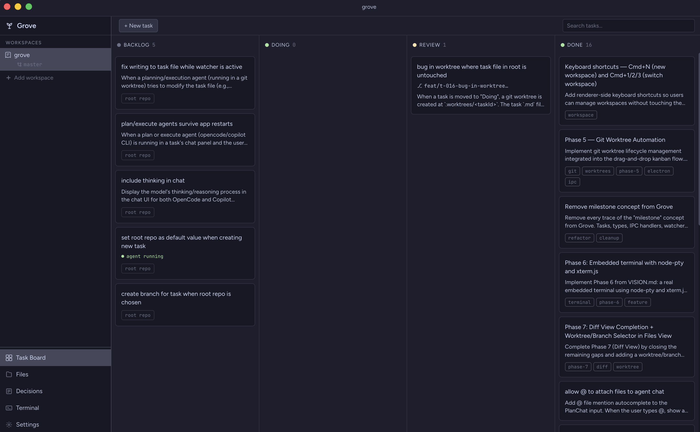

# Grove

<p align="center">
  
</p>

A local-first, file-based developer task orchestration tool. Grove acts as an orchestration layer over your repositories — reading and writing Markdown files, managing git worktrees, and embedding a terminal so AI coding agents can be run without requiring API key management.

<p align="center">
  
</p>

## Principles

- **No auth, no login, no server, no cloud** — everything stays on your machine
- **The repo is the source of truth** — all tasks and decisions are stored as Markdown files inside the repo being worked on
- **The app is a UI layer** on top of the filesystem and git
- **Multiple workspaces** — manage several repos in parallel, each with their own tasks and terminals

## Features

### Task Board

- Kanban-style board with Backlog, Doing, Review, and Done columns
- Drag-and-drop cards between columns
- Priority badges (Critical, High, Medium, Low)
- Tag support with filtering
- Milestone tracking with progress bars

### File-Based Storage

- Tasks live in `.tasks/{backlog,doing,review,done}/` as Markdown files with YAML frontmatter
- Decisions stored in `.decisions/` with structured format
- Milestones in `.milestones/`
- Full git integration — version control your tasks alongside your code

### Git Worktree Automation

- Drag a card to **Doing** → automatically creates a git worktree and branch
- Worktrees isolated in `.worktrees/` directory
- Branch name shown on the card
- Prompt to clean up worktree when moving to Done

### Embedded Terminal

- Real terminal per worktree using xterm.js + node-pty (same stack as VS Code)
- One tab per active worktree
- Run any CLI-based agent (Claude Code, Copilot CLI, Codex, Aider, OpenCode)
- Agent command pre-filled based on task's agent field
- Terminal persists across workspace switches

### Diff View

- For any task in Doing, see which files have been modified
- Inline diff renderer with syntax highlighting
- Auto-refreshes after agent activity
- Click to open file in the viewer

### File Tree & Viewer

- Browse any file in the workspace
- Respects `.gitignore`
- Fuzzy file search with `Cmd+P`
- Syntax-highlighted read-only viewer powered by Shiki

### Decision Log

- Structured decision records linked to tasks
- Status tracking: active, superseded, deprecated
- Context available to agents in worktrees

## Quick Start

```bash
# Clone and install
npm install

# Run in development
npm run dev

# Build for production
npm run build
```

## Keyboard Shortcuts

| Shortcut    | Action                                  |
| ----------- | --------------------------------------- |
| `Cmd+P`     | Fuzzy file search                       |
| `Cmd+K`     | Search tasks on board                   |
| `Cmd+,`     | Open settings                           |
| `Cmd+B`     | Toggle sidebar                          |
| `Cmd+J`     | Toggle terminal panel                   |
| ``Ctrl+` `` | Toggle terminal (works in terminal too) |
| `` ` ``     | Toggle terminal panel                   |
| `Cmd+N`     | Add workspace                           |
| `Cmd+T`     | Create new task (from board)            |
| `Cmd+1-9`   | Switch workspace                        |
| `N`         | Create new task (from board, legacy)    |
| `B`         | Move selected task to Backlog           |
| `D`         | Move selected task to Doing             |
| `R`         | Move selected task to Review            |
| `F`         | Move selected task to Done              |
| `?`         | Activate search on board                |
| `Escape`    | Clear search / close panel              |

## Tech Stack

- **Electron** — desktop shell with native terminal support
- **React + Vite** — fast, modern UI
- **xterm.js + node-pty** — terminal emulation (VS Code's stack)
- **simple-git** — git operations
- **Shiki** — syntax highlighting
- **Zustand** — state management

## License

MIT
