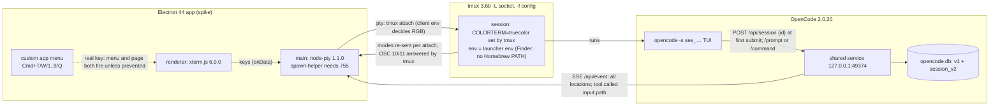

# Research: workspace walking skeleton (Phase 0 + environment deltas)

Research ran while `01-questions.md` was `status: draft`, version 1 (soft gate).
Every Phase 0 answer is an observation on this machine on 2026-10-05, made with a
re-runnable script under `spikes/`. Citation keys: `SP:` = `spikes/` in this repo;
`OC:` = opencode v2.0.20 source; `EL:` / `XT:` / `NP:` = electron v44.5.1 /
xterm.js 6.0.0 / node-pty 1.1.0 source; `old:` = this repo at `f5a1c17`;
`tmux.1` = tmux 3.6b man page. "Synthetic" = keys injected with
`webContents.sendInputEvent`, not pressed by a human. Raw logs and captures are
in the session scratch dir and are not committed; the scripts regenerate them.

## Summary

- tmux re-sends alt-screen, mouse (1000/1002/1003/1006), 2004 and 2031 modes to each newly attached client and resets them on detach. It sends nothing again while one client stays attached, even on `refresh-client`. Both Xirp workarounds reproduce: a detached pane's OSC 10/11 query gets no answer unless a pane style is set.
- tmux sends RGB to a client only when the tmux *client's* env has `COLORTERM=truecolor`. node-pty does not set it. OpenCode emits RGB inside tmux with or without COLORTERM, which corrects the epic research.
- `opencode -s <ses_ id>` creates nothing at launch. At the first submit the TUI calls `POST /api/session {id}` with that exact id, and it is then visible via `GET /api/session/{id}`. Ids that don't start with `ses` exit 1. A loosely formatted `ses_grovespike1` was accepted, but its model turns failed with a 403.
- `--prompt "/cmd args"` for an existing command goes to `POST …/command` and runs the expanded template. An unknown `/cmd` is sent to the model as plain text, with no error.
- Write/edit tool events carry the path only as model-supplied input (`session.tool.called.data.input.path`, absolute or relative), plus result text relative to `location.directory`. No `file.*` event is emitted.
- A Finder-launched app gets `PATH=/usr/bin:/bin:/usr/sbin:/sbin` and no `LANG`, so `/opt/homebrew/bin` isn't on PATH. A tmux server it starts passes that env on.
- node-pty 1.1.0 loads in Electron 44 main without a rebuild, but `spawn` fails (`posix_spawnp failed`) until `spawn-helper` is chmod 755. 1.2.0-beta.15 ships it 755.
- f5a1c17 did not typecheck (15 node + 7 web errors). Its tests pass (44/44). electron-vite 6.0.0-beta.5 is the first with an Electron 44 target table; 5.0.0 still builds, using a fallback target.
- userData = `~/Library/Application Support/grove` in dev and packaged builds. That folder already exists with Chromium profile data from the previous app; `~/.config/grove/` does not exist.
- Real keys (human run, `SP:electron/README.md`):
  - With a custom menu, Cmd+T/W/1/5/9/Q fire both the menu accelerator and the page `keydown`.
  - Renderer `preventDefault`, `before-input-event` `preventDefault` and `setIgnoreMenuShortcuts(true)` each stop the menu. Only `before-input-event` also hides the key from the page.
  - In OpenCode, Shift+Enter submits and Option+Enter inserts a newline.

## Inherited from epic

- Q2 tmux (detached sessions, attach flags, `send-keys`, formats, hooks)
- Q3 OpenCode CLI surface (TUI flags, shared service, `service.json`, Basic auth)
- Q4 OpenCode state (HTTP routes, SSE envelope, execution/permission/form events, session id format)
- Q5 previous grove app (IPC shape, PtyManager, taskTerminal, atomic writes)
- Q6 xterm.js + node-pty inside Electron (keyboard defaults, mouse, default menu bindings)

Corrections to the epic, from re-checking: (a) OpenCode emits RGB without
COLORTERM (Q1 below). (b) `~/.local/share/opencode/opencode.db` now holds v2
tables (`session_v2`, `session_message`, `session_inbox`, `event`) next to the v1
ones, and the shared service writes new sessions to `session_v2` (observed via
`sqlite3 -readonly`). (c) The epic's "`-s` uses the id for the first new
session" holds; the session is created at the first submit, not at launch (Q2).

## Answers

### Q1. Attach, detach and re-attach on `-L` + `-f`

Setup: `SP:tmux-opencode/spike.conf` (mouse on, status off, history-limit 50000, allow-passthrough on, remain-on-exit failed) on `-L grove-spike`, with a node-pty byte logger (`SP:tmux-opencode/attach-logger.js`).

- **Before any attach.** `default-size=80x24`, `window-size=latest`. After 12 s detached the pane reports `80x24 alt=1 mouse_any=1 sgr=1 all=1 clients=0`, and `capture-pane -p -e` shows the full home screen drawn at 80x24 with 24-bit SGRs (`SP:tmux-opencode/q1-attach-cycle.sh`).
- **What OpenCode writes at startup** (pipe-pane, about +1.2 s):
  - Modes and queries: `?2031h`, OSC 10/11 `?`, `\e[>0q`, `\e[6n`, `\e[?u`, `\e[>4;1m`, `?1049h`, `?2004h`, `?1000h ?1002h ?1003h ?1006h`, `\e[14t`, `?2026h/l`, OSC 0 title, OSC 12 cursor colour.
  - DECRQM, XTGETTCAP, kitty-graphics and DA1 probes are wrapped in `\ePtmux;` passthrough. They go out once at startup and never reach a later client.
- **On every attach** tmux sends the client:
  - `?1049h ?2004h ?2031h`, its own DA/XTVERSION and OSC 10/11 queries, `?1006h ?1000h ?1002h ?1003h`, the OSC 12 colour and a full redraw at the client size.
  - `?1004h` only when the server option `focus-events` is on (`SP:tmux-opencode/q1-2031.sh`).
- **On detach** tmux resets the client: mouse modes off, `?2004l ?1004l ?1049l ?2031l`.
- **Size and content.**
  - The pane takes each client's size (120x40, then 100x30) and keeps the last one after detach.
  - Screen content survives detach unchanged.
  - OpenCode re-sends OSC 10/11 and `\e[14t` at attach, then redraws fully.
- **Mouse replay.**
  - Across attach cycles, tmux re-sends mouse modes and the pane flags stay set.
  - Within one attach, `refresh-client` redraws (6.5 KB) without re-sending any `?100x h`. So a client whose terminal is reset while it stays attached does not get mouse modes back. This is the case Xirp's `repairMouseReporting` covers.
- **OSC 10/11** (`SP:tmux-opencode/q1-osc.sh`, `osc-probe.py`). tmux answers the pane's query itself and never forwards it to the client:
  - Detached, no pane style: no reply.
  - Detached, `select-pane -P 'fg=#d4d4d4,bg=#1e1e1e'`: the reply is `rgb:d4d4/…` / `rgb:1e1e/…`. `-P` sets `window-style`/`window-active-style`.
  - Attached, client answered tmux's query: the reply is the client's colours.
  - After that client detaches, or with a client that doesn't answer: no reply.
  - A pane with ?1004 gets `\e[I`/`\e[O` on attach/detach even with `focus-events off`. With an answering client it also gets `\e[?997;1n` (`SP:tmux-opencode/q1-2031.sh`).
- **OpenCode's look.** Its colours were byte-identical with no style, with a white pane style, and after an answered attach (`SP:tmux-opencode/q1-oc-colors.sh`). No theme is set in `~/.config/opencode/opencode.json`.
- **Colour depth** (`SP:tmux-opencode/q1-truecolor.sh`, `q1-client-rgb.sh`):
  - Inside the pane, OpenCode wrote RGB SGRs with no COLORTERM/FORCE_COLOR (436), with FORCE_COLOR only (434), and with COLORTERM (442).
  - tmux sets `COLORTERM=truecolor` in every session's env regardless of the launcher (tmux 3.6 CHANGES:55 "Set and check COLORTERM as a hint for RGB colour").
  - Client side: a node-pty client without COLORTERM gets `client_termfeatures` without `RGB` and 256-colour output. With `COLORTERM=truecolor` in the client env, `RGB` is present and the output is RGB.

### Q2. `opencode -s <id>` with a client-generated id

Script: `SP:opencode/q2-session-id.sh` (launch|check|send|wrong|loose). Ids are minted by `SP:opencode/gen-session-id.js`, whose output matches the prefix of an existing id given its `time_created`.

- **Valid-format id, before any prompt:**
  - The TUI shows the home screen.
  - `opencode api GET /api/session/<id>` returns `SessionNotFoundError` HTTP 404.
  - There is no `session_v2` row, and `session list` doesn't show it.
- **After the first submit:**
  - `GET /api/session/ses_ef43f68e6ffexnQMEg1f9ku18n` returns that exact id, with `title` and `location.directory`, and `session_v2` has the row.
  - SSE `session.created` (`durable.aggregateID` = the id, seq 0) is emitted at submit.
  - `opencode session list` shows it only when run from the project dir ("top-level sessions in the current project").
- **Mechanism:**
  - The CLI GETs the id. If it is absent, it passes it as `newSessionID` (`OC:packages/cli/src/commands/handlers/default.ts:53-61,97-98`).
  - The TUI holds it as pending for the first new session (`OC:packages/tui/src/context/args.tsx:17-28`). On submit it calls `session.create({id})` and restores the pending id if create fails (`OC:packages/tui/src/component/prompt/index.tsx:1234-1245`).
  - On the wire: `POST /api/session {"id","agent","model","location"}` immediately before the prompt/command POST (observed through `SP:opencode/logging-proxy.js`).
  - `Session.create` uses `input.id ?? ID.create()` and returns the existing record if the id exists (`OC:packages/core/src/session.ts:250-253`).
- **Wrong format:**
  - The schema only requires a `"ses"` prefix (`OC:packages/schema/src/session-id.ts:5`).
  - `opencode -s foo123` exits 1 before rendering: `Error: Expected a string starting with "ses"`. `GET /api/session/foo123` returns `InvalidRequestError` HTTP 400.
  - `-s ses_grovespike1` was accepted and created with exactly that id. Every turn then failed after about 500 ms with `provider.auth` 403 `FreeTierError … can only be used from within OpenCode` (twice). In the same minutes, a valid-format session on the same model succeeded.
  - The id is sent upstream as `x-session-affinity`/`X-Session-Id`/`x-opencode-session` headers (`OC:packages/core/src/session/model-request.ts:274-285`). That the 403 is caused by the id format is an inference, not established.

### Q3. `opencode --prompt "/<command> <args>"`

Scripts: `SP:opencode/q3-prompt-command.sh` (shared service plus SSE), and `q3-private-http.sh` with `private-server.sh` (a private `opencode serve`, same DB, behind a logging proxy). Test command: project-local `.opencode/commands/spike-echo.md`, template `Reply with exactly the text SPIKE-ECHO followed by: $ARGUMENTS`.

- **Source path:**
  - `--prompt` fills the composer and auto-submits once model and agent are ready (`OC:packages/tui/src/routes/home.tsx:53-79`).
  - Submit order: `exit`/`quit`/`:q`; then TUI-local argument slashes `/cd`, `/btw`, `/rename` (`OC:packages/tui/src/component/prompt/index.tsx:272,1137-1145`); then `parseSlashHead` checked against the server command list (`:1151-1154`). A match goes to `session.command` (`:1314-1330`); anything else goes to the normal prompt.
  - Server templates expand `$1..$n`, `$ARGUMENTS` and shell blocks, then call `session.prompt` (`OC:packages/core/src/config/plugin/command.ts:93-135,189-213`). Unknown names return `Command.NotFoundError` (`OC:packages/core/src/command.ts:81-88`).
- **Existing command** `/spike-echo alpha beta`:
  - HTTP: `POST /api/session`, `POST …/model`, `POST …/command {"name":"spike-echo","text":"alpha beta","delivery":"steer",…}`.
  - SSE: `session.created`, `session.inbox.enqueued` (user item = the expanded text), `execution.started` … `execution.succeeded`, `session.renamed`. No event names the command.
  - The reply was `SPIKE-ECHO alpha beta`.
- **Unknown command** `/nosuchcmd-xyz alpha`: `POST …/prompt` with the literal text. `/command` was never called and no toast appeared. The model answered "Command not found…" itself.
- **Plain text:** `POST …/prompt` with the text. The reply was as asked.
- In all runs, `GET /api/command?location[directory]=…` preceded the submit. Auto-submit is gated on model and agent readiness, not on the command list (`OC:packages/tui/src/routes/home.tsx:71-75`). A race where the list arrives late was not observed.

### Q4. SSE sequence for a write and an edit turn

Script: `SP:opencode/sse-capture.sh` (shared service; the password stays in-process) and `sse-summary.py`.

- **Write turn, first turn of a new session** (durable seq in parentheses):
  1. `server.connected`, `session.created` (0), `session.inbox.enqueued` (1), `session.execution.started` (2), `session.instructions.updated` (3), `session.inbox.delivered` (4).
  2. `session.step.started` (5), `session.tool.input.started` (6, `name:"write"`), `session.tool.input.ended` (7), `session.tool.called` (8), `session.step.streamed` (9), `session.tool.success` (10), `session.step.ended` (11), then `session.usage.updated` ×2 (ephemeral).
  3. `session.renamed` (13), then a text step (14–18), then `session.execution.succeeded` (19) and `session.viewed` (20).
- **Edit turn, same session:** `inbox.enqueued`, `project.updated`, `execution.started`, `inbox.delivered`, a reasoning step, `tool.input.started` (`name:"edit"`) … `tool.success`, a text step, `execution.succeeded`, `session.viewed`.
- **Seq gaps** (12, 79) match `session.usage.recorded`, which "never reaches clients" (`OC:packages/schema/src/session-event.ts:158-166,618-619`).
- **`location.directory`** (absolute session dir) is on every session event except `session.execution.*` and `session.viewed`.
- **Path-bearing fields:**
  - `session.tool.input.ended.data.text`: the raw JSON input string.
  - `session.tool.called.data.input.path`: exactly what the model sent. It was absolute (`<dir>/hello.txt`) in two runs and relative (`sub/rel.txt`) when the model was told to use a relative path. Relative paths resolve against the Location directory (`OC:packages/core/src/file-access.ts:94-104`).
  - `session.tool.success.data.content[0].text`: e.g. `"Created file successfully: hello.txt"`, `"Edited hello.txt (1 replacement)"`. The path is relative to `location.directory`, or absolute when outside it (`OC:packages/core/src/file-access.ts:35-36,102,115`).
  - `session.tool.success.data.metadata.files[]`: edit only, `{file:"hello.txt", patch, status:"modified", additions, deletions}` (relative). For write, `metadata` is `{truncated:false}`.
- **No `file.*` event.** `file.edited` exists only in the v1 manifest (`OC:packages/schema/src/v1/filesystem.ts:6-9`). write and edit each carry a source comment marking watcher/file-edit event publishing as not done (`OC:packages/core/src/tool/write.ts:42`; `edit.ts:105`).
- **Scope.** `/api/event` spans all server locations (`OC:packages/protocol/src/groups/event.ts:44-51`). The capture also held `project.updated` for an unrelated directory.

### Q5. Bracketed paste + Enter by tmux route

Scripts: `SP:tmux-opencode/q5-routes-bytes.sh` (bytes logged by `input-log.py`) and `q5-opencode-paste.sh` (the real TUI).

| Route | Pane with ?2004 on | Pane with ?2004 off |
|---|---|---|
| `send-keys -l $'\e[200~say ok\e[201~'` | `\e[200~say ok\e[201~` | same, bracketed |
| `send-keys -H 1b 5b 32 30 30 7e …` | `\e[200~say ok\e[201~` | same, bracketed |
| `paste-buffer -p` | `\e[200~say ok\e[201~` | `say ok` |
| `paste-buffer` (no `-p`) | `say ok` | `say ok` |
| multi-line `paste-buffer -p` | `\e[200~line1\rline2\e[201~` (LF→CR) | `line1\rline2` |
| `send-keys Enter` | `\r` | `\r` |

- **OpenCode composer before Enter:** single-line text shows verbatim by all three routes. A multi-line paste shows `[Pasted ~3 lines]`, and later typed text is appended after it.
- **Submitted text** (`opencode session export ses_ef4391a93ffeG737Js8qc9S5hY`): `say ok (route send-keys -l)`, `… -H`, and `… paste-buffer -p, Enter chained` (with `\; send-keys Enter` in the same tmux call). No bracket bytes leaked.

### Q6. Keys and truecolor in xterm.js 6.0.0 / Electron 44

Spike app: `SP:electron/` (main.js, renderer.js, keylog.py; `run-step.sh` + `summarize.py` for the human checklist). It logs xterm `onData` → `pty-in` → the bytes received by a program inside tmux. The table is from the synthetic run. The human run (steps 5a/5b, real keys, Swedish-layout keyboard) confirmed the same bytes for every key it covered.

| Key | xterm → PTY | received inside tmux |
|---|---|---|
| Enter / **Shift+Enter** / Ctrl+Enter | `0d` / `0d` / `0d` | same |
| Alt+Enter | `1b0d` | `1b0d` |
| Tab / Shift+Tab | `09` / `1b5b5a` | same |
| Alt+Backspace / Alt+Left / Ctrl+Left | `1b7f` / `1b5b313b3344` / `1b5b313b3544` | same |
| Ctrl+A/C/P/X/J | `01 03 10 18 0a` | same |
| Up | `1b4f41` (application cursor) | `1b5b41` |
| Option+b / Option+f (composed `∫` `ƒ`) | `e288ab` / `c692` | no ESC prefix (`macOptionIsMeta:false`) |
| Cmd+T/W/1/9/Q | nothing | — |

- **Sources:** Enter/Alt+Enter (`XT:src/common/input/Keyboard.ts:100-102`), Shift+Tab (`:91-94`), Option (`:325-326`; default `OptionsService.ts:40`), Meta gives nothing (`:353`).
- **Real keys** (step 5a, `run-step.sh 5a`):
  - Shift+Enter `0d`, Option+Enter `1b0d`, Option+Backspace `1b7f`, Option+Left `1b5b313b3344`, Ctrl+A/C/P/X/J `01 03 10 18 0a`. All reached the program inside tmux unchanged.
  - Option+B and Option+F produced composed characters (`›` `e280ba` and `ƒ` `c692` on this layout), with no ESC prefix.
- **Real keys in OpenCode** (step 5b, as reported by the human):
  - Shift+Enter (`\r`) **submits** the prompt; Option+Enter (`\e\r`) **inserts a newline**.
  - Option+B/F insert the composed characters (bytes `e280ba`/`c692` in the log).
- **Esc:**
  - Synthetic (`escape-time 10`): the first lone Esc after attach reached the inner program 502 ms after xterm sent it; a later one took 12 ms. In one synthetic run, Esc followed by Tab 400 ms later arrived merged as `1b09`.
  - Real: three Esc presses each reached the program 12 ms after xterm sent them (pty-in 592.444 → inner 592.456).
  - The Esc-then-Tab merge was not exercised with real keys.
- On attach, xterm answered tmux's DA1/DA2 and OSC 10/11 queries.
- **Truecolor (observed):**
  - With PTY env `TERM=xterm-256color COLORTERM=truecolor`, tmux→xterm carried `38;2`×143 and `48;2`×71, and all 4800 buffer cells were RGB.
  - Without COLORTERM, there were 0 RGB and 146 `38;5`, and all cells were palette colours.
  - Inside tmux: `TERM=tmux-256color`, `TERM_PROGRAM=tmux`.

### Q7. Environment under Finder/Dock launch

- `open <app>` from a shell forwards the shell's whole env (TMUX, LANG=C.UTF-8, …), so it isn't equivalent to a Finder launch.
- **Finder launch** (`osascript … tell application "Finder" to open`, packaged spike):
  - The env holds exactly: COMMAND_MODE, HOME, LOGNAME, MallocNanoZone, OSLogRateLimit, PATH, SHELL, SSH_AUTH_SOCK, TMPDIR, USER, XPC_FLAGS, XPC_SERVICE_NAME, `__CFBundleIdentifier`, `__CF_USER_TEXT_ENCODING`.
  - `PATH=/usr/bin:/bin:/usr/sbin:/sbin`, `SHELL=/bin/zsh`, `HOME=/Users/victor`, and **no `LANG`/`LC_*`**.
  - `env -i open -n -W` gives the same key set. `launchctl getenv PATH` is empty.
- **Command lookup:** `command -v tmux opencode` fails (exit 1) in that env, although `/opt/homebrew/bin/tmux` and `/opt/homebrew/bin/opencode` exist.
- **tmux under that env:**
  - A tmux server started by absolute path passes on that env plus TERM, TERM_PROGRAM(_VERSION), TMUX, TMUX_PANE, `COLORTERM=truecolor`, PWD and SHLVL.
  - PATH is unchanged and there is no LANG. A session running bare `opencode` exited at once.
- **Dev** (`electron .` from a shell) inherits the shell env, including another server's `TMUX=`.
- **Finder launch, human double-click** (step 6, `packaged-2026-10-05T11-46-22-406Z.log`): the same 14 env keys, `PATH=/usr/bin:/bin:/usr/sbin:/sbin`, and no LANG/LC_*. `command -v tmux opencode` exit 1; the tmux session env has the same PATH plus `COLORTERM=truecolor`.
- **Dock launch:** no log was produced. The click showed `TypeError: Object has been destroyed` at `app.asar/main.js:134`, the spike's `webContents.send` from a node-pty `onData` after its window was destroyed, so pty output was still arriving. The spike now guards that call. The Dock-launch env was not observed.

### Q8. tmux 3.6b states on a `-L` socket

Scripts: `SP:tmux-opencode/q8-states.sh`, `q8-detach.sh`.

| State | `has-session -t alpha` | `list-sessions` / `ls -F '#{session_name}'` |
|---|---|---|
| No server, no socket file | rc 1, `error connecting to <sock> (No such file or directory)` | same, rc 1 |
| No server, stale socket (after kill-server) | rc 1, `no server running on <sock>` | same, rc 1 |
| Server up, zero sessions (`exit-empty off`) | rc 1, `no current target` | rc 0, empty |
| `alpha` exists | rc 0, no output | rc 0, `alpha: 1 windows (created …)` / `alpha` |
| `alpha` killed, server kept | rc 1, `no current target` | rc 0, empty |
| `alpha` missing, others present | rc 1, `can't find session: alpha` | — |

- **Target matching.** `-t alpha` prefix-matches (rc 0 with only `alphabet` present); `-t =alpha` requires an exact name (rc 1).
- **`exit-empty`** (default on, `tmux.1:4176-4180`):
  - Killing the last session stops the server, and `start-server` alone exits at once.
  - A last session whose command exits 0 under `remain-on-exit failed` also stops it.
  - With it off, the server stays up with zero sessions.
  - A command exiting non-zero leaves a dead pane (`#{pane_dead}` 1, status 3) and the session alive.
- **`destroy-unattached`** (`off|on|keep-last|keep-group`, `tmux.1:4497-4509`):
  - Set to `on` with no client attached, it destroys the session immediately.
  - Set while a client is attached, it destroys the session at detach. If that was the last session, exit-empty then stops the server.
- **`exit-unattached on`** (`tmux.1:4181-4184`) stops the server at once with no clients attached, or at the last detach.
- **Killed session:** killing the session an attached client is on (with another session present) sends the client a reset plus `[exited]`, and the client exits 0.

### Q9. node-pty 1.1.0 in Electron 44 main

- **Load:** `require('node-pty')` loads from `prebuilds/darwin-arm64` without a rebuild, both under `electron .` and in a packaged build. Packaged, it resolves from `app.asar`, with the helper from `app.asar.unpacked` (`NP:lib/unixTerminal.js:29-32`).
  - npm 11.16 `allowScripts` skipped node-pty's install script ("not yet covered by allowScripts"), so no `build/Release` existed. It also skipped Electron's binary download, which was run manually.
- **Spawn:** fails in dev and packaged builds with `Error: posix_spawnp failed`, helper mode `644`. It succeeds after `chmod 755`. electron-builder 26.15.3 keeps mode 644 in `app.asar.unpacked`. The tmux spike reproduced the same failure under plain node.
- **Tarballs** (`npm pack`): 1.1.0 (2025-12-22) ships `prebuilds/darwin-{arm64,x64}/spawn-helper` as `-rw-r--r--`. 1.2.0-beta.15 (2026-08-03) ships them `-rwxr-xr-x` and adds linux prebuilds. Loading and spawning with 1.2.0-beta.15 in Electron 44 was not run.
- **GitHub:**
  - Issue #850 was closed 2026-01-13 (completed). The fixes are PR #858 "Ensure 755 permissions on prebuild spawn-helper" (merged 2026-01-03) and PR #866 (merged 2026-01-13), both after 1.1.0.
  - PR #953 (asar helper path rewrite) was closed unmerged. PR #917 (validate spawn-helper before fork) is open.
- **Old app's route:** f5a1c17's postinstall (`electron-builder install-app-deps`) rebuilds node-pty from source into `~/.electron-gyp/<ver>` headers for Electron 39 and 44 alike (Q10).
- **Exit hang:** after `term.kill()` + `app.exit(0)`, runs that had spawned a PTY did not exit and ignored SIGTERM; they needed SIGKILL. The cause could not be determined.

### Q10. Build tooling, then and now

- **electron-vite:**
  - dist-tags: `latest 5.0.0` (2025-12-07), `beta 6.0.0-beta.5` (2026-09-29). Both declare engines `node ^20.19.0 || >=22.12.0`; neither names Electron as a peer or names Node 26.
  - 5.0.0 peers `vite ^5||^6||^7`. Its target table stops at Electron 39 and unknown majors fall back to the newest entry (chrome142/node22.20).
  - 6.0.0-beta.5 peers `vite ^6||^7||^8`. The CHANGELOG v6.0.0-beta.2 says "build compatibility target for Electron 42, 43, 44", and its table has `'44': '152'` chrome / `'24.18'` node.
- **Electron 44.5.1** bundles Node 24.21.0 and Chrome 152, with engines `node >= 22.12.0`. Node 26.3.0 is the machine's node, not Electron's.
- **Other current versions:**
  - vite 8.3.2; vitest 5.0.3 (engines `^22.12||^24||>=26`); typescript 7.0.2.
  - `@vitejs/plugin-react` 6.1.2 (peer `vite ^8`, so not with electron-vite 5).
  - electron-builder 26.15.3; `@electron-forge/plugin-vite` 8.0.1 (not tested).
- **f5a1c17 as-is** (lock: electron 39.8.6, electron-vite 5.0.0, vite 7.3.1, TS 5.9.3, vitest 4.1.2):
  - `npm ci` passes.
  - `typecheck:node` fails with 15 errors, e.g. `src/main/ipc/taskTerminal.ts(298,12): TS2304 Cannot find name 'state'`, `getContainerService` (302,376,378,434,436), and `containerEnabled` etc. in `workspace.ts:163-165,452-458`.
  - `typecheck:web` fails with 7 errors (e.g. `AgentMonitor.tsx(86,37) Property 'tmux' does not exist on type 'ElectronAPI'`).
  - `vitest run` passes 44/44 (5 files) outside the sandbox. Inside the sandbox, 6 tests fail because they hardcode `/tmp` (`old:src/main/__tests__/tasks.test.ts:12,13,80`). `AgentModelForm.test.tsx` isn't collected (`old:vitest.config.ts:13-16`).
  - `electron-vite build` passes.
- **Against current versions** (electron 44.5.1, electron-vite 6.0.0-beta.5, vite 8.3.2, plugin-react 6.1.2, vitest 5.0.3, TS 7.0.2, electron-builder 26.15.3):
  - **`electron.vite.config.ts`:** works unchanged, and node-pty stays external (`old:electron.vite.config.ts:10`). `externalizeDepsPlugin` (`:7,20`) is marked `@deprecated use build.externalizeDeps`.
  - **tsconfigs:** both fail under TS 7 before any code is checked: `TS5102 Option 'baseUrl' has been removed` (`old:tsconfig.node.json:13`, `old:tsconfig.web.json:13`) and `TS5090 Non-relative paths are not allowed` (`:15-16`). Patched, node gives the same 15 errors and web 12 (adds missing `NodeJS`/`process` types).
  - **`vitest.config.ts`:** works, 44/44, with a warning about ESM syntax in a CJS-loaded config (no `"type"` in package.json).
  - **`electron-builder.yml`:** loads; `--dir` reached packaging, then failed on a network `ReadError`. It references a missing `build/entitlements.mac.plist` (`old:electron-builder.yml:23`).
  - **postinstall:** needs a writable `~/.electron-gyp`.
  - **typescript-eslint:** peer range `<6.1.0` rejects TS 7; lint was not run.
  - **Stable alternative:** electron-vite 5.0.0 + vite 7.3.6 + electron 44.5.1 also builds.

### Q11. Menu accelerators vs the page

- **Synthetic run:** custom menu with Cmd+T/W/1..9/Q. `before-input-event` fired for every key, and the renderer `keydown` fired for Cmd+T/W/1/9/Q. No menu click fired in any variant. `before-input-event` + `preventDefault` suppressed the page keydown.
- **Why synthetic can't test menus:**
  - `sendInputEvent` builds a `NativeWebKeyboardEvent` without an `os_event` (`EL:shell/browser/api/electron_api_web_contents.cc:4114-4122`).
  - The mac menu path calls `[[NSApp mainMenu] performKeyEquivalent:]` only for a real `NSEventTypeKeyDown` (`EL:shell/browser/api/electron_api_web_contents_mac.mm:37-66`).
- **Source on ordering:**
  - Menu dispatch is in `HandleKeyboardEvent`, which runs for events the page did not handle (`EL:…/electron_api_web_contents.cc:1659-1674`). It is skipped when `setIgnoreMenuShortcuts` is on (`_mac.mm:44`).
  - `before-input-event` + `preventDefault` returns handled in `PreHandleKeyboardEvent`, before the page (`:1703-1720`). The docs say this prevents "the page keydown/keyup events and the menu shortcuts" (`EL:docs/api/web-contents.md:533-537`).
  - Some system shortcuts reach NSMenu earlier, in Chromium's `render_widget_host_view_cocoa.mm` (comment at `_mac.mm:49-62`).
- **Real keys** (human run, steps 1–4, `summarize.py 1..4`). Custom menu with accelerators for Cmd+T, W, 1..9 and Q:

| Mechanism | Menu accelerator fired | Page `keydown` fired |
|---|---|---|
| none | yes (`triggeredByAccelerator:true`) for Cmd+T/W/1/5/9/Q | yes, all six |
| renderer `keydown` `preventDefault()` (capture phase) | no, all six (Cmd+Q did not quit) | yes, all six |
| `before-input-event` `preventDefault()` on meta keyDown | no, all six | no, all six |
| `webContents.setIgnoreMenuShortcuts(true)` | no, all six | yes, all six |

  - With nothing prevented, the order of `menu-click` and `renderer:keydown` in the log varied between keys (`h-none-2026-10-05T11-35-51-927Z.log`).

### Q12. userData and `~/.config`

- **Paths:** dev (package name `grove`) and packaged (productName `grove`, `isPackaged:true`) both report `app.getName()=grove`, userData = sessionData = `/Users/victor/Library/Application Support/grove`, and logs = `~/Library/Logs/grove`. `~/.config` = `/Users/victor/.config`; XDG_CONFIG_HOME is unset and Electron doesn't use it.
- **`~/.config/grove/`:** does not exist.
- **`~/Library/Application Support/grove/`:** exists, last modified 2026-05-02. It holds Chromium profile data plus `window-state.json` (83 B): Cache/, Code Cache/, Cookies, DIPS, GPUCache/, Local Storage/, Session Storage/, Preferences, TransportSecurity, Trust Tokens, blob_storage/, etc. No `state.json` or `comments/`. Contents were not read.

### Q13. OpenCode session titles

- **Storage and generation:**
  - Stored in nullable `session_v2.title` (`OC:packages/core/src/session/sql.ts:22-24,37`).
  - "Untitled" means undefined, or `New session - <ISO>` (`OC:packages/util/src/session-title-fallback.ts:3,30-36`).
  - Generated when the inbox promotes the first prompt of an untitled root session (`OC:packages/core/src/session/runner/llm.ts:174-177`). The generator is the hidden `title` agent with tools denied (`OC:packages/core/src/plugin/agent.ts:26-55,139-145`), on the provider's small model with the session model as fallback (`OC:packages/core/src/session/context.ts:95-118`).
  - The result is truncated to 100 chars and published as durable `session.renamed {sessionID,title}`. It is dropped if the title changed meanwhile (`OC:packages/core/src/session/title.ts:20,100-147`).
- **Exposure:**
  - Events: `session.created.data.title` (if given at create) and `session.renamed` (`OC:packages/schema/src/session-event.ts:51-66`). No `session.updated` was seen.
  - HTTP: `GET /api/session/{id}` field `title`, absent when untitled.
  - Display: `session list` shows "Untitled session"; the TUI tab shows `New session - <ISO>`.
- **Observed** (`SP:opencode/q13-title.sh`):
  - The first turn produced "Create hello.txt with hi" via `session.renamed` (seq 13), mid-turn, after the tool step.
  - When the first turn failed, the title stayed NULL.
- **Setting from outside the TUI:**
  - `PATCH /api/session/{id} {"title":"grove spike renamed"}` returns 204, and GET, SQLite and `session.renamed` reflect it. `{"title":""}` regenerates the title synchronously with the model (`OC:packages/protocol/src/groups/session.ts:358-361`; `OC:packages/server/src/handlers/session.ts:256-267`).
  - `POST /api/session {id,title}` sets it at create. The title survived the first prompt and no `session.renamed` followed (`OC:packages/protocol/src/groups/session.ts:220-223`).
  - The TUI's `/rename` uses the same PATCH (`OC:packages/tui/src/routes/session/index.tsx:905-917`).
  - The `opencode session` CLI has no rename subcommand.

## Current architecture

## Existing patterns to reuse

- **Attach + redraw:** each new `tmux attach` client gets every mode and a full redraw (Q1). The previous app always spawned a fresh attach on reconnect (epic Q5, `old:src/main/ipc/taskTerminal.ts:270-355`).
- **Pane style for OSC 10/11:** `select-pane -P 'fg=…,bg=…'` makes tmux answer while detached. Xirp's `terminal:colors` does this (epic Q2; `SP:tmux-opencode/q1-osc.sh`).
- **Id-first sessions:** create is idempotent on a client-minted id (`OC:packages/core/src/session.ts:250-253`). `SP:opencode/gen-session-id.js` mints the real format.
- **Secret-safe service access:** `SP:opencode/sse-capture.sh` reads `service.json` in-process; `opencode api …` handles auth itself.
- **Atomic writes and IPC shape:** see epic Q5 (`old:src/runtime/fileWriter.ts:4-23`; `old:src/preload/index.ts:3-215`).
- **node-pty packaging:** `asarUnpack: node_modules/node-pty/**` + `install-app-deps` (`old:electron-builder.yml:12,14,41`). The 644 helper mode survives packaging (Q9).

## Constraints & invariants

- tmux socket paths must fit `sun_path`; a long scratch path failed with `File name too long`.
- tmux enables RGB toward a client only from the client process's own `COLORTERM`. node-pty doesn't set it (Q1, Q6).
- A Finder-launched process has launchd's PATH and no locale (Q7). tmux sessions inherit the env of whichever process started the server.
- OpenCode sessions don't exist until the first submit (Q2). The `-s` id must start with `ses`, or the CLI exits 1.
- `/api/event` carries events for every directory on the shared service. Per-session filtering is by `data.sessionID` / `durable.aggregateID` (Q4).
- Tool-event paths are model-supplied and may be relative to `location.directory` (Q4).
- Unknown slash commands are sent silently to the model as text (Q3).
- node-pty 1.1.0 spawn fails as shipped on darwin (Q9).
- `~/Library/Application Support/grove/` is already populated by the previous app's Chromium profile (Q12).
- The sandbox blocks tmux sockets in `/private/tmp/tmux-501`, `~/.local/share/opencode`, `~/.electron-gyp` and `/tmp`. Spikes ran with it disabled.

## Test landscape

- **HEAD:** no app code or tests. `grove.config.json` `commands` is `{}`.
- **Spikes** (manual, not a test suite):
  - `spikes/tmux-opencode/*.sh` source `env.sh` and need `node_modules` with node-pty (chmod 755 `spawn-helper`) in `$SPIKE_DIR`.
  - `spikes/opencode/*.sh` need the shared service running and a model available.
  - `spikes/electron`: `npm install`, `chmod 755` the spawn-helper, then `electron . --session=keys|oc …`. The README has the human checklist.
  - All need the sandbox off for tmux and opencode.
- **f5a1c17:** `vitest run`, 44 tests across 5 files, none for pty/xterm/tmux; `tsc --noEmit` fails (Q10).

## Relevant ADRs

- **0003 tmux dedicated socket:** Q1 (modes, OSC 10/11, RGB via client COLORTERM), Q5 and Q8 test its config and lifecycle. Q7 shows the session env comes from the launching process.
- **0004 core in Electron main:** Q9 confirms node-pty loads in main (spawn needs the helper fix). Q9 also records the exit hang.
- **0005 status from shared service:** Q2 (`-s` id is created at first submit; `ses` prefix rule), Q4 (all-location stream, execution events without `location`).
- **0006 link by file-write events:** Q4 (path only in tool input/result, may be relative; no `file.*` event; edit has `metadata.files`).
- **0009 app state in JSON files:** Q12 (userData path; the existing grove folder; no `~/.config/grove`).

## Unknowns

- **Dock-launch env** (Q7): the first attempt hit a spike bug (now fixed). Resolve by quitting any running spike, then re-running README step 6 from the Dock.
- **Esc** (Q6): the synthetic 502 ms first-Esc delay and the `1b09` Esc+Tab merge did not appear with real Esc presses; the Esc-then-Tab sequence was not tried with real keys.
- **OpenCode word movement** (Q6): which key, if any, OpenCode 2.0.20 binds to word movement, given that Option+B/F arrive as composed characters with `macOptionIsMeta:false`. Not determined.
- **Why OpenCode emits RGB without COLORTERM** (Q1): resolve by reading OpenTUI colour detection, or a run with `TERM=screen` and no probe answers.
- **tmux client-colour caching** across separate attaches (Q1): resolve by attaching an answering client, then a silent one, and probing.
- **403 on `ses_grovespike1`** (Q2): format-related or not. Resolve with a valid-shape id with random time bits, and a non-Zen provider.
- **`-s` edge cases** (Q2): an existing session in another directory, or a child session. Not run.
- **`--prompt "/cmd"` race** (Q3): whether a slow `/api/command` makes it fall through to plain text. Resolve with a delaying proxy.
- **Other tool paths** (Q4): the `patch` tool, and writes outside the Location (`external_directory`). Not run.
- **Empty `event` table** read read-only (Q4): where durable events persist. Not determined.
- **node-pty 1.2.0-beta.15 in Electron 44** (Q9): load and spawn not run. Exit hang after a PTY spawn: cause not determined.
- **Packaging** (Q10): `electron-builder --dir` with Electron 44 not completed (network error); lint under TS 7 not run; Forge plugin-vite not tested; electron-vite 6 has no stable release yet.

## Open questions

