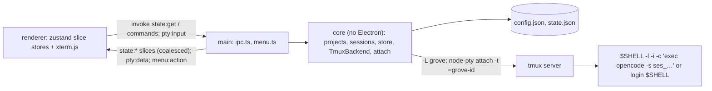

# Design: workspace walking skeleton

Child 1 of epic `2026-10-05-opencode-feature-workspace`. Designed while
questions (v1) and research (v2) were draft (soft gate).

## Inherited decisions

- **E-D1** Projects in app config `{id: uuid, name, path}`. This child adds projects only, with no discovery.
- **E-D3** tmux on a dedicated socket (`-L grove`) with a config file shipped with the app, attached through node-pty. A herdr stub is behind the backend interface.
- **E-D4** Core runs in Electron main behind a seam that imports nothing from Electron, and reconciles on start.
- **E-D5** (launch only) OpenCode TUIs start with an app-generated `-s ses_…` id. SSE status is out of scope here.
- **E-D7** Versioned JSON files with atomic writes, and main as the only writer. Config `projects`, `state.json` sessions.

## Desired state

1. `npm run dev` opens grove (Electron 44, React, electron-vite). The sidebar is empty apart from **Add project**.
2. **Add project** opens a native folder picker. Any folder is accepted and saved to
   `~/.config/grove/config.json`. **Remove project** is refused while the project has live
   sessions. Otherwise it removes the project and its `gone` sessions.
3. **Cmd+T** opens the ＋ modal: pick a project and OpenCode or Terminal. This creates the
   tmux session `grove-<uuid>` on `-L grove`, using the config file shipped with the app.
   It starts in the project root, and OpenCode runs as `opencode -s <minted ses_ id>`.
4. The session appears under its project with a generated label, which can be renamed. It
   is attached in xterm.js with WebGL, truecolor and the Phase 0 key behaviour.
5. **Cmd+W** asks for confirmation, then kills the session. Killed sessions show `gone` and
   have a **Remove** action.
6. Quit, then relaunch: `state.json` is checked against `tmux list-sessions`. Live sessions
   re-attach, and sessions killed outside the app show `gone`.
7. A Finder or Dock launch works the same as `npm run dev`: tmux and opencode are found and the locale is set.
8. Core modules (store, tmux backend) don't import Electron and have vitest tests,
   including the backend against a real tmux on a throwaway socket.

## Non-goals

- Feature discovery, the workflow, the feature tree (child 2)
- OpenCode working/waiting/idle status, auto-linking, adopting OpenCode's own titles, notifications (child 3)
- Next actions and prompt injection (child 5), the grid view and Cmd+K (child 7), packaging (child 8)
- Renaming projects, validating project folders, adopting orphan tmux sessions

## System design



### Files (E-D7 shapes, this child's subset)

- `~/.config/grove/config.json`: `{ schemaVersion: 1, projects: [{ id, name, path }] }`.
  `name` = folder basename. Child 2 adds `workflow`.
- `~/Library/Application Support/grove/state.json`:
  `{ schemaVersion: 1, sessions: [Session], ui: { sidebarWidth, focusedSessionId } }`.
- `Session` as in E-D7 plus additive `labelPinned: boolean`. In this child `feature` and
  `action` are always `null`, `linkPinned` is `false`, and `lastStatus` is `running | gone`.
  `endedAt` is set when the session is first seen gone.
- Missing file → empty default. Unparseable file or unknown `schemaVersion` → renamed to
  `<name>.bad-<ts>`, start empty, error banner. Writes: tmp file + rename (old `fileWriter`).

### tmux contract (all calls `tmux -L grove`, minimal env per D1)

| Use | Command |
|---|---|
| Ensure config | server up (`list-sessions` rc 0) → `source-file <resources>/tmux.conf`; otherwise the next `new-session` gets `-f <conf>` |
| Create | `-f <conf> new-session -d -s grove-<id> -c <project.path> -x <cols> -y <rows> [-- $SHELL -l -i -c "exec opencode -s <ses_id>"]` (argv form, so tmux execs without `sh -c`) |
| Colours | `select-pane -t =grove-<id> -P 'fg=<fg>,bg=<bg>'` |
| List | `list-sessions -F '#{session_name}'`. rc 1 with `no server running` / `error connecting` → empty set |
| Kill | `kill-session -t =grove-<id>` (an already-missing session counts as success) |
| Attach | node-pty spawn `tmux -L grove attach-session -t =grove-<id>`, env adds `TERM=xterm-256color COLORTERM=truecolor` |

### IPC contract (`src/shared/ipc.ts`)

| Kind | Channel | Payload → result |
|---|---|---|
| invoke | `state:get` | → `Slices` |
| invoke | `project:add` / `project:remove` | picker in main → `Project \| null` / `{id}`, error `has-live-sessions` |
| invoke | `session:create` | `{projectId, kind, cols, rows}` → `Session` |
| invoke | `session:kill` / `session:remove` | `{id}` (remove refused unless `gone`) |
| invoke | `session:rename` / `ui:set` | `{id, label}` (sets `labelPinned`) / `Partial<UiState>` |
| invoke | `pty:attach` | `{sessionId, cols, rows}` → `{attachId}` |
| on | `pty:input`, `pty:resize`, `pty:detach` | `{attachId, …}` (fire-and-forget) |
| push | `state:projects` / `state:sessions` / `state:ui`; `pty:data` / `pty:exit`; `menu:action` | whole slice; `{attachId, data?}`; `newSession \| closeSession \| focusIndex(n)` |

### Flows

- **App start:** load config + state → ensure config → `list` → sessions missing from
  tmux become `gone` (`endedAt` = now) → save → window loads → `state:get` → attach
  `ui.focusedSessionId` if it is running.
- **New session (Cmd+T):** modal → `session:create` → id = uuid, OpenCode id minted →
  backend create + colours → store add (`running`, label `<Kind> · HH:MM`) → push →
  renderer focuses it → `pty:attach`.
- **Close (Cmd+W):** confirm dialog → `session:kill` → `gone` → push.
- **Liveness:** every 5 s, on window focus, and on `pty:exit` → `list` → flip gone.
- **Quit / window close:** kill all attach PTYs → `app.quit()`. tmux sessions persist.

## Program design

HEAD has no app code, so everything is NEW. Build config is copied from f5a1c17 and trimmed.

```
package.json, electron.vite.config.ts, tsconfig{,.node,.web}.json, vitest.config.ts
                                  NEW  from f5a1c17, trimmed; postinstall runs scripts/fix-spawn-helper.mjs
scripts/fix-spawn-helper.mjs      NEW  chmod 755 node-pty prebuild helpers
resources/tmux.conf               NEW  options from the two-way table
src/shared/{types,ipc}.ts         NEW  Project, Session, UiState, Slices; channel maps, Result<T>
src/core/store/{jsonFile,configStore,stateStore}.ts  NEW  readVersioned/atomicWrite; slices
src/core/env.ts                   NEW  minimalEnv(), loginShellArgv(argv), findTmux()
src/core/opencodeId.ts            NEW  mintSessionId() (port of spikes/opencode/gen-session-id.js)
src/core/backend/{types,tmux,herdr}.ts  NEW  SessionBackend + AttachHandle; TmuxBackend; stub
src/core/{projects,sessions,core}.ts    NEW  rules; create/kill/remove/rename/reconcile/poll; createCore
src/core/**/*.test.ts             NEW  store, env quoting, id, sessions (fake backend), tmux (real)
src/main/{index,ipc,menu}.ts      NEW  lifecycle + wiring; handle + coalesced pushes + pty; menu
src/preload/index.ts              NEW  window.api (invoke, on → unsubscribe)
src/renderer/src/{App.tsx,stores/slices.ts}  NEW  Sidebar | TerminalView; zustand slice stores
src/renderer/src/components/{Sidebar,NewSessionModal,TerminalView,ConfirmDialog}.tsx  NEW
```

```ts
interface SessionBackend {
  ensureConfig(): Promise<void>
  create(o: { name: string; cwd: string; cols: number; rows: number; argv?: string[] }): Promise<void>
  setColors(name: string, fg: string, bg: string): Promise<void>
  list(): Promise<Set<string>>          // empty when no server
  kill(name: string): Promise<void>
  attach(name: string, cols: number, rows: number): AttachHandle
}
interface AttachHandle { onData(cb: (d: string) => void): void; onExit(cb: () => void): void; write(d: string): void; resize(c: number, r: number): void; kill(): void }
type Slices = { projects: Project[]; sessions: Session[]; ui: UiState }
interface Core { start(): Promise<void>; getSlices(): Slices
  on(e: 'slice', cb: <K extends keyof Slices>(k: K, v: Slices[K]) => void): () => void
  commands: Commands   // one async method per invoke channel in src/shared/ipc.ts
  attach(sessionId: string, cols: number, rows: number): AttachHandle; dispose(): void }
```

Test boundaries: `sessions.ts` against an in-memory `SessionBackend` and a temp directory.
`tmux.ts` against real tmux. Main and the renderer are checked by hand in each slice.

## One-way decisions

- **D1 Session environment: login-shell wrapper per session.** The tmux server and the
  attach clients get a minimal env: main's PATH plus fixed directories, used only to
  find `tmux`, and `LANG=en_US.UTF-8` if it is unset. `TMUX`/`TMUX_PANE` are stripped.
  Each OpenCode pane runs `$SHELL -l -i -c 'exec opencode -s <id>'`, and terminal
  sessions get tmux's login shell, so every session gets the user's own shell env, re-read
  at each start. Rejected: fixed PATH augmentation only (misses nvm/mise and `.zshrc`
  env); a login-shell env resolved once at app start (startup cost, parse and timeout
  logic, stale until restart). [ADR 0010](../../adr/0010-session-env-via-login-shell.md)
- **D2 Main → renderer state: slice snapshots.** Core keeps each domain slice in memory
  and emits the whole slice on change. Main coalesces this to one `state:<slice>` push per
  tick. The renderer hydrates zustand stores with `state:get` and replaces them on push.
  Commands are `invoke` calls returning `{ok,data}`. Terminal bytes use their own
  `pty:*` channels. Rejected: fine-grained add/update/remove events with reducers
  (per-domain bookkeeping, snapshot/event races); pull + invalidate (two round trips,
  cache layer). [ADR 0011](../../adr/0011-slice-snapshots-to-renderer.md)

## Two-way decisions

| Area | Decision | Basis |
|---|---|---|
| Toolchain | electron 44.5.1, electron-vite 5.0.0, vite 7.3, plugin-react 5.x, TS 5.9, vitest 4.x, electron-builder 26. Electron 6-beta and TS 7 come later. | research Q10 |
| Old build config | Reuse f5a1c17's `electron.vite.config`, tsconfigs and `vitest.config`, but none of its `src/` | questions product Q1, research Q10 |
| node-pty | 1.1.0, plus a postinstall step that runs `chmod 755` on `spawn-helper`, plus `asarUnpack` | research Q9 |
| tmux config | `resources/tmux.conf`: status off, mouse on, history-limit 50000, allow-passthrough on, remain-on-exit failed, escape-time 10, focus-events on. Default `exit-empty`. Run `source-file` on app start when the server is already running. | research Q1, Q8 |
| OSC 10/11 | `select-pane -P 'fg=…,bg=…'` with the app's terminal colours at session creation | research Q1 |
| Client colour | The PTY env for `tmux attach` sets `TERM=xterm-256color COLORTERM=truecolor` | research Q1, Q6 |
| Targets | Always `-t =grove-<id>` (exact match) | research Q8 |
| OpenCode id | Port `spikes/opencode/gen-session-id.js` (OpenCode's descending format: newer ids sort first) into core | research Q2 |
| Attach model | One live attach, for the focused session. Switching sessions disposes the old client and attaches the new one; tmux replays modes and redraws. Scrollback comes from tmux. | research Q1 |
| Liveness while running | Poll `list-sessions -F '#{session_name}'` every 5 s and when the window gets focus. The attached client exiting also triggers a check. | research Q8 |
| Status in this child | `running` / `gone` for both kinds | scope |
| Orphans | tmux sessions on `-L grove` that aren't in `state.json` are ignored: not shown, not killed | E-D7 |
| Labels | Generated as `OpenCode · HH:MM` / `Terminal · HH:MM`. Renaming sets `label` plus a new additive field `labelPinned: true`. Adopting OpenCode's title is deferred to child 3 (SSE `session.renamed`). | questions product Q4, research Q13 |
| Keys | A custom menu with accelerators (Cmd+T/W/K/1..9/Q) plus the standard Edit roles. No `before-input-event` interception. `macOptionIsMeta` stays off. | research Q6, Q11 |
| Quit | Kill the node-pty attach clients, then quit. Sessions keep running in tmux. | E-D3 |
| userData | Keep the default `~/Library/Application Support/grove`. Leave the old Chromium data alone. | research Q12 |
| Tests | vitest on core, with the tmux backend tests on a short `-L gt<pid>` socket (skipped if tmux is missing) | research Q8 |

## Risks

- **node-pty exit hang** (research Q9): processes that spawned a PTY ignored SIGTERM after
  `app.exit`. Quit kills the attaches and then calls `app.exit(0)`. If that still hangs, the first
  slice finds out, and the fallback is `process.kill(process.pid, 'SIGKILL')` after a short delay.
- **Shell rc side effects** (D1): a slow or prompting `.zshrc` delays OpenCode in the pane.
  It's visible and typeable, and not handled further.
- **Minted id format** (research Q2): relies on OpenCode's internal descending format; a
  loose id got a 403 (only inferred to be the cause). The id is minted by a port of OpenCode's
  own algorithm and checked by a unit test against a real id's prefix.
- **Never-submitted OpenCode sessions** have no OpenCode record (research Q2). This doesn't matter
  here; child 3 must treat a 404 as "not started yet".
- **Stale server options**: `source-file` adds and overrides options but never unsets ones a
  previous config set; changing the config may need `kill-server`, which ends sessions.
- **Leftover userData** from the previous app (research Q12) shares the folder; it's harmless.
- Research unknowns that are not blockers: the Dock-launch env, real Esc+Tab merging, OpenCode word
  movement, node-pty 1.2-beta.

## Open questions

