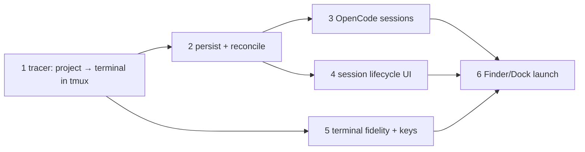

# Structure: workspace walking skeleton

Six vertical slices. Each one ends in a running app that does one more thing a
person can see. Slice 1 is the tracer bullet: folder picker → tmux → xterm.js,
end to end, for a plain terminal. Everything stays inside the epic scope for
child 1 (E-D1 projects only, E-D3, E-D4, E-D5 launch only, E-D7 subset).

**Commands.** `grove.config.json` has no `commands` yet. Slice 1 adds the npm
scripts and records them there: `test` = `npm test` (vitest run), `typecheck` =
`npm run typecheck`, `dev` = `npm run dev`. The tmux backend tests and the app
need tmux sockets under `/private/tmp/tmux-501`, so run them outside the Claude
sandbox (research: sandbox blocks them).

## Slices

### 1. Tracer: add a project, open a terminal session in tmux

- **Outcome:** `npm run dev` opens grove with an empty sidebar and **Add project**.
  Picking a folder saves it to `~/.config/grove/config.json` and lists it. Cmd+T opens
  the ＋ modal (project + Terminal only). It creates `grove-<uuid>` on `-L grove` in the
  project root, which shows under the project and is attached in xterm.js. Sessions
  live in memory only. Cmd+Q quits without hanging and the tmux session survives.
- **Files:** `package.json`, `electron.vite.config.ts`, `tsconfig{,.node,.web}.json`,
  `vitest.config.ts` (from f5a1c17, trimmed), `scripts/fix-spawn-helper.mjs`,
  `resources/tmux.conf`, `grove.config.json` (`commands`), `src/shared/{types,ipc}.ts`,
  `src/core/store/{jsonFile,configStore}.ts`, `src/core/env.ts` (`minimalEnv`,
  `findTmux`), `src/core/backend/{types,tmux,herdr}.ts`, `src/core/{projects,sessions,core}.ts`
  (create only), `src/main/{index,ipc,menu}.ts`, `src/preload/index.ts`,
  `src/renderer/src/{App.tsx,stores/slices.ts}`, components `Sidebar`, `NewSessionModal`,
  `TerminalView`; tests `src/core/backend/tmux.test.ts`, `src/core/store/jsonFile.test.ts`.
- **Signatures:** `SessionBackend` / `AttachHandle` as in the design; `createCore(opts):
  Core`; `readVersioned<T>(path, schemaVersion, empty): T`; `atomicWrite(path, data)`;
  IPC `state:get`, `project:add`, `session:create`, `pty:attach`, `pty:input|resize|detach`,
  pushes `state:projects|sessions|ui`, `pty:data|exit` (D2 coalesced slice snapshots).
  `HerdrBackend` throws "not implemented" for every method.
- **Verification:**
  1. `npm install` then `stat -f %Lp node_modules/node-pty/prebuilds/darwin-*/spawn-helper` prints `755`.
  2. `npm run typecheck` and `npm test` pass. `tmux.test.ts` runs create/list/kill/attach
     against real tmux on `-L gt<pid>` (skipped, not failed, without tmux).
  3. Manual: `npm run dev` → Add project → pick this repo → `cat ~/.config/grove/config.json`
     shows `{schemaVersion:1, projects:[{id,name:"grove",path}]}`. Cmd+T → Terminal →
     `pwd` in the xterm prints the repo path. `tmux -L grove ls` lists `grove-<uuid>`.
  4. Cmd+Q: the process exits within 2 s (`pgrep -f electron-vite` empty). `tmux -L grove ls`
     still lists the session. If it hangs, add the SIGKILL fallback from Risks in this slice.
- **Depends on:** none.

### 2. Sessions persist, reconcile on start, and go `gone`

- **Outcome:** sessions are saved to `state.json` with generated labels
  (`Terminal · HH:MM`). After quit and relaunch they are listed and the focused one
  re-attaches. A session killed outside the app shows `gone` within 5 s while
  running, or on the next start if the app was closed. A corrupt state file is moved
  aside and shows an error banner.
- **Files:** `src/core/store/stateStore.ts`, `src/core/sessions.ts` (reconcile, poll,
  labels, `endedAt`), `src/core/core.ts` (App start flow, 5 s poll, focus check,
  `pty:exit` check), `src/main/index.ts` (window focus → check), `ui:set` handler,
  `src/renderer/src/App.tsx` (attach `ui.focusedSessionId`, error banner);
  tests `src/core/sessions.test.ts` (in-memory backend + temp dir),
  `src/core/store/stateStore.test.ts`.
- **Signatures:** `reconcile(sessions, live: Set<string>, now): Session[]`;
  `Session.lastStatus: 'running' | 'gone'`, `endedAt`, `labelPinned: false`;
  `UiState { sidebarWidth, focusedSessionId }`.
- **Verification:**
  1. `npm test`: `sessions.test.ts` covers reconcile (missing → `gone` with `endedAt`,
     present stays `running`, orphans in tmux are ignored); `stateStore.test.ts` covers
     missing file → empty, bad JSON and unknown `schemaVersion` → `state.json.bad-<ts>`.
  2. Manual: create two sessions, Cmd+Q, relaunch → both listed, the focused one is
     attached and shows its previous screen.
  3. Manual: with the app running, `tmux -L grove kill-session -t =grove-<id>` → the row
     shows `gone` within 5 s. With the app closed, kill another → relaunch → `gone`, and
     `jq '.sessions[].endedAt' "~/Library/Application Support/grove/state.json"` is set.
  4. Manual: quit, `echo '{' > …/state.json`, relaunch → banner shown, `state.json.bad-*` exists.
- **Depends on:** 1.

### 3. OpenCode sessions with a minted id and the user's shell env

- **Outcome:** the ＋ modal offers OpenCode. It starts `$SHELL -l -i -c 'exec opencode
  -s <ses_…>'` in the project root (D1), labelled `OpenCode · HH:MM`. The TUI runs
  with the user's PATH (nvm/mise), and the first submitted prompt gets a model reply.
- **Files:** `src/core/opencodeId.ts`, `src/core/env.ts` (`loginShellArgv`),
  `src/core/sessions.ts` (kind `opencode`, `opencodeSessionId`), `NewSessionModal.tsx`;
  tests `src/core/opencodeId.test.ts`, `src/core/env.test.ts`.
- **Signatures:** `mintSessionId(now?: number): string`;
  `loginShellArgv(argv: string[], shell = process.env.SHELL): string[]`.
- **Verification:**
  1. `npm test`: `opencodeId.test.ts` checks the `ses_` prefix, length and that ids sort
     descending by time (newer first), against a real id captured from `spikes/opencode`;
     `env.test.ts` checks quoting of `exec opencode -s <id>` and that `TMUX`/`TMUX_PANE` are stripped.
  2. Manual: Cmd+T → OpenCode → the TUI opens in the repo. Submit "say hi" → a reply
     arrives (no `provider.auth` 403). `tmux -L grove list-panes -t =grove-<id> -F
     '#{pane_start_command}'` contains the `opencodeSessionId` from `state.json`.
- **Depends on:** 2.

### 4. Session and project lifecycle in the sidebar

- **Outcome:** Cmd+W asks for confirmation and kills the focused session. `gone` rows
  have **Remove**. Sessions can be renamed (`labelPinned: true`). Clicking a session or
  Cmd+1..9 switches the single live attach. **Remove project** is refused while it has
  live sessions and otherwise removes it with its `gone` sessions.
- **Files:** `src/core/{projects,sessions}.ts` (kill, remove, rename, project remove
  rules), `src/main/{ipc,menu}.ts` (`session:kill|remove|rename`, `project:remove`,
  `menu:action`), `Sidebar.tsx`, `ConfirmDialog.tsx`, `TerminalView.tsx` (dispose +
  re-attach on focus change); tests in `sessions.test.ts` and `src/core/projects.test.ts`.
- **Signatures:** `commands.sessionKill|sessionRemove|sessionRename|projectRemove`
  returning `Result<T>`; errors `has-live-sessions`, `not-gone`; `menu:action`
  `newSession | closeSession | focusIndex(n)`.
- **Verification:**
  1. `npm test`: remove refused unless `gone`; project remove refused with a `running`
     session and removes its `gone` sessions otherwise; rename sets `labelPinned`; kill
     of an already-missing tmux session succeeds.
  2. Manual: Cmd+W → Cancel keeps it; Cmd+W → Confirm → `gone`, and `tmux -L grove ls`
     no longer lists it. Remove → row gone. Rename → survives relaunch.
  3. Manual: with two running sessions, Cmd+1/Cmd+2 switch terminals and
     `tmux -L grove list-clients` shows exactly one client. Remove project with a live
     session → refused with a message.
- **Depends on:** 2.

### 5. Terminal fidelity and keys

- **Outcome:** terminals render with WebGL and truecolor, tmux sees the app's colours
  (OSC 10/11 via `select-pane -P`), and keys behave as in the Phase 0 spike: the custom
  menu owns Cmd+T/W/K/1..9/Q, Edit roles work, `macOptionIsMeta` is off, and everything
  else reaches the pane unchanged.
- **Files:** `TerminalView.tsx` (WebGL addon, theme, options), `src/core/backend/tmux.ts`
  (`setColors`, attach env `TERM=xterm-256color COLORTERM=truecolor`),
  `src/core/sessions.ts` (colours on create), `src/main/menu.ts` (Edit roles),
  `src/shared/theme.ts`.
- **Signatures:** `setColors(name, fg, bg)`; `terminalTheme: { foreground, background, … }`.
- **Verification:**
  1. `npm test`: `tmux.test.ts` asserts `show-options -p -t =<name> window-style`
     (or `display -p '#{pane_style}'`) matches after `setColors`.
  2. Manual: in a Terminal session run `spikes/tmux-opencode/q1-truecolor.sh` → smooth
     gradient; `printf '\e]11;?\a'` reports the app background.
  3. Manual: run `python3 spikes/electron/keylog.py` in a Terminal session and walk the
     key checklist in `spikes/electron/README.md` (arrows, Option+arrows, Esc, Tab,
     Ctrl-keys, paste) → same bytes as the research table. Cmd+K does nothing yet (child 7)
     and is not sent to the pane.
- **Depends on:** 1.

### 6. Finder and Dock launch work like `npm run dev`

- **Outcome:** launching the built app outside a shell finds tmux, starts OpenCode with
  the login-shell env, and has a UTF-8 locale.
- **Files:** `src/core/env.ts` (fixed directories for `findTmux`, `LANG` default),
  `src/main/index.ts` (startup error banner when tmux isn't found); test in `env.test.ts`.
- **Signatures:** `findTmux(env): string | null`; `minimalEnv(base): NodeJS.ProcessEnv`.
- **Verification:**
  1. `npm test`: `findTmux` finds `/opt/homebrew/bin/tmux` with `PATH=/usr/bin:/bin`;
     `minimalEnv` sets `LANG=en_US.UTF-8` only when unset.
  2. Manual: `npm run build`, quit grove, then `open -a node_modules/electron/dist/Electron.app --args "$PWD"`
     (Launch Services env, no shell). Existing sessions re-attach; a new OpenCode
     session opens; `locale` in a new Terminal session shows `UTF-8`.
  3. Manual: same, but launch by clicking that `Electron.app` in the Dock. This also
     closes the research's open "Dock-launch env" unknown; record the result in
     `06-implementation.md`.
- **Depends on:** 3, 4, 5.

## Deferred

- Packaged `.app`, signing, `asarUnpack` checks in a real build (child 8). Slice 6
  uses the dev Electron binary only.
- Status beyond `running`/`gone`, SSE, auto-linking, OpenCode titles, resume (child 3).
- Feature discovery and the feature tree (child 2). Cmd+K palette and grid (child 7).
- Renaming projects, validating folders, adopting orphan tmux sessions.
- herdr backend beyond the stub.

## Rollout / migration

No users and no app code at HEAD, so no data migration. The previous app's Chromium
data in `~/Library/Application Support/grove` is left alone. Changing
`resources/tmux.conf` options that later need unsetting requires `tmux -L grove
kill-server` (ends sessions); note it in the commit when it happens.

## Open questions
