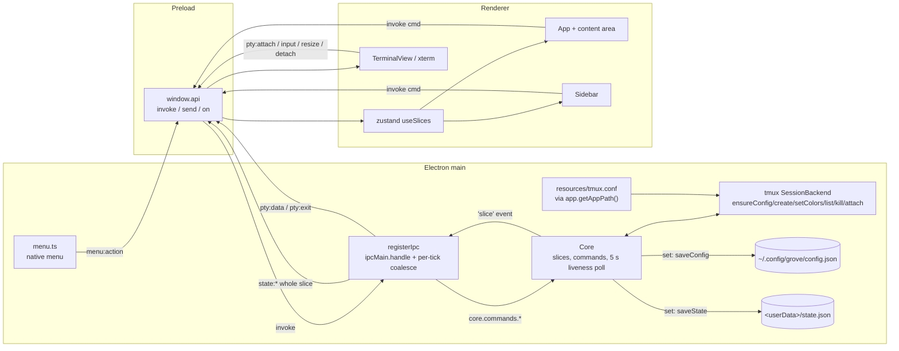

# Research: workflow, discovery and sidebar

Delta research for an epic child. Research ran while `01-questions.md` was draft v1 (soft gate). Citation key: `~/.claude/skills/...` = installed grove skills (symlinks into grove-skills). `$TMPDIR/fw` experiments are scratch and not committed.

## Summary

- Core in Electron main holds one in-memory `slices` object (`projects`, `sessions`, `ui`). Every write goes through `set`, which notifies listeners and persists synchronously (`src/core/core.ts:46,52-57`).
- Main pushes whole slices to the renderer, coalesced per tick (`src/main/ipc.ts:71-82`). The renderer mutates only through typed `invoke` commands (`src/shared/ipc.ts:7-33`).
- Config and state are versioned JSON with `schemaVersion: 1`. There is no shape validation and no migration code (`src/core/store/jsonFile.ts:11-36`).
- The sidebar lists projects in config order and sessions by `startedAt`. Cmd+1..9 uses the same order (`src/renderer/src/sidebarOrder.ts:4-10`).
- The grove contract now defines `flow`, `## Flow log` and a per-slice `05-plan.md`. There is no `grove-plan` skill (`~/.claude/skills/grove-implement/references/contract.md:48-97,171-191`).
- Real feature folders deviate from the contract in places: `status: complete`, missing `flow`, `00-ticket.md` without frontmatter, extra subfolders.
- No file-watching, frontmatter or YAML library is installed. chokidar 5.0.0 and gray-matter 4.0.3 were tried in scratch.
- `resources/` is not copied to `out/`. `tmux.conf` resolves from `app.getAppPath()` (`src/main/index.ts:24`). No packaged path is handled.
- `npm test` passes 55/55 outside the sandbox. Typecheck passes. No renderer component tests exist.

## Inherited from epic

This child relies on these sections of `docs/work/2026-10-05-opencode-feature-workspace/02-research.md`:

- **Q5. The previous grove app** — the chokidar and gray-matter watcher patterns (`02-research.md:153-196,343`).
- **Q7. Grove artifact formats today** (`02-research.md:237-247`). Partly outdated; see Q3 below for eight differences.
- **Current architecture** (`02-research.md:307-338`). Outdated: it describes a plan, not code. The code now exists (see Current architecture below).
- **Existing patterns to reuse** (`02-research.md:339-346`). The "Main/preload IPC shape" pattern is now implemented in this repo (`src/shared/ipc.ts:3-38`, `src/preload/index.ts:4-14`).
- **Constraints & invariants** (`02-research.md:348-358`). Outdated: it names grove-plan as the approval exception. grove-plan no longer exists; grove-implement self-approves per slice (`~/.claude/skills/grove-implement/references/gates.md:104-106`).

Also outdated: the epic's "Test landscape" says HEAD (15ec3b4) has no application code (`02-research.md:362`). Its "Relevant ADRs" says none exist (`02-research.md:368`). `src/` now holds core, main, preload and renderer with tests (e.g. `src/core/sessions.test.ts:13-181`). `docs/adr/` holds ADRs 0001–0012.

## Answers

### Q1. Core slices, IPC, persistence and migration

**Hold.** `createCore` keeps one `slices: Slices = {projects, sessions, ui}` (`src/core/core.ts:46`). `Project` is `{id, name, path}`. `Session` is `{id, projectId, kind, label, labelPinned, tmuxName, opencodeSessionId, feature, linkPinned, action, startedAt, endedAt, lastStatus}`. `UiState` is `{sidebarWidth, focusedSessionId}` (`src/shared/types.ts:1-19`). `feature`, `linkPinned` and `action` are commented "always null/false in this child" (`types.ts:11-13`). `newSession` sets them that way (`src/core/sessions.ts:20-22`).

**Mutate.** Every write goes through `set(k, v)`. It replaces the slice, calls every `'slice'` listener, then persists (`core.ts:52-57`). Helpers: `replaceSession` (`core.ts:72-74`) and `dropSessions`, which clears `ui.focusedSessionId` when the focused session disappears (`core.ts:76-80`). Commands: `projectAdd`, `projectRemove`, `sessionCreate`, `sessionKill`, `sessionRemove`, `sessionRename`, `uiSet` (`core.ts:82-137`). They return `Result = {ok:true,data}|{ok:false,error}` (`src/shared/ipc.ts:3`). Error strings are `'not-found'`, `'has-live-sessions'`, `'not-gone'` (`core.ts:90-91,99,120`). Session logic is pure functions: `newSession`, `reconcile`, `markGone`, `rename` (`sessions.ts:11-45`). `reconcile` returns the same array when nothing changed, and `set` is then skipped (`sessions.ts:36`, `core.ts:67`). Liveness is checked by a 5 s poll (`core.ts:153`), on window focus (`src/main/index.ts:45`), and when an attach exits (`core.ts:175-178`).

**Persist.** On every `set`, synchronously: `projects` → `saveConfig(configPath, {schemaVersion:1, projects})`; any other slice → `saveState(statePath, {schemaVersion:1, sessions, ui})` (`core.ts:55-56`). Paths are `~/.config/grove/config.json` and `<userData>/state.json` (`src/main/index.ts:19-20`). Writes are atomic: mkdir, write `${file}.${pid}.tmp`, rename (`src/core/store/jsonFile.ts:4-9`). Output is pretty JSON plus newline (`configStore.ts:9`, `stateStore.ts:10`).

**Push.** `registerIpc` subscribes to `core.on('slice')`. It collects changes in a pending Map and flushes once per `setImmediate` as `state:<key>` with the whole slice (`src/main/ipc.ts:71-82`). Sends go through `webContents.send`, guarded by `isDestroyed` (`ipc.ts:11-14`).

**IPC channels** (`src/shared/ipc.ts:7-33`):

| Kind | Channels |
|---|---|
| invoke | `state:get`, `app:errors`, `project:add` (opens a directory dialog in main, `ipc.ts:30-36`), `project:remove`, `session:create`, `session:kill`, `session:remove`, `session:rename`, `ui:set`, `pty:attach` |
| send | `pty:input`, `pty:resize`, `pty:detach` |
| push | `state:projects`, `state:sessions`, `state:ui`, `pty:data`, `pty:exit`, `menu:action` |

Core commands return their own `Result` (`returnsResult=true`). Other handlers are wrapped; a thrown error becomes `{ok:false,error}` (`ipc.ts:17-26,37-42`). Only one attach is live: a new `pty:attach` kills the others (`ipc.ts:45-50`).

**Renaming a session.** Double-clicking a card title shows an `<input>`. Enter trims; if non-empty, the renderer calls `invoke('session:rename',{id,label})`. Escape or blur cancels (`src/renderer/src/components/Sidebar.tsx:35-50`). Core runs `rename(s,label)` → `{...s, label, labelPinned:true}` (`sessions.ts:43-45`), then `replaceSession`, persist, push (`core.ts:125-131`). Core does not trim or check the label. `labelPinned` is written (`sessions.ts:17,44`) but never read in `src/` outside tests. No channel unpins it or sets `feature`, `linkPinned` or `action`. `ui:set` merges any `Partial<UiState>` with no validation (`core.ts:133-136`). Nothing in the renderer sets `sidebarWidth`. The only `ui:set` caller sends `focusedSessionId` (`src/renderer/src/stores/slices.ts:29`).

**Load, validate, migrate.** `start()` loads config then state, with an `onBad` that appends to errors (`core.ts:141-145`). Then it runs `ensureConfig` and reconciles against `backend.list()`; a tmux failure is logged as `tmux: …` (`core.ts:146-152`). `readVersioned(file, 1, empty, onBad)` (`jsonFile.ts:11-36`):

- ENOENT → empty. Any other read error throws (`jsonFile.ts:21-22`).
- The only check is `parsed.schemaVersion === 1` (`jsonFile.ts:27`). There is no shape validation.
- Invalid JSON or an unknown version renames the file to `${file}.bad-<ms>`, reports via `onBad`, and returns empty (`jsonFile.ts:28-35`).

`loadState` defaults missing `sessions`/`ui` (`stateStore.ts:6`). `loadConfig` does not default missing `projects` (`configStore.ts:5`, `core.ts:142`). No migration code exists. The version is hard-coded to 1 in the readers and in `set` (`configStore.ts:5`, `stateStore.ts:5`, `core.ts:55-56`). ADR 0009 says migrations are "hand-written per schemaVersion" (`docs/adr/0009-app-state-in-json-files.md:29`).

Renderer errors come from `app:errors`: a main-side list (tmux not found, `src/main/index.ts:16`) plus `core.getErrors()` (`index.ts:30`). They are fetched once at hydrate and never pushed (`slices.ts:25-27`).

### Q2. Renderer structure, sidebar, content area, order and base components

**Store.** One zustand store `useSlices` holds `{projects, sessions, ui, errors, hydrate, setFocused}` (`src/renderer/src/stores/slices.ts:5-30`). `hydrate` subscribes to the three `state:*` pushes first, then runs `state:get` and `app:errors` (`slices.ts:21-27`). Pushes replace slices wholesale. `setFocused` round-trips through `ui:set` (`slices.ts:29`).

**Sidebar** (`Sidebar.tsx:66-124`). The header shows "Sessions" with a `Badge` of `sessions.length` (all sessions, gone included) and an "Add project" button calling `project:add` (`Sidebar.tsx:79-85`). Each project, in config order, gets a folder row: chevron, folder icon, name, `title=path`. A click toggles collapse. Hover actions remove the project or start a new session in it via `onNew(p.id)` (`Sidebar.tsx:88-102`). A refused remove shows inline "Can't remove: project has running sessions" (`Sidebar.tsx:72-75,103`). When not collapsed, it renders `sessionsOf(p.id, sessions)` as `SessionCard` (`Sidebar.tsx:104-116`). Collapsed and compact sets are local `useState`, not persisted (`Sidebar.tsx:69-70`). `SessionCard` renders a `ListRow` (`Sidebar.tsx:17-63`): `title=label`, icon by kind, `status {label: lastStatus, tone: lastStatus}`, tone `selected` when focused else `default`. A trash button (`session:remove`) shows only when gone. A compact toggle is always present.

**Content area** (`src/renderer/src/App.tsx:41-65`). The focused session is the one with `id === ui.focusedSessionId`. `ContentHeader` crumbs are `[project.name, focused.label]`. If `lastStatus === 'running'` it renders `<TerminalView key=id sessionId>`. Else, if a session is focused, it shows "Session ended" with a Remove button. Else it shows "Start a session with ＋ or ⌘T". `NewSessionModal` and the Cmd+W kill `ConfirmDialog` render from App state (`App.tsx:18-19,68-80`). `TerminalView` uses xterm with Fit and WebGL (DOM fallback), buffers early `pty:data`, debounces resize by 100 ms, and detaches on unmount (`TerminalView.tsx:11-75`).

**sidebarOrder and Cmd+1..9.** `sessionsOf` filters by `projectId` and sorts by `startedAt` (`src/renderer/src/sidebarOrder.ts:4-6`). `sidebarOrder = projects.flatMap(sessionsOf)` (`sidebarOrder.ts:8-10`). Cmd+1..9 menu accelerators send `menu:action {type:'focusIndex', n}` (`src/main/menu.ts:37-42`). App reads `useSlices.getState()` and focuses `sidebarOrder(projects, sessions)[n-1]` (`App.tsx:26-36`). The order depends only on config project order and `startedAt`. It includes gone sessions and sessions in collapsed projects. It excludes sessions whose project is missing. Cmd+T and Cmd+W come from the same menu (`menu.ts:20-21`). Cmd+K is a no-op placeholder (`menu.ts:46`).

**Base components** (`src/renderer/src/components/ui/`):

| Component | Props |
|---|---|
| `Button` | `ButtonHTMLAttributes` + `variant` primary\|secondary\|ghost\|danger (default secondary), `size` sm\|md, `icon?: IconName`, `round?` (`Button.tsx:6-20`) |
| `Icon` | `{name, size=16, className?}`; names plus, folder, folder-plus, chevron-down, chevron-right, terminal, opencode, branch, search, info, trash, minimize, x, logo (`Icon.tsx:3-6,35`) |
| `ListRow` | `{title, icon?, meta?, status?:{label, tone:StatusTone}, tone?: default\|selected\|waiting\|finished, compact?, actions?, onClick?, onTitleDoubleClick?, editor?}`; compact shows a `StatusDot` and hides meta/status text (`ListRow.tsx:6-32`) |
| `StatusDot` | `{tone}`; `StatusTone` = running\|working\|waiting\|idle\|finished\|gone (`StatusDot.tsx:4-8`) |
| `Badge` | `{tone?: accent\|muted, children}` (`Badge.tsx:5`) |
| `Banner` | `{tone?: error\|info, children}`, `role="alert"` (`Banner.tsx:6-13`) |
| `Modal` | `{onClose, onConfirm?, width?: sm\|md, children}`; Esc/Enter in a capture-phase window keydown (`Modal.tsx:5-33`) |
| `cx` | class joiner (`cx.ts:1-3`) |

Shell and composite components: `AppShell {topBar, banners?, sidebar, content, sidebarWidth}` sets `--sidebar-w` (`shell/AppShell.tsx:4-21`). `ContentHeader {crumbs: string[], right?}` (`shell/ContentHeader.tsx:4`). `TopBar {onNew}` with an inert search box (`shell/TopBar.tsx:6-24`). `ConfirmDialog {title, body, confirmLabel, onConfirm, onCancel}` (`ConfirmDialog.tsx:5-11`). `NewSessionModal {onClose, initialProjectId?}` (`NewSessionModal.tsx:14`).

**Tokens** (`src/renderer/src/styles/tokens.css:3-85`): surfaces `--chrome-bg`, `--panel-bg`, `--card-bg`, `--raised-bg`, `--muted-badge-bg`, `--terminal-bg/fg`, `--backdrop`, `--shadow-modal`; borders `--card-border`, `--divider`, `--header-divider`, `--scrollbar-thumb`; text `--text`, `--text-2`, `--text-3`; accent `--accent`, `--accent-strong`, `--accent-badge`; status `--status-{running,working,waiting,finished,idle,gone}`; card tones `--card-{selected,waiting,finished}-{bg,border}`, `--card-glow`; danger `--danger`, `--danger-bg`, `--danger-border`; type `--font-ui`, `--font-mono`, `--fs-xs..xl`, `--fw-*`; space `--sp-1..6`, `--gutter`; radius `--r-card`, `--r-md`, `--r-panel`, `--r-pill`; sizes `--topbar-h`, `--header-h`, `--traffic-inset`, `--sidebar-w`. Global classes `.app-drag`, `.app-no-drag` (`base.css:35-44`). JS colours `chromeBackground` and the Catppuccin `terminalTheme` live in `src/shared/theme.ts:3-28`.

### Q3. Grove artifact contract today

**Installation.** Every `~/.claude/skills/grove-*` is a symlink to `/Users/victor/git/grove-skills/skills/grove-*`. There are 11 skills: approve, design, epic-status, implement, questions, render, research, setup, spike, start, structure. No `grove-plan` skill exists. Newest grove-skills commit: `faad6cb`. All 11 copies of `references/contract.md` have the same md5; so do all `gates.md` and `approve.md`. The file says it is copied verbatim by `scripts/sync-shared.sh` (`~/.claude/skills/grove-implement/references/contract.md:3-5`). Citations below use that copy (`contract.md`).

**Files per feature.** `feature.md` and `00-ticket.md` through `06-implementation.md`. Epics produce no 05 or 06 (`contract.md:101-110`). Only grove-render writes `.html` (`contract.md:112`). Render never makes companions for 00, 01, 05, 06 (`~/.claude/skills/grove-render/SKILL.md:19-20`).

**feature.md.** Not a phase artifact: no `phase`/`status`/`version`, never approved or stale (`contract.md:113-115`). Fields: `kind` (epic|feature, default feature), `parent`, `children`, `appetite`, `order`, `flow` (full|standard|small; missing = full), `created` (`contract.md:122-132`). A missing `feature.md` counts as `kind: feature` with no parent (`contract.md:138-139`). An epic body needs Problem, Who it's for, Success looks like, Non-goals, Appetite (`contract.md:141-147`).

**flow and Flow log.** `flow` is the only field that changes after creation without an approval (`contract.md:134-136`). Flows table: `contract.md:48-61`; proposal rules: `contract.md:63-72`. Missing flow = full (`contract.md:74-76`; `gates.md:6-7`; `approve.md:56`). `## Flow log` is a body section of `feature.md`. Each flow change appends `- YYYY-MM-DD: <flow> …`. The heading is created at the end of the body if missing (`contract.md:80-92`). Changing flow never changes an artifact's status (`contract.md:94-97`). Epic children are created with `flow: standard` and a body ending with `## Flow log` and `- <today>: standard (default for an epic child)` (`approve.md:102-106`).

**Phase-artifact frontmatter** (every file except 00 and `feature.md`): `feature`, `phase` (questions|research|design|structure|plan|implementation), `status` (draft|approved|stale), `version`, `created`, `updated`, `approved_at`, `based_on` (`file@v`, `parent:file@v`), `forced`, `repo_heads` (02 only) (`contract.md:149-169`).

**05-plan.md.** Written one slice at a time, just before the slice runs (`contract.md:171-191`). One frontmatter block. The body grows by one `## Slice N — <outcome>` section per slice. Steps are `- [ ]` / `- [x]` checkboxes. `based_on` lists `03-design.md@v` and `04-structure.md@v` (small flow: `01-questions.md@v`), updated per section. grove-implement sets `status: approved` itself, with the body note "Self-approved per slice by grove-implement…" (`~/.claude/skills/grove-implement/references/slice-plan.md:21-31,61-65`). The plan is never a gate (`gates.md:23-24,104-106`). Up-front plans remain valid with a drift check (`contract.md:188-191`; `slice-plan.md:67-78`). The next slice is the first whose section is missing or still has a `- [ ]` (`~/.claude/skills/grove-implement/SKILL.md:60-62`).

**06-implementation.md.** The contract gives no body format beyond the generic frontmatter. grove-implement logs deviations per slice (`SKILL.md:77-78`), writes a PR description at the end (`SKILL.md:86-89`), and tracks "progress, deviations, and … the PR description" (`SKILL.md:93-95`). Commits are named `<slug>: slice N — <outcome>` (`SKILL.md:78-79`). Approving design or structure marks existing 05 and 06 stale (`approve.md:89`).

**FLAGGED.md** is written into a child removed from an epic's list (`approve.md:109-112`). It is not defined in `contract.md`.

**Differences from epic research Q7** (`docs/work/2026-10-05-opencode-feature-workspace/02-research.md:237-247`):

1. Q7's `feature.md` field list (`:241`) has no `flow`. The contract now defines `flow` (`contract.md:129`) and `## Flow log` (`contract.md:80-92`).
2. Q7 says grove-plan sets 05 approved, in conflict with `gates.md` (`:243`). grove-plan no longer exists. grove-implement self-approves per slice, and `gates.md` states this as an explicit exception (`gates.md:104-106`). `AGENTS.md` still lists a "Plan (`grove-plan`)" phase and says "Plan needs an approved structure" (`AGENTS.md:10,24`).
3. The per-slice 05 format, legacy plans and the drift check are new (`contract.md:171-191`).
4. Epic-child slugs now insert `NN` (`<prefix>-<NN>-<kebab>`, never renumbered) (`contract.md:17-23`). Q7's slug rule (`:239`) has none.
5. Child folders created at approval now get `flow: standard` and a Flow log line (`approve.md:102-106`). Q7 (`:245`) lists only `kind`, `parent`, `order`.
6. Q7 says grove-epic-status and grove-spike are not linked (`:247`). Both are now symlinked, as is grove-start.
7. Q7's citations into `contract.md` (`:54-75`, `:85-105`, `:141-143`) point at old line numbers. That content is now at `:117-139`, `:149-169`, `:227-229`.
8. Q7 says FLAGGED.md is "not defined in the contract" (`:241`). Still true of `contract.md`, but `approve.md` now defines it (`approve.md:111`).

### Q4. Frontmatter actually present in docs/work

Method: frontmatter read with awk; every block parsed with `yaml.safe_load` without error; Flow log checked with `grep -l`. This child's own folder was not scanned.

| Folder | Files | feature.md frontmatter | Phase artifacts (status, version) | Other |
|---|---|---|---|---|
| `opencode-feature-workspace` (epic) | 00–04 + feature.md | `kind: epic`, `children` (9), `appetite` "~5–6 weeks", `created`; no flow; no Flow log | 01 draft v3, 02 draft v5, 03 approved v3 (`03-design.md:5`), 04 approved v5 (`04-structure.md:5`) | `.html` for 02/03/04; `refs/xirp-reference.png`; `.claude/.cc-writes/` (empty) |
| `01-workspace-walking-skeleton` | 00–06 + feature.md | `kind`, `parent`, `order: 1`, `created`; no flow; no Flow log | 01 draft v1, 02 draft v2, 03 approved v1, 04 approved v1, 05 approved v1, 06 `status: complete` v1 | `.html` 02/03/04; `.claude/.cc-writes/` |
| `09-visual-foundation` | 00–06 + feature.md | `kind`, `parent`, `order: 2`, `flow: standard`, `created`; has `## Flow log` | 01–04 approved (v1, v1, v2, v2), 05 approved v1 with empty `approved_at`, 06 draft v1 | `.html` 02/03/04; `.claude/.cc-writes/` |
| `03` to `08` (6 children) | feature.md only | `kind`, `parent`, `order` 4–9, `created`; no flow; no Flow log | none | none |

- `kind` values: `epic` (1), `feature` (8). `phase` values: questions, research, design, structure, plan, implementation. `status` values: draft, approved, and `complete` (not in the contract enum).
- Missing fields: only the epic has `appetite`. No child has `children`. Only visual-foundation has `flow`. walking-skeleton's 06 has no `approved_at`. No 01/05/06 has `repo_heads` (matches the contract).
- `based_on` irregularities: the epic's 01 lists `00-ticket.md` with no `@version` (`01-questions.md:10`). Children's 01 lists `parent:` entries including `parent:04-structure.md@N`, which the contract example does not show. `repo_heads` entries are `name@ref (extra)` strings, not bare SHAs. Children's `parent:` entries cite `parent:03-design.md@1` and `parent:04-structure.md@2` or `@4` (e.g. `2026-10-05-09-visual-foundation/03-design.md:13-14`), while the epic's 03 is now v3 and 04 is v5.
- `forced` is `[]` everywhere except the epic's 04, which has one entry: "9 children > epicMaxChildren 8: …" (`2026-10-05-opencode-feature-workspace/04-structure.md:11-12`).
- All three `00-ticket.md` files have no frontmatter (the contract expects none, `contract.md:149`).
- Non-phase content: `.html` only beside 02/03/04, git-ignored (`.gitignore:11`; `commitHtml: false`, `grove.config.json:5`). Other non-`.md` file: `refs/xirp-reference.png`. Subfolders: `refs/` and `.claude/.cc-writes/` (empty, mode 700) in three folders. `docs/work/` itself also holds an empty `.claude/.cc-writes/` (mode 700) at its root. No FLAGGED.md is present.
- The epic's `order` puts `09-visual-foundation` second (`feature.md:5`). Slug `NN` does not match list position: visual-foundation has `order: 2` and `NN` 09.
- Every `feature.md` seen has `kind` and `created`. Children carry `parent` and `order`; the epic carries `children`. Every 01–06 file seen has `feature` (= folder slug), `phase`, `status`, `version`, `created`, `updated`, `based_on`, `forced`.

### Q5. Watching, frontmatter and YAML libraries

**In repo.** None. `package.json` dependencies are only `@xterm/*`, `node-pty` 1.1.0 and `zustand` 5.0.15 (`package.json:20-26`). A grep of `node_modules` for chokidar, gray-matter, yaml, front, watch, fsevents, matter returned nothing. `package-lock.json:1851-1865` lists `fsevents` 2.3.3 (dev, optional, darwin, transitive), but it is not installed.

**Latest on npm** (`npm view`): chokidar 5.0.0, gray-matter 4.0.3, yaml 2.9.1, js-yaml 5.4.2. A scratch install in `$TMPDIR/fw` gave chokidar@5.0.0 (readdirp@5.1.1) and gray-matter@4.0.3 (js-yaml@3.15.2).

**chokidar 5 source.** ESM-only (`"type":"module"`, `package.json:5`). Node >= 20.19.0 (`package.json:35-36`). It does not use fsevents; it uses `fs.watch` (`handler.js:126`). `atomic` is on whenever polling is off (`index.js:269,279-280`). `awaitWriteFinish: true` means `{stabilityThreshold:2000, pollInterval:100}` (`index.js:258,273`). With `atomic`, an unlink is held 100 ms, and an add for the same path inside that window is reported as one `change` (`index.js:486-500`).

**chokidar experiment** (`$TMPDIR/fw/exp.mjs`, `ignoreInitial: true`). Inside the sandbox it crashed with `EMFILE: too many open files, watch`. These results come from a run outside the sandbox:

| Action | Events (no `awaitWriteFinish`) |
|---|---|
| Write dotfile tmp, rename over `a.md` | one `change feat/a.md` after ~7 ms |
| Write `a.md.tmp123`, rename over `a.md` | one `change`; no event for the tmp file |
| `mkdir f2` + file | `addDir f2`, `add f2/b.md` |
| `mkdir -p f3/sub` + file | `addDir f3`, `addDir f3/sub`, `add f3/sub/c.md` |
| `rm -rf f2` | `unlinkDir f2` at once; `unlink f2/b.md` ~100 ms later |
| Rename folder `f3` → `f4` | `unlinkDir f3/sub`, `unlinkDir f3`, `addDir f4`, `addDir f4/sub`, `add f4/sub/c.md`; then `unlink f3/sub/c.md` ~100 ms later |
| File written in 5 chunks 80 ms apart | one `add`, five `change` |

`unlink` was reported ~100 ms late. With `awaitWriteFinish {stabilityThreshold:200, pollInterval:50}`, each change was reported once, ~250 ms late. The chunked write gave a single `add` ~620 ms after start and no `change`. `addDir`/`unlinkDir` were not delayed.

**gray-matter 4.0.3.** Parses YAML with js-yaml 3 `safeLoad` (`node_modules/gray-matter/lib/engines.js:16`). It caches results by input string when no options are passed (`index.js:35-47`). In the experiment, mutating `data` on one result showed up in the next parse of the same string. Passing `{}` as options avoided the cache.

**gray-matter experiment** (`$TMPDIR/fw/gm.cjs`):

- Unquoted `2026-10-05` → JS `Date` (UTC midnight). `2026-10-05T10:00:00Z` → `Date`. A quoted date stays a string.
- `based_on: 1.10` → number `1.1`.
- Malformed YAML (`[unclosed`, bad indentation) throws `YAMLException`.
- No frontmatter → `data {}`.
- An opened but never closed block parsed the rest of the file as YAML, with `content ""`.
- Empty `---\n---` → `isEmpty: true`.
- Bare-scalar frontmatter returns a string as `data`.

### Q6. Build handling of main deps and resources/

**Main deps.** `externalizeDepsPlugin()` is used for main and preload (`electron.vite.config.ts:7,20`). `node-pty` is also listed as external (`electron.vite.config.ts:10`). The plugin externalizes every key in `package.json` `dependencies` plus subpaths (`node_modules/electron-vite/dist/chunks/lib-q6ns0vZr.js:1127-1146`). `devDependencies` are bundled.

**resources/.** For main, electron-vite sets `publicDir: 'resources'` and `copyPublicDir: false` (`lib-q6ns0vZr.js:325-327`). The folder is not copied to `out/`; `out/main` holds only `index.js`. Assets are emitted only when imported with `?asset` (`lib-q6ns0vZr.js:593-612`). No source does this.

**Runtime path.** Main passes `path.join(app.getAppPath(), 'resources', 'tmux.conf')` (`src/main/index.ts:24`). It is used in `tmux -f` and `source-file` (`src/core/backend/tmux.ts:36,41`). Tests use `path.resolve('resources/tmux.conf')`, relative to cwd (`src/core/backend/tmux.test.ts:19`). In electron-vite dev, `getAppPath()` is the project root, because `main` points to `./out/main/index.js` in the root `package.json` (`package.json:7`). This is inferred, not observed.

**Packaged.** `package.json:18` has `"build":{"asarUnpack":["node_modules/node-pty/**","resources/**"]}`. No packager is installed. A grep of `src` and `scripts` for `asar|unpacked` found nothing. No code maps to `app.asar.unpacked` or uses `process.resourcesPath`. `app.isPackaged` only toggles dev menu items (`src/main/menu.ts:48`). `scripts/fix-spawn-helper.mjs` (postinstall) sets mode 755 on node-pty's `spawn-helper`.

### Q7. Test setup and current results

See Test landscape below.

## Current architecture

Sources: `src/core/core.ts:43-57`, `src/core/backend/types.ts:9-16`, `src/main/ipc.ts:11-82`, `src/main/index.ts:19-24`, `src/main/menu.ts:20-48`, `src/preload/index.ts:4-14`, `src/renderer/src/stores/slices.ts:5-30`.

## Existing patterns to reuse

- **Whole-slice snapshots.** Renderer mutations are `invoke` commands; their effect arrives in the next push (ADR 0011; `core.ts:52-57`; `ipc.ts:71-82`).
- **Pure domain functions plus orchestrating core.** `sessions.ts`/`projects.ts` hold pure logic. Core gets `now` and the backend injected for tests (`core.ts:13-18`; `src/core/testing/fakeBackend.ts`).
- **Typed channel maps.** `InvokeMap`/`SendMap`/`PushMap` are shared by preload, main and renderer (`src/shared/ipc.ts`).
- **Versioned JSON with quarantine.** Bad files move to `.bad-<ms>` and surface in an error banner (`jsonFile.ts:32-34`; `App.tsx:49`).
- **Atomic write.** Write `${file}.${pid}.tmp`, then rename (`jsonFile.ts:4-9`).
- **CSS Modules reading tokens.** Runtime values pass only as CSS variables (ADR 0012; `AppShell.tsx:12`).
- **Fresh state in async handlers.** Handlers read `useSlices.getState()` to avoid stale closures (`App.tsx:27-28`).
- **Old app watcher pattern.** chokidar with `awaitWriteFinish`, `.tmp` ignore, write-then-rename, gray-matter under a per-file lock (epic `02-research.md:343`).
- **Resource paths.** From `app.getAppPath()` in main; from cwd in tests (`src/main/index.ts:24`; `tmux.test.ts:19`).

## Constraints & invariants

- Core in main is the single writer of both JSON files. Every `set` persists synchronously (`core.ts:55-56`).
- A project with running sessions can't be removed. Removing a project drops its sessions (`core.ts:91-93`).
- Only a gone session can be removed (`core.ts:120`). `markGone` is idempotent (`sessions.ts:40`).
- Focus is cleared when the focused session is dropped (`core.ts:79`).
- `tmuxName === 'grove-' + id` (`sessions.ts:18`). `opencodeSessionId` is set only for kind `opencode` (`sessions.ts:19`).
- One live PTY attach at a time (`ipc.ts:46-50`).
- No visual inline styles in `src/renderer`, enforced by test (`src/renderer/src/noInlineStyles.test.ts:69-73`).
- `--chrome-bg` and `--terminal-bg/fg` equal `theme.ts`, enforced by test (`src/renderer/src/styles/tokens.test.ts:9-13`).
- Contract: missing `flow` = full; missing `feature.md` = `kind: feature` (`contract.md:74-76,138-139`). `00-ticket.md` has no frontmatter (`contract.md:149`). `.html` exists only beside 02/03/04 (`grove-render/SKILL.md:19-20`).
- Observed files break the contract enum: `status: complete` on one 06; `status: approved` with empty `approved_at` on one 05 (Q4).
- `status: approved` is set only by grove-approve, except grove-implement's per-slice 05 self-approval (`gates.md:104-106`).
- `externalizeDepsPlugin` externalizes only `dependencies`; `devDependencies` are bundled into main (`lib-q6ns0vZr.js:1127-1146`).
- chokidar 5 is ESM-only and needs Node >= 20.19.0 (`chokidar/package.json:5,35-36`).

## Test landscape

- **Config** (`vitest.config.ts:5-15`): environment `node`; include `src/**/*.test.ts` (`.tsx` not matched); `testTimeout` 15000; `@shared`/`@renderer` aliases.
- **Test files (9):** `src/core/` env, opencodeId, projects, sessions, backend/tmux, store/stateStore, store/jsonFile; `src/renderer/src/noInlineStyles.test.ts` (source scan, `:1-30,90`) and `styles/tokens.test.ts` (compares `tokens.css` with `@shared/theme`, `:1-12`).
- **Renderer:** no component tests. No jsdom, happy-dom or `@testing-library` installed.
- **Core harness:** `setupCore()` (`src/core/testing/setup.ts:13-27`) makes an `fs.mkdtempSync` temp dir, writes a one-project config, and builds cores on a shared `FakeBackend` with an injected `now`. `disposeAll()` clears poll timers. `createTerminal` helper at `setup.ts:29-33`. `FakeBackend` (`src/core/testing/fakeBackend.ts:7-40`) records calls and keeps a live set and handles. Used by `projects.test.ts` and `sessions.test.ts`.
- **tmux tests:** `tmux.test.ts` runs real tmux on a `-L gt<pid>` socket and is skipped when tmux is missing (`tmux.test.ts:10-26`).
- **`npm test` at 31152c8:** inside the sandbox, 1 file failed and 8 passed; 4 of 55 tests failed, all in `tmux.test.ts`, with `error connecting to /private/tmp/tmux-501/gt73114`. Outside the sandbox: 9 files passed, 55 tests passed.
- **`npm run typecheck`:** exit 0 for `typecheck:node` and `typecheck:web`.

## Relevant ADRs

- **0001** Projects in app config, feature discovery declared in `workflow.yaml`.
- **0002** Declarative `workflow.yaml` with a fixed predicate set.
- **0004** Core runs in Electron main behind an Electron-free seam.
- **0006** Link sessions to features from OpenCode file-write events (source of the `feature`/`linkPinned` session fields).
- **0009** App-owned state in versioned JSON files, never in repos; migrations hand-written per `schemaVersion` (`0009-app-state-in-json-files.md:29`).
- **0011** Main pushes whole state slices to the renderer.
- **0012** CSS Modules with token custom properties; terminal colours in `theme.ts`.

## Unknowns

- What happens when `config.json` has `schemaVersion: 1` but no `projects`. `loadConfig` does not default it (`configStore.ts:5`). A core test with such a file would resolve it.
- Whether hand edits to `config.json` survive while the app runs. The file is rewritten from memory on every `projects` change (`core.ts:55`), and there is no file watcher. ADR 0009 calls it "human-editable".
- Nothing reads `labelPinned` today, so its intended effect is not visible in code.
- The body format and allowed `status` values of `06-implementation.md`. Neither the contract nor `slice-plan.md` specifies them. Reading 06 bodies or grove-skills fixtures would resolve it.
- Whether `.claude/.cc-writes/` in feature folders is produced by Claude Code. Harness docs would resolve it.
- Why children 03–08 lack the `flow: standard` that `approve.md:103` prescribes. Comparing grove-skills `approve.md` history (commit d306ac8) with folder creation times would resolve it.
- `app.getAppPath()` in dev was not observed at runtime. A log line under `electron-vite dev` would resolve it.
- chokidar timings come from one run on APFS under `$TMPDIR`. Editor-specific atomic saves (vim, VS Code) and large trees were not tested.
- Packaged path behaviour is undetermined. No packager is installed; building and inspecting `app.asar.unpacked` would resolve it.
- The sandbox blocked `fs.watch` (EMFILE), the tmux socket and the npm cache. The chokidar experiment and the passing test run were done outside the sandbox.

## Open questions
