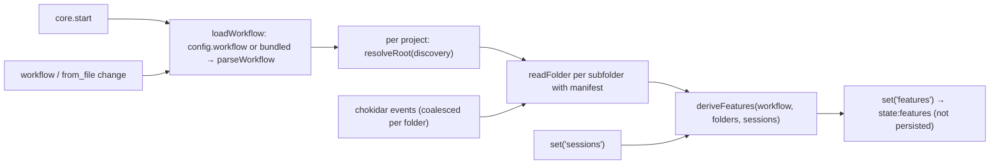

# Design: workflow, discovery and sidebar

v2 (2026-10-05, human): sidebar revised (Desired state 4); slices 7–8.

## Inherited decisions

- **E-D1** Projects in app config; discovery declared in `workflow.yaml` `discovery`; one global workflow.
- **E-D2** Declarative `workflow.yaml`: four predicates, first-incomplete stage, "unapproved" passes, `kinds` + `flows` (effective stages = kind ∩ flow), fixed card states in code.
- **E-D4** Core in Electron main behind an Electron-free seam.
- **E-D6** Manual link pins (`linkPinned`); auto-linking is child 3.
- **E-D7** Versioned JSON state, atomic writes, main as single writer; `workflow` path in config; per-viewer UI state in app state.
- Epic two-way rows: chokidar (gray-matter replaced by D3), `awaitWriteFinish`, ignore `*.tmp`, one watcher per project feature root; List/Board toggle and collapsed nodes in app state; Board columns are all `stages`, in order.
- **Epic v5** Sidebar lists sessions, feature on the card; Sessions | Features tabs; waiting count and notifications are per session.

## Desired state

1. Core loads `workflow.yaml` from config's `workflow` path, or the bundled
   example grove workflow (`resources/workflow.yaml`, flows `full`,
   `standard`, `small`) when unset. It validates it and watches it live; an
   invalid file shows a banner and the last valid workflow stays in use.
2. Per project, core resolves the discovery root from the workflow, watches
   it with chokidar, and reads frontmatter (D3). Each folder with the
   manifest is a feature. Projects without a root still host sessions;
   discovery starts if a root appears.
3. Pure functions derive each feature's effective stages, current stage,
   "unapproved" passes, flags, warnings and card state. Results reach the
   renderer as a whole `features` slice.
4. Sidebar (v2; epic Desired state 3, v5): **Sessions | Features** tabs.
   Sessions: all sessions (terminals muted) under collapsible project
   headers, by start time; a linked card shows its feature (epic-colour dot,
   title, current stage · card state); clicking it opens the feature page in
   place of the terminal (one focus, D2; back via the card, Cmd+N or the
   page's Sessions list). Features: project → epic → feature, no sessions,
   done last. Tab, collapsed nodes, List/Board persist. Cmd+N: Sessions order.
5. Feature page: stage timeline (complete, current, unapproved, upcoming;
   skipped stages absent), card state and flags, the folder's files listed
   (opening is child 4), linked sessions.
6. A session card links its session to a feature in its project, or
   unlinks it; both pin.
7. List/Board toggle: Board columns are every workflow stage in order, cards
   are non-group features showing their epic's name.
8. No app code names a grove file, phase or flow.

## Non-goals

- Live status, auto-linking, notifications (3); opening artifacts (4); next
  actions (5); comments, palette, grid, packaging (6–8).
- Creating or editing features or artifacts; keeping the last valid workflow across restarts.

## System design

### `features` slice (D1)

Core re-runs a pure `deriveFeatures(workflow, folders, sessions)` whenever
the workflow, a feature folder or the sessions slice changes, and pushes the
result whole as `state:features` (ADR 0011). The renderer derives nothing.

```ts
interface FeaturesSlice {
  workflowError: string | null
  stages: { id: string; label: string }[]           // all stages, in order: Board columns
  items: Feature[]
}
interface Feature {
  projectId: string; slug: string; path: string; title: string
  kind: string; group: boolean; parent: string | null; flow: string | null
  stages: { id: string; label: string; artifact: string; review: string | null
            state: 'complete' | 'current' | 'unapproved' | 'upcoming' }[]  // effective only
  currentStage: string | null                        // null when done
  cardState: 'backlog' | 'running' | 'waiting' | 'needs-review' | 'ready' | 'done'
  flags: { id: string; label: string }[]             // set if any effective stage's artifact matches `when`
  warnings: string[]                                 // e.g. 'flow?', 'frontmatter?: 03-design.md'
  artifacts: { name: string; stage: string | null; role: 'artifact' | 'review' | null }[]
}
```

### Persisted additions (D2)

All additive at `schemaVersion: 1`; readers default missing fields.

- `config.json`: `workflow?: string` (absolute or `~/…`), read at start;
  `saveConfig` preserves it. Hand-edited; the app never sets it this round.
- `state.json` `ui`: `view: 'list' | 'board'` (default `list`), `sidebarTab:
  'sessions' | 'features'` (default `sessions`, v2),
  `collapsed: string[]` (keys `p:<projectId>`, `f:<projectId>/<slug>`),
  `focusedFeature: { projectId, slug } | null` beside `focusedSessionId`.
  Core keeps the two focus fields mutually exclusive: `uiSet` clears one when
  the other is set.

### Parsing (D3)

- New dependencies: `chokidar@5.0.0`, `yaml@2.9.1`. No gray-matter.
- `readFrontmatter`: a leading `---` line (optional BOM, CRLF ok) to the next
  `---`/`...`, parsed with `YAML.parse(block, { schema: 'core' })` (dates stay
  strings). No opening line → `data {}`; unclosed, YAML error or non-mapping
  → `data {}` plus `error` (a `frontmatter?` warning). `workflow.yaml` uses
  the same call; its errors (line, column) feed `workflowError`.

### Example grove workflow (`resources/workflow.yaml`)

Stages `questions` 01, `research`/`design`/`structure` 02–04 (+html), each
`approved`; `implementation` 06 per D4. Kinds: `epic` (group) = 01–04;
`feature` = all. Flows: `full`, `standard` = all; `small` = questions,
implementation; default `full`. Flag `stale`. Epic actions copied as written,
templates validated only (child 5 runs them).

## Program design

### Call paths



`features` is never persisted (`set` writes only projects, sessions, ui). `session:link` → `sessionLink` → `replaceSession`
→ re-derive.

### File tree

```
resources/workflow.yaml                        NEW
src/shared/types.ts                            MODIFIED  Feature, FeaturesSlice, UiState fields, ConfigFile.workflow
src/shared/ipc.ts                              MODIFIED  session:link, state:features
src/core/workflow/{frontmatter,parse}.ts       NEW       readFrontmatter; Workflow types, parseWorkflow
src/core/workflow/derive.ts                    NEW       deriveFeatures, effectiveStages, cardState
src/core/discovery/{folder,watcher}.ts         NEW       resolveRoot, readFolder; watchRoot (chokidar)
src/core/core.ts                               MODIFIED  features slice, sessionLink, uiSet exclusivity
src/core/store/configStore.ts, stateStore.ts   MODIFIED  default/preserve new fields
src/main/index.ts, ipc.ts                      MODIFIED  bundled workflow path, push features
src/renderer/src/stores/slices.ts              MODIFIED  features
src/renderer/src/tree.ts                       NEW       buildTree (Features tab), sessionGroups (Sessions tab, v2)
src/renderer/src/components/Sidebar.tsx        MODIFIED  Sessions | Features tabs, card feature line, Link…
src/renderer/src/components/{FeaturePage,LinkPicker}.tsx  NEW  feature page; link Modal picker
src/renderer/src/components/Board.tsx          NEW       stage columns
src/renderer/src/App.tsx                       MODIFIED  content: session | feature | board; workflow banner
package.json                                   MODIFIED  chokidar 5.0.0, yaml 2.9.1
```

### Key signatures

```ts
readFrontmatter(text: string): { data: Record<string, unknown>; body: string; error: string | null }
parseWorkflow(text: string): { ok: true; workflow: Workflow } | { ok: false; error: string }
resolveRoot(projectPath: string, d: Workflow['discovery']): string | null      // reads from_file
readFolder(dir: string, wf: Workflow): FolderSnapshot | null                    // null: no manifest
interface FolderSnapshot { slug: string; path: string; manifest: Parsed; files: string[]
                           artifacts: Record<string, Parsed> }                  // stage files only
deriveFeatures(wf: Workflow, folders: (FolderSnapshot & { projectId: string })[],
               sessions: Session[]): Feature[]
watchRoot(root: string, onFolder: (slug: string) => void): { close(): Promise<void> }
Commands.sessionLink(a: { id: string; feature: string | null }): Promise<Result<Session>>
buildTree(projects, features, ui): TreeNode[]                                  // Features tab (v2: no sessions)
sessionGroups(projects, sessions, ui): { project; collapsed; sessions }[]       // Sessions tab; Cmd+N order (v2)
```

## One-way decisions

- **D1 `features` slice contract.** Core derives everything, card state included, and pushes finished `Feature` records; re-derive on workflow, folder or session change. Rejected: renderer joins sessions for card state (rules split across processes); raw frontmatter to the renderer (logic duplicated with child 5, unstable contract).
- **D2 Persisted additions.** Stay at `schemaVersion: 1`, all new fields optional; `focusedFeature` beside `focusedSessionId`, mutually exclusive in core. Rejected: v2 with a first migration and a `focus` union (older builds quarantine the files, migration framework for one nicer type); a union at v1 (shape changes without the version).
- **D3 YAML and frontmatter.** `yaml@2.9.1` (core schema) for `workflow.yaml` and frontmatter, with an own ~15-line splitter; no gray-matter. Departs from the epic's two-way row "chokidar + gray-matter" (not an `E-D`). Rejected: gray-matter's default js-yaml 3 (Date coercion, mutable cache, old major); gray-matter with a `yaml` engine (gray-matter reduced to splitting, js-yaml installed unused). [ADR 0013](../../adr/0013-yaml-core-schema-own-frontmatter-splitter.md)
- **D4 Grove implementation done.** The example workflow's last stage is `06-implementation.md` with `complete_when: { field: status, equals: approved }`; grove-approve gains an `implementation` unit (`docs/skills-changes.md` §1, not built here). Rejected: `all_checked: 05-plan.md` (false `done` between slices); an automatic field from grove-implement (no human gate); a fifth E-D2 predicate (reopens the epic, grove format in code). [ADR 0014](../../adr/0014-grove-implementation-done-by-approval.md)

## Two-way decisions

| Area | Decision | Basis |
|---|---|---|
| Modules | Pure `src/core/workflow/{validate,derive}.ts`; `src/core/discovery/` holds the watcher and folder reader; `core.ts` wires them | research: pure domain + orchestrating core |
| Workflow validation | Hand-written validator returning `path: message` errors; rejects unknown stage ids in kinds/flows, unknown predicates, reserved `{repo}`/`{repo_path}`/`per_repo`. No schema library | E-D2, YAGNI |
| Invalid workflow | Banner, last valid kept in memory. None valid at startup → no features plus banner; the bundled file is never a fallback for a broken custom one | E-D2 |
| Errors channel | The `features` slice carries `workflowError`, so the banner is live (`app:errors` is fetched once) | research Q1 |
| Watching | One chokidar watcher per project root, `depth: 1`; dot-folders and `*.tmp` ignored; `awaitWriteFinish {200, 50}`; discovery `from_file` and the workflow file also watched; events coalesced per feature folder (~50 ms), then that folder re-read | epic row; research Q5 |
| chokidar ESM-only | In `dependencies` (externalized); CJS main relies on Electron 44's `require(esm)`. Fallback: devDependency, bundled | research Q5/Q6 |
| Bad frontmatter | A YAML error in one artifact = no fields for that file plus a `frontmatter?` warning; the feature stays | research Q4/Q5 |
| Feature title | First `# ` heading of the manifest body, else the slug | generic markdown |
| Artifact list | Top-level non-dot files, sorted; stage artifacts and reviews tagged with their stage | Desired state 5 |
| `running` card state | Any linked session with `lastStatus: running`; `waiting` arrives with child 3 | E-D2 |
| Manual link | Card hover "Link…" opens a `Modal` picker (project's features + "None"); `session:link {id, feature\|null}` sets `feature`, `linkPinned: true`; unknown slug in that project → `not-found` | E-D6 |
| Sidebar ordering (v2) | Sessions tab: projects in config order, sessions by start time; Features tab: epics and features by slug, done after active; a link to a missing slug shows no feature line | Desired state 4 |
| Cmd+1..9 (v2) | Sessions tab order, collapsed included, whichever tab is shown; features are not Cmd+N targets | research Q2 |
| Card feature line (v2) | Epic-colour dot, feature title, `featureSummary` below; terminals muted via a `ListRow` tone; Link… stays a hover button | human, v2 |
| Example workflow location | `resources/workflow.yaml` via `app.getAppPath()`, like `tmux.conf`; packaged path is child 8 | research Q6 |
| Tests | vitest node tests for validation, derivation and the folder reader over temp dirs; one watcher integration test, skipped where `fs.watch` is blocked; no renderer component tests | research Q7 |

## Risks

- **`fs.watch` limits** (EMFILE in the sandbox): `depth: 1` keeps handles low.
  (`require(esm)` for chokidar 5 was verified in slice 2.)
- **Hand edits to `config.json` while running** are overwritten on the next
  project change; a new `workflow` path needs a restart.
- **Finished grove features read `done`** only once their 06 is approved
  (`grove-approve <slug> implementation`, built in grove-skills; ADR 0014).
- **Epic action templates**: `/grove-{stage}` yields `/grove-implementation`
  (no such skill). Child 5 owns actions.

## Open questions
