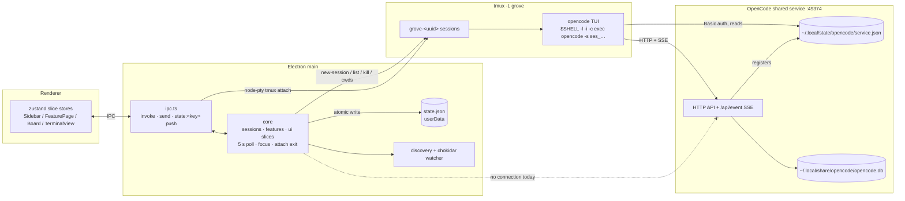

# Research: session status, linking and resume

Citation keys: plain `path:line` is this repo at `5d06037`. `OC:path:line` is OpenCode source at tag `v2.0.20` (commit `84c9be9`), under `packages/` (some citations include the `packages/` prefix). Electron citations are the Electron source at tag `v44.5.1`. Claims are from source unless marked **observed**. The live OpenCode HTTP API, the TUI and Electron notifications were not exercised for this document (agent sandbox: EPERM on `127.0.0.1:49374` and on OpenCode's log file); the SQLite store was opened read-only.

## Summary

- Grove's session status is tmux-only today: `lastStatus` is `'running' | 'gone'`, written `gone` only by `markGone` (reconcile or kill), never back to running. Liveness is checked on start, every 5 s, on window focus and on attach exit.
- Grove has no connection to the OpenCode service: no code reads `service.json`, calls `/api/*` or opens the SQLite store. OpenCode sessions start as `$SHELL -l -i -c 'exec opencode -s <minted ses_ id>'`.
- The service registers `{id, version, url, pid, password}` at `~/.local/state/opencode/service.json` (0600); clients use HTTP Basic auth. The service evicts itself when the file no longer matches, and drops SSE connections on stop.
- `GET /api/event` has no ids, no `Last-Event-ID`, no replay; heartbeat every 15 s. Current state is read from `/api/session/active` (running only), per-session `/permission` and `/form`, and per-location variants. Pending state is in memory only.
- Past tool calls are readable via `GET /api/session/:id/message` (cursor-paginated) and the v2 `session_message` table. The store now holds both v1 and v2 tables (corrects the epic). File-writing tools are `write`, `edit`, `patch`; path fields differ per tool and per v1/v2 row.
- Sub-session events carry the child's `sessionID`; the parent link is only on `session.created`/`Session.Info.parentID` or the parent's subagent tool metadata.
- Feature paths are not normalised (no realpath, no case folding); session↔feature matching is by `(projectId, slug)`. Card state `waiting` exists but is never produced.
- Grove uses no `Notification`; Electron 44 on macOS requires code signing for notifications. Main knows neither which session is attached nor the window's focus state.

## Inherited from epic

From the epic research (`2026-10-05-opencode-feature-workspace/02-research.md`, v5):
- `### Q2. tmux (3.6b, ...)`: pane formats, hooks (`pane-died`, `client-*`), `remain-on-exit`.
- `### Q3. OpenCode CLI surface (v2.0.20, Homebrew)`: `-s` semantics, TUI↔server connection modes, port selection, service state on this machine.
- `### Q4. OpenCode state`: HTTP routes, SSE envelope, state events (`session.execution.*`, `permission.*`, `form.*`), session id format, DB location.
  - **Corrected here:** "The real database ... has only v1 tables" no longer holds. The store now has both v1 and v2 tables, with the v1→v2 migration run (see Q6).
- `## Constraints & invariants`, `## Relevant ADRs`.

From the sibling's Phase 0 research (`2026-10-05-01-workspace-walking-skeleton/02-research.md`):
- `### Q2. opencode -s <id> with a client-generated id`: a not-yet-existing id returns 404 until first submit, then `session.created`.
- `### Q4. SSE sequence for a write and an edit turn`: observed event order, path-bearing fields, no `file.*` event, `/api/event` spans all locations.
- `### Q7. Environment under Finder/Dock launch` and `### Q8. tmux 3.6b states on a -L socket`: list/has-session results per server state; a non-zero exit under `remain-on-exit failed` leaves a dead pane and the session alive.

## Answers

### Q1. Session lifecycle in core
- **State model.** `lastStatus: 'running' | 'gone'` (`src/shared/types.ts:16`); `endedAt` is an ISO string "set when first seen gone" (`src/shared/types.ts:15`).
- **Writers.** `newSession` sets `running` / `endedAt: null` (`src/core/sessions.ts:24-25`). `markGone` is the only writer of `gone` and `endedAt`, and is a no-op if already gone (`src/core/sessions.ts:53-55`). Called from `reconcile` for running sessions whose `tmuxName` is not live (`src/core/sessions.ts:29-37`) and from `sessionKill` after `backend.kill` (`src/core/core.ts:254-258`). Nothing sets gone back to running; `reconcile` skips non-running sessions (`src/core/sessions.ts:32`).
- **When liveness is checked.**
  - `start()`: `backend.ensureConfig()`, `reconcile(... await backend.list())`, `refreshBranches()`; errors go to `errors` as `tmux: …` (`src/core/core.ts:317-324`).
  - Timer: every 5000 ms, `checkLiveness()` and `syncProjects(false)` (`src/core/core.ts:325-328`); cleared in `dispose` (`:357`).
  - Window focus: `win.on('focus', () => void core.checkLiveness())` (`src/main/index.ts:46`).
  - Attach exit: the attach handle's `onExit` calls `checkLiveness()` (`src/core/core.ts:350-353`).
  - `checkLiveness` ignores `backend.list()` errors (`:190-196`), sets `sessions` only when `reconcile` returns a new array (`:197-198`), then refreshes branches (`:199`).
- **tmux liveness source.** `TmuxBackend.list` runs `list-sessions -F '#{session_name}'` on `-L grove`; "no server running" / "error connecting" become an empty set (`src/core/backend/tmux.ts:52-60`; socket `src/main/index.ts:24`). `resources/tmux.conf:7` sets `remain-on-exit failed`. Sibling research Q8 observed that a non-zero exit leaves a dead pane and the session alive; `list` returns session names only.
- **`branch`.** Live-only, from `backend.cwds()` (`pane_current_path`) via `readBranch`, running sessions only (`src/core/sessions.ts:40-51`, `src/core/backend/tmux.ts:62-70`, `src/core/git.ts:6-16`).
- **Persistence.** `set(k, v)` updates memory and notifies listeners (`src/core/core.ts:75-77`). For keys other than `projects`/`features` it synchronously writes `state.json` as `{schemaVersion:1, sessions, ui}` without `branch` (`:85-88`), atomically via tmp + rename (`src/core/store/jsonFile.ts:4-9`, `src/core/store/stateStore.ts:9-11`). `set('sessions')` also calls `publish()`, re-deriving features (`src/core/core.ts:89`). Path `<userData>/state.json` (`src/main/index.ts:20`), loaded in `start()` (`src/core/core.ts:305-307`, `src/core/store/stateStore.ts:4-7`); a bad file is moved to `.bad-<ts>` (`src/core/store/jsonFile.ts:32-35`).
- **Push.** `registerIpc` subscribes to `core.on('slice')`, coalesces per key, sends `state:<key>` on `setImmediate` (`src/main/ipc.ts:72-83`). The renderer subscribes to `state:sessions` before `state:get` (`src/renderer/src/stores/slices.ts:28-35`).
- **IPC touching sessions.** invoke: `state:get`, `session:create|kill|remove|rename|link`, `ui:set` (focusedSessionId), `pty:attach`, `project:remove` (drops that project's sessions) (`src/shared/ipc.ts:8-18`, `src/main/ipc.ts:28-61`, `src/core/core.ts:233-240`). send: `pty:input|resize|detach` (`src/shared/ipc.ts:21-25`). push: `state:sessions`, `pty:data`, `pty:exit` (`src/shared/ipc.ts:29-33`). Commands return `{ok:false}` with `not-found`, and `sessionRemove` also with `not-gone` (`src/core/core.ts:253-268`).

### Q2. Creating a tmux session
- **Flow.** `sessionCreate` builds the record with `newSession` (id `randomUUID()`), calls `backend.create({name: tmuxName, cwd: project.path, cols, rows, argv})`, then `setColors`, then appends to the slice (`src/core/core.ts:242-251`). The renderer passes `cols:120, rows:40` and focuses the new session (`src/renderer/src/components/NewSessionModal.tsx:21-23`).
- **Name** `'grove-' + id` (`src/core/sessions.ts:18`). **Cwd** the project's `path`, unmodified (`src/core/core.ts:247`).
- **Command.** `tmux -L grove -f <resources/tmux.conf> new-session -d -s <name> -c <cwd> -x <cols> -y <rows> [-- argv…]` (`src/core/backend/tmux.ts:39-45`, `src/main/index.ts:24-25`).
- **Env (ADR 0010).** Server and attach clients get `minimalEnv(process.env)`: TMUX/TMUX_PANE removed, `/opt/homebrew/bin` and `/usr/local/bin` appended to PATH, LANG defaulted to `en_US.UTF-8` (`src/core/env.ts:9-18`, `src/main/index.ts:26`). Attach adds `TERM=xterm-256color`, `COLORTERM=truecolor`, cwd = home (`src/core/backend/tmux.ts:84-90`).
- **Per kind.** opencode: `loginShellArgv(['opencode','-s',<id>])` → `[$SHELL||/bin/zsh, '-l', '-i', '-c', 'exec opencode -s <id>']` (`src/core/core.ts:246`, `src/core/env.ts:39-41`). terminal: no argv, tmux's default shell (`src/core/core.ts:246`; test `src/core/sessions.test.ts:131`).
- **`opencodeSessionId`.** Minted only for kind `opencode` (`src/core/sessions.ts:19`) by `mintSessionId(now.getTime())`: `'ses_'` + 12 hex digits of the 48-bit bitwise-NOT of `now*0x1000+1` (newer sorts first) + 14 random base62 characters (`src/core/opencodeId.ts:7-14`).
- **Written only at creation:** `id`, `projectId`, `kind`, `tmuxName`, `opencodeSessionId`, `startedAt`, `action` (always `null`, no writer; `src/shared/types.ts:13`).
- **Changed later:** `label`/`labelPinned` by rename (`src/core/sessions.ts:61-63`); `feature`/`linkPinned` by link (`:57-59`); `lastStatus`/`endedAt` by `markGone`; `branch` by `withBranches`.

### Q3. How the OpenCode service is reached, and its lifecycle
- **Two `service.json` files, both observed at mode 0600.**
  - Registration: `~/.local/state/opencode/service.json` (observed, 164 bytes); path `global.state/<filename()>`, named `service.json` for channels latest/dev/beta/next (`OC:packages/cli/src/services/service-config.ts:30-33,94-110`). The client package falls back to `$XDG_STATE_HOME` or `~/.local/state` + `/opencode/service.json` (`OC:packages/client/src/effect/service.ts:156-159`).
  - Config: `~/.config/opencode/service.json` (observed, 64 bytes): `{disabled?, hostname?, port?, password?, cors?, env?}` (`service-config.ts:14-21,108`), written 0600 via temp + rename (`:136-142`).
- **Registration fields** `{id, version, url, pid, password}` (`OC:packages/cli/src/services/service-registration.ts:23-29`); the client schema requires only `url` and `pid` > 0 (`OC:packages/client/src/effect/service.ts:168-174`). Observed keys: `id`, `version`="2.0.20", `url`="http://127.0.0.1:49374", `pid`, `password` (value not recorded). Observed: the pid is the `opencode` process listening on that port (lsof).
- **Password.** `config.password`, else 32 random bytes base64url (`OC:packages/cli/src/server-process.ts:78-81`); a generated one is persisted to the config file "so discovered clients can reconnect" (`server-process.ts:132`; `service-config.ts:144-153`). Observed: both files hold the same password. `opencode service get` omits it; `opencode service get password` prints it (`service-config.ts:155-158,173-174`).
- **Registration write.** Temp `<file>.<id>.tmp` at 0600, then rename (`service-registration.ts:21,38`); `id` is a per-process `randomUUID()` (`server-process.ts:85`).
- **Auth.** The source calls the file "the complete discovery contract" (`client/src/effect/service.ts:19-25`). Client sends HTTP Basic, user `opencode`, the file's password (`:209-215,162-165`). The server also accepts `?auth_token=<base64(user:pass)>` and a same-origin session cookie (`OC:packages/server/src/middleware/authorization.ts:11,31-38,57-70`). Unauthenticated → 401 `{_tag:"UnauthorizedError"}`; `WWW-Authenticate: Basic` only when `sec-fetch-mode` is absent or `navigate` (`:44-55`).
- **Liveness check by clients** (`service.ts:205-261`): `GET /api/info` with a 2 s timeout (`service-timing.ts:18`). Different `pid`/`version` from the file → stale (`:246-248`). 200 ready, 500 failed, other waiting, 404 older incompatible V2 service (`:230-242,254`). `/api/info` answers 503 + `retry-after: 1` while starting/stopping (`OC:packages/server/src/process.ts:185-188,207-213`); other routes return 503 `service_starting|service_stopping|service_failed` (`:216-230`). `opencode service status` prints the URL or `stopped` (`OC:packages/cli/src/commands/handlers/service/status.ts:10-14`).
- **Self-eviction.** Every 5 s the service re-reads the file; missing, corrupt or not matching its own fields → it shuts down (`service-registration.ts:31-37,39-66`).
- **On stop.** The HTTP server scope closes; cleanup removes the file only if still this instance's (`service-registration.ts:67-70`; `server/src/process.ts:76-82`). A finalizer calls `closeAllConnections()` (`process.ts:86-91,155`): open SSE connections are dropped, not drained. `Service.stop`: SIGTERM, ~5 s wait (50 ms × 100), SIGKILL, remove file if unchanged (`client/src/effect/service.ts:146-154,271-304`). `opencode service set/unset` of hostname, port, password, cors or env stops the service first (`service-config.ts:198-233,247-278`).
- **Restart / version change.** `Service.ensure` reuses a ready, compatible service; on mismatch it calls `onStart("version-mismatch")`, stops the old one (persistent-pty handoff if ready), and spawns `opencode serve --service` contenders until one registers (`service.ts:54-143`, esp. `:96-114,125-129`). Three consecutive failures to answer → SIGTERM/SIGKILL and respawn (`:82-94`). Overall wait ≤ 120 s (`service-timing.ts:21`). Default TUI and `mini` use `mismatch:"replace"` (`OC:packages/cli/src/commands/handlers/default.ts:38`; `handlers/mini.ts:17`); `opencode api` uses `"ignore"` (`handlers/api.ts:24`); a TUI's mid-session reconnect ignores version (`OC:packages/cli/src/services/server-connection.ts:53-61`). A new service has a new `id` and `pid`; the password carries over from the config file; the port stays 49374 unless configured (`service-config.ts:35-39`).
- **Work across a restart.** A started execution is durably "claimed"; terminal events release it, a `shutdown` interrupt keeps it (`OC:packages/core/src/session/execution.ts:76-87,111-145`). At boot the server resumes claimed sessions (`server/src/process.ts:104-108,232-239`) with the synthetic text "The server restarted while you were working. Continue from where you left off…" (`OC:packages/core/src/session/execution/restart.ts:15-16,196-229`); past the resume budget, `session.execution.failed` (`restart.ts:80-90`). On shutdown, pending permissions are answered `reject` (publishing `permission.replied`) (`OC:packages/core/src/permission.ts:132-145`) and pending forms cancelled (`core/src/form.ts:207-220`).

### Q4. `GET /api/event` across disconnects
- **Contract.** "Volatile by contract: a slow consumer overflows and fails the stream, and events during disconnection are missed" (`OC:packages/protocol/src/groups/event.ts:44-53`). No query parameters.
- **Frames.** Only `data: <JSON>\n\n`; no SSE `id:` or `retry:` (`OC:packages/server/src/event-feed.ts:29-31`). `Last-Event-ID` is never read (only hit: a web e2e test, `packages/app/e2e/regression/session-timeline-transport.spec.ts`). Each connection starts with a fresh `server.connected`, then live events only (`server/src/handlers/event.ts:14-21`). Headers `text/event-stream`, `Cache-Control: no-cache, no-transform`, `X-Accel-Buffering: no` (`:23-32`).
- **Ids.** Envelope `id` = `"evt_" + ascending()` per event, not resumable (`OC:packages/schema/src/event.ts:9-12`). Durable events add `durable:{aggregateID, seq, version}`, `seq` = position in one aggregate's log (`:15-27`).
- **Heartbeat** `: heartbeat\n\n` every 15 s (`handlers/event.ts:22,24`).
- **Buffering.** Per-subscriber dropping queue of 4,096; overflow fails that stream with `EventFeed.SubscriberOverflow`; an encoding error fails all subscribers (`event-feed.ts:8,41-46,64-68,75-79`).
- **Replay that exists.** `GET /api/experimental/session/:sessionID/log?after=<seq>&follow=true`: SSE of the session's durable events after an exclusive `seq`, then live, with `{type:"log.synced", aggregateID, seq?}` at the captured watermark (`protocol/src/groups/session.ts:724-742`; `schema/src/event-log.ts:12-20`); 404 for unknown session (`server/src/handlers/session.ts:601-608`). It reads the `event` table, which is written only when the bus has `persist: true` (see Q6).
- **OpenCode's own client** (`OC:packages/client/src/solid/connection.ts`): connect timeout 2 s, reconnect delay 1 s, aborts a stream silent for 45 s (`:22-25,32-35,81,86-91`); requires `server.connected` first (`:106-107`); `reconnect()` re-runs `Service.ensure`, re-reading `service.json` (`:165-174`). While disconnected it invalidates cached data; on `server.connected` it re-fetches `GET /api/session/active` (`client/src/solid/data.ts:595-614,1923-1926`).
- **Service gone and back.** Connection closed via `closeAllConnections`; 503 + `retry-after: 1` while booting/stopping; a replacement starts a new stream with no backlog. Not observed live.

### Q5. Operations reporting session state
- **`GET /api/session/active`** → `{data: {[sessionID]: {type:"running"}}}` for foreground executions owned by this server process (`protocol/src/groups/session.ts:271-281`; `server/src/handlers/session.ts:178-185`), from the run coordinator's keys (`core/src/session/run-coordinator.ts:179`). Absent means inactive, whether or not the session exists. No pending state.
- **`GET /api/session/:id`** → `{data: Session.Info}` with `outcome?` (succeeded/failed/interrupted, last completed run) and `time.{created, updated, idle?, viewed?, archived?}` (`OC:packages/schema/src/session.ts:31-50`); no running flag. Unknown valid id → 404 `SessionNotFoundError` (observed in sibling research); no `ses` prefix → 400.
- **Permissions.** Per session `GET /api/session/:id/permission` → `{data: Permission.Request[]}`, and `…/permission/:requestID` (`protocol/src/groups/permission.ts:89-97,102-112`). Per location `GET /api/permission/request?location[directory]=…` → `{location, data}` (`:23-32`); location from query, else `x-opencode-directory`, else server cwd = `$HOME` for the service (`server/src/location.ts:39-47`; `cli/src/server-process.ts:55`).
- **Forms (incl. `question`).** Per session `GET /api/session/:id/form` → pending `Form.Info[]` (`protocol/src/groups/session.ts:794-806`; `core/src/form.ts:164-170`); `…/form/:formID` → `Form.Detail`. Per location `GET /api/form?location[directory]=…` (`protocol/src/groups/form.ts:12-21`).
- **Other.** `GET /api/session/:id/inbox`: durable undelivered input (`session.ts:605-617`). `POST /api/experimental/session/:id/wait` returns when the loop is idle (`session.ts:516-526`).
- **Not-yet-existing session.** `/permission`, `/form`, `/inbox` return 404 `SessionNotFoundError` (400 if malformed) (`server/src/location.ts:32-37`; `middleware/form-location.ts:35-36`; `handlers/permission.ts:59-68`; `handlers/session.ts:532-541`); `/api/session/active` omits it.
- **Where pending state lives.** Memory only: permissions in a `Map` (`core/src/permission.ts:129`), forms in an infinite-TTL cache while pending (`core/src/form.ts:104-111`). Lost on service stop (rejected/cancelled, Q3) or location eviction after 60 min without durable session events at that location, which also interrupts its executions with reason `inactivity` (`OC:packages/core/src/location-activity.ts:25,42-81`).
- **TUI exited.** The TUI is only an HTTP/SSE client; no full-TUI exit path interrupts a session (its interrupts are user actions, e.g. `OC:packages/tui/src/routes/session/index.tsx:1003`). The mini TUI's exit: "exiting should only detach the TUI" (`OC:packages/tui/src/mini/runtime.queue.ts:78`). So a running execution stays in `/active` and pending items stay listed until resolved, evicted or the service stops (from source, not observed).

### Q6. Reading past tool calls
- **Store contents (observed; corrects epic Q4).** Both schemas present: `session_v2` 218 rows (11 × 2.0.20, 36 × 1.14.30, 171 × 1.4.10; 41 with `parent_id`), `session_message` 5020, v1 `session` 207, `part` 21328. All 207 v1 sessions exist in `session_v2`; the 11 created by 2.0.20 exist only in v2.
- **HTTP.** `GET /api/session/:sessionID/message` (`OC:protocol/src/groups/message.ts:68-86`): `limit` 1–200 (default 50), `order` asc|desc (default desc), `cursor`, `type` (`:8-40`; `OC:server/src/handlers/message.ts:9,41`). Response `{data: Message.Info[], cursor:{previous?, next?}}`. Cursor is base64url `{id, order, direction}`; `cursor` + `order` together → `InvalidCursorError` (`:20-36`). `cursor.next` is set on every non-empty page; the end is an empty page (`:54-61`). Ordered by `session_message.seq` (`OC:core/src/session/store.ts:140-176`). Also `GET …/message/:messageID` (`OC:protocol/src/groups/session.ts:781-792`) and `GET …/diff?from&to&context` → `FileDiff.Info[]` per turn from snapshots (`:580-603`).
- **Event log.** `/api/experimental/session/:id/log` reads the `event` table (`OC:core/src/bus.ts:764-776`), written only with bus `persist: true` (`bus.ts:178-179,203,416-430`), set from `options.events.persist` (`OC:server/src/routes.ts:118`), set only by `workerd.ts:69`. Observed: `event` 0 rows, `event_sequence` 221 rows. Replay not run.
- **v2 table.** `session_message(id, session_id, type, seq, time_created, time_updated, data JSON)`, unique `(session_id, seq)`, index `(session_id, type, seq)` (`OC:core/src/session/sql.ts:73-96`). Tool calls are `data.content[]` items in `type='assistant'` rows: `{type:"tool", id, name, executed?, state, time:{created, ran?, completed?}}`; `state` ∈ `streaming {input:string}`, `running {input, metadata}`, `completed {input, content[], metadata?}`, `error {input, error, content?, metadata?}` (`OC:schema/src/session-message.ts:125-174`).
- **Observed 2.0.20 rows.** write: `input:{path:"sub/rel.txt", content}`, content "Created file successfully: sub/rel.txt", `metadata:{truncated:false}`. edit: `input:{path:"<abs>", oldString, newString}`, content "Edited hello.txt (1 replacement)", `metadata.files:[{file:"hello.txt", patch, status:"modified", additions, deletions}]`.
- **v1-migrated rows keep v1 names/keys (observed):** `write`/`edit`/`task`/`bash`, `input.filePath` (absolute); write metadata `{diagnostics, filepath, exists}`; edit metadata `{diff, filediff:{file (absolute), patch, additions, deletions}}`; task metadata `{sessionId, model}`. The migration's rename table (`bash→shell`, `task→subagent`, `apply_patch→patch`) only feeds a model notice; data is not rewritten (`OC:core/src/database/v1-migration.bun.ts:899-933`).
- **v1 tables (observed).** `message(id, session_id, time_*, data)`, `part(id, message_id, session_id, time_*, data)`; indexes `part_message_id_id_idx (message_id, id)`, `message_session_time_created_id_idx`. Tool part `{type:"tool", tool, callID, state:{status, input:{filePath,…}, output, metadata, title, time:{start, end}}}`; separate `{type:"patch", hash, files:[abs paths]}` parts (1007 rows). No `apply_patch` or `multiedit` part in this store.

### Q7. Tools that modify files
- **Built-ins in 2.0.20:** patch, edit, glob, grep, opencode/session_rename/session_move/models, MCP resource tools, question, read, shell, skill, subagent, webfetch, websearch, write (`OC:core/src/plugin/internal.ts:229-246`). No multi-edit, no `todowrite`.
- **write** (`OC:core/src/tool/plugin/write.ts:20-28`): input `{path, content}`; content `"{Wrote|Created} file successfully: <resource>"` (`:38-39`). Its `Output {operation, target, resource, existed}` (`:30-35`) did not appear in stored or event metadata; observed metadata was `{truncated:false}` from `OC:core/src/tool-output.ts:66-74`.
- **edit** (`edit.ts:22-34`): `{path, oldString, newString, replaceAll?}`; content "Edited <file> (n replacement(s))" and `metadata.files[]` FileDiff (`:209-217`).
- **patch** (`patch.ts:19-25`): `{patchText}` only; paths only inside `patchText` after `*** Add File:`, `*** Update File:`, `*** Delete File:`, `*** Move to:` (`OC:core/src/tool/patch.txt`); content "Success. Updated the following files:\nA|M|D <resource>" and `metadata.files[]` (`:38-45,274-285`); a move records the destination (`:320-332`). Offered instead of write/edit when the model id contains `gpt-` and neither `oss` nor `gpt-4`; otherwise removed (`:296-305`).
- **shell** can change files with no structured path (not traced). MCP tools not examined. No `file.*` event exists.
- **Event fields** (`OC:schema/src/session-event.ts:471-569`): every tool event has `{sessionID, assistantMessageID, id}`; only `session.tool.input.started` has `name`; `input.ended.text` is raw input JSON; `called.input` is parsed (`path` for write/edit, `patchText` for patch); `success`/`failed` carry `content[]` and `metadata`; ephemeral `session.tool.progress` carries `metadata`.
- **Path resolution** (`OC:core/src/file-access.ts:93-123`): against `location.directory`, `~` expanded (`:67-77`). "Internal" = inside the Location or the project worktree; `resource` is relative to `location.directory`, so elsewhere in the worktree it is `../`-style (`:95-103`). Outside both, `resource` is absolute and the target gets `externalDirectory`.
- **Outside the Location** (from source): `permission.asked` with `action:"external_directory"`, `resources:["<abs dir>/*"]`, `save:["<project root or dir>/*"]` (`file-access.ts:125-142`), then an `edit` permission with `resources:[target.resource]` (absolute) and `metadata.files` (`write.ts:78-86`). Results show absolute paths in `content` and `metadata.files[].file`.

### Q8. Sub-sessions (subagent)
- **Creation.** Tool `subagent`, input `{agent, description, prompt, model?, sessionID?, background?}` (`OC:core/src/tool/plugin/subagent.ts:17,29-48`); creates `sessions.create({parentID, title: description, agent, model})` (`:185-198`). `Session.create` copies the parent's `location`, `metadata`, `permissions` (`OC:core/src/session.ts:254-278`). `session.created` carries `parentID`, `location`, `subpath` (`session-event.ts:55-59`); `Session.Info.parentID` optional (`OC:schema/src/session.ts:33`). Same `ses_…` format. Depth capped by `experimental.subagent_depth`, default 1 (`subagent.ts:129-133`).
- **Parent-side events.** `session.tool.progress` metadata `{sessionID: child, status:"running"}` (`subagent.ts:201`; `OC:core/src/session/runner/publish-llm-event.ts:561-570`); final `metadata {sessionID, status}` and content `<subagent sessionID="…" state="completed">…</subagent>` (`subagent.ts:258-265`).
- **Distinguishing.** Child events (`session.execution.*`, `session.tool.*`, `permission.asked`) carry the child's `sessionID`; their `location.directory` equals the parent's. Nothing on child tool events names the parent.
- **API/store.** `GET /api/session?parentID=<id>` lists children; `parentID=null` lists top-level only (`OC:protocol/src/groups/session.ts:46-66`; `OC:core/src/session/store.ts:110-112`). Observed: all 41 children share `directory` and `project_id` with their parent; all v1-migrated (`agent:"explore"`); none created by 2.0.20.
- **TUI.** A parent view collects permissions/forms from the whole family (`OC:tui/src/routes/session/index.tsx:192-208`); a child view hides them and offers "Go to parent session" (`:1284-1300`).

### Q9. `opencode -s <id>` on an existing session (from source, not run)
- **Lookup.** CLI `chdir`s to a positional directory if given (`OC:cli/src/commands/handlers/default.ts:21-23`), then `GET /api/session/:id` (`OC:cli/src/session-target.ts:134-139`), which has no directory filter (`OC:protocol/src/groups/session.ts:283-293`). Found → `args.sessionID` (`default.ts:53-61,97-98`) → TUI `session` route (`OC:tui/src/app.tsx:646-651`).
- **Different directory.** The view uses the session's own `location` and sets the TUI's current location to it (`OC:tui/src/routes/session/index.tsx:182-185`); session-scoped requests run in the stored location via `SessionLocationMiddleware` (`OC:server/src/middleware/session-location.ts:16-29`). An unresolvable directory replaces the composer with a "Session recovery" prompt (move to another directory or new worktree) (`index.tsx:1497-1507`; `location-missing.tsx:14-55`).
- **Child id:** same CLI path; child view as in Q8.
- **On open.** Loads `message.list({limit: initialMessageLimit ?? 20, order:"desc"})`, reversed (`OC:client/src/solid/data.ts:77,1623-1630`); older pages by cursor (`:1685-1700`); "Loading session history…" meanwhile (`index.tsx:1438-1441`).
- **Interrupted by user or `inactivity`:** claim released (`OC:core/src/session/execution.ts:76-85,125-144`); message shows a muted "· interrupted" suffix when `error.message === "Step interrupted"` (`index.tsx:1885-1909`; `OC:core/src/session/runner/step.ts:62`). Opening resumes nothing.
- **Interrupted by shutdown or crash:** `session_v2.time_suspended` keeps the claim; the server resumes it at its own startup (`OC:server/src/process.ts:238`; `restart.ts:193-226`), not on TUI open. Budget 10 attempts per turn, then "Execution was interrupted repeatedly…" (`restart.ts:20-33`). Child claims are released unless a background job recovers them (`store.ts:224-235`).
- Observed: no row has `time_suspended`; `idle_outcome`: succeeded 10, failed 1, null 207.

### Q10. Feature folder locations and path normalisation
- **Project path** stored raw from the dialog's `filePaths[0]`; `name` = basename (`src/core/projects.ts:4-6`, `src/main/ipc.ts:30-35`).
- **Root.** `resolveRoot` → `path.resolve(projectPath, rel)` (`rel` from `from_file` or `discovery.root.default`), only if a directory (`src/core/discovery/folder.ts:18-31`). `listFolders` returns non-dot subdirectory names (`:33-38`); `readFolder(path.join(root, slug))` → `{slug: basename(dir), path: dir, …}` (`:49-65`).
- **Feature record** has `projectId`, `slug`, absolute `path`; no project-root field (`src/shared/types.ts:35-38`, `src/core/workflow/derive.ts:76-79`). Cache `discovery: Map<projectId, {root, fromFile, folders: Map<slug, …>}>` (`src/core/core.ts:67-73`). Watcher maps events to a slug via `path.relative(root, p).split(sep)[0]` (`src/core/discovery/watcher.ts:22`).
- **Normalisation.** Only `path.resolve`/`path.join` (`src/core/discovery/folder.ts:29`, `src/core/git.ts:7`). No `realpath`, `toLowerCase` or `normalize` in non-test `src`; symlinks (`/tmp` → `/private/tmp`) not resolved; case not folded. Only `src/core/backend/tmux.test.ts:71-74` calls `realpathSync`.
- **Matching** session↔feature by `(projectId, slug)` string equality (`src/core/workflow/derive.ts:66`, `src/renderer/src/tree.ts:83-85`, `src/core/core.ts:281`).

### Q11. Card state, stage, and where session status is shown
- **Derivation** (`src/core/workflow/derive.ts:44-100`): effective stages = kind ∩ flow (`:15-19`); stage state `complete`, else `unapproved` if a later effective artifact exists, else `null`; current = first `null` (`:56-58`). `running` if any session has same `projectId`, `feature === slug`, `lastStatus === 'running'` (`:66`). Rule: done if no current stage; else running; else backlog if no artifact; else needs-review if the current stage's artifact exists; else ready (`:67-69`). Groups with children are `active` with `progress` until all children done (`:104-121`). Re-derived on every sessions change (`src/core/core.ts:89`).
- **Session fields read:** `projectId`, `feature`, `lastStatus` only. `CardState` includes `'waiting'` (`src/shared/types.ts:34`) but nothing produces it; only non-CSS use is a label (`src/renderer/src/featureLabels.ts:6`).
- **Labels.** `featureStage`: stage label, `n / m done` for active groups, or `Done` (`featureLabels.ts:17-20`); `featureSummary`: `<stage> · <card state>` (`:23-27`).
- **Header.** `TopBar` has no status or counts (`src/renderer/src/components/shell/TopBar.tsx:6-24`); `ContentHeader` shows breadcrumbs (`src/renderer/src/App.tsx:44-51,64`). Banners come from `app:errors` and `features.workflowError` (`App.tsx:57-60`); none for session status.
- **Sidebar.** Sessions tab badge = `sessions.length`, gone included (`src/renderer/src/components/Sidebar.tsx:210`); Features tab no badge (`:211`). Session card status text/tone from `s.lastStatus` (`:56`); compact mode uses `StatusDot` (`src/renderer/src/components/ui/ListRow.tsx:25,29`). Meta: linked feature tag + `featureStage`, and `s.branch` (`Sidebar.tsx:40-55`). Remove only when gone (`:84-87`). Row tone `selected` when focused, else `default`/`muted` by kind (`:57`). `StatusTone` also defines `working`, `waiting`, `idle`, `finished` (`src/renderer/src/components/ui/StatusDot.tsx:4`); sessions use only `running`/`gone`; the board uses `idle` (`src/renderer/src/components/Board.tsx:34`). Feature rows show `featureSummary` (`Sidebar.tsx:120`).
- **Feature page.** Card-state badge and progress (`src/renderer/src/components/FeaturePage.tsx:21-22`); linked sessions (same `projectId` + `feature`) with `lastStatus` (`:13,59-62`). **Board** column count `cards.length`, card label = card state (`Board.tsx:21,34`).
- **Focused session content.** Running → `TerminalView`; gone → "Session ended" + Remove; none → hint (`App.tsx:70-79`).

### Q12. Electron 44 notifications on macOS
- **Repo.** No `Notification`, `setAppUserModelId`, `appId`, `app.setName`, `app.dock`, `app.focus` in `src/`, `scripts/`, `resources/`, `electron.vite.config.ts`; main imports only `app` and `BrowserWindow` (`src/main/index.ts:3`). `package.json:2-3`: `name`/`productName` `grove`; no `appId`.
- **Packaging.** `package.json:18` `"build"` only sets `asarUnpack` (node-pty, resources) in electron-builder format, but electron-builder is not installed (`package.json:19-41`). No builder/forge/notarize config, signing identity, entitlements or hardened runtime. `electron.vite.config.ts:5-37`: build, alias, plugins only. `dev` = `electron-vite dev`, `start` = `electron-vite preview` (`package.json:13-15`); no script produces a `.app`.
- **Dev bundle (observed).** `node_modules/electron/dist/Electron.app`: `CFBundleIdentifier=com.github.Electron`, `CFBundleName=Electron`; `codesign -dv`: `Identifier=Electron`, `Signature=adhoc`, `flags=0x20002(adhoc,linker-signed)`, `TeamIdentifier=not set`, `Info.plist=not bound`.
- **Electron 44.5.1.** Since 42, macOS uses `UNUserNotificationCenter`; it "requires that an application be code-signed in order for notifications to be displayed. If an application is not code-signed, notifications will emit a `failed` event" (`docs/breaking-changes.md:455-461`; PR electron/electron#47817; `docs/api/notification.md:10-15`; `docs/tutorial/notifications.md:141-146`). Unsigned dev builds: not delivered, `getHistory()` → `[]` (`docs/api/notification.md:86-90`). Docs do not distinguish ad-hoc from Developer ID (`:12-14`).
- **Mechanics.** First presenter creation calls `requestAuthorizationWithOptions(Alert|Sound|Badge)`; the result is only debug-logged, not exposed to JS (`shell/browser/notifications/mac/notification_presenter_mac.mm:54-75`). `addNotificationRequest` error → `failed`; success → `show` (`cocoa_notification.mm:209-245`). `willPresentNotification` returns `List|Banner|Sound`, so banners show while frontmost (`notification_center_delegate.mm:27-36`). Default action → `click` (`:38-55`); nothing in that path focuses a window.
- **Third-party reports.** electron/electron#51885: on 42.1.0, `click` never fires for banners shown while the app is frontmost; works in background; closed not planned. nilsonsfj/steamtrain#279 claims ad-hoc bundles do post and the grant keys on bundle id (not Electron/Apple).

### Q13. Which session is on screen, and window focus
- **Selection.** `ui.focusedSessionId`, persisted in `state.json`, set via `ui:set` (`src/renderer/src/stores/slices.ts:37`, `src/core/core.ts:289-296`); exclusive with `ui.focusedFeature` (`core.ts:291-293`); cleared when the focused session is removed (`:219-223`). Set by sidebar card click (`Sidebar.tsx:176`), Cmd+1..9 via `menu:action` `focusIndex` (`src/main/menu.ts:37-42`, `src/renderer/src/App.tsx:36-38`), feature page session list (`FeaturePage.tsx:61`), new session (`NewSessionModal.tsx:23`).
- **Attached.** `TerminalView` mounts only in list view, no focused feature, focused session running (`App.tsx:65-71`); invokes `pty:attach` on mount, `pty:detach` on unmount (`TerminalView.tsx:47-53,65-69`). `pty:attach` kills every existing attach first; `attaches` is keyed by `attachId`, not session id (`src/main/ipc.ts:45-61`). Core's `handles` set records no session id (`src/core/core.ts:60,338-354`). Neither main nor core exposes which session is attached.
- **Window focus.** Only `win.on('focus')` → `checkLiveness` (`src/main/index.ts:46`); no `blur`; focus not stored or pushed. The renderer has no window `focus`/`blur`/`visibilitychange` listeners (only `onFocus` props, `Sidebar.tsx:176,199`). `tmux.conf` `focus-events on` (`resources/tmux.conf:9`) is forwarded to the pane, not to grove.

## Current architecture

No grove code reads `service.json`, calls `/api/*`, or opens `opencode.db` (grep of `src/`, non-test, for `service.json`, `/api/`, `EventSource`, `49374`, `opencode.db`: no hits).

## Existing patterns to reuse

- **Slice push (ADR 0011):** core `set(k, v)` → `core.on('slice')` → per-tick coalesced `state:<key>` → renderer stores replaced wholesale (`src/core/core.ts:75-89`, `src/main/ipc.ts:72-83`, `src/renderer/src/stores/slices.ts:28-35`).
- **Atomic JSON writes** via tmp + rename, bad file quarantined as `.bad-<ts>` (`src/core/store/jsonFile.ts:4-9,32-35`). OpenCode writes its own `service.json` the same way (`service-registration.ts:21,38`).
- **Reconcile on start and poll:** `reconcile` against the live tmux set plus derived fields recomputed live (`branch`) and stripped on persist (`src/core/sessions.ts:29-51`, `src/core/core.ts:85-88`).
- **Derived features re-computed on sessions change** (`src/core/core.ts:89`), pure `deriveFeatures` (`src/core/workflow/derive.ts`).
- **Backend adapter + fakes:** `SessionBackend` behind `FakeBackend` (`live`, `paths`, `calls`, `emitExit()`) and `fakeWatchers` in `src/core/testing/`.
- **Banner sources:** `app:errors` slice and `features.workflowError` render as banners (`src/renderer/src/App.tsx:57-60`); core pushes errors such as `tmux: …` (`src/core/core.ts:317-324`).
- **Login-shell argv helper** `loginShellArgv` (`src/core/env.ts:39-41`) and `mintSessionId` (`src/core/opencodeId.ts:7-14`).
- **Unused UI vocabulary already present:** `StatusTone` `working|waiting|idle|finished` (`StatusDot.tsx:4`), `CardState` `waiting` with label (`src/shared/types.ts:34`, `featureLabels.ts:6`).

## Constraints & invariants

- Core is Electron-free; only the IPC layer touches Electron (ADR 0004). Nothing observes while the app is closed; recovery is by reconciliation.
- Core in main is the single writer of app state; files carry `schemaVersion` and are written atomically; the app never writes into repos (ADR 0009).
- `lastStatus` is a two-value union and `gone` is terminal in code today (`src/shared/types.ts:16`, `src/core/sessions.ts:32,53-55`).
- Session↔feature identity is `(projectId, slug)`, not path (`derive.ts:66`); paths are not canonicalised (Q10).
- OpenCode's event stream is volatile: no ids, no resume, 4,096-event buffer (Q4). Pending permissions/forms exist only in service memory (Q5).
- The service evicts itself if `service.json` stops matching; the password is a secret held in two 0600 files (Q3).
- `/api/event` spans all locations; sessions not started by grove share the service (sibling Q4; ADR 0005).
- Stored tool-call shapes differ between 2.0.20 rows and v1-migrated rows (`path` vs `filePath`, `metadata.files` vs `filediff`) (Q6).
- Electron 44 macOS notifications need a code-signed app; the dev bundle is ad-hoc signed as `com.github.Electron` (Q12).

## Test landscape

- Vitest 4.1.11, `npm test` (`vitest run`); env `node`, includes `src/**/*.test.ts`, timeout 15 s, aliases `@shared`/`@renderer` (`package.json`, `vitest.config.ts:1-16`). `npm run typecheck` runs tsc for node and web configs.
- Covered: `src/core/sessions.test.ts` (reconcile, persistence, gone on start, liveness on attach exit, opencode argv and minted id, terminal no argv, kill, remove, rename, focus clearing); `src/core/features.test.ts` (derivation, watcher re-read, re-root, workflow errors, focus exclusivity, linking); `src/core/workflow/derive.test.ts`; `src/core/discovery/folder.test.ts`, `watcher.test.ts`; `src/core/env.test.ts`, `opencodeId.test.ts`, `store/*.test.ts`; `src/renderer/src/tree.test.ts`.
- `src/core/backend/tmux.test.ts` runs real tmux on a `gt<pid>` socket, skipped without tmux (`:11-16`).
- Helpers: `src/core/testing/fakeBackend.ts`, `fakeWatchers.ts`, `setup.ts` (`setupCore()`, `make(now)`, `disposeAll`, `NOW`, `LATER`, `createTerminal()`). No renderer component tests. No fake for an OpenCode HTTP/SSE service exists.
- Observed run (inside agent sandbox): 139 passed, 3 skipped, 5 failed, all in `tmux.test.ts` (`posix_spawnp failed`, a create assertion, `select-pane`); not confirmed outside the sandbox.

## Relevant ADRs

- 0003 tmux on a dedicated socket (`-L grove`, `remain-on-exit failed`, resume by `opencode -s <id>`).
- 0004 core in Electron main behind an Electron-free seam; reconcile on start.
- 0005 status from the shared OpenCode service's event stream (accepted; not implemented in code today).
- 0006 link sessions by file-write events (accepted; not implemented in code today).
- 0009 app state in versioned JSON files, single writer.
- 0010 session env via login shell.
- 0011 whole-slice snapshots pushed to the renderer.

## Unknowns

- How a dead-but-remaining pane (`remain-on-exit failed`) affects grove's `list`-based liveness end to end. Sibling Q8 shows the session stays alive; a run of grove against real tmux with an OpenCode exit ≠ 0 would settle what grove shows.
- Whether `permission.replied` / `form.cancelled` from shutdown reach SSE clients before `closeAllConnections`. Resolve with a live stop/restart capture. Resolved by spike S2: not delivered before the stream drops.
- Live behaviour of `/api/event` across a disconnect, and every HTTP response in Q5, were not observed (sandbox). Resolve with local HTTP access to `127.0.0.1:49374` or a human-run probe. Partly resolved by spike S2 (private server).
- Whether a running execution survives the TUI exiting (Q5). Resolve by killing a TUI mid-turn and querying `/api/session/active`. Resolved by spike S2: it survives and completes.
- What the TUI shows when opening a session the server is resuming after a crash; `opencode -s` against an existing, other-directory, child or interrupted session was not run. Resolve by running these under tmux.
- Replaying past events through `/api/experimental/session/:id/log` was not run (the `event` table is empty).
- `shell` and MCP tool file effects were not traced.
- Whether Electron 44.5.1 notifications appear from `npm run dev` (ad-hoc, `Info.plist=not bound`) and from an ad-hoc packaged build; which name/icon/permission entry macOS shows; whether `click` fires while frontmost (electron#51885) and whether a click brings the window forward. Resolve with a hands-on run with `ELECTRON_DEBUG_NOTIFICATIONS`, a `failed` listener, and System Settings > Notifications. Partly resolved by spike S1: no variant displayed (`failed`, "not allowed"); a Developer ID-signed build was not tested.

## Spikes

Spike on 2026-10-05, 30-minute time box, branch `spike/2026-10-05-03-session-status-linking-status-notify` (deleted afterwards). OpenCode 2.0.20 against a **private** `opencode serve --port 49511` (same code and API as the shared service, same SQLite store; the shared service was not touched), TUIs launched as `opencode --server … -s <minted ses_ id> --prompt …` in detached tmux on a throwaway socket. Electron 44.5.1 on macOS 26.4.1.

### S1. Do macOS notifications work for grove in dev and as an ad-hoc-signed app?

- **Question:** does `new Notification(...).show()` display, and does `click` fire (frontmost and background), for (a) the dev `Electron.app`, (b) an ad-hoc-signed bundle copy with its own bundle id launched directly, (c) the same bundle launched through LaunchServices (`open`)?
- **Answer:** no notification was displayed in any of the three variants, so `click` could not be tested. Each `show()` emitted `failed` within ~10 ms. No permission prompt appeared, and macOS shows no entry for these apps. This machine has no code-signing identity (`security find-identity -v -p codesigning`: 0 valid identities), so a Developer ID-signed run was not possible.
- **Evidence:**
  - (a) dev `Electron.app` (`com.github.Electron`, ad-hoc, `Info.plist=not bound`): `Error requesting notification authorization: The operation couldn't be completed. (UNErrorDomain error 1.)`, then `failed` with the same text, both frontmost (`winFocused=true`) and later.
  - (b) copy with `CFBundleIdentifier=se.assaria.grove.notifyspike`, re-signed `codesign --force --deep -s -` (Info.plist bound): `Error requesting notification authorization: Notifications are not allowed for this application`, `failed` with the same text.
  - (c) the same bundle via `open -W -n`: `failed` "Notifications are not allowed for this application" for N1 (frontmost) and N2 (background, `winFocused=false`).
  - `Notification.isSupported()` returned `true` in every run.
- **Recommendation:** treat native notifications as unavailable until grove is signed with a real identity (child 8's signed packaging, which appetite cut 4 may drop). The design should decide a fallback that does not depend on them (for example dock badge / bounce or in-app only) and handle `failed` explicitly, rather than assume the epic's two-way "Notifications" row works. Re-test click-to-focus once a signed build exists.

### S2. How does session state look live, through blocking, TUI exit and a service restart?

- **Question:** what do `/api/session/active`, `/permission`, `/form`, `GET /api/session/:id` and `/api/event` show for a running turn, a turn blocked on a permission, a turn blocked on a question, a finished turn, a turn whose TUI is killed, and pending items across a server stop/start?
- **Answer:**
  1. **Running:** the session is in `/api/session/active` as `{type:"running"}`; `/permission` and `/form` are empty; `outcome` null.
  2. **TUI killed mid-turn** (`tmux kill-session` during `sleep 40`): the execution kept running server-side, stayed in `/active`, and finished: `session.execution.succeeded` arrived on SSE, `/active` became empty, `outcome:"succeeded"`, `time.idle` set.
  3. **Blocked on permission** (write outside the Location): the session **stays in `/active` as `running`**. `/permission` returns the request (`action:"external_directory"`, `resources`, `save`, `source.{type:"tool",messageID,id}`); `permission.asked` arrived on SSE.
  4. **Blocked on a question:** also stays `running` in `/active`. `/form` returns the pending form (`metadata.kind:"question"`, `fields[]` with options). On SSE, `form.created` carries the session id at `data.form.sessionID`, not `data.sessionID`.
  5. **Finished:** `/active` empty, `outcome:"succeeded"`, `time.idle` set; `time.viewed` stayed unset.
  6. **Server stop (SIGTERM) with a permission and a form pending:** the SSE stream ended (curl exit 18) with **no** `permission.replied`, `form.cancelled` or `session.execution.interrupted` event before it. After a restart: a new stream starts with `server.connected` (then `skill.updated` ×4); both sessions were absent from `/active`, `/permission` and `/form` were empty, and `outcome` stayed null. The blocked turn was **not resumed**; the TUI showed it as `interrupted` and the stored assistant message has `time.completed` set.
  7. **`session.viewed`:** not emitted, and `time.viewed` not set, for four finished turns whose TUIs ran in tmux sessions with no client attached. Whether an attached client triggers it: inconclusive (the scripted attach did not register a client).
- **Evidence:** `/active` during the permission block: `{"data":{"ses_ef28638e…":{"type":"running"}}}` with `/permission` returning `per_10d79e4b…`; during the question: both sessions `running`, `/form` returning `frm_10d7a518…`. SSE capture 1 ends `… form.created, session.usage.updated, session.renamed, EXIT=18`. After restart, `GET /api/session/ses_ef28638e…` → `outcome: None`, `time.idle` absent; TUI footer `… · interrupted`. `grep -c session.viewed` over both captures: 0.
- **Recommendation:** "waiting" cannot be read from `/active` (blocked turns report `running`); it has to come from pending `/permission` + `/form` (or `permission.asked`/`form.created` minus their replies) plus the turn-finished transition. On every (re)connect, re-sync per tracked session from `/active`, `/permission`, `/form` and `GET /api/session/:id` (`outcome`, `time.idle`), because a stop drops pending items without telling clients. A session whose TUI has exited can still be `working`; tmux `gone` and OpenCode status are independent. Do not rely on OpenCode's `session.viewed` for "I've seen it"; grove has to track acknowledgement itself (focus of the session in the app).

## Open questions
