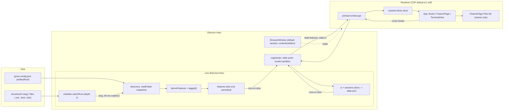

# Research: artifact viewer

Child 4 of epic `2026-10-05-opencode-feature-workspace`. This is delta research over the epic's research v5. Citation keys: `EL:` = electron/electron at tag `v44.5.1` (Chromium 152.0.7977.130, Node v24.21.0); `GR:` = the grove-render skill folder at `~/git/grove-skills/skills/grove-render`. Bare paths are in this repo at `5d06037`.

## Summary

- The feature page lists every top-level non-dot file in a feature folder, by name, with `stage`/`role` tags. Rows are not clickable. No IPC channel reads file content.
- Core alone knows feature folder paths (`Feature.path`). No function resolves `(projectId, slug, fileName)` to a path, and there is no path-containment check.
- Any top-level file change, `.html` included, re-derives and pushes the whole `features` slice. No event names the changed file.
- The main window uses the default session, `contextIsolation: true`, no protocols, no navigation or window-open handlers. The renderer meta CSP is `default-src 'self'` with no `frame-src`.
- View state is core-owned `UiState`, persisted in `state.json`. `view` is `'list' | 'board'`; feature page and terminal follow focus fields.
- grove-render pages load Mermaid from jsDelivr at `@11`, start it from an inline script, and link outside the feature folder (epic pages, `../../adr/*.md`, `refs/*.png`).
- Electron 44 has `protocol.handle` and `registerSchemesAsPrivileged`; a header CSP `sandbox` unions with an iframe `sandbox` attribute. Custom-scheme iframes under an `http://localhost` parent were not observed.
- Mermaid 12.1.0 ships one self-contained 5.49 MB IIFE; markdown-it 15.0.2 ships browser bundles and has no built-in task lists or anchors.
- Tests are vitest, node environment, `*.test.ts` only. Main, preload and React components have no tests.

## Inherited from epic

From the epic's `02-research.md` v5, this research relies on:

- "Q7. Grove artifact formats today"
- "Q9. Sandboxed artifact HTML in Electron"
- "Q5. The previous grove app (f5a1c17)", for history only; app code is new since then
- "Constraints & invariants" (including "renderers sandboxed by default")
- "Unknowns" (the `corsEnabled` unknown is resolved in Q7 below)

The epic's "Test landscape" (HEAD 15ec3b4, before any app code) is superseded by the Test landscape section here.

## Answers

### Q1. Feature page today

- Core reads a folder with `readdirSync(dir, {withFileTypes})` and keeps `e.isFile() && !e.name.startsWith('.')`, sorted (`src/core/discovery/folder.ts:56-59`).
  - Dot files excluded. Subfolders excluded (not files; no recursion).
  - Non-markdown files kept; no extension filter (`src/core/discovery/folder.ts:11`).
- Frontmatter is parsed only for each stage's `artifact` and any `complete_when.all_checked` target (`src/core/discovery/folder.ts:40-47,60-64`). Other files appear by name only.
- A folder is a feature only if its manifest exists (`src/core/discovery/folder.ts:50-55`).
- `deriveFeatures` sets `artifacts: f.files.map(name => ({ name, ...tagged(name) }))` (`src/core/workflow/derive.ts:95`).
- `tagged(name)` (`src/core/workflow/derive.ts:70-75`):
  - effective stage with `artifact === name` → `{stage: id, role: 'artifact'}`;
  - else effective stage with `review === name` → `{stage: id, role: 'review'}`;
  - else `{stage: null, role: null}`. Stages outside the feature's kind/flow give null tags.
- Bundled workflow review files are `.html` companions such as `02-research.html` (`resources/workflow.yaml:30-41`).
- Shape: `Feature.artifacts: { name; stage: string | null; role: 'artifact' | 'review' | null }[]`; no path, content or frontmatter (`src/shared/types.ts:50`). `Feature.path` is the absolute folder path (`src/shared/types.ts:38`, `src/core/workflow/derive.ts:79`).
- `FeaturesSlice = { workflowError, stages, items }` (`src/shared/types.ts:52-56`), derived, not persisted, pushed whole as `state:features` (`src/core/core.ts:85,178-188`, `src/shared/ipc.ts:31`). Renderer subscribes in `src/renderer/src/stores/slices.ts:32`.
- `FeaturePage({feature, sessions, onFocusSession})` (`src/renderer/src/components/FeaturePage.tsx:8-12`): header (17-26), Stages (28-39), Files (41-51), Sessions (53-65).
- A Files row is a plain `<li>` with the name, plus `stage` and `· review` notes when tagged (`src/renderer/src/components/FeaturePage.tsx:44-49`).
- Clicking a file row does nothing: no `onClick`, no link (`src/renderer/src/components/FeaturePage.tsx:45-48`); `.file` sets no cursor (`src/renderer/src/components/FeaturePage.module.css:60-64`).
- Only linked-session rows are clickable: `onFocusSession(x.id)` (`src/renderer/src/components/FeaturePage.tsx:60-61`), wired to `setFocused` (`src/renderer/src/App.tsx:69`).

### Q2. Renderer navigation

- View state is `UiState`, owned by core: `{ sidebarWidth, focusedSessionId, focusedFeature, view: 'list'|'board', sidebarTab: 'sessions'|'features', collapsed }` (`src/shared/types.ts:19-26`); default `sidebarWidth: 230`, `view: 'list'` (`src/shared/types.ts:60`).
- The renderer mirrors it in zustand (`src/renderer/src/stores/slices.ts:20-41`). Every setter calls `window.api.invoke('ui:set', partial)`; no local-first update; core pushes `state:ui` back (`src/renderer/src/stores/slices.ts:31,37-46`).
  - `setFocused` → `{focusedSessionId}`; `focusFeature` → `{focusedFeature}`; `openFeature` → `{view:'list', focusedFeature}`; `setView` → `{view}`; `setSidebarTab` → `{sidebarTab}`; `toggleCollapsed` → `{collapsed}`.
- Core `uiSet` merges; setting `focusedFeature` clears `focusedSessionId` and vice versa (`src/core/core.ts:289-296`). IPC at `src/main/ipc.ts:43`.
- `App` picks content in order (`src/renderer/src/App.tsx:65-79`):
  1. `view === 'board'` → `<Board>`; its `onOpen` calls `openFeature`.
  2. `focusedFeature` resolves (match `projectId+slug`, `src/renderer/src/App.tsx:45-46`) → `<FeaturePage>`.
  3. focused session `lastStatus === 'running'` → `<TerminalView key={id}>`.
  4. focused session otherwise → "Session ended" panel.
  5. else an empty hint.
- Board wins: `focusFeature`/`setFocused` don't change `view` (`src/renderer/src/stores/slices.ts:37-38`). No router.
- Breadcrumbs `['Board']` or `[project.name, title]` (`src/renderer/src/App.tsx:47-51`); `ContentHeader` with `ViewToggle` (`src/renderer/src/components/shell/ViewToggle.tsx:5-20`).
- Sidebar: tabs set `sidebarTab` (`src/renderer/src/components/Sidebar.tsx:209-222`); session card click → `setFocused`, its open-feature button → `focusFeature` (`src/renderer/src/components/Sidebar.tsx:176-177`); Features tree rows → `focusFeature` (`src/renderer/src/components/Sidebar.tsx:190-207,235-240`).
- Menu `menu:action` handled at `src/renderer/src/App.tsx:28-41`: Cmd+T, Cmd+W, Cmd+1..9 (`src/main/menu.ts:20-41`); Cmd+K is a no-op (`src/main/menu.ts:46`).
- `TerminalView` attaches on mount, sends `pty:detach` on unmount (`src/renderer/src/components/TerminalView.tsx:47-49,65-69`); main keeps one live attach (`src/main/ipc.ts:46-51`).
- Persistence: core `set()` writes `{schemaVersion:1, sessions, ui}` to `state.json` for all slices except `projects` (→ `config.json`) and `features` (`src/core/core.ts:75-90`). Paths: `app.getPath('userData')/state.json`, `~/.config/grove/config.json` (`src/main/index.ts:19-20`). Saved ui merged over `DEFAULT_UI` (`src/core/store/stateStore.ts:4-7`).
- No `localStorage`/`sessionStorage` in the renderer. Local unpersisted state: card `compact`, `linking` (`src/renderer/src/components/Sidebar.tsx:157-158`); modals (`src/renderer/src/App.tsx:21-22`).
- Layout: `AppShell` = `topBar`, `banners`, `.body` row of `<aside .sidebar>` + `<main .content>` (`src/renderer/src/components/shell/AppShell.tsx:11-19`). Sidebar `width: var(--sidebar-w)`, content `flex: 1; min-width: 0`, both `overflow: hidden` (`src/renderer/src/components/shell/AppShell.module.css:16-35`). `--sidebar-w` set from `ui.sidebarWidth` (`src/renderer/src/components/shell/AppShell.tsx:12`); nothing writes `sidebarWidth`; no splitter.

### Q3. Main process and window setup

- One `BrowserWindow`, created in `app.whenReady()` after `core.start()`, `registerIpc`, `buildMenu` (`src/main/index.ts:13-36`). No `requestSingleInstanceLock`.
- Window settings: 1200×800, `titleBarStyle: 'hidden'`, `trafficLightPosition {18,18}`, `backgroundColor: chromeBackground`, `show: false`, shown on `ready-to-show` (`src/main/index.ts:36-45`).
- `webPreferences: { preload: '../preload/index.js', contextIsolation: true }` only (`src/main/index.ts:43`). No `sandbox`, `nodeIntegration`, `partition`, `session`; defaults apply (renderers sandboxed by default, `EL:docs/tutorial/sandbox.md:15`). No `session.*` or `webRequest` use in `src/main`, `src/core`, `src/preload`.
- Preload exposes `window.api` with `invoke`, `send`, `on` (returns unsubscribe) (`src/preload/index.ts:4-14`); channel types `InvokeMap`, `SendMap`, `PushMap` (`src/shared/ipc.ts:7-40`).
- Renderer CSP (meta): `default-src 'self'; script-src 'self'; style-src 'self' 'unsafe-inline'; img-src 'self' data:` (`src/renderer/index.html:7-10`). No `frame-src`/`child-src`. Main sets no CSP header.
- Dev vs built: `ELECTRON_RENDERER_URL` set → `win.loadURL(...)`; else `win.loadFile('../renderer/index.html')` (`src/main/index.ts:51-52`). Scripts `dev`/`build`/`start` = `electron-vite dev|build|preview`; entry `./out/main/index.js` (`package.json:7,13-15`).
- Vite config: main/preload use `externalizeDepsPlugin`, `node-pty` external; renderer React with `@renderer`/`@shared` aliases (`electron.vite.config.ts:5-35`).
- Resources read as `path.join(app.getAppPath(), 'resources', …)` (`src/main/index.ts:21,25`); `build.asarUnpack: ["node_modules/node-pty/**","resources/**"]` (`package.json:18`).
- No `protocol.handle`, `registerSchemesAsPrivileged`, `setWindowOpenHandler`, `will-navigate` or `shell.*` anywhere in `src/main`, `src/core`, `src/preload`.
- Window handlers: `ready-to-show`, `focus` (`core.checkLiveness`), `closed` (`app.quit`) (`src/main/index.ts:45-50`). App: `before-quit` (`core.dispose`), `window-all-closed`, `will-quit` (`app.exit(0)`) (`src/main/index.ts:54-58`).
- Custom menu: File Cmd+T/Cmd+W, Session Cmd+1..9, View Cmd+K (empty handler); DevTools/reload only when `!app.isPackaged`; actions pushed as `menu:action` (`src/main/menu.ts:4-50`, `src/main/index.ts:32-34`).

### Q4. Locating feature folders from main

- Main builds core with `configPath`, `statePath`, `bundledWorkflowPath`, a backend; it has no feature-folder knowledge of its own (`src/main/index.ts:18-28`).
- Core keeps a private `discovery` map: `projectId → { root, fromFile, folders: Map<slug, FolderSnapshot>, rootWatch, fileWatch }` (`src/core/core.ts:67-73`). `FolderSnapshot = { slug, path, manifest, files, artifacts }`, `path` absolute (`src/core/discovery/folder.ts:7-13,65`).
- `resolveRoot` reads `key` from `from_file` (YAML, accepts JSON), else `default`, resolves against the project path, `null` if not a directory (`src/core/discovery/folder.ts:18-31`). Bundled workflow: `manifest: feature.md`, `root: { from_file: grove.config.json, key: artifactRoot, default: docs/work }` (`resources/workflow.yaml:3-5`). Features = non-dot subdirs of the root with the manifest (`src/core/discovery/folder.ts:33-38,49-55`).
- Main reaches features through `core.getSlices()` (`src/core/core.ts:45,330`); renderer via `state:get` and `state:features` (`src/main/ipc.ts:28,72-83`, `src/renderer/src/stores/slices.ts:29-34`).
- Resolving `(projectId, slug, fileName)` today:
  - Only lookup by `(projectId, slug)`: `slices.features.items.some(...)` in `sessionLink` (`src/core/core.ts:281`).
  - `Feature.path` plus `Feature.artifacts[].name` give folder and existing file names (`src/shared/types.ts:38,50`).
  - No function or IPC channel resolves or reads a file in a feature folder (`src/shared/ipc.ts:7-19`). No path-containment or traversal check.
- Watching: `watchRoot` uses chokidar on the root, `depth: 1`, `ignoreInitial`, `awaitWriteFinish {200, 50}`, ignores `.tmp` and dot-segments, reduces events to the slug, coalesces 50 ms per slug (`src/core/discovery/watcher.ts:12-38`).
  - Any top-level file change, `.html` included, fires `onFolder(slug)`.
  - `rereadFolder` re-runs `readFolder`, replaces/deletes the snapshot, calls `publish()` (`src/core/core.ts:153,169-176`); `publish()` re-derives the whole slice and `set('features', …)` (`src/core/core.ts:75-77,179-188`).
  - An `.html` change only affects file names (no content, no mtime); an identical slice is still pushed.
- Push: `core.on('slice')` → `setImmediate` batch → `webContents.send('state:<key>')` (`src/main/ipc.ts:72-83`). No per-file event.
- Other watchers: workflow file (`src/core/core.ts:311-314`), project `from_file` (`src/core/core.ts:146`), 5 s `syncProjects(false)` poll (`src/core/core.ts:325-328`).

### Q5. grove-render output today

- `~/.claude/skills/grove-render` symlinks to the `GR:` folder: `SKILL.md`, `assets/template.html`, `references/{components,contract,gates}.md`.
- Renders with its own bundled template (`GR:SKILL.md:24-27`), only research, design, structure (`GR:SKILL.md:16-20`), to `<same-name>.html` beside the markdown (`GR:SKILL.md:60-61`). Banner "Generated from `<file>.md` v`<version>`…"; child pages link the epic's same-phase page (`GR:SKILL.md:62-67`).
- Only external resource: `<script src="https://cdn.jsdelivr.net/npm/mermaid@11/dist/mermaid.min.js">` (`GR:assets/template.html:7`). Major version only, no SRI. Same line in all 12 generated files. No `<link>`, web fonts, `@import`, `url(`, ``; system font stacks (`GR:assets/template.html:38,54`).
- Mermaid: CDN script sync in `<head>`; inline script at body end runs `mermaid.initialize({ startOnLoad: true, theme: dark ? 'dark' : 'default' })` in `try/catch` (`GR:assets/template.html:112-116`). No `securityLevel`. Diagrams are `<pre class="mermaid">` plus a `
` with escaped source (`GR:references/components.md:12-20`).
- Each generated file has exactly 2 `<script>` tags; no `on*=` attributes.
- One inline `<style>` (`GR:assets/template.html:8-104`) with CSS variables and dark theme via `prefers-color-scheme` and `data-theme`; `<html data-theme="auto">` (`GR:assets/template.html:2`).
- Generated `<head>`s match the template except `<title>` and extra CSS (tables, blockquote). `docs/work/2026-10-05-01-workspace-walking-skeleton/02-research.html:105` adds a second `<style>`.
- `docs/work/2026-10-05-09-visual-foundation/03-design.html` departs most: 57 extra `<head>` lines incl. mock-up CSS (~`:108-160`), 29 inline `style="…"`, 5 inline `<svg>` (`:259,260,267,271`), an app-shell mock-up absent from its markdown.
- Relative links:
  - epic page `../2026-10-05-opencode-feature-workspace/0N-*.html` in all 9 child files (e.g. `docs/work/2026-10-05-01-workspace-walking-skeleton/02-research.html:107`);
  - ADRs `../../adr/00NN-*.md` (all targets exist);
  - image `refs/xirp-reference.png` (`docs/work/2026-10-05-opencode-feature-workspace/04-structure.html:187`);
  - sibling anchor `02-research.html#current-architecture` (`docs/work/2026-10-05-09-visual-foundation/03-design.html:187`);
  - in-page TOC `#slug` links per `##` heading (`GR:references/components.md:142-145`), 4–10 per file.
- Components: `decision-card`, `callout risk|deferred|appetite`, `compare`, `filetree`, `timeline`, `inherited-decisions`, `badge epic`, `epic-link`, `diagram-block`.
- Sizes: 12 files, 419,738 B total, 14,237–67,016 B each, 155–405 lines.
- Companions are gitignored: `.gitignore:11` `docs/work/**/*.html`; `grove.config.json:5` `"commitHtml": false`.

### Q6. Markdown in artifacts

Scope: 40 `.md` files under `docs/work/`.

- YAML frontmatter: 34 of 40; every `00-ticket.md` lacks it (e.g. `docs/work/2026-10-05-opencode-feature-workspace/03-design.md:1-13`). `based_on` entries like `01-questions.md@3`, `parent:02-research.md@5` (`docs/work/2026-10-05-01-workspace-walking-skeleton/03-design.md:10-14`).
- Tables: in research, design, one plan and one ticket (e.g. `docs/work/2026-10-05-01-workspace-walking-skeleton/02-research.md:159-160`).
- Task lists: plans (46–97 items) and implementation logs (4–20) (e.g. `docs/work/2026-10-05-01-workspace-walking-skeleton/05-plan.md:264`).
- Mermaid fences: 10 across research, design and structure files. Other fences: `ts`, `json`, `yaml`, unlabelled.
- Raw HTML: none intended; angle brackets appear only as prose placeholders or wrapped code spans (e.g. `docs/work/2026-10-05-09-visual-foundation/05-plan.md:81`).
- Links: 16 `` links. 15 go to ADRs via `../../adr/…md` (e.g. `docs/work/2026-10-05-opencode-feature-workspace/03-design.md:170-178`); 1 external (`docs/work/2026-10-05-09-visual-foundation/06-implementation.md:147`).
- No markdown links to other artifacts or `CONTEXT.md` (inline code only). No `](#anchor)` links. No `![` images. Blockquotes only in `docs/work/2026-10-05-09-visual-foundation/00-ticket.md:3,5,7`; no `> [!…]` callouts.
- Config: `grove.config.json:2` `artifactRoot: "docs/work"`, `:3` `adrDir: "docs/adr"`, `:4` `contextFile: "CONTEXT.md"`. The app reads only `artifactRoot` (`resources/workflow.yaml:5`); no non-test use of `adrDir`/`contextFile` in `src` or `resources`.
- ADRs: `# NNNN. Title`, `Date:`, `## Status`, no frontmatter (`docs/adr/0001-projects-and-workflow-declared-discovery.md:1-7`).
- Feature folders hold 40 `.md`, 12 `.html`, 1 `.png`. The PNG is in subfolder `docs/work/2026-10-05-opencode-feature-workspace/refs/` (870,536 B, 3366×2068). Empty `.claude/.cc-writes/` folders exist in 4 feature folders.

### Q7. Electron 44 protocol and frame APIs

No Electron run was observed: a spike hung inside the sandbox ("sysmond service not found"). Load answers come from source, docs and tests.

- `registerSchemesAsPrivileged(customSchemes: CustomScheme[]): void` (`node_modules/electron/electron.d.ts:11775`); `CustomScheme = { scheme; privileges? }` (`:7562-7571`); `Privileges`: `standard`, `secure`, `bypassCSP`, `allowServiceWorkers`, `supportFetchAPI`, `corsEnabled`, `stream`, `codeCache` (needs `standard`), `allowExtensions`, all default false (`:23542-23580`).
- `handle(scheme, handler: (request: GlobalRequest) => GlobalResponse | Promise<GlobalResponse>): void` (`node_modules/electron/electron.d.ts:11634`). `request.initiatorOrigin` is `null` for opaque origins, absent for browser-initiated requests (`EL:docs/api/protocol.md:135-139`, `EL:spec/api-protocol.spec.ts:1538-1559`).
- Privileges in source (`EL:shell/browser/api/electron_api_protocol.cc:141-205`): `standard` → standard + web-safe scheme (`:145-150`); `secure` → no mixed-content warnings (`:152-154`); `bypassCSP` (`:156-158`); `corsEnabled` → scheme can receive CORS requests (`:160-162`). Tests: an http page can `fetch()` a `corsEnabled` scheme (`EL:spec/api-protocol.spec.ts:1317-1323`); `supportFetchAPI` alone blocks cross-origin fetch (`:1331-1349`).
- Must be called once, before `ready` (`EL:docs/api/protocol.md:76-78`). Without `standard`: no relative URLs, no web storage or cookies (`EL:docs/api/protocol.md:94-118`).
- `protocol.handle` covers the default session; partitioned windows need `ses.protocol.handle` (`EL:docs/api/protocol.md:28-38`). Grove's window uses the default session (`src/main/index.ts:43`).
- Headers: return `new Response(body, { headers })` (`EL:docs/api/protocol.md:166-168`). Electron honours a `Content-Security-Policy` header; `webRequest.onHeadersReceived` is the other path (`EL:docs/tutorial/security.md:382-401`).
- CSP `sandbox` acts as if set on an iframe `sandbox`; ignored in `<meta>` (https://w3c.github.io/webappsec-csp/). Final sandbox flags are the union of attribute and CSP flags; neither lifts the other's (https://html.spec.whatwg.org/multipage/browsing-the-web.html). The sandboxed origin flag gives an opaque origin and blocks `document.cookie`/`localStorage`.
- Custom-scheme iframe in a `file://` parent loads (`EL:spec/api-protocol.spec.ts:281-299`). Under an `http://localhost` parent and a custom-scheme parent: not determined.
- Parent CSP must allow the scheme in `frame-src` (fallback `child-src` → `default-src`). The renderer CSP has none, and the same `index.html` serves dev and build (`src/renderer/index.html:7-10`, `src/main/index.ts:51-52`).
- `will-frame-navigate` fires for main frame and subframes, has `isMainFrame`, `frame`, `preventDefault()`; not for `loadURL` or in-page navigations (`node_modules/electron/electron.d.ts:17759-17780`, `EL:docs/api/web-contents.md:281`). `will-navigate` is main-frame only (`node_modules/electron/electron.d.ts:17781-17795`).
- Also: `did-start-navigation` (`EL:docs/api/web-contents.md:313-337`), `did-frame-navigate` (`:417-432`), `frame-created` (`:1074`), `console-message` with `frame` (`:1009-1025`). `webFrameMain.origin` is `"null"` for opaque origins (`EL:docs/api/web-frame-main.md:277-285`).
- `setWindowOpenHandler(details => { action: 'allow'|'deny', … })` runs before a window opens for `window.open()`, `target=_blank`, shift-click, form `_blank` (`node_modules/electron/electron.d.ts:18759,22157-22190,20664-20689`). Docs don't state subframe behaviour.
- A sandboxed iframe without `allow-popups` cannot open auxiliary windows; without `allow-top-navigation*` it cannot navigate the top level (HTML §7.1.5).
- `shell.openExternal(url, options?)` (`node_modules/electron/electron.d.ts:14064`). Security checklist 13–15: limit navigation, deny new windows, don't pass untrusted content to `openExternal` (`EL:docs/tutorial/security.md:593-712`).
- Mermaid 12.1.0 `dist/mermaid.min.js` (static grep): no `localStorage`, `sessionStorage`, `indexedDB`, `document.cookie`, `window.top`, `window.parent`, `navigator.clipboard`. `crypto.randomUUID` used only if present. `new Worker` only on the ELK layout path. `Function("return this")()` as global fallback.

### Q8. Bundling assets for main

- electron-vite 5.0.0: main/preload `publicDir` defaults to `resources`, not copied to `out` (`node_modules/electron-vite/dist/chunks/lib-q6ns0vZr.js:324-326`; electron-vite docs `guide/assets.md:11-20`).
- Import suffixes: `?asset`, `?asset&asarUnpack`, `?modulePath`, `?nodeWorker`, `.wasm?loader`, `.node` (`node_modules/electron-vite/node.d.ts:13-27`).
- `?asset` (build only): files outside `publicDir` emit to `out/main/chunks/[name]-[hash].[ext]`; files inside are not copied and resolve relative to the chunk; `&asarUnpack` rewrites `app.asar` → `app.asar.unpacked` (`node_modules/electron-vite/dist/chunks/lib-q6ns0vZr.js:579-690`).
- Only `dependencies` are externalised; `devDependencies` are bundled (`node_modules/electron-vite/dist/chunks/lib-q6ns0vZr.js:1127-1146,1636-1640`). `externalizeDepsPlugin()` is deprecated (`node_modules/electron-vite/dist/index.d.ts:10-14`); Grove still uses it (`electron.vite.config.ts:7-12`).
- Output is CJS: no `"type":"module"` in `package.json` (`node_modules/electron-vite/dist/chunks/lib-q6ns0vZr.js:133-136,284`). Node target falls back to `node22.20` (`:160-187`).
- `package.json:18` declares `asarUnpack`, but no packager (electron-builder, forge, @electron/packager) is installed (`package.json:19-41`).
- mermaid 12.1.0: ESM-only package entry `dist/mermaid.core.mjs` (imports npm deps), no `require` condition, `"./*"` deep paths. `dist/mermaid.min.js`: 5,493,176 B single IIFE setting `globalThis.mermaid`. `dist/mermaid.esm.min.mjs`: 30,936 B entry plus 104 chunks (5,361,433 B). 23 runtime deps.
- grove-render pages request `mermaid@11`; npm latest is 12.1.0.
- markdown-it 15.0.2: `import` → `dist/markdown-it.mjs` (imports 5 deps), `require` → `dist/markdown-it.cjs.js`, bundled types; `./browser` → `dist/browser/markdown-it.esm.min.mjs` (138,276 B, no imports) or `markdown-it.umd.min.js` (115,080 B, global `markdownit`).
- Presets: `default` has `html:false`; `commonmark` has `html:true` (`node_modules/markdown-it/dist/markdown-it.mjs:3430-3480`, npm pack).
- No built-in task lists or anchors. npm plugins: `markdown-it-anchor` 10.0.0, `@mdit/plugin-anchor` 2.2.2, `@mdit/plugin-tasklist` 1.1.3, `markdown-it-task-lists` 2.1.1 (2022), `markdown-it-task-checkbox` 1.0.6 (2022).

### Q9. Tests

- `npm test` = `vitest run` (`package.json:12`), vitest 4.1.11 (`package.json:40`). `environment: "node"`, `include: ["src/**/*.test.ts"]`, `testTimeout: 15000`, aliases (`vitest.config.ts:4-16`). `.tsx` tests are not matched.
- `npm run typecheck` runs `tsc --noEmit` on `tsconfig.node.json` then `tsconfig.web.json` (`package.json:9-11`). `grove.config.json:9-14` lists `test` and `typecheck` commands.
- Core seams: `CoreOptions` injects `watchers`, `backend`, `now` (`src/core/core.ts:21-28`). Fakes: `FakeBackend` (`src/core/testing/fakeBackend.ts:7-59`), `FakeWatchers` storing callbacks to fire by hand (`src/core/testing/fakeWatchers.ts:4-17`). `setupCore()` builds a temp project `p` with the bundled workflow (`src/core/testing/setup.ts:17-32`). Example re-read: `s.watchers.roots.get(s.work)!('b')` (`src/core/features.test.ts:49-60`).
- Real I/O: `watcher.test.ts` uses real chokidar, skipped when `fs.watch` fails (`src/core/discovery/watcher.test.ts:9-28`); covers folder add/rename/remove, `.tmp`, dot folders, `watchFile` (`:42-81`); no test of a file change inside an existing folder. `tmux.test.ts` needs tmux (`src/core/backend/tmux.test.ts:16`).
- Main and preload: no tests; no Electron harness in dependencies (`package.json:19-41`).
- Renderer: node tests of pure modules and source text only (`tree.test.ts`, `tags.test.ts`, `styles/tokens.test.ts`, `noInlineStyles.test.ts`). No jsdom or testing-library.
- Sandboxed run: 19 files, 147 tests: 139 passed, 3 skipped, 5 failed, all in `tmux.test.ts` (socket connect error).

## Current architecture

## Existing patterns to reuse

- Core is a plain module behind `createCore`, with I/O behind injectable interfaces (`Watchers`, `SessionBackend`, `now`) and fakes in `src/core/testing/` (`src/core/core.ts:21-28`).
- State reaches the renderer as whole slices: `core.on('slice')` → batched `state:<key>` push; renderer subscribes before `state:get` (`src/main/ipc.ts:72-83`, `src/renderer/src/stores/slices.ts:28-34`; ADR 0011).
- Renderer writes go through invoke commands; core is the owner and pushes back (`src/renderer/src/stores/slices.ts:26-46`).
- Typed IPC via `InvokeMap`/`SendMap`/`PushMap`; handlers return `Result<T>` directly or via `handle()` (`src/shared/ipc.ts:3-40`, `src/main/ipc.ts:17-26`).
- Main is thin glue: Electron-only work in `src/main`, domain logic in core (`src/main/ipc.ts:30-61`).
- chokidar with `awaitWriteFinish`, `.tmp` and dot-path ignores, per-slug coalescing (`src/core/discovery/watcher.ts:12-29`).
- Failures tolerated inline: racing reads return `null`; errors go to `errors`/`workflowError` (`src/core/core.ts:101-133`).
- Single-focus rule enforced in core (`src/core/core.ts:291-293`).
- Atomic JSON writes for app state (`src/core/store/stateStore.ts:9-11`).
- CSS modules plus tokens; dynamic values via CSS custom properties (`src/renderer/src/components/shell/AppShell.tsx:12`); `noInlineStyles.test.ts` guards inline styles.
- Bundled files live in `resources/` and are read via `app.getAppPath()` (`src/main/index.ts:21,25`).

## Constraints & invariants

- `contextIsolation: true`; renderer reaches main only through `window.api` (`src/main/index.ts:43`, `src/preload/index.ts:14`).
- Renderer CSP allows only `'self'` scripts, `'self'` + inline styles, `'self'`/`data:` images; frames fall under `default-src 'self'`, in dev and build (`src/renderer/index.html:7-10`).
- A feature is identified by `projectId + slug` (`CONTEXT.md` "Feature", `src/core/core.ts:281`).
- Artifacts are top-level non-dot regular files; root watch is `depth: 1`; subfolder contents are not tracked (`src/core/discovery/folder.ts:56-59`, `src/core/discovery/watcher.ts:20`).
- Artifact entries carry no path or content (`src/shared/types.ts:38,50`).
- `features` is derived and never persisted; `ui` and `sessions` persist to `state.json` on every set (`src/core/core.ts:85-88`).
- Only one of `focusedSessionId` and `focusedFeature` is non-null; `view` is only `'list' | 'board'` (`src/core/core.ts:291-293`, `src/shared/types.ts:22-23`).
- Only one PTY attach is live at a time (`src/main/ipc.ts:46-51`).
- `registerSchemesAsPrivileged` runs once, before `ready`; storage and relative URLs need `standard`; `protocol.handle` covers only the default session (`EL:docs/api/protocol.md:28-38,76-118`).
- CSP `sandbox` works only as an HTTP header and unions with an iframe `sandbox` attribute (CSP3 §6.3.2; HTML spec).
- grove-render pages are not self-contained: Mermaid from jsDelivr at `@11`, inline `<script>` and `<style>`, and in one page inline `style=` and `<svg>` (`GR:assets/template.html:7,112-116`).
- Relative hrefs in companions reach outside the feature folder: `../<epic>/…html`, `../../adr/*.md`, `refs/*.png`.
- Companions exist only for 02/03/04 artifacts and are gitignored (`GR:SKILL.md:16-20`, `.gitignore:11`).
- electron-vite externalises only `dependencies`; `resources/` is not copied to `out/`. Mermaid's npm entry is ESM-only; its only single-file build is the 5.49 MB IIFE.
- vitest runs only `*.test.ts` in a node environment (`vitest.config.ts:12-13`).

## Test landscape

- Run: `npm test` (vitest run) and `npm run typecheck` (node then web tsconfig) (`package.json:9-12`, `grove.config.json:9-14`).
- Core: test files for `features`, `sessions`, `projects`, `env`, `git`, `opencodeId`, `discovery/folder`, `discovery/watcher`, `workflow/{derive,frontmatter,parse}`, `store/{configStore,jsonFile,stateStore}`, `backend/tmux`. Fakes and `setupCore()` in `src/core/testing/`.
- Discovery: `discovery/folder` and `features.test.ts` cover folder reads via `FakeWatchers`; real-chokidar `watcher.test.ts` skips when `fs.watch` fails and does not test a file change inside an existing folder.
- Main and preload: no tests, no Electron harness.
- Renderer: node-only tests of pure modules and source text; no DOM, no React rendering, no jsdom.
- In the research sandbox: 147 tests, 139 passed, 3 skipped, 5 failed (`tmux.test.ts`, socket restriction).

## Relevant ADRs

- 0004. Core runs in Electron main behind an Electron-free seam (`docs/adr/0004-core-in-electron-main.md`).
- 0007. Artifacts served through a custom protocol with a header CSP (`docs/adr/0007-artifact-protocol-with-header-csp.md`).
- 0008. In-app inline comments, collected as drafts, sent explicitly (`docs/adr/0008-in-app-inline-comments.md`).
- 0009. App-owned state in versioned JSON files, never in repos (`docs/adr/0009-app-state-in-json-files.md`).
- 0011. Main pushes whole state slices to the renderer (`docs/adr/0011-slice-snapshots-to-renderer.md`).
- 0012. CSS Modules with token custom properties; terminal colours in theme.ts (cited in `CONTEXT.md:44`).
- 0013. YAML core schema with an own frontmatter splitter, no gray-matter (`docs/adr/0013-yaml-core-schema-own-frontmatter-splitter.md`).

## Unknowns

- Whether a custom-scheme iframe loads inside a page served from `http://localhost` (Vite dev). Resolved by an Electron 44 run outside the sandbox with that setup.
- Whether a custom-scheme iframe loads inside a custom-scheme parent page. Resolved by the same run.
- Whether `setWindowOpenHandler` and `will-frame-navigate` are reached for `window.open`/link clicks from a sandboxed subframe, or Blink blocks them first. Resolved by logging both handlers in an Electron run.
- Mermaid 12.1.0 runtime behaviour in an opaque-origin sandboxed frame (the `Function("return this")` fallback, `fetch` uses). Resolved by rendering a diagram in such a frame.
- Size of the `mermaid@11` CDN `mermaid.min.js` that grove-render pages load. Resolved by fetching the jsDelivr file.
- Unsandboxed test-suite result (5 `tmux.test.ts` failures seen only in the sandbox). Resolved by running `npm test` outside the sandbox.

## Open questions
