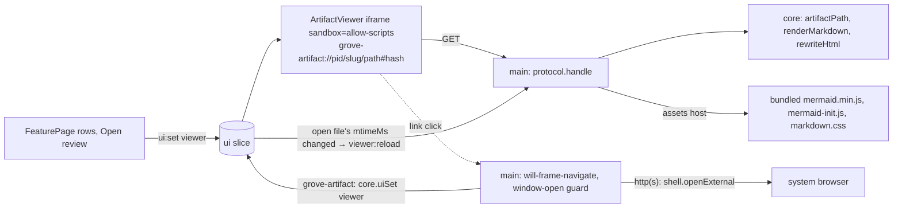

# Design: artifact viewer

Child 4 of epic `2026-10-05-opencode-feature-workspace`.

## Inherited decisions

- **E-D8** Artifact display isolation: `grove-artifact://` scheme allowlisted to
  feature folders, header CSP, bundled Mermaid, markdown rendered in main,
  opaque iframe. The injected `postMessage` script is child 6's.
- **E-D4** Core in Electron main behind an Electron-free seam.
- **E-D7** App state in versioned JSON files; main is the single writer.
- **E-D1 / E-D2** Feature folders come only from the workflow's `discovery`; no
  code names grove files or phases.

## Desired state

1. The feature page has an **Open review** button for the current stage's
   `review` file (its `artifact` when no companion exists). Every viewable
   top-level file of the feature folder (markdown, HTML, images) is clickable.
2. The artifact opens in a **resizable right-hand panel** next to whatever the
   main area shows (feature page or terminal), with a toggle to expand it to
   the whole content area and a switcher of the folder's files, grouped by stage.
3. HTML loads in an `sandbox="allow-scripts"` iframe (no same-origin) from
   `grove-artifact://<projectId>/<slug>/<path>`. A header CSP blocks all
   network; scripts come only from app-bundled assets; the CDN Mermaid tag is
   rewritten to a bundled copy, so diagrams render offline.
4. Markdown is rendered to HTML in main (frontmatter, tables, task lists,
   Mermaid fences) and served through the same handler and CSP.
5. Requests outside discovered feature folders are refused (traversal, dot
   paths, symlinks escaping). Links to another feature's artifacts open in the
   viewer; `https://` links open in the system browser; popups and other
   navigation are denied.
6. When the open file changes on disk, the panel reloads in place, keeping the
   scroll position where Chromium can restore it.
7. The open artifact, panel width and expanded state persist in app state.

## Non-goals

- **Repo docs (ADRs, `CONTEXT.md`) in the viewer.** Wanted (questions, product
  answer 2) but outside E-D8's feature-folder allowlist; deferred by the human
  on 2026-10-05. Such links show the refusal page. The fix needs an epic
  revision of E-D8 and E-D2; recorded under `## Follow-ups` in the epic's
  `feature.md`.
- **Subfolder files in the switcher** (questions, product answer 4, narrowed by
  the human in this design): discovery stays top-level. Subfolder files (e.g.
  `refs/*.png`) are served when an artifact links or embeds them, but are not
  listed and don't trigger live reload.
- The injected comment script and comments (child 6); next-action buttons
  (child 5); editing artifacts or generating missing companions.
- File types other than markdown, HTML and images.

## System design



### URLs and resolution

- Artifacts: `grove-artifact://<projectId>/<slug>/<path>`, `path` relative POSIX,
  sub-paths allowed. Bundled assets: `grove-artifact://assets/<file>` (project
  ids are UUIDs, so no clash). Scheme privileges `{ standard, secure }`.
- **Artifact identity** = `projectId + slug + path`, the URL path. Child 6
  stores `path` in `Comment.artifact`.
- `core.artifactPath(projectId, slug, path)` returns an absolute path or `null`.
  Allowed only when `slug` is a discovered feature of that project and `path`
  is non-empty, not absolute, has no `\`, no segment starting with `.` (covers
  `..` and dot files), resolves under the folder after `realpath` on both
  sides, and is a regular file.
- Viewable extensions: `.html .htm .md .png .jpg .jpeg .gif .webp .svg`.
  Anything else, or `null` from `artifactPath`, gets a 404 HTML page "Not
  available in the viewer (outside the feature folders or not a viewable file)".

### Responses

- Every response carries the header CSP:
  `default-src 'none'; script-src grove-artifact://assets; style-src 'unsafe-inline' grove-artifact://assets; img-src grove-artifact: data:; font-src data:; base-uri 'none'; form-action 'none'; sandbox allow-scripts`.
- HTML: `rewriteHtml` replaces any `<script src="https://cdn.jsdelivr.net/npm/mermaid@…">`
  with the bundled `mermaid.min.js` followed by `mermaid-init.js`. The page's
  inline init script is blocked by the CSP. `mermaid-init.js` calls
  `mermaid.initialize({ startOnLoad: true, theme })`, with the theme from
  `prefers-color-scheme`.
- Markdown: `renderMarkdown(source, name)` gives a full HTML document: markdown-it
  `default` preset (`html: false`), frontmatter (own splitter, ADR 0013) as a
  key/value table, `- [ ]`/`- [x]` as disabled checkboxes, ```` ```mermaid ````
  fences as `<pre class="mermaid">` plus the two Mermaid scripts,
  `markdown.css` (light/dark via `prefers-color-scheme`).
- Images: file bytes with their MIME type.

### Navigation, popups, reload

- `will-frame-navigate`, subframe: `grove-artifact:` → `preventDefault`, parse
  the URL, `core.commands.uiSet({ viewer })` (the iframe follows `ui.viewer`,
  the one source of truth). `http:`/`https:` → `preventDefault` +
  `shell.openExternal`. Anything else → `preventDefault`. Main frame: deny any
  navigation away from the renderer URL. In-page `#anchor` jumps don't fire.
- `setWindowOpenHandler`: always `deny`; `http(s)` URLs go to `openExternal`.
- Reload: `Feature.artifacts[]` gains `mtimeMs`. When the open file's `mtimeMs`
  changes in the pushed slice, the renderer invokes `viewer:reload`. Main
  calls `reload()` on every `grove-artifact:` frame in the window, which
  restores scroll on Chromium's own terms.

### Data shapes

- `UiState` += `viewer: { projectId; slug; path; hash: string | null } | null`
  (default `null`), `viewerWidth: number` (default 480), `viewerExpanded:
  boolean` (default `false`). Persisted like the rest of `ui` (merged over
  `DEFAULT_UI`, no schema bump).
- `Feature.artifacts: { name; stage; role; mtimeMs: number }[]`, top-level
  files only, as today.
- IPC: invoke `viewer:reload: [void, void]`.

## Program design

Call path, open: FeaturePage row → `openArtifact` (store) → `ui:set { viewer }`
→ `state:ui` → `ArtifactViewer` sets `iframe.src = artifactUrl(viewer)` → main
handler → `core.artifactPath` → read → `rewriteHtml` / `renderMarkdown` / bytes
→ `Response` + CSP.

```
src/shared/artifactUrl.ts (+test)        NEW  artifactUrl, parseArtifactUrl, VIEWABLE
src/shared/types.ts, ipc.ts              MOD  UiState viewer fields, artifacts mtimeMs; 'viewer:reload'
src/core/artifacts/{path,markdown,html}.ts (+tests)  NEW  safeArtifactPath, renderMarkdown, rewriteHtml
src/core/core.ts                         MOD  Core.artifactPath(projectId, slug, path)
src/core/discovery/folder.ts, workflow/derive.ts  MOD  mtimes → artifacts[].mtimeMs
src/main/artifacts.ts                    NEW  registerArtifactScheme, handleArtifacts, guardNavigation
src/main/index.ts, ipc.ts                MOD  scheme before ready, handler + guard; viewer:reload
resources/viewer/{mermaid-init.js,markdown.css}  NEW
src/renderer/index.html                  MOD  CSP frame-src grove-artifact:
src/renderer/src/viewerFiles.ts (+test)  NEW  viewableFiles (grouped by stage), reviewTarget
src/renderer/src/components/ArtifactViewer.tsx (+css)  NEW  header, switcher, expand, close, iframe
src/renderer/src/components/shell/AppShell.tsx (+css)  MOD  viewer slot, splitter, expanded mode
src/renderer/src/components/FeaturePage.tsx (+css)     MOD  clickable rows, Open review
src/renderer/src/stores/slices.ts, App.tsx             MOD  viewer actions, pass viewer to AppShell
package.json                             MOD  markdown-it 15.0.2 (dep), mermaid 12.1.0 (devDep, ?asset)
```

Key signatures:

```ts
// shared
type ViewerTarget = { projectId: string; slug: string; path: string; hash: string | null }
function artifactUrl(t: ViewerTarget): string
function parseArtifactUrl(url: string): ViewerTarget | null // null for assets host or bad URL
// core
function safeArtifactPath(folder: string, rel: string): string | null
function renderMarkdown(source: string, name: string): string
function rewriteHtml(html: string): string
interface Core { artifactPath(projectId: string, slug: string, rel: string): string | null }
```

Tests: core and shared functions in vitest (node); main glue and React by manual checks.

## One-way decisions

- **Artifact identity and listing.** Chosen: **top-level only** (option C):
  discovery and the switcher stay top-level; identity is
  `projectId + slug + path` (relative POSIX, sub-paths possible via links);
  `mtimeMs` added for reload. Rejected: recursive listing in the features slice
  (A: bigger slice and watcher depth for one PNG today); on-demand
  `artifact:list` invoke (B: second source of truth, new channel). No ADR
  (cheap to widen later; the identity string already fits sub-paths).

## Two-way decisions

| Area | Decision | Basis |
|---|---|---|
| Code split | Resolution, markdown and HTML rewrite in core (pure, tested); `protocol.handle`, CSP, navigation in `src/main/artifacts.ts` | ADR 0004; research "Main is thin glue" |
| Assets | `grove-artifact://assets/…`; Mermaid via electron-vite `?asset` import (devDependency); own small files in `resources/viewer/` | research Q8; existing `resources/` pattern |
| Mermaid init | Bundled `mermaid-init.js` after the bundled Mermaid; inline page scripts stay blocked | ADR 0007 `script-src` app-bundled only |
| Markdown | markdown-it `default` preset, own task-list rule, frontmatter table, no anchors plugin | research Q6: no `#anchor` links in md |
| Viewer state | `UiState.viewer`, `viewerWidth`, `viewerExpanded` in core, persisted | epic two-way "Per-viewer UI state" |
| Navigation in frame | Intercept and route through `ui.viewer` | one source of truth |
| External links | `shell.openExternal` for `http:`/`https:` only; all else denied | Electron security checklist 13–15 |
| Change detection | `mtimeMs` in the features slice; renderer asks `viewer:reload` | ADR 0011 slices; no new watcher |
| Reload | `webFrameMain.reload()` for scroll restore; no injected script | child 6 owns the injected script |
| Panel | Right panel, splitter drag (min 320 px, max content − 320 px), expand toggle hides the main area, close button | product answer 3 |
| Feature page | Rows of viewable files are buttons; **Open review** = current stage `review` if it exists, else `artifact`, hidden if neither | Desired state 1 |
| Switcher | Dropdown in the panel header: stage-tagged files grouped by stage in workflow order, then "Other" | product answer 4 |
| Refusals | 404 HTML page with the CSP; no logging of paths | — |

## Risks

- **Custom-scheme iframe under `http://localhost` (dev)** and `will-frame-navigate`
  reach for sandboxed subframes are unobserved (research Unknowns). Slice 1
  checks dev and `npm start`; slice 4 logs the handler. Fallback for navigation:
  `did-frame-navigate` to sync `ui.viewer` after the fact.
- **Mermaid 12 vs pages written for `@11`**: same `initialize` API; a failing
  diagram shows the page's own `<details>` fallback.
- **Mermaid tag rewrite** is a regex on grove-render's current tag; if the
  template changes, diagrams don't render but nothing loads from the network.
- **Scroll restore** after `reload()` is best-effort (Mermaid renders after
  load and shifts layout); reload lags a write by ≈250 ms (`awaitWriteFinish`).

## Open questions
