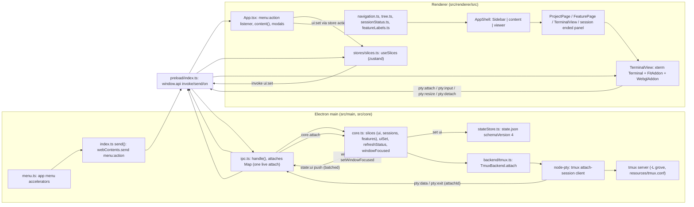

# Research: command palette and grid view

Note: research ran while `01-questions.md` was `status: draft`, version 1 (soft gate). Paths are relative to the repo root.

## Summary

- The only accelerator registry is the Electron application menu (`src/main/menu.ts:4-56`); the renderer has no Cmd-key handlers and the terminal has no custom key handler.
- Cmd+K exists as a menu item whose click does nothing (`src/main/menu.ts:51`); Cmd+1..9 focus the n-th session in sidebar order (`src/renderer/src/App.tsx:57-59`).
- One attach exists at a time: each `pty:attach` kills every earlier attach (`src/main/ipc.ts:58-64`), and `TerminalView` is mounted only for the one shown running session (`src/renderer/src/App.tsx:112-113`).
- `TerminalView` builds a fresh xterm `Terminal` per mount, with no pool or shared state (`src/renderer/src/components/TerminalView.tsx:13-95`).
- `UiState` has three exclusive focus fields, core nulls the other two (`src/core/core.ts:665-668`); `schemaVersion` is 4.
- "On screen" for the seen mark is a single id, `focusedSessionId` while the window is focused (`src/core/core.ts:399-402`).
- Session list, status and feature-label helpers are pure `.ts` modules; most take props, the Sidebar reads the store.
- No renderer fuzzy matcher, arrow-key list navigation or focus trap exists; modals use a capture-phase Escape/Enter listener.
- Tests run on vitest in a `node` environment, with no DOM test setup and no tests of components.

## Inherited from epic

Epic research (`docs/work/2026-10-05-opencode-feature-workspace/02-research.md`, v5) sections this child relies on:

- **Q2. tmux (3.6b, `/opt/homebrew/bin/tmux`)** (`:79`): detached sessions size from `default-size` (80x24) and survive without clients; an attach client's size follows `window-size` (observed `latest`) and `aggressive-resize`; `-r` is `read-only,ignore-size`; `resize-window` switches `window-size` to `manual`; control mode `-C`, `capture-pane`, `pipe-pane`, `send-keys` exist as outside read/write routes; `mouse` defaults off.
- **Q6. xterm.js + node-pty inside Electron** (`:197`): versions (xterm 6.0.0, webgl 0.19.0, node-pty 1.1.0); WebGL needs WebGL2 and can lose its context (`onContextLoss`); `term.resize` and `pty.resize` are not linked automatically; `attachCustomKeyEventHandler` runs before xterm's own handling; Electron's default menu binds Cmd+W, C, X, V, A, Z, Shift+Z, R, Shift+R, H, Alt+H, M, Q, 0, +, -, Alt+I, Ctrl+F; macOS takes Cmd+Tab, Cmd+Space, Ctrl+arrows and others before the app; in xterm 6.0.0 Cmd combinations produce no sequence; node-pty runs in main because renderers are sandboxed by default.

Updates from the code reports:

- The epic research text has no statement that Cmd+K or Cmd+1..9 are "reserved" (grep of the epic's `02-research.md` for `reserved`, `Cmd+K`, `⌘K`, `⌘1` found nothing). The code now registers both in a custom menu: Cmd+K as an inert item (`src/main/menu.ts:51`), Cmd+1..9 as Session-menu items (`src/main/menu.ts:39-46`).
- The app sets its own application menu (`src/main/menu.ts:55`), so Electron's default menu (epic Q6) is replaced; the custom menu has role items for app and Edit menus (`src/main/menu.ts:7-17, 28-38`).
- The renderer's `webPreferences` are `{ preload, contextIsolation: true }` with no explicit `sandbox` key (`src/main/index.ts:121`).
- The epic's Q6 "xterm 6.0.0 Shift+Enter sends `\r`" and the shipped config: the shipped tmux config sets no `window-size` or `aggressive-resize` (`resources/tmux.conf:3-14`).

## Answers

### Q1. Accelerators, Cmd+K, Cmd+1..9, keys reaching the terminal

- Accelerators are registered only through the Electron app menu: `buildMenu` at `src/main/menu.ts:4-56`, set with `Menu.setApplicationMenu(Menu.buildFromTemplate(template))` at `src/main/menu.ts:55`, called once at `src/main/index.ts:110`, before the window is created at `src/main/index.ts:119`.
- A grep of `src` found no `globalShortcut`, `before-input-event`, `setIgnoreMenuShortcuts` or `attachCustomKeyEventHandler`.
- Menu accelerators with custom items: `CmdOrCtrl+T` New Session (`src/main/menu.ts:22`), `CmdOrCtrl+J` New Terminal (`:23`), `CmdOrCtrl+W` Close Session (`:24`), `CmdOrCtrl+1..9` (`:39-46`), `CmdOrCtrl+B` Project Board (`:49`), `CmdOrCtrl+Alt+B` Session Diff (`:50`), `CmdOrCtrl+K` Command Palette (`:51`). Dev-only View items add devtools and reload (`:53`).
- App-menu and Edit-menu items are roles without explicit accelerators (`src/main/menu.ts:7-17, 28-38`). The accelerators Electron attaches to roles were not confirmed in the repo.
- A menu click runs `send(action)`, which is `win.webContents.send('menu:action', a)` guarded by `win && !win.isDestroyed()` (`src/main/index.ts:110-112`). `MenuAction` is typed at `src/shared/ipc.ts:4-5`, the channel at `src/shared/ipc.ts:46`. The renderer listens in one place, `src/renderer/src/App.tsx:41-67`, reading fresh state via `useSlices.getState()` (`:44`).
- Cmd+K today: the menu item's click is `() => {}` with the comment `// child 7` (`src/main/menu.ts:51`); no `MenuAction` variant exists for it (`src/shared/ipc.ts:4-5`). `src/renderer/src/components/shell/TopBar.tsx:18-22` renders an inert search box (`role="search" aria-disabled="true"`, text "Search grove", comment "inert until search lands (child 7)").
- Cmd+1..9 today: each item sends `{type:'focusIndex', n: i+1}` (`src/main/menu.ts:44`); the renderer takes `sessionOrder(sessionGroups(projects, sessions, ui))[a.n - 1]` and calls `setFocused(target.id)` if it exists (`src/renderer/src/App.tsx:57-59`). `sessionOrder` flattens groups in display order, collapsed groups included (`src/renderer/src/tree.ts:24-27`). With no n-th session nothing happens.
- Other actions (`src/renderer/src/App.tsx:41-67`): `newSession` opens `NewSessionModal` (`:45`); `newTerminal` invokes `session:create` with kind `terminal` then `setFocused` (`:46-53`); `closeSession` sets `confirmKill` only when the focused session is `running` (`:54-56`); `projectBoard` calls `go(boardKey(...))` (`:60-62`, `src/renderer/src/navigation.ts:68-72`); `sessionDiff` toggles the diff viewer (`:63-65`).
- Complete list of renderer key handlers:
  - `src/renderer/src/components/ui/Modal.tsx:13-24`: window-level capture-phase `keydown`; Escape calls `onClose`, Enter calls `onConfirm` if given; both `preventDefault` and `stopPropagation` (comment at `:21`: "capture, so the keys don't also reach a focused terminal"); other keys are ignored (`:15-16`).
  - `src/renderer/src/components/ReviewTray.tsx:78-86`: document `keydown` while open; Escape closes, no `preventDefault`.
  - `src/renderer/src/components/CommentEditor.tsx:20-29`: textarea `onKeyDown`; Escape cancels (`preventDefault`, `stopPropagation`); Enter with shift, meta or ctrl saves (`:25`).
  - `src/renderer/src/components/Sidebar.tsx:75-80`: rename input; Enter commits, Escape cancels.
  - `DiffViewer.tsx` has no key handlers.
- The only `metaKey`/`ctrlKey` use in the renderer is `CommentEditor.tsx:25`.
- Terminal input path: `Terminal` options include `macOptionIsMeta: false` (`src/renderer/src/components/TerminalView.tsx:15`); keyboard input reaches the PTY via `term.onData` sending `pty:input {attachId, data}` (`:64`), which main writes to the attach (`src/main/ipc.ts:78`). There is no key filtering in the component.
- Keys reaching the terminal versus the app, from the code: keys xterm turns into `onData` go to tmux; menu accelerators are registered natively (list above). Whether a page-level `preventDefault` prevents a menu accelerator was not verified.
- Renderer CSP: `default-src 'self'; script-src 'self'; style-src 'self' 'unsafe-inline'; img-src 'self' data:; frame-src grove-artifact:` (`src/renderer/index.html:7-8`). The artifact iframe is `sandbox="allow-scripts"` (`src/renderer/src/components/ArtifactViewer.tsx:96`).

### Q2. Terminal attach end to end

- Renderer mounts `TerminalView` only for a shown session with `lastStatus === 'running'`, keyed by session id (`src/renderer/src/App.tsx:112-113`); it is used nowhere else (`App.tsx:11,113`).
- The effect calls `api.invoke('pty:attach', { sessionId, cols: term.cols, rows: term.rows })` (`src/renderer/src/components/TerminalView.tsx:66`).
- Preload exposes `invoke` (`ipcRenderer.invoke`), `send` (`ipcRenderer.send`), `on` (listener plus unsubscribe) (`src/preload/index.ts:4-12`).
- Channels (`src/shared/ipc.ts`): `pty:attach` invoke returning `{attachId}` (`:27`); `pty:input`, `pty:resize`, `pty:detach` are sends (`:31-33`); `pty:data`, `pty:exit` are pushes (`:44-45`).
- Main handler (`src/main/ipc.ts:58-73`): `attaches` is a `Map<string, AttachHandle>` local to `registerIpc` (`:58`); it kills and deletes every existing entry first, comment "one live attach: the focused session" (`:60-64`); then mints `attachId = randomUUID()` and calls `core.attach(sessionId, cols, rows)` (`:65-66`); `onData` pushes `pty:data` (`:68`); `onExit` deletes the entry and pushes `pty:exit` (`:69-72`). Input and resize call `attaches.get(attachId)?.write/.resize` (`:78-79`); detach kills and deletes (`:80-83`).
- `handle()` wraps thrown errors as `{ok:false, error}` (`src/main/ipc.ts:17-25`). `core.attach` throws `'not-found'` for an unknown session id (`src/core/core.ts:801-802`).
- Core wraps the backend handle (`src/core/core.ts:800-818`): tracked in a `handles` set (`:110, :811`), `kill` removes it (`:806-809`), on exit it removes it and calls `checkLiveness()` (`:812-815`).
- `TmuxBackend.attach` (`src/core/backend/tmux.ts:110-130`) runs `pty.spawn(tmuxPath, ['-L', socket, 'attach-session', '-t', '=<name>'], {name:'xterm-256color', cols, rows, cwd: os.homedir(), env: {..., TERM:'xterm-256color', COLORTERM:'truecolor'}})` (`:112-118`); `resize` is `p.resize(c, r)` (`:124`); `kill` is guarded by a `killed` flag (`:125-128`). `AttachHandle` interface: `src/core/backend/types.ts:1-7`.
- Detached session size: resume creates at 80x24 with the comment "attaching resizes it" (`src/core/core.ts:636`); the CLI server's `COLS=120 ROWS=40` is commented "The size of a session nobody is looking at; attaching resizes it" (`src/main/cliServer.ts:60-62`). Whether those constants reach `backend.create` was not checked.
- More than one attach: not handled. A new `pty:attach` kills all existing attaches, with no per-session tracking (`src/main/ipc.ts:60-64`); one `TerminalView` is mounted at a time (`App.tsx:113`). `core.handles` is a `Set` capable of holding several (`src/core/core.ts:110`).
- Shipped tmux config `resources/tmux.conf:3-14`: `status off`, `mouse on`, `history-limit 50000`, `allow-passthrough on`, `remain-on-exit failed`, `escape-time 10`, `focus-events on`, `set-clipboard on`, clipboard terminal-feature, copy-mode mouse bindings. No `window-size`, `aggressive-resize` or `resize-window` setting is present, so tmux defaults apply (epic Q2 observed `window-size latest`). Behaviour with attach clients of different sizes was not run here.
- Config is applied with `-f` on `new-session` (`src/core/backend/tmux.ts:45`) and `source-file` when a server exists (`:34-41`).

### Q3. TerminalView

- One file, `src/renderer/src/components/TerminalView.tsx` (102 lines); one `useEffect` with deps `[sessionId]` (`:95`); props `{sessionId}`.
- DOM: `div.term` inside `div.frame` (`:97-101`). `.frame` is `flex:1; display:flex; padding: var(--sp-1); background: var(--terminal-bg); isolation:isolate`; `.term` is `flex:1; min-width:0; min-height:0` (`src/renderer/src/components/TerminalView.module.css`).
- Per mount a new `Terminal` is created with `allowProposedApi`, `macOptionIsMeta:false`, `macOptionClickForcesSelection:true`, `theme: terminalTheme` (`src/shared/theme.ts:6`), `fontFamily 'Menlo, monospace'`, `fontSize 13`, `lineHeight 1.35` (`:13-21`). An OSC 52 handler writes decoded text to `navigator.clipboard` (`:23-34`); `onSelectionChange` copies selection to the clipboard (`:36-39`). `FitAddon` loads, then `term.open(ref.current)` (`:40-42`).
- Rendering: `new WebglAddon()` with `onContextLoss(() => webgl.dispose())` inside try/catch; failure stays on the DOM renderer (`:43-49`). On context loss the addon is disposed and not reloaded; whether xterm falls back to DOM was not verified. Versions: `@xterm/xterm 6.0.0`, `addon-fit 0.11.0`, `addon-webgl 0.19.0` (`package.json:25-27`).
- Fit: initial `fit.fit()` then `term.focus()` (`:50-51`); attach requested with `term.cols`/`term.rows` (`:66`). A `ResizeObserver` on `ref.current` debounced 100 ms runs `fit.fit()` then sends `pty:resize {attachId, cols, rows}` if `attachId` is set (`:74-82`). `term.onResize` is not used. No window-level resize listener exists in the file.
- Data: `pty:data` is buffered into `early[]` until `attachId` is known, then written when ids match (`:56-60`); `pty:exit` writes `\r\n[detached]\r\n` on a matching id (`:61-63`); `term.onData` sends `pty:input` (`:64`). An error result is written to the terminal (`:67`); if already disposed, `pty:detach` is sent for the new id (`:68`); otherwise `attachId` is set and `early` flushed (`:69-71`).
- Focus: `term.focus()` once at mount (`:51`); no focus or blur listeners. A grep found no other `.focus()` call in renderer components.
- Teardown (`:84-94`): sets `disposed`, clears the timer, `ro.disconnect()`, sends `pty:detach` if attached, then `offData()`, `offExit()`, `input.dispose()`, `selection.dispose()`, `term.dispose()`. `fit` and `webgl` are not disposed explicitly.
- Per instance (closure in the effect): `term`, `fit`, webgl addon, `attachId`, `disposed`, `early`, `timer`, `ro`, `pty:*` listeners. Remount on `sessionId` change and via `key={shown.session.id}` (`App.tsx:113`); no cache, pool or re-parenting. Module-level state in the file: none.
- Shared outside the file: `window.api`; `xterm.css` imported at `src/renderer/src/main.tsx:1`; main's `attaches` map (`src/main/ipc.ts:58`); core's `handles` (`src/core/core.ts:110`). `pty:data`/`pty:exit` channels are shared and filtered by `attachId` per instance.
- A non-running or non-shown session renders no `TerminalView` (`App.tsx:112-113`); there is no hidden-but-mounted terminal. Under the viewer's `expanded` mode, content is `display: none` while staying mounted, per a comment in `src/renderer/src/components/shell/AppShell.module.css`.

### Q4. UiState

- Fields (`src/shared/types.ts:53-64`): `sidebarWidth`, `focusedSessionId`, `focusedFeature {projectId, slug}`, `focusedProject` (comment: three focuses exclusive, ADR 0018), `sidebarTab 'sessions'|'projects'`, `board 'features'|'sessions'`, `collapsed: string[]` (`p:<projectId>` keys), `viewer: ViewerTarget|null`, `viewerWidth`, `viewerExpanded`. `ViewerTarget = DocTarget | DiffTarget` (`:23-28`).
- Defaults (`src/shared/types.ts:116-117`): `SIDEBAR_WIDTH = 220` ("fixed ... a saved width is ignored"); `DEFAULT_UI` has all focus fields null, `sidebarTab 'sessions'`, `board 'sessions'`, `collapsed []`, `viewer null`, `viewerWidth 480`, `viewerExpanded false`.
- Persistence: `ui` is a key of `Slices` (`:113`), in memory as `slices.ui` initialised to `DEFAULT_UI` (`src/core/core.ts:106`). `set(k, v)` (`:157-172`) assigns, notifies, and for `sessions`/`ui` calls `saveState(statePath, { schemaVersion: 4, sessions, ui })` (`:166-168`), stripping live-only session fields first (`:167`). The whole `ui` is written. `saveState` uses `atomicWrite` (temp file plus rename) (`src/core/store/stateStore.ts:39-41`, `src/core/store/jsonFile.ts:5-10`). Startup sets `slices.ui = state.ui` (`src/core/core.ts:751-752`).
- Migration: `schemaVersion` is 4 (`src/core/store/stateStore.ts:23`); `readVersioned(file, 4, empty, onBad, {1: v1ToV2, 2: v2ToV3, 3: v3ToV4})`. `readVersioned` (`src/core/store/jsonFile.ts:11-39`): missing file returns empty (`:19-22`); applies migrations stepwise stamping `schemaVersion: v+1` (`:28-30`); unknown version or bad JSON renames to `<file>.bad-<ts>`, calls `onBad`, returns empty (`:32-38`).
  - `v1ToV2` renames `opencodeSessionId` to `agentSessionId` (`stateStore.ts:6-10`); `v2ToV3` tags an untagged `ui.viewer` as `{kind:'artifact', ..., fromDiff:null}` (`:12-17`); `v3ToV4` sets session `cwd` to null (`:19-20`).
  - Post-migration in `loadState` (`:24-35`): `seenAt` defaults null; legacy `view` dropped; `ui = {...DEFAULT_UI, ...saved}` (missing keys get defaults); saved `sidebarTab 'features'` becomes `'projects'`; a diff viewer or `fromDiff` naming an unknown session is cleared.
- Push: `set` emits `(k, v)` (`src/core/core.ts:159`); `src/main/ipc.ts:85-97` batches into `pending` and pushes `state:<key>` on `setImmediate`; `'state:ui': UiState` in `PushMap` (`src/shared/ipc.ts:38-47`). Renderer store `src/renderer/src/stores/slices.ts`: `hydrate()` subscribes `api.on('state:ui', (ui) => set({ ui }))` (`:59`) then `invoke('state:get')` (`:62-66`; handler `src/main/ipc.ts:29`).
- Change path: `'ui:set': [Partial<UiState>, UiState]` (`src/shared/ipc.ts:25`), handler `src/main/ipc.ts:50` calling `core.commands.uiSet`. Store actions (`slices.ts:71-92`): `setFocused`, `focusFeature`, `openProject` (`openBoard(id)` = `{focusedProject: id, board: 'sessions'}`, `src/renderer/src/navigation.ts:32`), `go`, `setBoard`, `setSidebarTab`, `openArtifact`, `closeViewer`, `reloadViewer`, `openDiff` (`{viewer: {kind:'diff', sessionId}, viewerExpanded: true}`), `openRendered`, `setViewerWidth`, `toggleViewerExpanded`, `toggleCollapsed`. Main-process callers of `uiSet`: `src/main/cliServer.ts:119`, `src/main/index.ts:97`, `src/main/artifacts.ts:100`.
- `uiSet` (`src/core/core.ts:663-673`): `next = {...slices.ui, ...partial}`, `set('ui', next)`, `refreshStatus()`, `syncDiff()`, returns `{ok:true, data: slices.ui}`. Core also changes `ui` itself: removing a project with `focusedProject === id` nulls it (`:558`); removing sessions (`:519-532`) nulls a dangling `focusedSessionId`, sets `focusedProject` to that session's project, and clears a diff viewer or `fromDiff` of removed sessions (`:529-531`).
- Exclusivity (`src/core/core.ts:665-668`): a truthy `focusedSessionId` nulls `focusedFeature` and `focusedProject`; truthy `focusedFeature` nulls the other two; truthy `focusedProject` nulls the other two. A null value overwrites only that field. The renderer does not enforce it; `content()` resolves by precedence (session, feature, project) (`src/renderer/src/navigation.ts:23-30`).

### Q5. Content area, sidebar, board and viewer space

- `content(ui, projects, sessions, features)` (`src/renderer/src/navigation.ts:23-30`; type `:4-9`): matching `focusedSessionId` gives `session`; else matching `focusedFeature` gives `feature`; else the project `ui.focusedProject ?? focusedFeature?.projectId`, falling back to `projects[0]`, gives `project`; no projects gives `none`. A dangling focus falls through.
- `App.tsx:70` computes `shown`; `App.tsx:92-128` renders `ContentHeader` with `crumbs(...)` (`App.tsx:71`, `navigation.ts:41-53`); `project` renders `ProjectPage` (`App.tsx:102-105`) with `BoardSwitch` in the header (`:95`); `feature` renders `FeaturePage` (`:106-111`); a running session renders `TerminalView` (`:112-113`); a non-running session renders a "Session ended" panel with Resume and Remove (`:114-123`); `none` shows an add-project hint (`:124-126`). A session header has a "Diff" button (`:96-100`).
- `ProjectPage` (`src/renderer/src/components/ProjectPage.tsx:19-27`) filters features and sessions to the project and renders `Board` when `ui.board === 'features'`, else `SessionsBoard`. `openBoard` always sets `board: 'sessions'` (`navigation.ts:32`); `boardKey` flips `ui.board` on a project page, otherwise opens the context project's page (`:70-75`).
- Viewer panel (`App.tsx:129-139`): `ui.viewer` of kind `diff` renders `DiffViewer`; any other non-null renders `ArtifactViewer`; null renders none. It is independent of focus and can sit beside a session, feature page or project page.
- Space: `App.tsx:140-143` passes `sidebarWidth={SIDEBAR_WIDTH}` (the constant, not `ui.sidebarWidth`), `viewerWidth={ui.viewerWidth}`, `viewerExpanded={ui.viewerExpanded}`, `onViewerWidth={setViewerWidth}` to `AppShell`.
- `AppShell` (`src/renderer/src/components/shell/AppShell.tsx`): root CSS vars `--sidebar-w` and `--viewer-w` (`--viewer-w` is `drag ?? viewerWidth`, `:41`); flex row of sidebar aside, content main, then, only with a viewer, a splitter and viewer aside (`:44-52`); `expanded` class when `!!viewer && viewerExpanded` (`:44`); splitter drag keeps local `drag` state, commits via `onViewerWidth` on release, clamps to `MIN = 320` for viewer and content (`:5, :24-38`).
- CSS (`AppShell.module.css`): sidebar `width: var(--sidebar-w); flex-shrink: 0`; content `flex: 1; min-width: 320px`; viewer `width: var(--viewer-w); min-width: 320px; flex-shrink: 1`; under `.expanded` content and splitter are `display: none` and viewer is `flex: 1`.
- `ui.sidebarWidth` exists but is ignored (`src/shared/types.ts:116`); `src/renderer/src/styles/tokens.css:104` still carries `--sidebar-w: 220px` with a comment saying it is overridden from `ui.sidebarWidth`.
- The Sessions board lives inside the content area. Its columns are `flex: 0 0 220px` in an `overflow-x: auto` container (`src/renderer/src/components/Board.module.css`); `SessionsBoard` reuses that CSS (`SessionsBoard.tsx:9`) and has no width state. `ProjectPage.module.css` is a flex column filling the content area.
- `sidebarTab` and `collapsed` affect only sidebar content (`Sidebar.tsx:216-239`).

### Q6. Session list, status, linked-feature and feature-list data and helpers

- Store `useSlices` (`src/renderer/src/stores/slices.ts:35`) holds `projects`, `sessions`, `ui`, `features: FeaturesSlice`, `opencode`, `diff`, `comments`, `errors`, `waitingSince`, `statusSince`; the last two are renderer-derived via `trackWaiting`/`trackStatus` in `setSessions` (`:36-41`).
- Session fields: `lastStatus`, `status?`, `waitingFor?`, `feature`, `branch?`, `startedAt`, `endedAt` (`src/shared/types.ts:3-22`); `status`, `waitingFor`, `branch` are live-only. `Feature` (`:73-89`) has `cardState`, `currentStage`, `stages`, `progress`, `parent`, `group`. `FeaturesSlice` is `{workflowError, stages, items}` (`:90-93`), derived by `deriveFeatures(...)` (`src/core/core.ts:268`).
- `src/renderer/src/sessionStatus.ts`: `shownStatus(s)` returns `'gone'` or `s.status ?? 'running'` (`:7-10`); `statusView(s)` returns `{label, tone}`, label `waiting · <waitingFor>` when waiting with a reason (`:12-15`); `trackWaiting`, `trackStatus` (`:18-38`); `duration` (`:41`); `longestWaiting` (`:50`); `serviceBanners` (`:62`).
- `src/renderer/src/tree.ts`: `projectKey` (`:4`); `sessionGroups(projects, sessions, ui)` per project in config order, sorted by `startedAt`, with collapsed flag (`:11-22`); `sessionOrder` (`:25-27`); `boardColumns` (`:32-42`); `linkedSessions` (`:45-47`); `linkedFeature(session, features)` matches projectId and `session.feature` slug (`:50-52`); `sessionColumns` makes Waiting, Working (working and running), Idle, Ended via `shownStatus` (`:54-67`).
- `src/renderer/src/featureLabels.ts`: `CARD_STATE_LABELS` (`:4`), `CARD_STATE_TONES` (`:15`), `progressLabel` (`:25`), `featureStage(f)` (`:29-32`). `colorTags` at `src/renderer/src/tags.ts:8`; `childrenOf` at `navigation.ts:66`.
- Used by more than one view: `shownStatus` (Sidebar, Board, App top bar, `sessionColumns`, `trackWaiting`, `trackStatus`, `longestWaiting`); `statusView` (Sidebar, SessionsBoard, Board, FeaturePage); `linkedFeature` (Sidebar, SessionsBoard); `colorTags` (Sidebar, SessionsBoard, Board); `featureStage` (Sidebar, FeaturePage); `CARD_STATE_LABELS` and `progressLabel` (Board, FeaturePage); `sessionGroups` (Sidebar, App for Cmd+1..9).
- Used by one view: `CARD_STATE_TONES`, `boardColumns`, `linkedSessions` (Board); `sessionColumns`, `duration` and `statusSince` display (SessionsBoard); `waitingSince` (App `longestWaiting`, `App.tsx:26,78`); `childrenOf` (App, passed to FeaturePage).
- Props versus store: `Sidebar` reads the store with `useSlices()` (`Sidebar.tsx:172`); `SessionsBoard`, `Board`, `ProjectPage`, `FeaturePage` receive data as props from App (`ProjectPage.tsx:19-20`). `LinkPicker` (`:10`), `NewSessionModal` (`:17`), `ArtifactViewer` (`:35-36`), `DiffViewer` (`:42`), `ReviewTray` (`:55-66`) read the store directly. All helpers above take props (arguments), not the store.
- Sidebar `SessionCard` is a local component (`Sidebar.tsx:22`): feature line is `<Tag>{feature.title}</Tag>` plus `featureStage(feature)` (`:51-52`), plus `s.branch`. `SessionsBoard` builds its own `ListRow` (`:38-50`): feature tag without stage, no branch, time via `endedAt` for gone else `statusSince` (`:26`), 30-second `now` timer (`:20-24`). Both compute `tags.group(f.projectId, f.group ? f.slug : f.parent)` (`Sidebar.tsx:190`, `SessionsBoard.tsx:44`).
- `tree.ts` holds a flat project-to-sessions grouping plus board helpers; no nested feature tree exists there.

### Q7. Modal, dialog, list-row and keyboard patterns

- `Modal` (`src/renderer/src/components/ui/Modal.tsx`): props `onClose`, optional `onConfirm`, `width` `'sm'|'md'` (default `md`), `children` (`:5-10`); renders `div.backdrop` (`onClick={onClose}`) with `div role="dialog" aria-modal="true"` stopping propagation (`:26-31`); Escape/Enter via the capture-phase listener (`:13-24`), re-subscribed when `onClose`/`onConfirm` change (`:24`). It has no focus trap, no focus restore, no `autoFocus` of its own, no arrow keys.
- `ui/Modal.module.css`: backdrop `position: fixed; inset: 0; z-index: 1000`, flex `align-items: flex-start`, `justify-content: center`, `padding-top: 120px` (`:1-9`); panel column flex, `gap: var(--sp-3)`, `padding: var(--sp-4)`, `--panel-bg`, `--card-border`, `--r-panel`, `--shadow-modal` (`:12-21`); `.sm` 360px, `.md` 520px (`:23-29`).
- `ConfirmDialog` (`ConfirmDialog.tsx:13-24`): `Modal width="sm"`, title, body, Cancel `Button`, primary confirm `Button` with `autoFocus` (`:20`). Used only at `App.tsx:146-150` ("Kill session <label>?").
- `NewSessionModal`: `Modal` with `onConfirm` only when projects exist (`:30`); project is a native `<select autoFocus>` (`:38`); kind is a `role="radiogroup"` of `Button role="radio"` chosen by click only (`:42-55`); footer "Create ↵" (`:58`); success calls `setFocused(res.data.id)` then `onClose()` (`:25-26`). No filtering.
- `LinkPicker` (`LinkPicker.tsx:9-33`): `Modal width="sm"` with `onClose` only; lists `features.items.filter(projectId === session.projectId)` (`:12`) as `ListRow`s (title, meta slug, tone `selected` for the current link) plus a "None" row (`:24-28`); click calls `session:link` and closes (`:14-18`). No filter, no arrow keys, no `autoFocus`. Opened from `Sidebar.tsx:241`.
- `ListRow` (`ui/ListRow.tsx:6-34`): plain `div` with `onClick`; no `tabIndex`, `role` or `onKeyDown`. Props: `title`, `icon`, `meta`, `status`, `tone` (`default|selected|waiting|finished|muted`), `compact`, `actions` (hover buttons, `stopPropagation`), `badge`, `onClick`, `onTitleDoubleClick`, `editor`. CSS: border, padding `5px 10px`, `cursor: pointer`, hover border colour, tone backgrounds (`ui/ListRow.module.css:1-39`). Used by `LinkPicker`, Sidebar `SessionCard` (`Sidebar.tsx:60-64`), and `SessionsBoard`.
- Other base components in `ui/`: `Banner`, `Badge`, `Button`, `Icon`, `StatusDot`, `Tag`, `cx`. `Button` takes `variant` (`primary`, `ghost`), `size`, `round`, `icon` plus standard button props (`autoFocus` at `ConfirmDialog.tsx:20`, `role="radio"` at `NewSessionModal.tsx:47`); `Button.tsx` was not read in full.
- Filtering: the only user-query filter is `filterFiles` (`src/renderer/src/diffView.ts:150-153`): trim, lowercase, `includes`. Used by `DiffViewer.tsx` (`:100`, input `:128-130`, state `:41`). A grep for `fuzzy`, `startsWith`, `indexOf` found no other matcher. Sorting uses `localeCompare` (`navigation.ts:60`, `ReviewTray.tsx:57`).
- Popover: `ReviewTray` panel is `role="dialog" aria-label="Comments"`, anchored to a `Button` with `aria-expanded`, closes on Escape and outside `mousedown`, no focus handling (`ReviewTray.tsx:73-87, 119-120`). `CommentEditor` textarea has `autoFocus` (`:18-29`). Sidebar rename input has `autoFocus`, `onBlur` closes (`Sidebar.tsx:69-80`).
- Arrow keys: no handler for ArrowUp/ArrowDown exists anywhere in the renderer.
- `BoardSwitch.tsx` and the `role="separator"` splitter (`AppShell.tsx:48`) exist; their key behaviour was not read.

### Q8. Seen mark and waiting status

- `seenAt: string | null` is persisted on Session (`src/shared/types.ts:18`), created null (`src/core/sessions.ts:26`), defaulted null on load (`src/core/store/stateStore.ts:24`). `status`/`waitingFor` are live-only (`src/core/core.ts:167`; ADR 0015 `docs/adr/0015-live-session-status-with-persisted-seen-mark.md:21-26`).
- The only setter is `markSeen(s, at)` (`src/core/sessions.ts:58-59`), called only from `refreshStatus` (`src/core/core.ts:417`).
- On screen is one id: `onScreenId()` returns `windowFocused ? slices.ui.focusedSessionId : null` (`src/core/core.ts:399-402`; comment: "focused window, session focused (the focuses are exclusive)"). `windowFocused` starts false (`:128`), `lastOnScreen` null (`:129`).
- `setWindowFocused(f)` sets the flag and calls `refreshStatus()` (`src/core/core.ts:786-789`); main calls it at `ready-to-show` with `win.isFocused()`, on `focus` with true, on `blur` with false (`src/main/index.ts:124-132`).
- `refreshStatus` (`src/core/core.ts:410-424`): computes statuses with `withAllStatus` (`:404-408`); for the on-screen id, if it is an agent session with an existing source (`kind !== 'terminal' && states.has(kind)`), calls `markSeen` and recomputes, only when the id changed since last call (`id !== lastOnScreen`) or its `status`/`waitingFor` changed; stores `lastOnScreen`; updates the slice if changed; runs `notifyTransitions` per connected non-queued source with the on-screen id. Called at `core.ts:479, 496, 508, 596, 640, 670, 788`; `:670` is in `uiSet`.
- Terminal sessions get no seen mark or agent status (`after.kind !== 'terminal'`, `:414`); their status is tmux liveness.
- `statusOf(tracker, seenAt)` (`src/core/status.ts:51-59`): permission, then question (waiting); `working` if running; `waiting` with `waitingFor: 'done'` if `idleAt` exists and (`seenAt === null` or `idleAt > seenAt`); else `idle`. `withStatus` applies per session with its own `seenAt` and only while its source is connected (`:62-76`, `:68`).
- `notifyTransitions(st, onScreen)` fires on entering `waiting` (or new `waitingFor`) only when the source is primed and `s.id !== onScreen` (`src/core/core.ts:426-438`); already-waiting sessions at start do not notify (`primed`, `:58`).
- Visible-terminal assumption in the code: a single `string | null` on-screen id (`core.ts:399-402`); one `focusedSessionId`, exclusive with the other focuses (`core.ts:665-668`; CONTEXT.md "Focus"); `refreshStatus` marks one session seen (`:411-419`); one `TerminalView` per `sessionId` prop, one `pty:attach` per mount (`TerminalView.tsx:8, 66`). Sessions visible elsewhere (sidebar, boards) are not counted as on screen.
- Tests: `src/core/sessions.test.ts:400-411` (waiting notifies only off screen), `:455-478` (focused window plus `focusedSessionId` marks seen), `src/core/status.test.ts:136-160` (`statusOf` finished turns), `src/core/features.test.ts:351` (calls `setWindowFocused`).

### Q9. Attach when session ends, is gone or resumed

- Session ends while attached: the `tmux attach-session` client exits; the PTY `onExit` fires; main deletes the entry and pushes `pty:exit {attachId}` (`src/main/ipc.ts:69-72`); core removes the handle and calls `checkLiveness()` (`src/core/core.ts:812-815`); the renderer writes `[detached]` on a matching id (`TerminalView.tsx:61-63`). With `remain-on-exit failed` a failed pane stays dead; `list()` treats `pane_dead` sessions as not live (`src/core/backend/types.ts:13`; `tmux.ts` list around `:56-60`). Whether a dead pane makes the client exit was not verified.
- Liveness polls every 5 s (`src/core/core.ts:772-775`) and on window focus (`src/main/index.ts:128-131`); `checkLiveness` calls `backend.list()` then `reconcile` (`core.ts:348-359`); `reconcile` marks `running` sessions absent from the live set as `gone` with `endedAt` (`src/core/sessions.ts:30-38, 54-56`); a throwing `list()` returns early (`core.ts:352-354`).
- When the slice shows `gone`, `App.tsx:112-124` stops rendering `TerminalView` (condition requires `'running'`); unmount cleanup sends `pty:detach` (`TerminalView.tsx:88`); the "Session ended" panel appears.
- Kill: `sessionKill` calls `backend.kill` then `markGone` (`src/core/core.ts:604-612`); it does not touch `handles`; the attach client exits on its own.
- Resume (`src/core/core.ts:625-641`): allowed only for agent sessions with `lastStatus === 'gone'` (errors `'not-agent'`, `'not-gone'`); kills a leftover dead pane, creates a tmux session with the same `tmuxName` at 80x24, runs `setColors`, then `replaceSession(resume(...))` setting `lastStatus:'running'`, `endedAt:null` (`sessions.ts:66-68`). It does not touch attach handles; a new `TerminalView` mounts and issues a fresh `pty:attach`.
- `sessionRemove` requires `gone`, calls `dropSessions` (clears focus and viewer) (`core.ts:519-534, 614-622`); it does not touch attaches.
- Main cleanup: map entries are removed in `onExit` (`src/main/ipc.ts:69-72`), `pty:detach` (`:80-83`), and the kill-all step of the next `pty:attach` (`:60-64`). The kill-all step does not itself push `pty:exit`; killed PTYs' `onExit` callbacks still push `pty:exit` with the old id, which the renderer ignores when its id differs or it is unmounted. Core `dispose()` kills all tracked handles (`core.ts:826-834`), called on `before-quit` (`src/main/index.ts:140-143`); window `closed` and `window-all-closed` call `app.quit()` (`:133-136, :146`). `kill` is idempotent via the `killed` flag (`tmux.ts:120-128`). Closing an attach never ends the tmux session (CONTEXT.md "Attach").
- No `webContents` destroyed or reload hook in `ipc.ts` detaches an attach. A renderer reload with an active attach was not verified.
- Race: if the attach invoke resolves after disposal, the renderer sends `pty:detach` (`TerminalView.tsx:68`); the `early` buffer covers data arriving before the invoke resolves.

### Q10. Test setup and verification commands

- Runner: vitest 4.1.11; `npm test` runs `vitest run` (`package.json`).
- `vitest.config.ts`: `environment: "node"`, `include: ["src/**/*.test.ts"]`, `testTimeout: 15000`, aliases `@shared` to `src/shared` and `@renderer` to `src/renderer/src`. No `.test.tsx` files exist; no jsdom, happy-dom or testing-library is listed in `package.json`.
- A run of `npm test` by the fact-gatherer: 55 files, 525 tests passed, 10.63 s.
- Files by area: `src/core/**` about 38; `src/cli/*.test.ts` 3; `src/main/cliServer.test.ts` 1; `src/shared/artifactUrl.test.ts` 1; `src/renderer/src` 10, all on pure `.ts` modules: `navigation.test.ts` (`content`, `crumbs`, `boardKey`, `boardProject`, `childrenOf`, `currentProjectId`), `sessionStatus.test.ts`, `tree.test.ts`, `tags.test.ts`, `diffView.test.ts`, `reviewView.test.ts`, `viewerFiles.test.ts`, `artifactComments.test.ts`, `noInlineStyles.test.ts`, `styles/tokens.test.ts`.
- Terminal code: `src/core/backend/tmux.test.ts` exists. No test file exists for `TerminalView.tsx` or for node-pty attach code; test contents were not searched for pty or attach calls. No test is named for the renderer stores.
- `grove.config.json` commands: `test` = `npm test` (`vitest run`); `typecheck` = `npm run typecheck`, which runs `typecheck:node` (`tsc --noEmit -p tsconfig.node.json --composite false`) then `typecheck:web` (`tsc --noEmit -p tsconfig.web.json --composite false`); `build` = `npm run build` (`electron-vite build`); `dev` = `npm run dev` (`electron-vite dev`). `start` is `electron-vite preview`, `postinstall` is `node scripts/fix-spawn-helper.mjs`; neither is in `grove.config.json`. Typecheck, build and dev were not run.

## Current architecture

## Existing patterns to reuse

- Whole-slice snapshots: core emits a full slice, main coalesces one `state:<key>` push per tick, the renderer replaces the store wholesale (`src/main/ipc.ts:85-97`, `src/renderer/src/stores/slices.ts:59-66`; ADR 0011).
- Menu to renderer: a typed `MenuAction` union over `menu:action` handled in one listener (`src/shared/ipc.ts:4-5, 46`, `src/renderer/src/App.tsx:41-67`).
- Focus changes go through `ui:set` with partial `UiState`, and core enforces exclusivity (`src/core/core.ts:663-673`).
- Content selection by precedence in a pure function with tests (`src/renderer/src/navigation.ts:23-30`, `navigation.test.ts`).
- Modal with capture-phase Escape/Enter so keys do not reach a focused terminal (`ui/Modal.tsx:13-24`); modal composition in `ConfirmDialog`, `NewSessionModal`, `LinkPicker`.
- Session ordering helper shared by sidebar and Cmd+1..9 (`src/renderer/src/tree.ts:24-27`).
- Status and label helpers as pure functions of a session or feature, used across Sidebar, boards and pages (Q6 lists).
- Attach race handling: `early` buffer plus detach-if-disposed (`TerminalView.tsx:56-71`).
- Substring filter helper with test (`src/renderer/src/diffView.ts:150-153`).
- Persisted UI state with defaults merged on load and per-version migrations (`src/core/store/stateStore.ts:23-35`).
- Style rules: CSS modules with token custom properties (ADR 0012), guarded by `noInlineStyles.test.ts` and `styles/tokens.test.ts`.

## Constraints & invariants

- Core in main is the single writer of app state (ADR 0009); the renderer mutates only through `invoke` commands and sees effects in the next push (ADR 0011).
- Exactly one of `focusedSessionId`, `focusedFeature`, `focusedProject` is set after a non-null focus change (`src/core/core.ts:665-668`).
- `state.json` carries `schemaVersion` 4; unknown versions are renamed `.bad-<ts>` and reset (`src/core/store/jsonFile.ts:32-38`).
- Live-only session fields (`branch`, `status`, `waitingFor`) are never persisted (`src/core/core.ts:167`).
- One live attach in main; each `pty:attach` kills the previous (`src/main/ipc.ts:60-64`).
- Terminal bytes do not use the slice path; they use `pty:data` / `pty:input` (ADR 0011).
- Closing an attach never ends the tmux session (CONTEXT.md).
- Renderer CSP forbids inline scripts and remote sources (`src/renderer/index.html:7-8`); no inline styles (`noInlineStyles.test.ts`).
- Sidebar width is the constant 220 (`src/shared/types.ts:116`); viewer and content each have a 320 px minimum (`AppShell.tsx:5`, `AppShell.module.css`).
- Menu accelerators are consumed by the native menu; `Modal`'s capture listener ignores Cmd combos (`Modal.tsx:15-16`).

## Test landscape

- Vitest, `node` environment, `src/**/*.test.ts` only; 55 files and 525 tests passed in the fact-gatherer's run.
- Related coverage: `src/renderer/src/navigation.test.ts`, `tree.test.ts`, `sessionStatus.test.ts`, `tags.test.ts`; `src/core/backend/tmux.test.ts`; `src/core/sessions.test.ts` (seen mark, notifications) and `status.test.ts`; store migration tests were not enumerated.
- Not covered by any test file: `TerminalView`, the `pty:*` IPC handlers in `src/main/ipc.ts`, `App.tsx` menu handling, and all React components.
- Run: `npm test` (all), `npm run typecheck`, `npm run build`, `npm run dev` (`grove.config.json`, `package.json`).

## Relevant ADRs

- 0003 (`docs/adr/0003-tmux-dedicated-socket-backend.md`): sessions run on tmux socket `-L grove` with an app-shipped config via `-f`, one tmux session per app session named `grove-<uuid>`, attached through node-pty; the config sets `mouse on`, `status off`, `history-limit 50000`, `allow-passthrough on`, `remain-on-exit failed`. It says nothing about multi-client sizing.
- 0009 (`docs/adr/0009-app-state-in-json-files.md`): state lives in `state.json` under the app support directory; every file has `schemaVersion`, atomic writes, single writer (core in main).
- 0011 (`docs/adr/0011-slice-snapshots-to-renderer.md`): core holds whole slices, main pushes `state:<slice>` per tick, mutations are `invoke` commands, terminal bytes do not use this path.
- 0015 (`docs/adr/0015-live-session-status-with-persisted-seen-mark.md`): `lastStatus` is tmux liveness; agent `status`/`waitingFor` are live-only; `seenAt` is the one persisted field; a finished turn is waiting while idle time is later than `seenAt`.
- 0018 (`docs/adr/0018-project-page-replaces-board-mode.md`): three mutually exclusive focuses (session, feature, project); the project page has a Features | Sessions switch; sidebar tabs are Sessions | Projects.
- 0020 (`docs/adr/0020-sessions-and-review-before-workflow.md`): project page navigation always lands on the Sessions board; build order is sessions and review first.
- 0023 (`docs/adr/0023-send-to-session-by-tmux-paste.md`): `sendToSession` puts text into any session by tmux bracketed paste plus Enter without an attach, and resumes a gone agent session first.

## Unknowns

- Whether a page-level `preventDefault` in the renderer stops a macOS menu accelerator; resolved by a runtime test in Electron.
- The accelerators Electron attaches to role-only menu items in the custom menu; resolved by the Electron docs or runtime inspection of the menu.
- Whether the renderer is sandboxed given no explicit `sandbox` key (`src/main/index.ts:121`); resolved by the Electron version's default in `package.json` or a runtime check.
- Observed tmux behaviour with attach clients of different sizes under the shipped config (no `window-size` set); resolved by running two attach clients against a `-L grove` session.
- Whether xterm falls back to DOM after `webgl.dispose()` on context loss, and whether `term.dispose()` disposes the fit and webgl addons; resolved by the xterm 6.0.0 source.
- Whether the CLI server's `COLS`/`ROWS` constants are passed to `backend.create` (`src/main/cliServer.ts:60-62`); resolved by reading that call site.
- Whether a `remain-on-exit` dead pane makes the `tmux attach-session` client exit; resolved by a tmux run.
- What happens to an active attach on a renderer reload (no `webContents` hook in `src/main/ipc.ts`); resolved by a reload test with an attached session.
- Core-side derivation of `status` and `waitingFor` beyond `src/core/core.ts:404-424` (`withAllStatus`), and ADR 0018 text on viewer or width sharing; resolved by reading those regions.
- Key behaviour of `BoardSwitch.tsx` and the `AppShell` splitter beyond mouse drag; `Button.tsx` in full; whether any test covers the renderer stores or the `pty:*` handlers; resolved by reading those files and grepping test contents.

## Open questions
