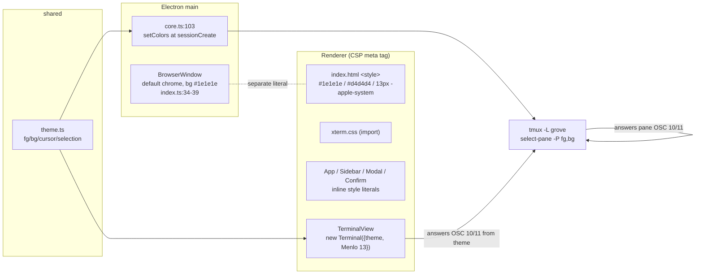

# Research: visual foundation

Citation keys: `EL:` = `node_modules/electron/electron.d.ts`; `EL-doc:` = electron
v44.5.1 docs (raw.githubusercontent.com/electron/electron/v44.5.1/docs/, fetched);
`XT:` = `node_modules/@xterm/xterm/`; `WGL:` = `node_modules/@xterm/addon-webgl/src/`;
`VITE:` = `node_modules/vite/dist/node/chunks/`; `EV:` =
`node_modules/electron-vite/dist/chunks/lib-q6ns0vZr.js`; `REF:` =
`docs/work/2026-10-05-opencode-feature-workspace/refs/xirp-reference.png`.
"Observed" means a command was run on this machine (macOS 26.4.1) on 2026-10-05.

## Summary

- The renderer has no stylesheet, no CSS classes, no CSS variables. Styling is one `<style>` rule in `index.html`, inline `style={{}}` objects, one file-local constant, and xterm options. Modal backdrop/panel literals are duplicated across two files.
- `src/shared/theme.ts` is the only shared colour module. It has four terminal colours and two consumers: xterm (at Terminal construction) and tmux `select-pane -P` (at session creation only). `#1e1e1e`/`#d4d4d4` are also repeated as separate literals in `index.html` and `BrowserWindow.backgroundColor`.
- Vite 7.3.6 handles CSS modules, `@import` inlining, PostCSS (auto-discovered config) and custom properties without configuration. Lightningcss is not installed. The build target resolves to `chrome142`; Electron 44.5.1 ships Chromium 152.
- CSP (meta tag only): `style-src 'self' 'unsafe-inline'`; no `font-src`, so fonts fall back to `default-src 'self'`. Remote fonts and `data:` fonts are blocked. Vite inlines assets < 4096 bytes as `data:`.
- The window uses default chrome (no `titleBarStyle`, vibrancy, `show:false`). Electron 44 offers `titleBarStyle: 'hidden' | 'hiddenInset'`, `trafficLightPosition`, `setWindowButtonPosition`, and `app-region: drag`.
- No appearance handling exists (`nativeTheme`, `prefers-color-scheme`, `color-scheme` absent).
- On stock macOS, SF Mono is not addressable by name from web content, and Chromium does not support `ui-monospace`. Menlo and Monaco are system fonts. xterm 6 has no web-font-load re-measure.
- The reference screenshot is @2x, dark, with a `#0a0a0b` chrome, `#121212` panels at 10px radius, a 51px top bar, a 230px sidebar of bordered session cards, and orange/amber/cyan state accents.

## Inherited from epic

- Q2 tmux (pane style answering OSC 10/11 while detached; Xirp `terminal:colors`)
- Q6 xterm.js + node-pty inside Electron (WebGL renderer, DOM fallback, keyboard defaults)
- Q9 Sandboxed artifact HTML in Electron (the CSP for artifacts is separate from the app's, ADR 0007)

From the sibling child 1's research: a detached pane's OSC 10/11 query is answered by tmux only when a pane style is set (`docs/work/2026-10-05-01-workspace-walking-skeleton/02-research.md:35,358`).

## Answers

### Q1. How styling is done in `src/renderer` today

There is no CSS file, no class name and no CSS variable in `src/renderer`. Every value:

| Where | Value |
|---|---|
| `src/renderer/index.html:11` (`html, body, #root`) | `margin:0; height:100%; background:#1e1e1e; color:#d4d4d4; font:13px -apple-system, sans-serif` |
| `src/renderer/src/App.tsx:39` error banner | `background:#5a1d1d; color:#f48771; padding:4px 8px` |
| `App.tsx:37,41,46,51` layout | flex column/row, `minHeight:0`; "Session ended" pane `gap:12` |
| `components/ConfirmDialog.tsx:26` backdrop | `position:fixed; inset:0; zIndex:1000; background:rgba(0,0,0,0.5); paddingTop:120` |
| `ConfirmDialog.tsx:27` panel | `background:#252526; padding:16; borderRadius:6; minWidth:320; gap:12` |
| `ConfirmDialog.tsx:28,30` | title `fontWeight:600`; buttons `gap:8` |
| `components/NewSessionModal.tsx:25-26` | same literals as `ConfirmDialog.tsx:26-27`, duplicated |
| `NewSessionModal.tsx:40` error | `color:#f48771` |
| `components/Sidebar.tsx:6` `const linkButton` | `background:none; border:none; color:#888; cursor:pointer; fontSize:11; padding:0` |
| `Sidebar.tsx:15-16` session row | `gap:8; padding:3px 8px; borderRadius:4; background: focused ? #37373d : transparent` |
| `Sidebar.tsx:44` status word | `color: running ? #89d185 : #888; fontSize:11` |
| `Sidebar.tsx:59-68,76` panel | `width: ui.sidebarWidth; borderRight:1px solid #333`; `padding:8`; `marginBottom:12`; `padding:4px 0`; name `fontWeight:600`; refusal `color:#f48771; fontSize:11; paddingBottom:4`; `margin:8` |
| `src/shared/types.ts:22` | `DEFAULT_UI.sidebarWidth: 260` (persisted UI state) |
| `components/TerminalView.tsx:15-17` | xterm `theme: terminalTheme`, `fontFamily:'Menlo, monospace'`, `fontSize:13` |
| `TerminalView.tsx:76` container | `padding:4; boxSizing:border-box; isolation:isolate` (comment at `:75`: keeps xterm.css z-indexed layers 5–11 under app overlays) |
| `src/shared/theme.ts:1` | `{ foreground:#d4d4d4, background:#1e1e1e, cursor:#d4d4d4, selectionBackground:#264f78 }` |
| `src/main/index.ts:37` | `backgroundColor:'#1e1e1e'` |

How values are shared:
- `theme.ts` is imported by `TerminalView.tsx:5` and `src/core/core.ts:6`. Nothing else imports it.
- `#1e1e1e` appears as separate literals at `theme.ts:1`, `index.html:11` and `src/main/index.ts:37`; `#d4d4d4` at `theme.ts:1` and `index.html:11`.
- `linkButton` (`Sidebar.tsx:6`) is the only reused style object, within one file.
- Native `<button>`, `<select>`, `<input>` and radios get no styling anywhere.
- Third-party: `@xterm/xterm/css/xterm.css` (imported at `src/renderer/src/main.tsx:1`) sets `background:#000; color:#FFF` (`XT:css/xterm.css:81-82`), `font-family: monospace` (`:156`), `font-size: 11px !important` (`:234`) and `var(--vscode-scrollbar-shadow, #000)` (`:266,274,284`).

### Q2. Stylesheets reaching the renderer and what the build handles

- Two stylesheets: the inline `<style>` (`src/renderer/index.html:10-12`) and xterm.css via a JS import (`src/renderer/src/main.tsx:1`). The production build emits `<link rel="stylesheet" href="./assets/index-*.css">` (`out/renderer/index.html:14`). In dev, Vite injects `<style data-vite-dev-id>` (`node_modules/vite/dist/client/client.mjs:1060-1067`).
- The renderer config has only aliases and `react()`, no `css` key (`electron.vite.config.ts:27-35`). There is no PostCSS config file and no lightningcss, sass or less (`package.json:21-42`).
- Vite 7.3.6 with no extra configuration:
  - PostCSS is a runtime dependency (`node_modules/vite/package.json:74`); the default transformer is `postcss` (`VITE:config.js:29559`).
  - `@import` is inlined by bundled postcss-import (`VITE:config.js:30155,30161`).
  - `*.module.css` matches `cssModuleRE` and runs postcss-modules (`VITE:config.js:29572,30288`); types come from `vite/client.d.ts:6`, referenced by `src/renderer/src/env.d.ts:1`.
  - A PostCSS config file is auto-discovered when present (`VITE:config.js:30332-30345`).
  - CSS custom properties pass through PostCSS unchanged.
  - Lightningcss is used only when `css.transformer` or `build.cssMinify` is `"lightningcss"` and is an optional peer dependency (`VITE:config.js:29566,30459`; `vite/package.json:143,174`).
- Build target: electron-vite's renderer preset sets `build.target: getElectronChromeTarget()` and `base: './'` (`EV:512-530`). Its table ends at Electron 39 → `chrome142`, which Electron 44 falls back to (`EV:190-217`). electron-vite sets `minify:false` (`EV:533`), so `cssMinify` is `false` (`VITE:config.js:33477`). Electron 44.5.1 ships Chromium 152.0.7977.130 (observed: `process.versions.chrome` from the bundled binary). There is no browserslist.

### Q3. Content-Security-Policy for styles, fonts and images

- The only CSP is the meta tag `default-src 'self'; script-src 'self'; style-src 'self' 'unsafe-inline'; img-src 'self' data:` (`src/renderer/index.html:6-9`). Nothing in `src/main` sets a CSP header; there is no `webRequest`, `protocol.*` or `registerSchemesAsPrivileged` in `src/` (ADR 0007's protocol is not implemented yet).
- Styles: `'unsafe-inline'` allows React `style={{}}`, the `<style>` block and Vite's dev injection. Remote stylesheets are blocked.
- Fonts: no `font-src`, so `default-src 'self'` applies. Remote font hosts and `data:` fonts are blocked.
- Images: same origin and `data:`.
- Loading: dev uses `loadURL(ELECTRON_RENDERER_URL)` (http://localhost); production uses `loadFile(.../renderer/index.html)`, a `file://` URL (`src/main/index.ts:45-46`).
- Bundled fonts: Vite treats `woff2?` as assets (`VITE:logger.js:174-200`). Assets under `assetsInlineLimit` 4096 bytes become `data:` URIs (`VITE:logger.js:223`; `config.js:33431`), which the CSP blocks. Larger ones are emitted to `out/renderer/assets` and referenced relative to `base './'`. The built CSS already loads from `file://` under `style-src 'self'`. Whether a `file://` font passes `'self'` the same way was not tested (see Unknowns).

### Q4. Window chrome today and Electron 44's macOS options

Today (`src/main/index.ts:34-39`): `width:1200`, `height:800`, `backgroundColor:'#1e1e1e'`, `webPreferences: { preload, contextIsolation: true }`. No `titleBarStyle`, `trafficLightPosition`, `vibrancy`, `visualEffectState`, `frame`, `transparent`, `minWidth/minHeight` or `show`, so the defaults apply: `titleBarStyle:'default'`, `frame:true`, `show:true` (`EL:3909,4019,4067`). The only window events are `focus` (`:40`) and `closed` (`:41-44`).

Electron 44 on macOS:
- `titleBarStyle: 'default' | 'hidden' | 'hiddenInset' | 'customButtonsOnHover'` (`EL:4067`). `hidden` gives full-size content with the traffic lights kept top-left; `hiddenInset` insets them further; `customButtonsOnHover` is "currently experimental" (`EL-doc:api/structures/base-window-options.md:88-98`).
- `trafficLightPosition?: Point` for frameless windows (`EL:4069-4073`), used with `titleBarStyle:'hidden'` in the docs example (`EL-doc:tutorial/custom-title-bar.md:106-115`). Runtime: `setWindowButtonPosition(Point|null)` (`EL:3620-3626`), `getWindowButtonPosition()` (`EL:2902-2908`), `setWindowButtonVisibility(boolean)` (`EL:3628-3632`).
- `titleBarOverlay` enables Window Controls Overlay APIs and CSS env variables when traffic lights are visible with a non-default `titleBarStyle` (`EL:4055-4063`; `EL-doc:tutorial/custom-title-bar.md:148-149`). On macOS only `height` applies; `color`/`symbolColor` and `setTitleBarOverlay()` are win32/linux (`EL:24145-24165,3593`).
- Drag regions: `app-region: drag` (`-webkit-app-region`, `EL:2560`) makes an area draggable, and that area ignores all pointer events; controls inside need `app-region: no-drag`, and text selection in drag areas is to be disabled (`EL-doc:tutorial/custom-window-interactions.md:7-46`). `ELECTRON_DEBUG_DRAGGABLE_REGIONS` paints the regions (`:51-52`).
- `vibrancy` values: `appearance-based | titlebar | selection | menu | popover | sidebar | header | sheet | window | hud | fullscreen-ui | tooltip | content | under-window | under-page` (`EL:4099`); `setVibrancy()` at runtime (`EL:3611`). `visualEffectState` (`followWindow` default, `active`, `inactive`) works only with `vibrancy` (`EL:4100-4106`).
- `backgroundMaterial` is win32 only (`EL:3866-3872`). `transparent` (`EL:4075-4080`) is required for an alpha `backgroundColor` (`EL-doc:base-window-options.md:68`). `roundedCorners` defaults to true (`EL:4015`).
- `ready-to-show` fires once the page has rendered while hidden (`EL:4719-4728`).

### Q5. Terminal colour theme flow

```
src/shared/theme.ts:1 terminalTheme
 ├─ TerminalView.tsx:15  new Terminal({ theme })   — per mount / sessionId change
 └─ core.ts:103 backend.setColors(tmuxName, fg, bg) — in sessionCreate only
      └─ tmux.ts:47-50  tmux select-pane -t =<name>: -P fg=…,bg=…
```

- xterm: the theme is passed once to the constructor inside `useEffect([sessionId])` (`TerminalView.tsx:10-18,73`); the view is re-keyed per focused session (`App.tsx:44`). No `term.options.theme = …` exists in `src/`. xterm supports runtime changes: `options` is get/set, object options are compared by reference (`XT:typings/xterm.d.ts:865-899`), `ThemeService` re-applies on a `theme` change (`XT:src/browser/services/ThemeService.ts:73`), and the WebGL renderer redraws on colour change (`WGL:WebglRenderer.ts:93`).
- tmux: `setColors` is called only after `backend.create` in `sessionCreate` (`src/core/core.ts:101-103`), not on attach or app start. Sessions created earlier keep their pane style. `resources/tmux.conf:1-9` sets no colours. Tests: `src/core/backend/tmux.test.ts:69-77` checks the pane style holds both colours; `src/core/sessions.test.ts:105` checks the call arguments. The tmux 3.6b man page's `select-pane` synopsis does not list `-P` (observed: `man tmux`); the spikes use `select-pane -P` and found it makes tmux answer OSC 10/11 for a detached pane (`spikes/tmux-opencode/q1-osc.sh:7`; child 1 research `:358`).
- OSC 10/11: the app registers no OSC handler (no `registerOscHandler`/`parser.` in `src/`). xterm answers OSC 10/11 itself from its theme service colours, and OSC 10/11 SET requests change them (`XT:src/common/InputHandler.ts:306,308,3058-3106`; `XT:src/browser/CoreBrowserTerminal.ts:212-225`). Inside tmux, tmux answers the pane's query itself and does not forward it (child 1 research `:85`).
- Runtime vs creation: the xterm theme can change at runtime but grove sets it only at construction. The tmux pane style is applied only at session creation. `BrowserWindow.backgroundColor` and `index.html` CSS are static at startup.
- Fonts on xterm: `fontFamily:'Menlo, monospace'`, `fontSize:13` (`TerminalView.tsx:16-17`). Not set, so defaults apply: `lineHeight 1.0`, `letterSpacing 0`, `fontWeight 'normal'`, `fontWeightBold 'bold'`, `customGlyphs true`, `rescaleOverlappingGlyphs false`, `minimumContrastRatio 1` (`XT:src/common/services/OptionsService.ts:19-49`).

### Q6. Fonts on stock macOS and in xterm.js's WebGL renderer

- `/System/Library/Fonts` (observed: `ls`): `Courier.ttc`, `Helvetica.ttc`, `HelveticaNeue.ttc`, `Menlo.ttc`, `Monaco.ttf`, `NewYork*.ttf`, `SFNS.ttf`, `SFNSItalic.ttf`, `SFNSMono.ttf`, `SFNSMonoItalic.ttf`, `SFNSRounded.ttf`, `SFCompact*`. `Supplemental/` adds `Courier New*.ttf` and `Andale Mono.ttf`; `/Library/Fonts` has only `Arial Unicode.ttf`.
- Family names (observed: `fc-list : family file`): `SFNSMono.ttf` → `.SF NS Mono`; `SFNS.ttf` → `System Font` / `.SF NS`; plus `Menlo`, `Monaco`, `Helvetica Neue`. Named `SF-Mono-*.otf` and `SFMono-Terminal.ttf` exist only inside `Terminal.app/Contents/Resources/Fonts`, not system-wide.
- Chromium's macOS font cache returns nothing for dot-prefixed families and resolves `system-ui` via `MatchSystemUIFont`, with `BlinkMacSystemFont` as the legacy name (chromium `third_party/blink/renderer/platform/fonts/mac/font_cache_mac.mm:281-283,290-291,401-410`, main branch, not the 152 tag). So `.SF NS Mono` and an uninstalled "SF Mono" don't resolve by name.
- MDN browser-compat-data (`css/properties/font-family.json`): `system-ui` since Chrome 56; `ui-monospace`, `ui-sans-serif`, `ui-serif`, `ui-rounded` are not supported in Chrome (crbug.com/40194142), only Safari 13.1+. The app uses `-apple-system` today (`index.html:11`).
- xterm cell measurement: `CharSizeService` measures 'W' on an OffscreenCanvas (`width`, `fontBoundingBoxAscent+Descent`), falling back to a DOM span (`XT:src/browser/services/CharSizeService.ts:29-33,75-126`). It re-measures on `fontFamily`/`fontSize` change (`:34`), `open()` (`XT:src/browser/CoreBrowserTerminal.ts:570`), resize (`:1222-1234`) and when a terminal hidden at open becomes visible (`XT:src/browser/services/RenderService.ts:136-138`). xterm and the WebGL addon contain no `document.fonts`/`FontFace` handling, so a web font that loads after `open()` triggers no re-measure by itself.
- WebGL: char width `floor(charWidth*dpr)`, height `ceil(charHeight*dpr)`, cell height `floor(charHeight*lineHeight)`, cell width + `round(letterSpacing)` (`WGL:WebglRenderer.ts:566-587`). Glyphs are drawn with Canvas 2D `ctx.font = "<style> <weight> <size*dpr>px <fontFamily>"`, so fallback inside the family list is the canvas's (`WGL:TextureAtlas.ts:500-503`). `customGlyphs` draws box/block characters itself (`:517`). Font, size, weight, `lineHeight`, `letterSpacing`, `minimumContrastRatio` and `rescaleOverlappingGlyphs` can change at runtime (`XT:RenderService.ts:93-108`; `WGL:WebglRenderer.ts:243-247`).
- Ligatures: the WebGL renderer draws joined ranges from `registerCharacterJoiner` (experimental, WebGL-only) (`WGL:WebglRenderer.ts:437-460`; `XT:typings/xterm.d.ts:1115-1140`), and attaches the atlas canvas to the DOM to inherit `font-feature-settings` (`WGL:TextureAtlas.ts:439-445`). No ligatures addon is installed. `@xterm/addon-ligatures` 0.10.0's README says it needs Node.js APIs to read the font file and lists the canvas renderer as a requirement (unpkg README:3,8,32-38).

### Q7. The reference screenshot, measured

Method: PNG decoded to raw RGBA with a zlib script; run-length and ink-bounding-box scans. ±1 device px for edges, ±0.5–1 CSS px for type sizes (from cap height ≈0.7 em or monospace advance ≈0.6 em). `REF:` is 3366×2068 px at 144 dpi (@2x), tagged Display P3; CSS px = device ÷ 2. Greys match in P3 and sRGB; chromatic colours are given as sRGB. The window is ≈1657 CSS wide; its bottom is cut off.

**Layout regions (CSS px).**

| Region | Size | Fill |
|---|---|---|
| Window chrome, top bar, gutters | top bar ≈51 tall; gutters 6 left / 7 right; 8 gap between panels | `#0a0a0b` |
| Sidebar panel | 230 wide | `#121212` |
| Content panel | ≈1406 wide; header 47 tall, then 1px `#303035` divider | header `#121212` |
| Terminal area | rest of content panel | `#1e1e2e` |

Panels have ≈10px corner radius. The sidebar footer has a 1px `#212123` divider and four `#b3b3b3` icons. Sidebar scrollbar thumb: 6 wide, `#38383c`.

**Top bar.** Traffic lights (13px circles, 9px gaps) sit inside the dark bar at left. Then logo + "Xirp" wordmark (white) and a "Beta" badge (≈35×20, fill `#16161a`, text `#b3b3b3`). Centred search pill "Search Xirp" ≈345×32, radius = half height, fill `#232324`, placeholder `#b3b3b3` at ≈14px. A ≈30px circular "+" button (`#232324`). Right: four line icons in `#b3b3b3` (≈15–16px), a blue unread dot `#1278f2`, an avatar circle 32px `#f66032`.

**Sidebar.**
- Tabs: "Sessions" white, ≈15px semibold, with a count badge "19" (≈20×16, fill `#ffa42c`, black text); "Projects" `#b3b3b3` regular. Active underline 2px `#f66032`. Text inset ≈12px.
- Project group header: folder icon, name `#b3b3b3` ≈13px regular, "+" at right; no card behind it.
- Session cards: ≈208 wide, 8px inset, 1px border `#292929`, fill `#1f1f1f`, radius ≈5, gap 6–7. Heights 32 (title only), ≈53 (title + status), 72 (title + branch + status). Icon starts ≈9.5px in.
- Card content: title white bold ≈12.5–13px, clipped without ellipsis. OpenCode icon `#fbc024`; terminal `>_` icon `#fb923c`. Branch line: icon + monospace ≈11px `#b3b3b3`. Status line monospace ≈10px: `idle` `#5e5e66`, `waiting` `#fbc024` + info icon, `finished` `#24d3ef`.
- Card states: selected fill `#342519`, border `#fb923c`; waiting fill `#1d1b15`, border `#604c1d` with a ≈5px outer glow; finished fill `#141c1d`, border `#1f545c` with a teal glow. No hover state is visible.

**Content header.** Breadcrumb "grove / Implement workspace walking skeleton": "grove /" `#b3b3b3` regular, title white bold ≈14px, left padding ≈16px; a chevron and a spinner `#549df5`. Right: "claude ⌄" agent picker `#b3b3b3`, a kebab menu, a panel icon (16px); icons use a 1.5px stroke.

**Terminal area** (TUI output, not app chrome): monospace ≈13.3px (8px advance), line height 18px. Text `#cdd6f4`, paths `#afd7ff`, muted `#949494`, green bullet `#87d787`, yellow `#ffd800`, 1px `#808080` dividers. `#1e1e2e`/`#cdd6f4` equal Catppuccin Mocha base/text; `#fb923c`, ≈`#fbbf24` and ≈`#22d3ee` are within ±2 of Tailwind orange-400, amber-400, cyan-400.

Per the epic structure, the search bar belongs to child 7, the Projects tab and tree to child 2, and status text such as `waiting` to child 3 (`docs/work/2026-10-05-opencode-feature-workspace/04-structure.md:80-81`).

### Q8. UI surfaces named by the epic and later children

Epic paths: `D:` = `docs/work/2026-10-05-opencode-feature-workspace/03-design.md`, `S:` = `.../04-structure.md`; `cN:` = `docs/work/2026-10-05-0N-*/feature.md`.

| Surface | Source | Elements stated |
|---|---|---|
| Project nodes + add action | `D:21-22`; `S:49` | nodes, add control |
| ＋ / Cmd+T Spotlight-style new-session modal | `D:23-25`; `S:50,85-86` | project picker, OpenCode/Terminal choice |
| Sidebar tree (project → epic → feature → sessions, unlinked sessions) | `D:26-29`; `S:95-97`; `c2:19` | nodes with stage and card state |
| Status dots (working/waiting/idle/gone; running/gone) | `D:27-28,113-114`; `c3:19`; `c2:23` | dots, roll-up to features |
| Header waiting count | `D:28`; `c3:19` | count in header |
| Manual link control | `D:31`; `c2:19` | control not specified |
| Board view (List/Board toggle, by stage) | `D:33,188,211`; `c2:19` | toggle, stage groups, card states backlog/running/waiting/needs-review/ready/done (`D:88-91`) |
| Feature page | `D:34-35`; `c2:19`; `c5:19` | stage timeline, next-action buttons, artifact list |
| Stage timeline | `D:34,85-86`; `c2:19` | stage sequence, "unapproved" markers |
| Next-action buttons (Start {stage}/Revise/Approve) + Revise text input | `D:34-35,76-79`; `c5:19` | buttons, text prompt |
| Artifact list / switcher, viewer (iframe or rendered markdown) | `D:35-37,149-150`; `c4:19` | file list; viewer chrome not specified |
| Inline comments, orphans, review tray (drafts + Send), side-panel fallback | `D:37-39,145-146,151,215-216`; `c6:19,31` | selection-triggered entry, drafts list, Send button, side panel |
| Error banners (invalid workflow, OpenCode unreachable) | `D:92,194`; `c2:19`; `c3:19` | banner |
| Resume action on a `gone` session | `c3:19` | control |
| Command palette (Cmd+K) | `D:212`; `c7:19`; `S:80` | palette with result list |
| Grid view (tiled xterms, Cmd+1..9, persisted layout) | `D:212`; `c7:19` | tiles, session chooser |
| Native notification on waiting | `D:28-29,187`; `c3:19` | OS notification, not in-app |
| Child 9's own list | `S:72-77` | sidebar and rows, ＋ modal, confirm dialog, error banner, empty and "Session ended" panes, terminal frame; Button, Modal, ListRow, Badge, Banner, app shell with header |

Child 8 (`c8:19`) names no UI surface. Tabs, chips and cards on the feature page are not named in any of these docs. Dependency lists differ: `c2:27` says "1" while `S:106` says "1, 9"; `c8:27` says "1–7" while `S:208` says "1–7 and 9".

Walking-skeleton screens in code: `App.tsx` (error strips `:38-40`; Sidebar plus TerminalView, "Session ended" pane with Remove, or empty pane `:41-53`; modal and confirm `:54-66`); `Sidebar.tsx` (project blocks with bold name and "Remove project" `:63-66`, refusal text `:67-69`, session rows with rename, Remove and status word `:12-45`, "Add project" `:76`); `NewSessionModal.tsx` (project `<select>`, OpenCode/Terminal radios, error, Create `:28-41`); `ConfirmDialog.tsx` (title, body, Cancel/confirm, Enter/Escape `:12-33`); `TerminalView.tsx` (xterm, WebGL with DOM fallback, fit `:12-29`).

### Q9. macOS appearance and the first paint

- No appearance handling: `nativeTheme`, `prefers-color-scheme` and `color-scheme` do not occur in `src/`. Every colour is a fixed dark literal (Q1).
- Before the renderer paints, the window shows `backgroundColor:'#1e1e1e'` (`src/main/index.ts:37`). It is shown immediately: no `show:false`, no `ready-to-show` handler (`:34-39`). The page then paints `html, body, #root` as `#1e1e1e` (`index.html:11`).

## Current architecture



## Existing patterns to reuse

- `src/shared/theme.ts` is already imported by both renderer and core (`TerminalView.tsx:5`, `core.ts:6`), via the `@shared` alias (`vitest.config.ts:5-9`).
- `isolation: isolate` on the terminal container keeps xterm's z-indexed layers under overlays (`TerminalView.tsx:75-76`).
- Persisted UI dimensions live in `DEFAULT_UI` in `src/shared/types.ts:22` (`sidebarWidth`).
- WebGL addon with DOM fallback and `onContextLoss` dispose (`TerminalView.tsx:21-28`).

## Constraints & invariants

- CSP: `style-src 'self' 'unsafe-inline'`; fonts from `'self'` only; no `data:` fonts (`index.html:8`). Vite inlines assets < 4096 bytes as `data:` (`VITE:logger.js:223`).
- Production renderer loads from `file://` (`src/main/index.ts:46`).
- Chromium 152 runtime; build target `chrome142` (`EV:190-217`).
- `app-region: drag` areas swallow pointer events (`EL-doc:custom-window-interactions.md:7-13`).
- `trafficLightPosition` applies to frameless/hidden-title-bar windows (`EL:4069-4073`).
- tmux pane style is set once per session at creation (`core.ts:103`); sessions survive app restarts (ADR 0003), so existing sessions keep the style they were created with.
- xterm does not re-measure on web-font load (Q6).
- The epic structure scopes this child to the renderer: IPC, state and core are untouched (`docs/work/2026-10-05-opencode-feature-workspace/04-structure.md:84`).

## Test landscape

- Vitest, `environment: "node"`, `include: ["src/**/*.test.ts"]` (`vitest.config.ts:12-13`): `.tsx` tests are not collected; no jsdom/happy-dom in `package.json`.
- All tests are in `src/core` (env, sessions, projects, opencodeId, backend/tmux, store/stateStore, store/jsonFile). No renderer tests exist; `src/renderer/src/sidebarOrder.ts` is untested.
- Colour-related tests: `src/core/backend/tmux.test.ts:69-77` (pane style holds fg/bg), `src/core/sessions.test.ts:105` (`setColors` arguments).
- Commands: `npm test`, `npm run typecheck`, `npm run build` (`grove.config.json`).

## Relevant ADRs

- 0003 tmux dedicated socket: the app handles OSC 10/11 through tmux; pane style per session.
- 0004 core in Electron main: core imports nothing from Electron.
- 0007 artifact protocol with header CSP: the app CSP stays strict and independent of artifacts.
- 0011 slice snapshots to renderer: state shape reaching the renderer.

## Unknowns

- Whether a Vite-emitted font file loaded from `file://` passes `font-src` fallback `'self'` in a production build. Resolve by building with a bundled `.woff2` > 4 KB and checking the DevTools console.
- Which font Chromium 152 resolves for `-apple-system` and `system-ui` on macOS 26. Resolve by rendering a test page in the app and reading the used font in DevTools.
- Live tmux behaviour of `select-pane -P` on 3.6b given the man page omits it; the subagent could not open a tmux socket in the sandbox. `tmux.test.ts:69-77` and the child 1 spikes exercised it. Resolve by running `spikes/tmux-opencode/q1-osc.sh` outside the sandbox.
- The reference screenshot shows no hover state and not the window bottom. Resolve with further screenshots.

## Open questions
