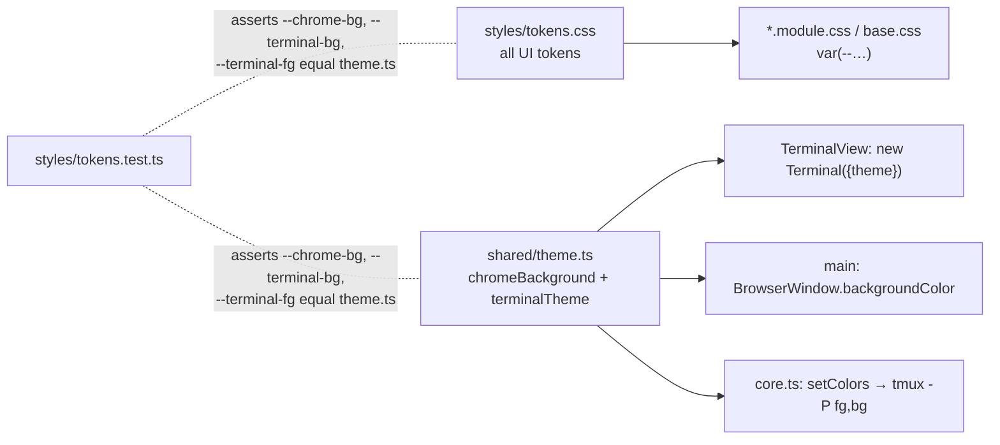

# Design: visual foundation

## Inherited decisions

None. The epic's structure gives this child no `E-D` ids (renderer only).
It touches `src/main/index.ts` window options and the values in
`src/shared/theme.ts` (read by core for tmux); no IPC, state shape or core
logic changes.

## Desired state

1. One dark theme, a near-copy of Xirp: `#0a0a0b` chrome, `#121212` panels
   (10px radius) with 6–8px gutters, amber/orange accent, Catppuccin Mocha
   terminal (`#1e1e2e`/`#cdd6f4`, full ANSI 16).
2. Custom draggable top bar (~51px): traffic lights inset, then (~24px gap)
   a logo mark + "grove" wordmark, centred search pill (inert until child 7),
   round ＋ opening the modal.
3. Sidebar panel (230px): "Sessions" header with count Badge and a ＋ icon
   that adds a project; project groups as one-line collapsible folder headers
   (icon, name, ＋, remove); sessions as bordered cards (kind icon, title, mono
   status line), each compactable to one line; selected card orange.
4. Content panel: header with "project / session label" breadcrumb; the
   terminal fills the panel below it, no inset frame, clipped by the panel's
   rounded bottom corners; styled empty and "Session ended" panes.
5. The ＋ modal (Spotlight-style) and confirm dialog share one Modal; the
   error banner uses Banner.
6. Tokens in one place feed CSS, xterm theme, tmux pane colours and the
   window background, so first paint matches (no flash).
7. Base components: Button, Modal, ListRow (card), Badge, Banner, Icon,
   StatusDot, AppShell (TopBar, SidebarPanel, ContentPanel + header). Status
   tokens for working / waiting / idle / finished / gone / running exist now.
8. No visual inline styles in `src/renderer`; a test enforces it (runtime
   values pass as CSS variables only).

## Non-goals

- Light theme or following macOS appearance.
- Search behaviour (child 7), Projects tab and tree data (child 2), status
  derivation and waiting count (child 3).
- Persisting compact/collapsed state (child 2, epic two-way row Per-viewer UI state).
- Bundled fonts, a component library, an icon dependency.
- Restyling already-running tmux sessions (their pane style is fixed at creation).

## System design

### Styling mechanism (D1)

- `src/renderer/src/styles/tokens.css`: custom properties on `:root`.
- `src/renderer/src/styles/base.css`: reset, body font, scrollbars,
  `app-region` helpers. Imported once in `main.tsx` after `xterm.css`.
- Each component: `Name.tsx` + `Name.module.css`; variants are classes
  (`className={s.primary}`); conditional classes joined with a local
  `cx(...)` helper (no dependency).

### Token ownership (D2)



- `theme.ts` owns only what JS needs: `chromeBackground` and `terminalTheme`
  (Catppuccin Mocha: fg `#cdd6f4`, bg `#1e1e2e`, cursor `#f5e0dc`,
  selection `#585b70`, ANSI 16 from the Mocha palette). No other colour
  literal outside these two files.

### Tokens (`tokens.css`, from research Q7)

| Group | Tokens |
|---|---|
| Surfaces | `--chrome-bg #0a0a0b`, `--panel-bg #121212`, `--card-bg #1f1f1f`, `--raised-bg #232324` (pill, round buttons), `--muted-badge-bg #16161a`, `--terminal-bg #1e1e2e`, `--terminal-fg #cdd6f4` |
| Borders | `--card-border #292929`, `--divider #212123`, `--header-divider #303035` |
| Text | `--text #ffffff`, `--text-2 #b3b3b3`, `--text-3 #5e5e66` |
| Accent | `--accent #fb923c`, `--accent-strong #f66032` (underline, focus ring), `--accent-badge #ffa42c` |
| Status | `--status-running`/`--status-working #fb923c`, `--status-waiting #fbc024`, `--status-finished #24d3ef`, `--status-idle`/`--status-gone #5e5e66` |
| Card tones | selected `#342519`/`#fb923c`; waiting `#1d1b15`/`#604c1d` + 5px glow; finished `#141c1d`/`#1f545c` + glow |
| Danger | `--danger #f87171`, `--danger-bg #2a1517`, `--danger-border #5c2427` |
| Type | `--font-ui: -apple-system, system-ui, sans-serif`; `--font-mono: Menlo, monospace`; sizes `--fs-xs 10px`, `--fs-sm 11px`, `--fs-md 13px`, `--fs-lg 14px`, `--fs-xl 15px`; weights 400/600/700 |
| Space | `--sp-1 4px` … `--sp-6 24px` (4px scale), `--gutter 8px` |
| Radius | `--r-card 5px`, `--r-md 8px`, `--r-panel 10px`, `--r-pill 999px` |
| Sizes | `--topbar-h 51px`, `--header-h 47px`, `--traffic-inset 100px`; `--sidebar-w` set at runtime from `ui.sidebarWidth` |

## Program design

### Call-path diff

- Window: `new BrowserWindow({ titleBarStyle:'hidden', trafficLightPosition:{x:18,y:18},
  backgroundColor: chromeBackground, show:false })` → `once('ready-to-show', show)`.
- Render: `main.tsx` imports `xterm.css`, `tokens.css`, `base.css` → `App` →
  `AppShell({ topBar:<TopBar onNew/>, banners, sidebar:<Sidebar onNew/>, content })`.
- ＋ (top bar, project row, Cmd+T) → `openNew(projectId?)` → `NewSessionModal({ initialProjectId })`.
- Modal keys: `Modal` registers capture-phase `keydown`; Escape → `onClose`,
  Enter → `onConfirm` when given (ConfirmDialog, NewSessionModal Create).
- Terminal: `new Terminal({ theme: terminalTheme, fontFamily:'Menlo, monospace',
  fontSize:13, lineHeight:1.35 })` filling the ContentPanel below the header
  (4px inner padding, `--terminal-bg`; the panel's `overflow:hidden` + radius rounds it).

### File tree

```
src/main/index.ts                                MODIFIED  window chrome (t1)
src/shared/theme.ts                              MODIFIED  chromeBackground, Mocha terminalTheme
src/shared/types.ts                              MODIFIED  DEFAULT_UI.sidebarWidth 230
src/core/sessions.test.ts                        MODIFIED  expect terminalTheme values, not literals
src/renderer/index.html                          MODIFIED  drop <style>; <meta name="color-scheme" content="dark">
src/renderer/src/main.tsx                        MODIFIED  import tokens.css, base.css
src/renderer/src/styles/tokens.css               NEW
src/renderer/src/styles/base.css                 NEW
src/renderer/src/styles/tokens.test.ts           NEW       D2 parity test
src/renderer/src/noInlineStyles.test.ts          NEW       t10
src/renderer/src/components/ui/cx.ts             NEW
src/renderer/src/components/ui/{Button,Modal,ListRow,Badge,Banner,StatusDot}.tsx + .module.css  NEW
src/renderer/src/components/ui/Icon.tsx          NEW       Lucide paths (t3)
src/renderer/src/components/shell/{AppShell,TopBar,ContentHeader}.tsx + .module.css            NEW
src/renderer/src/App.tsx (+ App.module.css)      MODIFIED  AppShell, Ended/Empty panes
src/renderer/src/components/Sidebar.tsx (+ .module.css)         MODIFIED  folders + cards
src/renderer/src/components/NewSessionModal.tsx (+ .module.css) MODIFIED  on Modal, preselect
src/renderer/src/components/ConfirmDialog.tsx    MODIFIED  on Modal
src/renderer/src/components/TerminalView.tsx (+ .module.css)    MODIFIED  frame, lineHeight
```

### Key types and signatures

```ts
type StatusTone = 'running' | 'working' | 'waiting' | 'idle' | 'finished' | 'gone'
type IconName = 'plus' | 'folder' | 'folder-plus' | 'chevron-down' | 'chevron-right'
  | 'terminal' | 'opencode' | 'branch' | 'search' | 'info' | 'trash' | 'minimize' | 'x' | 'logo'
function cx(...c: (string | false | null | undefined)[]): string
function Button(p: ButtonHTMLAttributes<HTMLButtonElement> & {
  variant?: 'primary' | 'secondary' | 'ghost' | 'danger'; size?: 'sm' | 'md'
  icon?: IconName; round?: boolean }): JSX.Element
function Modal(p: { onClose(): void; onConfirm?(): void; width?: 'sm' | 'md'
  children: ReactNode }): JSX.Element          // fixed backdrop, panel at 120px top
function ListRow(p: { title: string; icon?: ReactNode; meta?: ReactNode
  status?: { label: string; tone: StatusTone }
  tone?: 'default' | 'selected' | 'waiting' | 'finished'; compact?: boolean
  actions?: ReactNode; onClick?(): void; onTitleDoubleClick?(): void
  editor?: ReactNode }): JSX.Element            // editor replaces title while renaming
function Badge(p: { tone?: 'accent' | 'muted'; children: ReactNode }): JSX.Element
function Banner(p: { tone?: 'error' | 'info'; children: ReactNode }): JSX.Element
function StatusDot(p: { tone: StatusTone }): JSX.Element
function Icon(p: { name: IconName; size?: number; className?: string }): JSX.Element
function AppShell(p: { topBar: ReactNode; banners?: ReactNode; sidebar: ReactNode
  content: ReactNode; sidebarWidth: number }): JSX.Element  // sets --sidebar-w
function TopBar(p: { onNew(): void }): JSX.Element
function ContentHeader(p: { crumbs: string[]; right?: ReactNode }): JSX.Element
function NewSessionModal(p: { onClose(): void; initialProjectId?: string }): JSX.Element
```

- Session card mapping (this child): kind icon `opencode` (`--status-waiting`
  colour) or `terminal` (`--accent`); status line = `lastStatus` in mono with
  tone `running`/`gone`; `tone='selected'` when focused. Waiting/finished
  tones are used from child 3.
- Test boundary: Vitest stays `node`; the two new tests read files with `fs`.
  Components are checked by `npm run typecheck`, `npm run build` and manual
  UI steps (no DOM test environment added).

## One-way decisions

- **D1 Styling mechanism.** CSS Modules per component + global
  `tokens.css`/`base.css` custom properties. Rejected: one global stylesheet
  with naming conventions (global namespace, merge conflicts across
  children); Tailwind v4 (new dependency and vocabulary for ~10
  components). [ADR 0012](../../adr/0012-css-modules-with-token-custom-properties.md)
- **D2 Token ownership.** `tokens.css` owns UI tokens; `shared/theme.ts` owns
  `chromeBackground` + `terminalTheme` for xterm, main and core; the ~3
  overlapping values are repeated in `tokens.css` and kept equal by
  `tokens.test.ts`. Rejected: TS single source injected onto `:root` at
  startup (tokens invisible in CSS, runtime step before first paint); TS
  source + Vite plugin generating CSS (custom build code for 3 values).
  [ADR 0012](../../adr/0012-css-modules-with-token-custom-properties.md)

## Two-way decisions

| # | Decision | Basis |
|---|---|---|
| t1 | `titleBarStyle:'hidden'`, `trafficLightPosition {x:18,y:18}`, `show:false` + `ready-to-show`, `backgroundColor` from tokens | research Q4, Q9 |
| t2 | UI font `-apple-system, system-ui`; mono `Menlo, monospace`; nothing bundled | research Q3, Q6 |
| t3 | ~10 Lucide (ISC) SVG paths copied into `Icon.tsx`, 1.5px stroke | research Q7; no new dependency |
| t4 | Own Modal (backdrop, panel, capture-phase Escape/Enter as today) | research Q1 |
| t5 | Compact/collapsed state in React state; child 2 persists in `ui` | epic two-way row Per-viewer UI state |
| t6 | Search pill rendered, inert, `aria-disabled` | questions answer 5 |
| t7 | running/working orange `#fb923c`, waiting amber `#fbc024`, finished cyan `#24d3ef`, idle/gone grey `#5e5e66` | research Q7 |
| t8 | Project ＋ opens the modal preselected; remove project = hover icon; rename stays double-click; add project = `folder-plus` icon in the sidebar header (no footer button) | research Q7; human review of slice 1 |
| t9 | `DEFAULT_UI.sidebarWidth` 260 → 230; saved widths still honoured | research Q7 |
| t10 | Vitest text scan of `src/renderer/**/*.tsx` fails on any `style=` other than an object literal with only `--` keys | ticket outcome |
| t11 | xterm `fontSize 13`, `lineHeight 1.35`; terminal full-bleed under the header, 4px padding, panel radius clips it | research Q7; human review of slice 1 |

## Risks

- **tmux sessions created before this change** keep the old pane style
  (`#1e1e1e`), so OSC 11 answers the old background inside the new frame.
  Accepted: new sessions match; old ones look off until recreated.
- **Drag region swallowing clicks:** search pill, ＋ and any top-bar control
  need `app-region: no-drag`; check with `ELECTRON_DEBUG_DRAGGABLE_REGIONS`.
- **Traffic-light alignment** in a 51px bar is tuned by eye (`{x:18,y:18}`);
  the wordmark starts at `--traffic-inset` 100px, ~24px after the lights.

## Open questions
