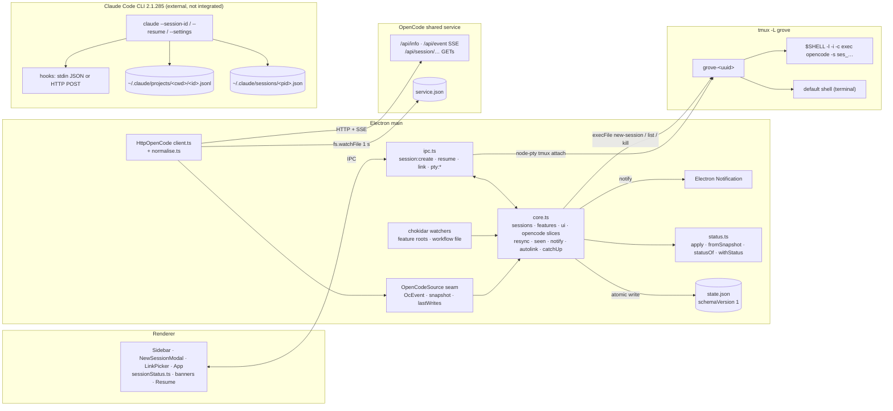

# Research: Claude Code sessions

v3: Q1–Q6 and Q10 re-checked at 3642102, after child 3 (session status, linking, resume) finished; Q7–Q9 unchanged.

Citation keys: plain `path:line` is this repo at `3642102`. Doc citations are `code.claude.com/docs/en/<page>` § section (pages `cli-reference`, `settings`, `hooks`, `sessions`, `claude-directory`, `statusline`, `monitoring-usage`). `help` is `claude --help` of the installed 2.1.285. **Observed** marks read-only inspection of local files (`~/.claude/projects/-Users-victor-git-grove/*.jsonl`, about 13k records, all written by 2.1.285 except 28 by 2.1.274; `~/.claude/sessions/*.json`), limited to field names, types and enum values. "Child 3" is the sibling feature `2026-10-05-03-session-status-linking`; its `03-design.md`, `04-structure.md` and `06-implementation.md` are `status: approved` and slices 3-6 are in the code (commits 2fe5d2e, 1eb1369, 0b84915, d2e895d).

## Summary

- `SessionKind` is `'opencode' | 'terminal'`. Core branches on `kind === 'opencode'` for seen mark, notifications, re-sync and resume, and on `opencodeSessionId` for launch argv, live status and auto-link. The renderer branches on `kind` for the ＋ modal, icon, tone, Resume buttons and the unreachable banner.
- OpenCode sessions launch, and resume, as `$SHELL -l -i -c 'exec opencode -s ses_…'` in tmux `grove-<uuid>` on `-L grove`, cwd = project root.
- `state.json` is `schemaVersion: 1`; other versions are moved aside as `.bad-<ms>`. No versioned migrations; `seenAt` was added by a load-time fill-in. `opencodeSessionId` is the OpenCode-specific persisted field.
- Status: `HttpOpenCode` (SSE + snapshot/message GETs) → `normalise` → `OcEvent` → `OpenCodeSource` seam (`start`/`snapshot`/`lastWrites`/`stop`) → pure `status.ts`. Re-sync on connect, seen mark, notifications, auto-link and catch-up are built; core takes one optional source.
- Main opens no local listener. Inbound: one outbound HTTP/SSE client, chokidar watchers, `fs.watchFile` and 5 s polls, tmux child processes, renderer IPC, window focus and `Notification` events.
- `claude` 2.1.285 accepts `--session-id <uuid>`, `--resume <id|name|path>`, a positional initial prompt, `--name`, and `--settings <file-or-json>` merged above project/user settings for one session.
- Claude Code hooks (command stdin JSON or HTTP POST) cover prompt submit, tool use with absolute `file_path`, permission request, notifications and stop; Stop does not fire on user interrupt. Transcripts are JSONL at `~/.claude/projects/<cwd with non-alphanumerics → '-'>/<session-id>.jsonl`, format documented as internal.

## Inherited from epic

From `2026-10-05-opencode-feature-workspace/02-research.md` (v5):
- `### Q1. herdr`: `pane.report_agent_session` with `resume_argv`, e.g. `claude --resume <id>`.
- `### Q2. tmux (3.6b, /opt/homebrew/bin/tmux)`: sessions, attach, hooks, `remain-on-exit`.
- `### Q3. OpenCode CLI surface (v2.0.20, Homebrew)` and `### Q4. OpenCode state`: the OpenCode side of today's status source.
- `### Q5. The previous grove app (f5a1c17)`: an agent TUI in tmux attached via node-pty; status from screen text.
- `### Q8. Xirp (0.45.0, edition external)`: Claude hook scripts POSTing to a loopback HTTP daemon; `preToolUse` → running, `stop` → idle/finished, `permissionRequest`/`notification` → waiting.

## Answers

### Q1. Where session kind is named or branched on

- **Type and IPC:** `SessionKind = 'opencode' | 'terminal'` (src/shared/types.ts:2), `Session.kind` (types.ts:6). `session:create` `{ projectId, kind, cols, rows }` (src/shared/ipc.ts:12; src/main/ipc.ts:39) → `Commands.sessionCreate` (src/core/core.ts:42, 423). `session:resume` `[{ id }, Session]` (ipc.ts:15; src/main/ipc.ts:42), command comment "gone OpenCode sessions only" (core.ts:45). `opencode` slice pushed as `state:opencode` (types.ts:69-70, 75; ipc.ts:34).
- **Core, on `kind === 'opencode'`:**
  - `KIND_NAMES` "OpenCode"/"Terminal"; `makeLabel` → `"<Name> · HH:MM"` (src/core/sessions.ts:4, 7-8).
  - `newSession` mints `opencodeSessionId` only for opencode, else `null` (sessions.ts:19).
  - `refreshStatus` sets `seenAt` only for an on-screen opencode session (core.ts:296).
  - `notifyTransitions` skips non-opencode sessions; its `notify` event drives macOS Notifications (core.ts:311; src/main/index.ts:40-61).
  - `resync` snapshots only running opencode sessions with an id (core.ts:369).
  - `sessionResume` refuses `not-opencode` otherwise (core.ts:457).
- **Core, on `opencodeSessionId`:** launch argv (core.ts:427); `withStatus` live status (src/core/status.ts:66); auto-link `linkWrite`, `catchUp`, `wrote` handling (core.ts:218-231, 245-261, 348-353).
- **Core OpenCode-only plumbing:** `opencode?: OpenCodeSource` (core.ts:31); trackers, roots, `ocConnected`, `syncGen`, `queue`, `waitKey`, `primed`, `held`, `wroteSince` (core.ts:86-97); `onOcEvent` (core.ts:333-359), `resync` (core.ts:362-392), `armUnreachable` (core.ts:323-326); start/stop (core.ts:529-532, 572); main wiring `HttpOpenCode`, `serviceFilePath` (src/main/index.ts:8, 32). All of `src/core/opencode/*` (client.ts, normalise.ts, types.ts) and `src/core/opencodeId.ts`. Card `waiting`/`running` only from linked sessions' `status`, "terminals don't keep a card running" (src/core/workflow/derive.ts:66).
- **Renderer:**
  - ＋ modal: hardcoded `[opencode 'OpenCode' icon opencode, terminal 'Terminal' icon terminal]`, default `'opencode'`, `session:create` 120×40 (src/renderer/src/components/NewSessionModal.tsx:9-12, 17, 21).
  - Sidebar: `opencode = s.kind === 'opencode'` (Sidebar.tsx:35) picks icon and CSS class (:40) and tone, non-OpenCode `'muted'` unless focused (:58); Resume button only on gone opencode cards (:87-90).
  - "Session ended" view: Resume only when `focused.kind === 'opencode'`, next to Remove (src/renderer/src/App.tsx:86-93).
  - Icon glyphs `'opencode'` and `'resume'` (src/renderer/src/components/ui/Icon.tsx:5-6, 18, 26).
  - Status display gone > `s.status` > running, no kind check (src/renderer/src/sessionStatus.ts:7-10). `serviceBanners`: "unreachable" only if a running session is opencode; "untested version" when version ≠ `'2.0.20'` (sessionStatus.ts:36-47; App.tsx:71).

### Q2. Id, launch and resume command lines, cwd and tmux name

- Grove id `randomUUID()` (src/core/core.ts:426); tmux name `'grove-' + id` (src/core/sessions.ts:18); socket `-L grove` (src/main/index.ts:28; src/core/backend/tmux.ts:27); targets `=name` (tmux.ts:75, 85), panes `=name:` (tmux.ts:49).
- OpenCode id `mintSessionId(now.getTime())` (sessions.ts:19; src/core/opencodeId.ts:7-14): `'ses_'` + 12 hex of `~(now*0x1000+1)` (descending time prefix) + 14 random base62 chars; port of `spikes/opencode/gen-session-id.js` (opencodeId.ts:3-4).
- Launch: `loginShellArgv(['opencode','-s',id])` (core.ts:427) → `[$SHELL ?? '/bin/zsh', '-l', '-i', '-c', 'exec ' + quoted]` (src/core/env.ts:34-36, 39-41), appended after `--` in `tmux -f <conf> new-session -d -s <name> -c <cwd> -x cols -y rows` (tmux.ts:39-45); then `setColors(name, fg, bg)` (core.ts:429).
- Terminals: argv `undefined` → tmux default shell (core.ts:427); `resources/tmux.conf` sets no `default-command`/`default-shell` and sets `remain-on-exit failed`.
- cwd: always `project.path`, on create (core.ts:428) and resume (core.ts:461).
- Env: `minimalEnv` strips `TMUX`/`TMUX_PANE`, appends `/opt/homebrew/bin` and `/usr/local/bin` to PATH, defaults `LANG` (env.ts:5, 9-18), for the tmux server (index.ts:30); attach pty adds `TERM=xterm-256color`, `COLORTERM=truecolor` (tmux.ts:90). ADR 0003:24 says the session env sets `COLORTERM=truecolor`; code sets it only on the attach client.
- Resume (core.ts:452-467): requires session and project (`not-found`), opencode with id (`not-opencode`), `lastStatus === 'gone'` (`not-gone`). Then `backend.kill(tmuxName)` clears a leftover dead pane; a tmux session with the **same name**, cwd `project.path`, fixed 80×24 ("attaching resizes it"), and the **same** `loginShellArgv(['opencode','-s',opencodeSessionId])`; `setColors`; `resume()` sets `lastStatus: 'running', endedAt: null` (sessions.ts:66-68); `resync()` if connected, then `refreshStatus()`. Id, label, feature and `linkPinned` are kept (src/core/sessions.test.ts:451-466).

### Q3. What `state.json` persists; versions and migrations

- `StateFile = { schemaVersion: 1; sessions; ui }` (src/shared/types.ts:72) at `<userData>/state.json` (src/main/index.ts:24). Saved on every `set('sessions'|'ui')` after stripping live-only `branch`, `status`, `waitingFor` (src/core/core.ts:109-112; types.ts:18-20).
- Persisted `Session` fields (types.ts:4-17): `id`, `projectId`, `kind`, `label`, `labelPinned`, `tmuxName`, `opencodeSessionId`, `feature`, `linkPinned`, `action` ("always null"), `startedAt`, `endedAt`, `lastStatus` (`'running' | 'gone'`), `seenAt` (ISO or null, "persisted").
- OpenCode-specific: `opencodeSessionId` (types.ts:10, "set for kind 'opencode'") and kind `'opencode'`. `seenAt` is generic in type but only set for OpenCode sessions (core.ts:296-300). Live `status`/`waitingFor` and the `opencode` slice ("not persisted", types.ts:69) are not saved.
- Versions: `readVersioned(file, 1, empty, onBad)` accepts only `schemaVersion === 1`; unknown version or invalid JSON → renamed `<file>.bad-<ms>`, `onBad`, empty state (src/core/store/jsonFile.ts:11-36, 27, 32-35); core collects errors (core.ts:501). Atomic tmp + rename writes (jsonFile.ts:4-9). `config.json` the same at version 1 (core.ts:103-107).
- Migrations: no versioned migration code. Load-time fill-ins without a version bump (src/core/store/stateStore.ts:5-7): `sessions ?? []`; per session `seenAt: x.seenAt ?? null` ("added after v1 shipped"); `ui = {...DEFAULT_UI, ...s.ui}`; tested in stateStore.test.ts:40-71. ADR 0009:29 says "Migrations are hand-written per `schemaVersion`"; none exist, and a field was added at v1 by fill-in.

### Q4. Session status pipeline

**Source (OpenCode-specific, src/core/opencode/client.ts):**
- `service.json` under `$XDG_STATE_HOME` or `~/.local/state`, `opencode/service.json` (client.ts:7-9), re-read `{url, password}` per connect (client.ts:139); Basic auth `opencode:<password>` (client.ts:140); `GET /api/info` 2 s timeout for version (client.ts:141-144); streaming `GET /api/event` (client.ts:146-150) split by hand-written `sseData` (client.ts:12-21); each frame `normalise(raw, version) ?? tools(raw)` (client.ts:169). Wired in main as `new HttpOpenCode({ serviceFile })` (src/main/index.ts:32), optional `CoreOptions.opencode`, "absent: tmux-only" (src/core/core.ts:31).
- `normalise` knows OpenCode 2.0.20 shapes (normalise.ts:3, 22-44): `server.connected` → `connected`; `permission.asked/replied` → `pending` permission; `form.*` → `pending` question; `session.created` with parent → `child`; `session.execution.started` → `exec-started`; `session.execution.succeeded|failed|interrupted` → `exec-ended`; `toolWrites()` → `wrote` (normalise.ts:95-114).

**Seam (src/core/opencode/types.ts):** `OcEvent = connected | disconnected | exec-started | exec-ended | pending | child | wrote` (types.ts:2-9). `OpenCodeSource { start(onEvent); snapshot(ids) → Map<id, SessionSnapshot>; lastWrites(id) → string[]; stop() }`, `SessionSnapshot {running, idleAt, pending[], children[]}` (types.ts:12-24). File comment: "Agent-neutral events and the adapter seam" (types.ts:1); names keep the `Oc`/`OpenCode` prefix. Core accepts a single optional source (core.ts:31).

**Mapping (pure, src/core/status.ts):**
- `apply` folds events into `Tracker {running, pending, idleAt, children}` per root; a child's own turns are ignored, its pending counts for the root; `wrote`/`connected`/`disconnected` ignored (status.ts:5-32). `apply` creates trackers for any session id on the shared service (status.ts:19-20); re-sync rebuilds only grove's ids. `fromSnapshot` rebuilds trackers and child→root map (status.ts:35-49).
- `statusOf`: permission > question > working > finished-unseen (`idleAt > seenAt`, ISO string compare) → `waiting`/`done` > idle (status.ts:51-59). `waitingFor` includes `'done'` (src/shared/types.ts:20). `withStatus` sets status only for sessions with `opencodeSessionId` while connected (status.ts:63-74).
- `gone` from tmux: `reconcile` (src/core/sessions.ts:30-38); `TmuxBackend.list()` excludes `#{pane_dead}` panes (src/core/backend/tmux.ts:52-56); 5 s poll (core.ts:525-528), window focus (index.ts:83-86), attach exit (core.ts:559-562). `resume()` is the only gone → running path (sessions.ts:66-68).
- Renderer: gone > status > running (src/renderer/src/sessionStatus.ts:7-10), `waiting · <reason>` (sessionStatus.ts:12-15). Card roll-up waiting → waiting, working → running (src/core/workflow/derive.ts:68-71).

**Seen mark (ADR 0015):** `seenAt` persisted, `null` from `newSession`, `null` for old files (types.ts:17; sessions.ts:26; stateStore.ts:6). On screen = window focused, view `list`, no feature page open (core.ts:287-290). `refreshStatus` calls `markSeen` on the on-screen OpenCode session when it newly comes on screen or its status/reason changes (core.ts:292-306); `setWindowFocused` from focus/blur/ready-to-show (core.ts:541-544; index.ts:79-87); `uiSet` calls `refreshStatus` (core.ts:494). `notifyTransitions` emits `notify` when a running OpenCode session enters waiting or gets a new reason while off screen, only while connected, with no snapshot in flight and after the first re-sync (`primed`) (core.ts:95, 305, 309-320, 378, 390). Main shows an Electron `Notification`; click focuses window and session; failure logged once (index.ts:36-61).

**Re-sync on (re)connect:** on `connected`/`disconnected` core resets trackers/roots, bumps `syncGen`, sets the `opencode` slice (core.ts:333-347); on `connected` → `resync()` (core.ts:343) snapshots every running OpenCode session with an id (core.ts:362-373), queues events arriving mid-snapshot and replays them (core.ts:91, 355, 386-388), drops superseded snapshots (core.ts:381), keeps event-built trackers on failure (core.ts:374-379). `HttpOpenCode.snapshot`: `/api/session/active`; per id `/api/session/:id`, `/permission`, `/form`; children `/api/session?parentID=`; 404 → blank snapshot (client.ts:61, 66-85). Resume also re-syncs (core.ts:464). `refreshStatus()` (core.ts:358) runs after `void resync()` starts and before the snapshot resolves, with `ocConnected` true and trackers empty, so OpenCode sessions show `idle` in that window; ADR 0015 says cards "show tmux liveness only" until the first re-sync. No test covers that window.

**Fallback:** backoff 1 s doubling to 10 s, reset after a successful connect (client.ts:114-135); a stream silent 45 s is dropped (client.ts:153-159); `service.json` polled by `fs.watchFile` every 1 s, a change aborts the attempt or wakes the sleep (client.ts:36-47); `disconnected` only if `connected` was seen on that stream (client.ts:128). `opencode` slice `{state: connecting|connected|unreachable; version}`, `unreachable` after 5 s, armed in `start()` and on disconnect (types.ts:69; core.ts:323-326, 529-531). While disconnected `status` is stripped and cards show tmux running/gone; banners per Q1.

**OpenCode-specific vs agent-neutral:** OpenCode-specific: all of `src/core/opencode/`, `src/core/opencodeId.ts`, kind `'opencode'`, `opencodeSessionId` (types.ts:2, 10), `withStatus` keyed on it (status.ts:66), the `kind` filters in seen/notify/re-sync (core.ts:296, 311, 369), the `opencode` slice and `TESTED_OPENCODE` (sessionStatus.ts:36), resume's `opencode -s` (core.ts:457-460). Agent-neutral in shape: `OcEvent`/`SessionSnapshot` fields, `status.ts` rules, `autolink.ts`, `sessions.ts` helpers. ADR 0005 names `/api/permission/request` and `/api/form`; code uses per-session `/api/session/:id/permission` and `/form` (client.ts:73).

### Q5. Linking a session to a feature

- **Manual:** `link()` sets `feature` and `linkPinned: true`, also when unlinking to `null` (src/core/sessions.ts:70-72); new sessions start `feature: null, linkPinned: false`. `sessionLink` refuses an unknown session or a slug that is not a discovered feature of the session's project (src/core/core.ts:477-486); IPC `session:link` (src/shared/ipc.ts:16); UI `LinkPicker` from Sidebar.tsx:249. Persisted (src/core/features.test.ts:158-185).
- **Auto-link:** `wrote {sessionId, paths}` emitted on `session.tool.success`; tool name from `input.started`, input from `called`; only write, edit, patch; patch paths from `*** Add/Update/Delete File` / `Move to:` headers (src/core/opencode/normalise.ts:80-114). `slugFor` realpaths both sides (best-effort), resolves relative paths against the project, takes the first segment under the feature root, last matching path wins, ignores files directly in the root and dot folders (src/core/autolink.ts:5-32). `linkWrite` maps subagent → root, skips `linkPinned`, calls `autoLink` which leaves `linkPinned` false (core.ts:217-231; sessions.ts:62-64). Writes to not-yet-discovered folders are held per session with no time limit, a newer write replaces, dropped for removed/pinned sessions, `applyHeld` on every `publish` (core.ts:96, 212, 225-242).
- **Startup catch-up:** after each successful snapshot `catchUp` calls `lastWrites(id)` per unpinned running OpenCode session (core.ts:245-261, 391), skipping sessions with a live write since re-sync began (core.ts:97, 258, 351). `HttpOpenCode.lastWrites` reads `/api/session/:id/message` newest first, up to 5 pages of 200 (client.ts:87-100); `lastWritesOf` picks the latest completed write (normalise.ts:118-132). Root's own messages only, not subagents' (child 3 06-implementation.md, slice 5 deviations). Gone sessions are not caught up (core.ts:368-370).
- ADR 0006 holds undiscovered writes "briefly"; code has no time limit. ADR 0006 links next-action sessions at creation; no such code, `Session.action` is "always null" (types.ts:13).

### Q6. Inbound channels to Electron main; local listeners

| Channel | What | Where |
|---|---|---|
| HTTP client (outbound) | `fetch` `/api/info`, long-lived SSE `/api/event`; snapshot and message GETs, 5 s timeout | src/core/opencode/client.ts:57-64, 141-150 |
| Polling | `fs.watchFile` on `service.json`, 1 s; `setInterval` 5 s → `checkLiveness` (tmux `list-sessions`, `cwds` → branch from `.git/HEAD`) + `syncProjects(false)`; 5 s unreachable timer; 45 s silence timer | client.ts:46, 153; core.ts:263-284, 325, 525-528 |
| File watchers (chokidar) | `watchRoot` depth 1, `awaitWriteFinish` 200/50 ms per feature root; `watchFile` on discovery `from_file` and the workflow file | src/core/discovery/watcher.ts:12-25; core.ts:170, 177, 511 |
| Child processes | tmux CLI via `execFile` on `-L grove`; one `node-pty` `attach-session` per attach; attach exit → `checkLiveness` | src/core/backend/tmux.ts:7, 27, 85; core.ts:559-562 |
| Renderer and OS | `ipcMain.handle`/`on` incl. `session:resume`; in-process artifact `protocol.handle`; menu actions; window focus/blur; `Notification` click/close | src/main/ipc.ts:19, 72; src/main/artifacts.ts:44; src/main/index.ts:44-59, 79-87 |

Local listeners: none in non-test `src/`. The only `http.createServer` is the test stub on `127.0.0.1:0` (src/core/opencode/client.test.ts:42-56). The only sockets are tmux's own server and the OpenCode service, to which grove is a client.

### Q7. `claude` 2.1.285 flags for start, resume, initial prompt, settings

| Need | Flag | Source |
|---|---|---|
| Caller-chosen id | `--session-id <uuid>` "Use a specific session ID for the conversation (must be a valid UUID)" | help; cli-reference § CLI flags |
| Resume by id | `-r, --resume [value]` "Resume a conversation by session ID, or open interactive picker"; also a session name or absolute `.jsonl` path; an id is searched in the current project dir and its git worktrees, then every other project (since 2.1.223); resuming a still-running background session attaches to it (2.1.285) | help; cli-reference; sessions § Resume a session |
| Resume under a new id | `--fork-session` with `--resume`/`--continue` | help; cli-reference |
| Most recent in cwd | `-c, --continue` (skips `-p`/SDK and `/loop`-first sessions) | cli-reference |
| Initial prompt, interactive | positional `prompt`: `claude "query"`; `claude -r "<session>" "query"` resumes and sends a prompt | cli-reference § CLI commands |
| Initial slash command | Not documented for interactive launch. `--bare` help: "Skills still resolve via /skill-name". `SessionStart` output `initialUserMessage` creates a first turn only in `-p` mode | help; hooks § SessionStart |
| Display name | `-n, --name <name>`: shown in `/resume` and terminal title, resumable via `--resume <name>`; a variant is applied if a live session holds the name | help; cli-reference |
| Per-invocation settings | `--settings <file-or-json>` "Path to a settings JSON file or a JSON string" (file ≤ 2 MiB, regular file); `--setting-sources user,project,local` limits loaded files | help; cli-reference |
| Other per-run config | `--mcp-config`, `--strict-mcp-config`, `--plugin-dir`, `--permission-mode`, `--model`, `--effort`, `--append-system-prompt[-file]`, `--agents`, `--add-dir` | help |

Merge (settings § Settings precedence): Managed > Command line (`--settings`) > Project local > Shared project > User. `--settings` keys override the same keys below and keep lower-level values for omitted keys; lasts one session, writes no file. Lists merge (e.g. `permissions.allow`) except `fallbackModel`, `modelPicker`, `availableModels`. Hook entries merge across levels (hooks § Hook locations); an identical handler in several files runs once (hooks § Hook handler fields). `--restricted` loads only managed settings and `--settings`.

### Q8. Observing a running interactive session

**A. Hooks** (hooks reference)
- Delivery: `command` hooks get JSON on stdin; `http` hooks get the same JSON as a POST body; `mcp_tool`, `prompt`, `agent` types also exist. "All matching hooks run in parallel." `async: true` command hooks run in the background, timeout not enforced. Default timeouts 600 s (command/http/mcp_tool), 30 s UserPromptSubmit, 1.5 s budget SessionEnd. No controlling TTY (§ Hook handler fields, § Hook input and output, § Timeouts).
- Common input fields: `session_id`, `prompt_id` (absent until first input), `transcript_path`, `cwd`, `scratchpad_dir` (2.1.257+), `permission_mode` (not all events), `effort.level` (tool events), `hook_event_name`; `agent_id`, `agent_type` inside a subagent or with `--agent` (§ Common input fields). The transcript "is written asynchronously and may lag"; `last_assistant_message` on Stop/SubagentStop carries final text.

| Event | Cadence | Fields relevant here |
|---|---|---|
| SessionStart | per session (background at interactive launch) | `source` startup/resume/clear/compact/fork, `model`, … |
| UserPromptSubmit | per turn; also scheduled tasks, `/loop`, background-subagent reports, cross-session messages | `prompt`, `permission_mode` |
| PreToolUse | per tool call | `tool_name`, `tool_input`, `tool_use_id`; Write/Edit/Read `tool_input.file_path` always absolute; AskUserQuestion `questions[]`, `answers` |
| PermissionRequest | "the moment Claude asks for permission"; not for a sandboxed command's network request | `tool_name`, `tool_input`, `permission_suggestions[]`; no `tool_use_id` |
| PostToolUse | per tool call, concurrent for parallel calls; not fired for files written by Bash or external processes | `tool_name`, `tool_input`, `tool_response` (Write: `filePath`, `type`), `tool_use_id`, `duration_ms` |
| PostToolUseFailure / PostToolBatch | per call / per batch | `error`, `is_interrupt` / `tool_calls` |
| PermissionDenied | auto mode only | `tool_name`, `tool_input`, `tool_use_id`, `reason` |
| Notification | see table below | `message`, `title?`, `notification_type` |
| Stop | per turn; **not** on user interrupt | `stop_hook_active`, `last_assistant_message`, `background_tasks[]`, `session_crons[]` |
| StopFailure | turn ends on API error | `error` (rate_limit, overloaded, authentication_failed, …, unknown), `error_details` |
| SubagentStart / SubagentStop | per subagent | `agent_id`, `agent_type`, `agent_transcript_path`, `last_assistant_message` |
| SessionEnd | per session | `reason` clear/resume/logout/prompt_input_exit/other |

Also documented: Setup, InstructionsLoaded, UserPromptExpansion, MessageDisplay (`turn_id`, `delta`, `final`), TaskCreated/TaskCompleted, TeammateIdle, ConfigChange, CwdChanged (`old_cwd`, `new_cwd`), DirectoryAdded, FileChanged, WorktreeCreate/Remove, Pre/PostCompact, Pre/PostModelSwitch, Elicitation, ElicitationResult.

Notification `notification_type` (§ Notification):

| Type | When |
|---|---|
| `permission_prompt` | ~6 s after the prompt appears; each keystroke defers it (canUseTool hosts: ~6 s, not deferred) |
| `idle_prompt` | ~60 s after Claude finishes responding, if the user has not typed and no background agent runs |
| `auth_success` | auth completes |
| `elicitation_dialog` / `elicitation_url_dialog` | MCP elicitation, after ~6 s without typing |
| `elicitation_complete` / `elicitation_response` | MCP elicitation lifecycle |
| `agent_needs_input` | a background session starts waiting while agent view is open (also teammate-setup, classifier-charge notices) |
| `agent_completed` | background session finishes/fails, only while agent view is open |
| `quota_auto_resume_fired` / `_stale` / `_disabled` | usage-limit pause handling (2.1.234+) |

Documented correspondence to the question's terms: turn start — UserPromptSubmit; turn end — Stop, or StopFailure on API errors, nothing on user interrupt; pending permission — PermissionRequest (immediate) and Notification `permission_prompt` (delayed); question to the user — PreToolUse with `tool_name: "AskUserQuestion"`; file paths — PreToolUse/PostToolUse `tool_input.file_path`. Not documented: whether AskUserQuestion also triggers PermissionRequest or a Notification; any "permission answered"/"question answered" hook other than PostToolUse/PostToolUseFailure; ordering between concurrent async hooks; delivery if the hook process fails.

**B. Status line command** (statusline): JSON on stdin with `session_id`, `transcript_path`, `agent.name`, …; runs at session start, then event-driven updates debounced 300 ms, optional `refreshInterval` ≥ 1 s; in-flight runs cancelled by newer ones; triggers do not map one-to-one to turn/tool events.

**C. OpenTelemetry** (monitoring-usage): `claude_code.user_prompt`, `.tool_decision`, `.tool_result`, `.tool`, `.api_request`, `.hook_execution_start/complete`, `.permission_mode_changed`, `.session`; `prompt.id` correlates with hook `prompt_id`; delivered to an OTel exporter. Payload fields not extracted.

**D.** stream-json output and `--include-hook-events`: `-p` mode only, not interactive (cli-reference).

**E.** `claude agents --json` prints active background sessions as JSON (cli-reference); fields undocumented there, not inspected.

**F. `~/.claude/sessions/<pid>.json`**: docs (claude-directory) say only "one small file per running session, used to detect concurrent sessions and crashes", removed on exit. **Observed** keys: `pid`, `sessionId`, `cwd`, `startedAt`, `procStart`, `version`, `kind` (e.g. `interactive`), `entrypoint`, `name`, `nameSource`, `nameSince`, `status`, `statusUpdatedAt`, `updatedAt`, `waitingFor`, `tmux`, `messagingSocketPath`, `peerProtocol`, `peerFeatures`, `pidDomain` (some files carry only the first six). **Observed** `status` values `idle`, `busy`, `waiting`; `waitingFor` value `input needed`. Semantics, update timing and stability undocumented.

### Q9. What Claude Code writes to disk per session

**Documented** (sessions § Where transcripts are stored; claude-directory):
- Transcript `~/.claude/projects/<project>/<session-id>.jsonl`; `<project>` is the working directory path "with non-alphanumeric characters replaced by `-`"; over 200 chars → truncated to 200 plus a hash of the full path. `CLAUDE_CONFIG_DIR` moves the root; `CLAUDE_CODE_PROJECT_DIR_NAME` (2.1.234+, only with `CLAUDE_CONFIG_DIR`) sets the dir name. Retention default 30 days (`cleanupPeriodDays`).
- Format: "Each line is a JSON object for a message, tool use, or metadata entry."
- Stability: "The entry format is internal to Claude Code and changes between versions, so scripts that parse these files directly can break on any release." Docs point to `/export`, hooks' `transcript_path`, `-p --output-format json`, or the Agent SDK.
- Siblings: `<session>/subagents/`, `<session>/tool-results/`, set-aside `<session>.orphaned-<ts>-<suffix>.jsonl` and `<session>.jsonl.superseded-<ts>`, `file-history/<session>/`, `session-env/`, `projects/<project>/memory/`; macOS scratchpad `/private/tmp/claude-<uid>/<project>/<session-id>/scratchpad/`.
- Timing: sessions are "saved continuously" (sessions § Resume); hooks docs say transcript writes are asynchronous and may lag.

**Observed** (`~/.claude/projects/-Users-victor-git-grove/`, cwd `/Users/victor/git/grove`):
- Name derivation matches the docs (`/` → `-`); files mode `-rw-------`; `<session>/subagents/agent-<id>.jsonl` + `agent-<id>.meta.json` (`agentType`, `description`, `toolUseId`, `spawnDepth`, `requestShape`, `requestNonInteractive`); `<session>/tool-results/<id>.txt`.
- Top-level `type` values: `user`, `assistant`, `system` (subtypes `turn_duration`, `stop_hook_summary`, `informational`, `local_command`, `bridge_status`), `attachment` (`hook_success`, `edited_text_file`, `queued_command`, `command_permissions`, …), `last-prompt`, `mode`, `permission-mode`, `ai-title`, `file-history-snapshot`, `file-history-delta`, `queue-operation` (`enqueue`/`dequeue`/`remove`), `cost-state`, `bridge-session`. Common keys: `uuid`, `parentUuid`, `sessionId`, `timestamp`, `cwd`, `gitBranch`, `version`, `entrypoint`, `isSidechain`, `userType`.
- Tool calls: `assistant.message.content[]` blocks `text`, `thinking`, `tool_use {id, name, input, caller}`; `user.message.content[]` blocks `text`, `image`, `tool_result {tool_use_id, content, is_error}`. `tool_use.input`: Write `file_path`, `content`; Edit `file_path`, `old_string`, `new_string`, `replace_all`; AskUserQuestion `questions`. `user.toolUseResult` keys include `filePath`, `type`, `structuredPatch`, `answers`, `questions`.
- A `system`/`turn_duration` record appears about once per turn (190 vs 189 `stop_hook_summary`); that it marks a turn's end is an inference, undocumented.

### Q10. How sessions, tmux backend and status are tested

- Run: `npm test` → `vitest run` (package.json:12); node env, `src/**/*.test.ts`, 15 s timeout (vitest.config.ts); `npm run typecheck` node + web tsc (package.json:9-11); 29 test files.
- Fakes in `src/core/testing/`: `FakeBackend` records `calls`, has `live`/`paths` sets, attach handles expose `emitExit` (fakeBackend.ts:7-59). `FakeOpenCode`: `emit` (throws before start), `snapshots` map read by `snapshot()` incl. children, `snapshotCalls`, `writes` returned by `lastWrites()`, `started`/`stopped` (fakeOpenCode.ts:3-43). `FakeWatchers`. `setupCore()` wires the three fakes with clocks `NOW`/`LATER` (setup.ts:13-34); helpers `createTerminal`/`createOpenCode` (setup.ts:36-46).
- Core integration, `src/core/sessions.test.ts`: reconcile, makeLabel, persistence, branch, gone-on-start, attach exit, kill, remove, rename, not-found; OpenCode argv `argv[4] === 'exec opencode -s <id>'`, id `/^ses_/`, label `/^OpenCode · /` (:111-122); terminals get no argv (:132-139); "core opencode status": connect, snapshot, replay, reconnect, unreachable after 5 s, dispose (:215-346); "core seen and notify" (:348-434); "resume": kill then create with same name/cwd/argv, refuses unknown, running and terminal, re-syncs when connected (:436-488). `features.test.ts`: manual link (:158-185), "core auto-link" incl. catch-up (:204-268).
- Unit: `status.test.ts` (`apply`, `statusOf`, `withStatus`, `fromSnapshot`, finished/seen; :18-141); `normalise.test.ts` (events, `unwrap`, `childIds`, `snapshotOf`, `patchPaths`, `toolWrites`, `lastWritesOf`; :7-174); `autolink.test.ts` (`slugFor` incl. symlinks; :14-42); `opencodeId.test.ts`, `env.test.ts`, `stateStore.test.ts` (incl. `seenAt` fill-in), `jsonFile.test.ts`; renderer `sessionStatus.test.ts` (banners :51-62), `tree.test.ts`.
- Stub server: `client.test.ts` drives the real `HttpOpenCode` against a local `http` stub serving `/api/info`, `/api/event` and the snapshot/message routes, with a temp `service.json` and short retry/watch/silence timeouts (client.test.ts:38-103); covers auth, split frames, reconnect, silence, `service.json` change, snapshot, `wrote`, paged `lastWrites`, no requests after stop (:104-220).
- tmux: `src/core/backend/tmux.test.ts` runs real tmux on socket `gt<pid>`, `describe.skipIf(!tmuxPath)`, `kill-server` in `afterAll` (:11-16, 25-27); cases :29-96 incl. "dead pane not live" (:76-85) and "pane colours" (:87-95). `HerdrBackend` is a stub that throws (src/core/backend/herdr.ts).
- Results: 278 passing outside the sandbox (child 3 06-implementation.md:169). In the agent sandbox: 260 passed, 3 skipped, 15 failed; the 15 are 9 stub-server tests (`listen EPERM 127.0.0.1`) and 6 real-tmux tests (`posix_spawnp`, no tmux socket) (06-implementation.md:85-91).
- A session-source test provides, per the seam: an object implementing `start`/`snapshot`/`lastWrites`/`stop` (src/core/opencode/types.ts:19-24); `connected` emitted first, otherwise `withStatus` hides status and notifications stay off (status.ts:66; core.ts:305); ids equal to grove's `opencodeSessionId`; a microtask flush (`setImmediate`) after `connected` so re-sync and catch-up finish (features.test.ts:210, 225, 276-277).
- Manual checks: each child 3 slice has a human-confirmed `npm run dev` check in 06-implementation.md (slices 3-6), e.g. slice 6 "kill the tmux server → Resume reopens the TUI with history, also for a session interrupted mid-turn" (:168-172). The "waiting · permission" label was not checked by hand (:68).

## Current architecture

Grove has no code touching the Claude Code CLI, its hooks or its files; main opens no local listener (Q6).

## Existing patterns to reuse

- **Adapter seam + pure core rules:** `OpenCodeSource { start, snapshot, lastWrites, stop }` emitting `OcEvent`, protocol shapes confined to `normalise.ts`, status rules in pure `status.ts`, path→slug in pure `autolink.ts` (src/core/opencode/types.ts:1-24; normalise.ts:3; status.ts:5-74; src/core/autolink.ts:5-32).
- **Re-sync with event queue and generation counter:** snapshot on connect, replay queued events, drop superseded snapshots (src/core/core.ts:91, 343, 362-392).
- **Session backend seam:** `SessionBackend` (tmux, stub herdr) behind `FakeBackend` (src/core/backend/; src/core/testing/fakeBackend.ts).
- **Fakes, core harness and stub server:** `FakeOpenCode` (`emit`, `snapshots`, `writes`), `FakeWatchers`, `setupCore()` with fixed clocks (src/core/testing/); local `http` stub for the real client (client.test.ts:38-103).
- **Versioned JSON with quarantine and fill-in:** `readVersioned` + atomic tmp/rename, `.bad-<ms>` on mismatch (src/core/store/jsonFile.ts:4-36); load-time defaults incl. `seenAt ?? null` (stateStore.ts:5-7).
- **Live-only fields stripped on save:** `branch`, `status`, `waitingFor`; non-persisted `opencode` slice (core.ts:109-112; types.ts:18-20, 69).
- **Login-shell argv and minted agent id:** `loginShellArgv` (src/core/env.ts:39-41); `mintSessionId` before launch (src/core/opencodeId.ts:7-14); resume reuses the same argv and tmux name (core.ts:452-467).
- **Reconcile against tmux** on start, poll, focus and attach exit (sessions.ts:30-38; core.ts:525-528, 559-562); slice push to the renderer (ADR 0011); `notify` event → Electron `Notification` in main (index.ts:36-61).

## Constraints & invariants

- Core is Electron-free; only main touches Electron, incl. `Notification` (ADR 0004; src/main/index.ts:36-61).
- Core is the single writer of app state; files carry `schemaVersion` and are written atomically; an unknown version is moved aside, not migrated (ADR 0009; jsonFile.ts:27-35).
- `lastStatus` is `'running' | 'gone'`; running → gone by tmux reconcile, gone → running only by `resume()` (sessions.ts:30-38, 66-68).
- Live status exists only for sessions with `opencodeSessionId` and only while the source is connected (status.ts:63-74). Core takes a single optional source (core.ts:31).
- Notifications fire only for running OpenCode sessions off screen, while connected, after the first re-sync (core.ts:305, 309-320).
- Session↔feature identity is `(projectId, slug)`; manual link sets `linkPinned: true`; auto-link never overrides a pinned link and leaves `linkPinned` false (sessions.ts:62-64, 70-72; core.ts:217-231).
- Sessions always start, and resume, in the project root (core.ts:428, 461).
- Claude Code: `--session-id` must be a valid UUID (help). Transcript format is documented as internal and version-unstable (sessions). Stop does not fire on user interrupt; PostToolUse does not fire for files written by Bash or external processes (hooks). Hook timeouts and parallel execution as in Q8.
- `~/.claude/projects` and `~/.claude/sessions` files are mode `-rw-------` (observed); the per-pid session file is undocumented beyond its purpose.

## Test landscape

- `npm test` (Vitest, node env, `src/**/*.test.ts`, 15 s timeout) and `npm run typecheck` (package.json:9-12; vitest.config.ts); 29 test files. Files and helpers per Q10.
- `tmux.test.ts` (real tmux) and `client.test.ts` (local stub server) fail inside the agent sandbox and pass outside it (child 3 06-implementation.md:85-91, 169).
- Not covered: the brief `idle` window between connect and the first snapshot (Q4); renderer components; anything Claude Code-related (none exists). Manual `npm run dev` checks are recorded per slice in child 3's 06-implementation.md.

## Relevant ADRs

- 0003 tmux on a dedicated socket (`-L grove`; resume by `opencode -s <id>`, built; `COLORTERM` set only on the attach client, Q2).
- 0004 core in Electron main behind an Electron-free seam.
- 0005 status from the shared OpenCode service (built; endpoint names differ from code, Q4).
- 0006 link sessions by file-write events (built; no time limit on held writes and no next-action linking, Q5).
- 0009 app state in versioned JSON files, single writer (no versioned migrations; `seenAt` added by fill-in, Q3).
- 0010 session env via login shell.
- 0011 whole-slice snapshots to the renderer.
- 0015 live session status with persisted seen mark (built; brief `idle` before first re-sync differs from "tmux liveness only", Q4).

## Unknowns

- Whether a slash command works as the positional prompt of an interactive `claude` launch. Resolved by starting `claude "/<command>"` interactively and observing.
- Exact live hook payloads in 2.1.285 (field presence per event, AskUserQuestion → PermissionRequest/Notification or not, interrupt, parallel-hook ordering, `session_id` across `--resume`). A 2026-10-06 spike (10 min) established only that hooks added via `--settings <file>` fire in an interactive session in tmux, that `SessionStart` carries the id passed via `--session-id`, and that a cwd under `/tmp` is reported as the realpath `/private/tmp/…` with the transcript dir named from that realpath; no prompt was sent, so the rest is unverified. Resolved by a live capture with prompts typed by a human.
- Semantics, update timing and stability of `~/.claude/sessions/<pid>.json` (`status`, `waitingFor`). Resolved only by Anthropic documentation; a live watch shows current behaviour only.
- Fields of `claude agents --json`. Resolved by running it with a background session active.
- Semantics of most transcript record types and their presence/ordering guarantees, including whether `system`/`turn_duration` marks a turn's end. Undocumented; a live capture shows current behaviour only.
- OpenTelemetry event payload fields. Resolved by reading monitoring-usage in full or running with a console exporter.

## Spikes

### Hook payload capture (2026-10-06, 10 min time box)

- **Question:** With `claude` 2.1.285 run interactively in tmux and launched with `--settings <file>` that adds a command hook on SessionStart, UserPromptSubmit, PreToolUse, PermissionRequest, PostToolUse, PostToolUseFailure, Notification, Stop, StopFailure, SubagentStart, SubagentStop and SessionEnd, each hook appending its stdin JSON to a spool file, do the live payloads support the E-D10 hook mapping? Items: delivery, turn start, permission (PermissionRequest vs `permission_prompt` delay), AskUserQuestion, turn end and interrupt (`Stop`, `idle_prompt`), Write/Edit `file_path` and subagent `agent_id`, and `session_id` across `--resume`.
- **Answer:** Only the delivery item was answered. `--settings` hooks fire in an interactive session, and `SessionStart` carries the `session_id` passed via `--session-id`. Every other item is **inconclusive within the time box**: the agent driving the spike could not type prompts into the session (the auto-mode classifier denied `tmux send-keys` into the nested `claude`), and no prompt was sent. So the AskUserQuestion behaviour, interrupt behaviour, ordering of parallel hooks and stability of `session_id` across resume all remain unverified.
- **Evidence:** Launched as `claude --session-id 5505e776-eb94-4342-a658-86d5639d138c --settings settings.json --model haiku` in `tmux -L spikehooks`; the hook was `python3 hook.py` doing one `O_APPEND` write per payload. No trust prompt appeared; the TUI showed "manual mode on". The spool held exactly one line after start:
  `{"session_id": "5505e776-eb94-4342-a658-86d5639d138c", "transcript_path": "/Users/victor/.claude/projects/-private-tmp-claude-501-grove-spike-hooks-spikes-claude-hooks-work/5505e776-….jsonl", "cwd": "/private/tmp/claude-501/grove-spike-hooks/spikes/claude-hooks/work", "scratchpad_dir": "/private/tmp/claude-501/-private-tmp-…-work/5505e776-…/scratchpad", "hook_event_name": "SessionStart", "source": "startup", "model": "claude-haiku-4-5-20251001"}`
  The cwd under `/tmp` was reported as the realpath `/private/tmp/…`, and the transcript dir name was built from that realpath.
- **Recommendation:** The E-D10 spool transport (per-launch `--settings` hooks → append-only file keyed by our own `--session-id`) is viable as far as observed, so design can proceed on it. The per-event mapping rows (AskUserQuestion, interrupt/`idle_prompt`, `permission_prompt` timing, resume id) are still unverified. Design should either keep them as documented-but-unconfirmed with the tmux-liveness fallback, or schedule a human-driven capture as the first slice's verification. Main should compare realpaths, not raw paths, when matching `cwd` or `transcript_path`.

## Open questions
