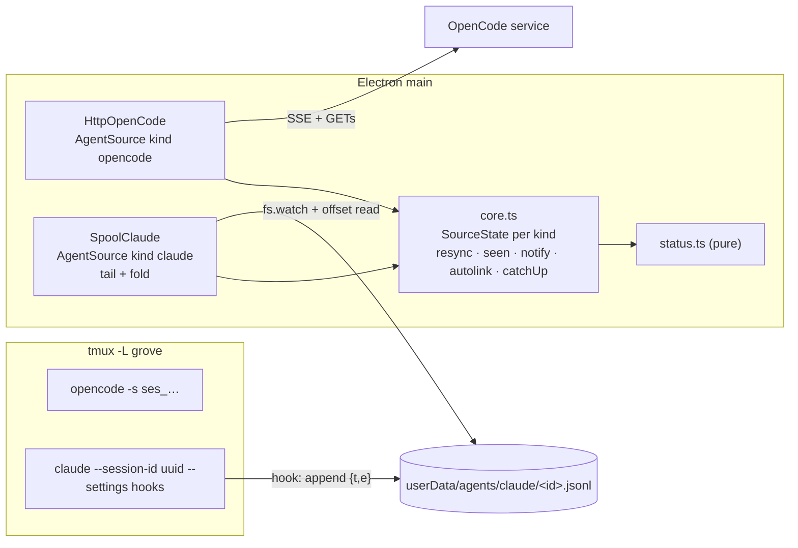

# Design: Claude Code sessions

## Inherited decisions

- **E-D3** tmux on `-L grove`; per-kind launch and resume argv via the login shell (v6 two-way row).
- **E-D5** OpenCode status from the shared service's SSE stream, kept as is; the seam is generalised.
- **E-D6** link to the feature folder of the latest write, for both agent kinds; manual link pins; startup catch-up.
- **E-D7** `kind: opencode | claude | terminal`; `opencodeSessionId` → `agentSessionId`; `state.json` `schemaVersion: 2` via a hand-written v1 → v2 migration (ADR 0017).
- **E-D10** `--settings` hooks per launch append to an app-owned spool `<userData>/agents/claude/<id>.jsonl`; main tails it; re-sync and catch-up replay it (ADR 0016).

## Desired state

1. The ＋ modal offers **Claude Code**: `claude --session-id <uuid> --settings <hooks>` via the login shell in tmux `grove-<id>`, cwd = project root.
2. Per-launch hooks append each payload to `<userData>/agents/claude/<agentSessionId>.jsonl`; a Claude adapter tails it and emits the OpenCode adapter's agent-neutral events. Core runs both sources side by side, each with its own connect and re-sync state.
3. Claude cards show working / waiting (permission, question, unseen finished turn) / idle / gone with OpenCode's rules, seen mark, waiting count and notifications; a session no hook has fired for shows tmux liveness only.
4. Claude sessions auto-link on Write/Edit into a feature folder; after a restart, status and links catch up by replaying the spool.
5. A gone Claude session resumes with `claude --resume <id> --settings <hooks>`; the spool survives resume and is deleted with the session.
6. `state.json` moves to `schemaVersion: 2` (`opencodeSessionId` → `agentSessionId`) without losing sessions. OpenCode behaviour is unchanged.

## Non-goals

- Agents beyond OpenCode and Claude Code; next-action prompts for Claude (child 5).
- Parsing Claude transcripts or `~/.claude/sessions/<pid>.json`; linking on files written by Bash or external processes.
- Spool compaction; a Claude connection banner (no service to be unreachable).

## System design



**Seam (`src/core/agents/types.ts`).** `AgentEvent` (today's `OcEvent`, same
variants) and `SessionSnapshot` unchanged. Each source owns its kind's id
format, argv and files, so core has no per-kind launch branches:

```ts
export type AgentKind = Exclude<SessionKind, 'terminal'>
export interface AgentSource {
  kind: AgentKind
  statusNeedsEvent: boolean           // claude: no status until the session's spool has a record
  mintId(now: Date): string           // opencode: ses_…; claude: randomUUID()
  argv(id: string, mode: 'start' | 'resume'): string[] // before loginShellArgv
  start(onEvent: (e: AgentEvent) => void): void
  snapshot(ids: string[]): Promise<Map<string, SessionSnapshot>>
  lastWrites(id: string): Promise<string[]>
  forget(id: string): void            // session removed; claude deletes its spool
  stop(): void
}
```

**Spool record.** One JSON object per hook call, `{"t":"<UTC ISO, s>","e":<hook stdin JSON>}`,
appended by the hook command (every hook entry, `timeout: 5`, synchronous). `PostToolBatch` carries
every tool's input and output (slice 1 capture), so its command drops stdin and writes a marker:

```sh
x=$(cat); printf '{"t":"%s","e":%s}\n' "$(date -u +%Y-%m-%dT%H:%M:%SZ)" "$x" >> '<spool>'
cat >/dev/null; printf '{"t":"%s","e":{"hook_event_name":"PostToolBatch"}}\n' "$(date …)" >> '<spool>'
```

Hooks in the `--settings` JSON: `SessionStart`, `UserPromptSubmit`,
`PermissionRequest`, `PreToolUse` (matcher `AskUserQuestion`), `PostToolUse`
(matcher `Write|Edit|MultiEdit|NotebookEdit|AskUserQuestion`),
`PostToolUseFailure`, `PostToolBatch`, `Stop`, `StopFailure`, `Notification`
(matcher `idle_prompt`). The source creates the spool dir with mode 0700.

**Hook → event mapping** (per spool, keyed by the file's id, never by payload
`session_id`; `scope` = `agent_id` or `main`):

| Hook | Event(s) |
|---|---|
| `UserPromptSubmit` | close pending of all scopes; `exec-started` |
| `PermissionRequest` | `pending` open `perm:<scope>` permission; ignored for `tool_name` AskUserQuestion (it fires for questions too) |
| `PreToolUse` AskUserQuestion | `pending` open `q:<tool_use_id>` question |
| `PostToolUse` / `PostToolUseFailure` | close `perm:<scope>`, close `q:<tool_use_id>`; Write/Edit/MultiEdit/NotebookEdit success → `wrote [tool_input.file_path]` |
| `PostToolBatch` (marker, no scope) | close `perm:*` of all scopes |
| `Stop`, `StopFailure` (main scope) | close all pending; `exec-ended at t` |
| `Notification` `idle_prompt` | close all pending; if running: `exec-ended at t` (interrupt, or a question rejected with Esc: no hook fires) |
| `SessionStart` | records `session_id` as the resume id; no status change |

The fold per spool (`running, idleAt, pending, lastWrite, resumeId`) is the
snapshot: `snapshot(ids)` returns it for ids whose spool has a record (others
are omitted, so no tracker and no status: the live gate). `lastWrites(id)` =
the fold's last write. `argv(id,'resume')` uses `resumeId ?? id`, so a
`/clear`ed session resumes its current conversation.

**State v2.** `Session.agentSessionId: string | null` (set for agent kinds);
`StateFile.schemaVersion: 2`. v1 files migrate on read
(`opencodeSessionId` → `agentSessionId`), and the next save writes v2.

## Program design

**Call paths.**

- Before: `createCore({opencode?})` → `onOcEvent` / `resync` / `catchUp` /
  `linkWrite` on module-level `trackers, roots, ocConnected, syncGen, queue,
  primed, wroteSince`; sessions found by `opencodeSessionId`; argv built in
  `sessionCreate`/`sessionResume` for `kind === 'opencode'`.
- After: `createCore({sources: AgentSource[]})` → `states: Map<AgentKind,
  SourceState>`; `onEvent(st, e)`, `resync(st)`, `catchUp(st, gen, ids)`,
  `linkWrite(st, id, paths)` find sessions by `kind === st.source.kind &&
  agentSessionId`. `refreshStatus` applies `withStatus` per state;
  seen/notify use `kind !== 'terminal'` and the session's own state
  (`connected && queue === null && primed`). `sessionCreate`: `source.mintId`
  + `loginShellArgv(source.argv(id,'start'))`; no source → `no-source`.
  `sessionResume`: `argv(id,'resume')`, error `not-agent`. Remove (session or
  project) calls `source.forget(agentSessionId)`. The `opencode` slice,
  unreachable timer and banner stay tied to the opencode state.

**Files.**

```
src/shared/types.ts                 MODIFIED  SessionKind + 'claude'; agentSessionId; StateFile v2
src/core/agents/types.ts            NEW       AgentEvent, SessionSnapshot, AgentSource (from opencode/types.ts)
src/core/opencode/types.ts          DELETED
src/core/opencode/client.ts         MODIFIED  HttpOpenCode implements AgentSource (kind, mintId, argv, forget no-op)
src/core/opencode/normalise.ts      MODIFIED  imports only
src/core/claude/hooks.ts            NEW       hookSettings(spool), claudeArgv(id, spool, mode, resumeId)
src/core/claude/spool.ts            NEW       scanRecords(text), SpoolTail (offsets, fs.watch dir + 1 s stat)
src/core/claude/normalise.ts        NEW       step(fold, record) → {fold, events}
src/core/claude/source.ts           NEW       SpoolClaude implements AgentSource
src/core/claude/*.test.ts           NEW       + fixtures/capture-2.1.285.jsonl (slice 1 capture)
src/core/status.ts                  MODIFIED  withStatus per kind, needsEvent gate
src/core/sessions.ts                MODIFIED  newSession takes agentSessionId; label "Claude"
src/core/core.ts                    MODIFIED  SourceState per kind (D1)
src/core/store/jsonFile.ts          MODIFIED  readVersioned(..., migrations)
src/core/store/stateStore.ts        MODIFIED  v1 → v2
src/core/testing/fakeOpenCode.ts    DELETED   → fakeAgentSource.ts NEW (kind param); setup.ts MODIFIED
src/main/index.ts                   MODIFIED  sources: [HttpOpenCode, SpoolClaude({dir})]
src/renderer/src/components/NewSessionModal.tsx, Sidebar.tsx, ui/Icon.tsx, App.tsx  MODIFIED
src/renderer/src/sessionStatus.ts   MODIFIED  agent = kind !== 'terminal'
```

**Key signatures.**

```ts
interface SourceState { source: AgentSource; connected: boolean; trackers: Map<string, Tracker>;
  roots: Map<string, string>; syncGen: number; queue: AgentEvent[] | null; primed: boolean; wroteSince: Set<string> }
function withStatus(sessions: Session[], kind: AgentKind, t: Map<string, Tracker>, connected: boolean, needsEvent: boolean): Session[]
function readVersioned<T>(file: string, version: number, empty: T, onBad?: (m: string) => void,
  migrations?: Record<number, (old: any) => any>): T   // migrations[n] turns version n into n+1
function scanRecords(text: string): { records: { t: string; e: unknown }[]; consumed: number } // skips corrupt spans
function step(f: ClaudeFold, r: { t: string; e: unknown }): { fold: ClaudeFold; events: AgentEvent[] }
```

## One-way decisions

- **D1 How core runs several agent sources: per-source state, one interface.**
  Chosen: `AgentSource[]` with `kind`; core keeps a `SourceState` per kind; the
  Claude adapter implements `snapshot`/`lastWrites` from its spool fold. An
  OpenCode reconnect never touches Claude state. Rejected: a composite source in
  main behind the single `OpenCodeSource` (shared connected state couples Claude
  status to the OpenCode service); a separate `onClaudeEvent` path in core
  (two mechanisms for status, linking and notify). [ADR 0019](../../adr/0019-agent-sources-with-per-source-state.md)

## Two-way decisions

| # | Area | Decision |
|---|---|---|
| 1 | Seam names | `OcEvent` → `AgentEvent`, `OpenCodeSource` → `AgentSource`, in `src/core/agents/`; new `src/core/claude/` |
| 2 | Claude id | `agentSessionId = randomUUID()`, separate from `Session.id`; spool named by it; events keyed by file name |
| 3 | Resume id | Latest `SessionStart` `session_id` in the spool, else `agentSessionId`; derived, not persisted |
| 4 | Hooks | The list and matchers above; Read/Bash payloads stay out of the spool (`PostToolBatch` as a marker) |
| 5 | Hook command | Inline `sh`, `{t, e}` record (`PostToolBatch`: stdin dropped), synchronous, 5 s timeout; settings as inline JSON quoted by `loginShellArgv`; nothing shipped |
| 6 | Spool reader | Byte offsets, `fs.watch` on the dir + 1 s stat fallback; newline-agnostic object scanner; a corrupt span is skipped |
| 7 | Mapping | Table above, revised from slice 1's capture; interrupt and Esc-rejected questions close on next prompt or `idle_prompt`; subagent events fold via `scope` |
| 8 | Live gate | Claude source connected from `start()`; per session, status only once its spool has a record |
| 9 | Kind filters | `kind !== 'terminal'` for seen, notify, re-sync, resume; `not-opencode` → `not-agent` |
| 10 | Migration | `readVersioned` `migrations` map; stateStore v1 → v2; existing fill-ins kept after it |
| 11 | Spool lifecycle | Kept across resume; deleted by `forget` on session or project remove; no compaction |
| 12 | Renderer | "Claude Code" modal option, `claude` glyph, label "Claude · HH:MM"; same card, tone, Resume and status as OpenCode; unreachable banner OpenCode only |
| 13 | Missing `claude` | No special case: `exec` fails, pane dies, card shows gone |
| 14 | Tests | `FakeAgentSource(kind)`; fixture from slice 1's capture; temp-dir spool tests |

## Risks

- **Partly verified hook payloads.** Slice 1's capture confirmed delivery, records one per line, resume and `/clear` ids, and the two fixes above. Still unseen: a real tool's `PermissionRequest`, an answered question, `idle_prompt`, Edit, subagent `agent_id`, parallel appends. Slice 3 starts with a second capture; rows adjust, only a delivery failure reopens E-D10.
- **Batch marker has no scope**: with parallel subagents, one batch ending clears another's permission wait (shows `working`).
- **Realpaths**: `file_path` arrives resolved (`/private/tmp/…`); `slugFor` already compares realpaths of the feature root and the write.
- **Interleaved appends** from parallel hooks can corrupt a span; the scanner skips it. A lost `wrote` is fixed by the next write, a lost `Stop` by `idle_prompt`.
- **Interrupt** shows `working` until the next prompt or `idle_prompt` (~60 s); a **granted long tool** stays `waiting · permission` until its batch ends (no "answered" hook).
- **Spool growth**: Write/Edit contents and prompts are copied into userData (0700 dir); replay reads whole files.
- **Hooks disabled** by user or managed settings: cards fall back to tmux liveness.
- **Refactor of child 3's status code** (D1): existing OpenCode tests must stay green with only renames.
- **Second-precision `t`** (normalised to `.000Z`): a turn ending in the seen mark's second counts as seen.

## Open questions
