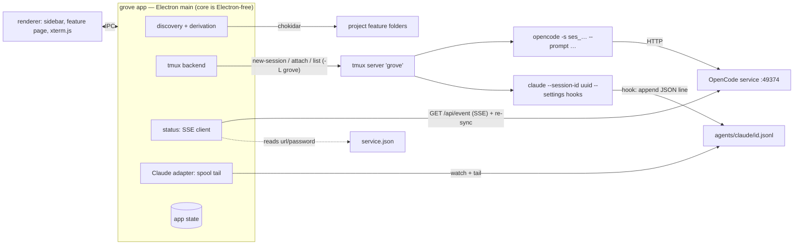
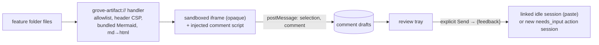

# Design: feature-focused desktop workspace for OpenCode (epic)

Designed on draft questions (v3) and research (v5). v3: `flows` (E-D2). v4:
group done rule, `active` (E-D2). v5: session-first sidebar (human, 2026-10-05). v6: Claude Code as a second
agent kind (child 10; human, 2026-10-06), from that child's research.

## Desired state

1. **grove** is a macOS Electron app organised around **projects** (registered
   repo folders), added from the app.
2. A **＋ / Cmd+T** modal starts an **OpenCode**, **Claude Code** (v6) or
   **Terminal** session in a project. Sessions persist across app restarts,
   show under their project, and gone agent sessions resume by agent id.
3. The **sidebar** (v5) has **Sessions | Features** tabs. Sessions: all
   sessions under project headers, terminals muted, each card showing its
   linked feature and live status (working / waiting / idle / gone, both agent
   kinds). Features: project → epic → feature tree. Header counts waiting
   sessions; a notification fires when a session starts waiting.
4. Agent sessions **link to features automatically** on writes into a feature
   folder, catching up after restarts. Discovery is live. Manual link works.
5. A feature's stages, stage and card state come only from `workflow.yaml`
   rules over frontmatter, including which stages its kind **and flow** use.
   No code names a grove phase or flow. A Board view groups by stage.
6. The **feature page** shows the stage timeline, **next-action buttons** (each
   starts a linked, prompted session, Approve included) and its artifacts.
   Either agent can be started; child 5 decides how, within E-D2 (v6).
7. The **artifact viewer** shows `grove-render` HTML in a sandboxed iframe, or
   rendered markdown. You can **comment** on artifacts. Comments are collected
   as drafts and sent to the agent only when you explicitly send them, as one
   revise prompt. The app never edits artifacts.
8. The app writes only its own config and session/comment state, never repos.
9. Phase 0 spike findings are written up before app code depends on them.

## Non-goals

- A custom chat UI or custom message rendering
- Cloud sync, accounts, telemetry, multi-user features
- Linux and Windows support
- Editing artifacts inside the app (comment only)
- Creating features from the app (`grove-questions` in a session does it)
- Agents other than OpenCode and Claude Code (v6; was "other than OpenCode")
- Auto-sending comments to an agent

## System design

### `workflow.yaml` shape (E-D1, E-D2)

```yaml
discovery: { manifest: feature.md, root: { from_file: grove.config.json, key: artifactRoot, default: docs/work } }
kinds:
  field: kind
  default: feature
  parent_field: parent
  values:
    epic:    { group: true, stages: [questions, research, design, structure] }
    feature: { stages: all }
flows:                                    # second axis; effective stages = kind ∩ flow
  { field: flow, default: full, values: { full: { stages: all }, standard: { stages: all },
    small: { stages: [questions, implementation] } } }
stages:                                   # ordered
  - id: design
    label: Design
    artifact: 03-design.md
    review: 03-design.html                # optional
    complete_when: { field: status, equals: approved }
    # | { exists: true } | { field: status, in: [...] } | { all_checked: 05-plan.md }
flags:
  - { id: stale, label: Stale, when: { field: status, equals: stale } }
actions:
  start:   { label: "Start {stage}", prompt: "/grove-{stage} {slug}", cwd: "{project_path}" }
  revise:  { label: "Revise", prompt: "/grove-{stage} {slug} {feedback}", cwd: "{project_path}", needs_input: true }
  approve: { label: "Approve", prompt: "/grove-approve {slug} {stage}", cwd: "{project_path}" }
stage_actions: { default: [start, revise, approve] }
```

- Template variables: `{slug} {stage} {project_path} {feature_path} {feedback}`.
  `{repo}`, `{repo_path}` and the `per_repo` stage key are reserved for a
  later hub and rejected by v1 validation.
- Effective stages: those in both the kind's and the flow's list, in `stages`
  order. Missing `flow` → `default`; unknown value → `default` plus a `flow?`
  card warning. Stages outside the list are absent from that feature's
  timeline. Children are found by `parent_field`.
- Stage derivation, over effective stages: first incomplete stage; a stage
  is passed if any later effective stage's artifact exists ("unapproved").
- Card state (code, generic): `backlog` (no stage artifact exists),
  `running` / `waiting` (a linked session is), `needs-review` (current stage's
  artifact exists, incomplete, no running session), `ready` (current stage's
  artifact absent; start available), `done` (all stages complete).
- Groups (v4): `done` only when their own stages are complete and every
  child is `done`; until then, own stages complete → `active`, `n / m done`.
  No children → done by own stages.
- Invalid workflow → error banner, last valid workflow kept.

### Sessions, backend and status (E-D3, E-D4, E-D5, E-D10)



- Status: `working`|`waiting`|`idle`|`gone` (agents); `running`|`gone`
  (terminal). Per-kind adapters emit shared events; rules stay pure (v6).
- Main flows:
  - **New session (＋):** pick project + kind → tmux `grove-<uuid>` in project
    root (`opencode -s <generated ses_id>`, v6 `claude --session-id <uuid>
    --settings <hooks>`, or `$SHELL`) → stored unlinked → attach in xterm.js.
  - **Next action:** template prompt/cwd from workflow → same start path with
    `--prompt`, stored already linked (`action` set).
  - **Auto-link (E-D6):** a write event (SSE tool event; Claude `PostToolUse`)
    under a feature folder → `feature` = that slug unless `linkPinned`.
  - **App start:** read state → tmux `list-sessions` (gone vs live) →
    re-sync status (OpenCode service; Claude spool replay) → catch up links.

### App state (E-D7)

- `~/.config/grove/config.json`: `{ schemaVersion, workflow, projects: [{ id, name, path }] }`.
- `~/Library/Application Support/grove/state.json`: `{ schemaVersion, sessions: [Session], ui }`.
  v6: `schemaVersion: 2`, read through a v1 → v2 migration (E-D7).
- v6: `.../grove/agents/claude/<sessionId>.jsonl`: per-session hook spool
  (E-D10), app-owned, removed with the session.
- `.../grove/comments/<projectId>.json`: `{ schemaVersion, comments: [Comment] }`.
- `Session`: `id, projectId, kind (opencode|claude|terminal), label, tmuxName,
  agentSessionId, feature (slug|null), linkPinned, action ({stage, actionId}|null),
  startedAt, endedAt, lastStatus` (v6: `agentSessionId` was `opencodeSessionId`).
- `Comment`: `id, projectId, featureSlug, artifact, artifactVersion,
  anchor {exact, prefix, suffix}, body, state (draft|sent), createdAt, sentAt, sentTo`.
- Feature identity: `projectId + slug`. Single writer (main), atomic writes.

### Artifacts and comments (E-D8, E-D9)



- Artifacts of a feature = files in its folder; the workflow's `artifact` and
  `review` name the stage's main file and its review view.
- Comments never auto-send. Orphaned (unplaceable) comments stay sendable.

Children: see `04-structure.md` (this design's former child-map preview is
superseded by it).

## One-way decisions

- **E-D1 Projects and discovery.** Projects in app config (`{id: uuid, name, path}`); feature discovery declared in `workflow.yaml` `discovery`; one global workflow. Rejected: hardcoded grove file names; auto-detect under a workspace root. [ADR 0001](../../adr/0001-projects-and-workflow-declared-discovery.md)
- **E-D2 `workflow.yaml` contract.** Declarative stages, four predicates (`exists`, `field equals`, `field in`, `all_checked`); first incomplete stage, passed if a later artifact exists; generic `kinds`, plus a `flows` axis of the same shape (v3), effective stages = kind ∩ flow; fixed card states in code, with a group done only when its stages and all its children are (`active` until then, v4). Rejected: expression language; workflow JS module; ordered first-match profiles (v3); per-stage `skip_when` (v3); a group showing `ready` or its busiest child's state while children are unfinished (v4). [ADR 0002](../../adr/0002-declarative-workflow-contract.md)
- **E-D3 Session backend.** tmux on a dedicated socket (`-L grove`) with app-shipped config, node-pty attach; herdr stub; Phase 0 verifies. Rejected: herdr; own PTY daemon. [ADR 0003](../../adr/0003-tmux-dedicated-socket-backend.md)
- **E-D4 Process topology.** Core in Electron main behind an Electron-free seam; reconcile on start. Rejected: `utilityProcess` core; detached daemon. [ADR 0004](../../adr/0004-core-in-electron-main.md)
- **E-D5 Status source.** One SSE client on the shared OpenCode service, TUIs launched with an app-generated `-s ses_…` id, HTTP re-sync on (re)connect; tmux for `gone`. Rejected: tmux screen parsing; app-owned `opencode serve`. [ADR 0005](../../adr/0005-status-from-shared-opencode-service.md)
- **E-D6 Session ↔ feature linking.** Link to the feature folder the session's edit/write tool most recently targeted (v6: both agent kinds); manual link pins; startup catch-up from session messages; terminals manual. Rejected: manual only; file-change ↔ working-session correlation; prompt patterns. [ADR 0006](../../adr/0006-link-sessions-by-file-write-events.md)
- **E-D7 App state store.** Versioned JSON files, atomic writes, main as single writer; nothing in repos. v6: `kind` gains `claude`; `opencodeSessionId` → `agentSessionId`, `schemaVersion: 2` with the first hand-written migration. Rejected: SQLite; per-feature files in repos; (v6) rename without a bump; one id field per agent. [ADR 0009](../../adr/0009-app-state-in-json-files.md), [ADR 0017](../../adr/0017-agent-neutral-session-id-and-first-state-migration.md)
- **E-D8 Artifact display isolation.** `grove-artifact://` scheme allowlisted to feature folders, header CSP, bundled Mermaid, markdown rendered in main, opaque iframe, one injected `postMessage` script. Rejected: `srcdoc`; `WebContentsView`. [ADR 0007](../../adr/0007-artifact-protocol-with-header-csp.md)
- **E-D9 Commenting.** In-app inline layer; TextQuoteSelector anchors + artifact version, fuzzy re-attach; review tray of drafts; explicit Send fills `{feedback}`. Cut fallback: side-panel comments. Rejected: Plannotator as review flow; side-panel only. [ADR 0008](../../adr/0008-in-app-inline-comments.md)
- **E-D10 Claude Code status source (v6).** `--settings` hooks per launch append their JSON input to an app-owned spool `<userData>/agents/claude/<sessionId>.jsonl`; main tails it; a Claude adapter emits the same agent-neutral events as the OpenCode one; re-sync and link catch-up replay the spool. A spike verifies payloads; a failure reopens E-D10. Rejected: `http` hooks to a loopback server in main; polling `~/.claude/sessions/<pid>.json` + transcript tail. [ADR 0016](../../adr/0016-claude-status-from-hook-spool-files.md)

## Two-way decisions

| Area | Decision | Basis |
|---|---|---|
| IPC | Old app's shape: `handle` → `{ok,data}\|{ok:false,error}`, fire-and-forget `on` for keys/resize, `webContents.send` pushes, one `window.api` with unsubscribe-returning listeners | research: patterns to reuse |
| File watching | chokidar + gray-matter, `awaitWriteFinish`, ignore `*.tmp`, one watcher per project feature root | research: patterns to reuse |
| Terminal | xterm.js 6.0.0 + WebGL (DOM fallback on context loss) + fit; PTY env `COLORTERM=truecolor`; resize debounced 100 ms | research Q6 |
| node-pty | 1.1.0 + postinstall `chmod +x spawn-helper` (or 1.2.0-beta if Phase 0 prefers); `asarUnpack` | research Q6, node-pty #850 |
| Keys | Custom app menu. Reserved: Cmd+T, Cmd+K, Cmd+W, Cmd+1..9, Cmd+Q; everything else goes to the focused terminal | research Q6 |
| Window close | Quits; persistence is the backend's job | ticket locked decision 2 |
| Prompt injection | Start: `opencode --prompt "<text>"`. Follow-ups (Approve, sent comments): bracketed paste + Enter via the backend. Both verified in Phase 0 | research Q3 |
| Plain terminals | Status running / gone only | — |
| Agent seam (v6) | One source per agent kind (child 3's `OpenCodeSource` generalised), keyed by `kind`, emitting the same events (turn start/end, pending permission/question, child, wrote) | child 10 research Q4 |
| Launch / resume (v6) | Per kind, via the login shell (ADR 0010). OpenCode: `opencode -s <id>` for both. Claude: `claude --session-id <uuid> --settings <json>`; resume `claude --resume <uuid> --settings <json>` in the project root | child 10 research Q7 |
| Claude hook mapping (v6) | `UserPromptSubmit`/`PreToolUse` → working; `PermissionRequest` → waiting·permission; `PreToolUse` AskUserQuestion → waiting·question; `Stop`/`StopFailure` → turn end (seen mark); `PostToolUse` Write/Edit → wrote; events with `agent_id` fold into the session. A turn ended by interrupt (no `Stop`) closes on the next event or `idle_prompt`. Spike confirms | child 10 research Q8 |
| Hook command (v6) | Spool path baked into the per-launch `--settings` JSON; inline shell append, no shipped script | E-D10 |
| Claude label / icon (v6) | Label prefix "Claude", own glyph; same card, tone and status display as OpenCode | — |
| Notifications | Electron `Notification` on any session → `waiting`; click focuses it | — |
| Flow edge cases | Flow changed mid-feature needs nothing (derivation is pure). A flow listing an unknown stage id is a validation error. Board columns are all `stages`, in order | E-D2 v3 |
| Per-viewer UI state | List/Board toggle, Sessions/Features tab (v5), collapsed nodes, sidebar width in app state | ticket locked decision 4 |
| Phase 0 | Throwaway scripts in `spikes/`; findings recorded in the first child's research | ticket §2 |
| Skills changes | `docs/skills-changes.md`: hub/multi-repo support as a later prerequisite. The ticket's two items are dropped (no app-created features, no `.sessions.json`) | ticket §8, E-D7 |

## Risks

- **OpenCode's "Experimental" HTTP/SSE API changes** (E-D5, E-D6). The client is isolated in one module and tested against 2.0.20; on failure the app degrades to tmux liveness only and shows a banner.
- **Unverified source-read behaviour:** `-s <generated id>`, `--prompt "/cmd"`, tool events carrying file paths, service restart on upgrade. Phase 0 verifies each; a failure reopens E-D5/E-D6 rather than being worked around.
- **tmux as a second emulator:** mouse-mode replay, OSC 10/11 colour queries, sizing. xterm.js 6.0.0 lacks the kitty keyboard protocol (Shift+Enter = Enter); Phase 0 checks how OpenCode degrades.
- **Reboot or tmux server kill** ends sessions; they show `gone`, with resume via `opencode -s <id>` (deferred, see appetite).
- **Comment re-anchoring** after heavy rewrites may orphan many comments; orphans stay visible and sendable.
- **Claude Code CLI and hook changes** (E-D10, v6): flags, hook events and payloads can change between releases. The adapter is isolated and tested against 2.1.285; on failure Claude cards fall back to tmux liveness. The payload spike has not run yet; a failure reopens E-D10.
- **Reading `service.json`** (a secret file, mode 0600); read in main only, never logged or sent to the renderer.

## Appetite check

Against ~20 days: spikes 2–3, skeleton 4, workflow + sidebar 4–5, status 3,
viewer 2, actions 2, comments 4–6, packaging 1 ≈ 22–26 days: **over**.

v6: child 10 (Claude Code) adds 4–5 days; appetite raised to ~6–7 weeks.

Proposed cuts, in order, applied when a child slips (not up front):

1. Board view: later (not needed: shipped in child 2).
2. Command palette (Cmd+K) and grid view: later.
3. Session resume after reboot: later (sessions show `gone`).
4. Signed packaging: ad-hoc `.app` only.
5. Inline comments behind at midpoint: side-panel comments first (ADR 0008).

## Open questions
