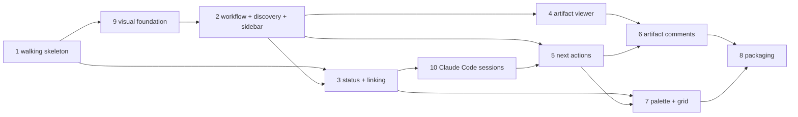

# Structure: feature-focused desktop workspace for OpenCode (epic)

Ten child features. Child 1 is the walking skeleton. Each child runs the
grove sequence in its own flow and reads the epic's research and design first.
Slugs are written into `feature.md` `children:` on approval.

**Build order** is the `children:` order: 1, 9, 2, 3, 4, 10, 5, 6, 7, 8.
Children are named by their slug number, which never changes. Child 9 (visual
foundation) was added in v3, after child 1 was implemented, and is built
second. Child 10 (Claude Code sessions) was added in v6, after children 1, 9,
2, 3 and 4 were built, and is built before child 5 so next actions cover both
agents. The `order` fields follow build order: child 9 `order: 2`, children
2–4 `order: 3`–`5`, child 10 `order: 6`, children 5–8 `order: 7`–`10`.

## Children

### 1. `2026-10-05-01-workspace-walking-skeleton`

- **Goal:** the thinnest end-to-end app. Add a project, start a session,
  work in it, quit, reopen, and find it still there.
- **Outcome:** in the running Electron app I add a repo folder as a project.
  Cmd+T opens the ＋ modal, where I pick the project and OpenCode or Terminal.
  The session runs in tmux (`-L grove`) and appears under its project in the
  sidebar, attached in xterm.js. After I quit and relaunch, it is listed and
  re-attaches. A session killed outside the app shows `gone`.
- **Scope:** E-D1 (projects only, not discovery), E-D3, E-D4, E-D7 (config
  `projects`, `state.json` sessions, atomic writes). Design: Desired state 1, 2,
  8, 9; "Sessions, backend and status" flows *New session* and *App start*
  (tmux part only); "App state"; two-way rows IPC, Terminal, node-pty, Keys,
  Window close, Plain terminals, Phase 0.
- **Phase 0:** this child's research runs the spikes in `spikes/` and records
  the findings: tmux attach and replay, `opencode -s <generated id>`,
  `--prompt "/cmd"`, SSE tool events carrying file paths, bracketed paste,
  xterm.js keys and colours. Any failure reopens the matching epic decision
  (via the epic's Open questions) before app code depends on it.
- **Depends on:** none.
- **Size:** 6–7 days, about 6 slices, at most 2 own one-way decisions.

### 9. `2026-10-05-09-visual-foundation` (built second)

- **Goal:** the app looks deliberate and consistent, and later children build
  screens from shared parts, not inline styles.
- **Outcome:** every walking-skeleton screen uses one set of design tokens
  (colour, type, spacing, radius) and a small set of base components: the
  sidebar and its rows, the ＋ modal, the confirm dialog, the error banner, the
  empty and "Session ended" panes, and the terminal frame. The components are
  Button, Modal, ListRow, Badge, Banner, and an app shell with a header area.
  The xterm theme reads from the same tokens. No visual inline styles remain in
  `src/renderer`.
- **Visual reference:** the human wants it to look similar to Xirp (Spotify),
  per `refs/xirp-reference.png`. The child's questions and design phases settle
  how close to follow it. Parts of that screenshot belong to other children:
  the search bar (child 7's palette), the Projects tab and tree (child 2), and
  status text such as `waiting` (child 3). Child 9 sets their look, not their
  behaviour.
- **Scope:** no `E-D` ids. It is renderer only: IPC, state and core are
  untouched. Design: Desired state 2 (the Spotlight-style modal) and 3 (the
  look of the sidebar rows, header and status dots, not the tree data);
  two-way row Terminal (colours).
- **Depends on:** 1. Child 2 depends on it.
- **Size:** 2–3 days, about 4 slices, at most 2 own one-way decisions.

### 2. `2026-10-05-02-workflow-discovery-sidebar`

- **Goal:** features appear and move through stages driven only by
  `workflow.yaml`.
- **Outcome:** with a project registered, its feature folders appear live in a
  project → epic → feature tree, alongside unlinked sessions. Each feature
  shows its derived stage and card state. The feature page shows the stage
  timeline (marking "unapproved" passes) and lists the feature's artifacts. I
  can link a session to a feature by hand. A List/Board toggle groups features
  by stage. An invalid `workflow.yaml` shows a banner and keeps the last valid
  one. Each feature's stages come from its kind and flow (`flows` in
  `workflow.yaml`); stages its flow skips don't appear on its timeline. An
  example grove `workflow.yaml`, declaring `full`, `standard` and `small`,
  ships with the app.
- **Scope:** E-D1 (discovery), E-D2 (including `flows`, v3), E-D7 (`workflow` path, `linkPinned`, UI
  state). Design: Desired state 3 (tree; status dots come from child 3), 4
  (discovery and manual link), 5; "`workflow.yaml` shape"; two-way rows File
  watching and Per-viewer UI state.
- **Depends on:** 1, 9 (tokens and base components).
- **Size:** 4–5 days, about 6 slices. Board is the last slice (appetite cut 1).

### 3. `2026-10-05-03-session-status-linking`

- **Goal:** live session status, sessions link to features without manual
  work, and dead OpenCode sessions can be resumed.
- **Outcome:** every OpenCode session shows working / waiting / idle / gone in
  the sidebar, and statuses roll up to features. The header shows a waiting
  count. A native notification fires when a session starts waiting, and
  clicking it focuses the session. A session that writes into a feature folder
  becomes linked to that feature unless the link is pinned. After a restart,
  status and links catch up. If the OpenCode service is unreachable, the app
  falls back to tmux liveness and shows a banner. A `gone` OpenCode session
  (after a reboot or a tmux server kill) offers Resume, which starts a new tmux
  session running `opencode -s <opencodeSessionId>` in the same project. It
  keeps the session's id, label and feature link.
- **Scope:** E-D3 (new tmux session for resume), E-D5, E-D6, E-D7
  (`opencodeSessionId`, `feature`, `lastStatus`, `endedAt`).
  Design: Desired state 3 (status, waiting count, notifications), 4
  (auto-link); "Sessions, backend and status" flows *Auto-link* and *App start*
  (re-sync and catch-up); card states `running` and `waiting`; two-way row
  Notifications; Risks covering the Experimental API, `service.json`, and
  reboot or tmux server kill (resume).
- **Depends on:** 1 (sessions), 2 (feature folders to link to).
- **Size:** 4 days, about 6 slices. Resume is the last slice (appetite cut 3).

### 4. `2026-10-05-04-artifact-viewer`

- **Goal:** read any artifact of a feature safely inside the app.
- **Outcome:** from the feature page I open the current stage's `review` HTML,
  or switch to any other artifact in the folder. HTML renders in an opaque
  sandboxed iframe through `grove-artifact://` with header CSP, and Mermaid
  works offline. Markdown without a companion renders in main. Requests outside
  the feature folder are refused.
- **Scope:** E-D8 (without the comment script). Design: Desired state 7
  (viewing), "Artifacts and comments" (protocol and iframe), the artifact list
  bullet.
- **Depends on:** 2.
- **Size:** 2 days, about 4 slices.

### 10. `2026-10-05-10-claude-code-sessions` (v6, built after 4)

- **Goal:** Claude Code is a second agent kind with the same session
  experience as OpenCode.
- **Outcome:** the ＋ modal offers Claude Code. A Claude session runs
  `claude --session-id <uuid>` in tmux with per-launch hooks, shows working /
  waiting (permission, question, unseen finished turn) / idle / gone, counts
  in the waiting header and notifies. It auto-links on writes into a feature
  folder, and status and links catch up after an app restart from its spool.
  A gone Claude session resumes with `claude --resume <uuid>`. Existing
  `state.json` files migrate to v2 (`agentSessionId`) without losing sessions.
- **Scope:** E-D3 (per-kind launch and resume), E-D5 (OpenCode source kept,
  seam generalised), E-D6 (both kinds), E-D7 (v6: `kind: claude`,
  `agentSessionId`, `schemaVersion: 2` migration), E-D10. Design: Desired
  state 2–4; "Sessions, backend and status"; "App state"; two-way rows Agent
  seam, Launch / resume, Claude hook mapping, Hook command, Claude label /
  icon; Risk "Claude Code CLI and hook changes".
- **Spike first:** the hook payload spike (live capture in 2.1.285, including
  AskUserQuestion, interrupt and `idle_prompt`) runs in this child's research
  before its design. A failure reopens E-D10.
- **Depends on:** 1, 3 (status seam, seen mark, auto-link, resume).
- **Size:** 4–5 days, about 6 slices, at most 2 own one-way decisions.

### 5. `2026-10-05-05-next-actions`

- **Goal:** move a feature forward from its page.
- **Outcome:** the feature page shows the current stage's next-action buttons
  from `workflow.yaml`. Each one starts a session that is already linked and
  prompted (`--prompt`) in the templated cwd. A `needs_input` action (Revise)
  asks for text first. Approve and other follow-ups are pasted into an idle
  linked session if one exists, and start a new linked session otherwise.
  Card states `ready` and `needs-review` drive which buttons are offered.
- **Scope:** E-D2 (actions, template variables, `stage_actions`), E-D3
  (bracketed paste), E-D5 (idle detection for the paste target). Design:
  Desired state 6; "Sessions, backend and status" flow *Next action*; two-way
  row Prompt injection.
- **Depends on:** 2, 3, 10 (v6: actions can start either agent; how the
  agent is chosen is this child's decision, within E-D2).
- **Size:** 2 days, about 4 slices.

### 6. `2026-10-05-06-artifact-comments`

- **Goal:** review artifacts by commenting inline and sending the comments to
  the agent deliberately.
- **Outcome:** I select text in a viewed artifact and add a comment. Comments
  are kept as drafts with TextQuoteSelector anchors and the artifact version,
  and they re-attach after the artifact is revised. Unplaceable comments show as
  orphans. The review tray lists drafts, and Send turns them into one
  `{feedback}` revise prompt through child 5's send path. Nothing is ever sent
  automatically.
- **Scope:** E-D7 (`comments/<projectId>.json`, `Comment`), E-D8 (injected
  `postMessage` script), E-D9. Design: Desired state 7 (commenting);
  "Artifacts and comments"; the comment re-anchoring risk.
- **Depends on:** 4, 5.
- **Size:** 4–6 days, about 6 slices. Appetite cut 5: if inline comments are
  behind at the midpoint, ship side-panel comments on the same data model and
  send path.

### 7. `2026-10-05-07-command-palette-grid`

- **Goal:** keyboard-first navigation, and several live terminals at once.
- **Outcome:** Cmd+K opens a command palette that fuzzy-matches features,
  sessions and the current feature's next actions. Picking one jumps to the
  feature, focuses the session, or runs the action through child 5's start
  path. A grid view shows several live sessions side by side, each attached
  in its own xterm.js and resized independently. I can choose which sessions
  are in the grid, focus one with Cmd+1..9, and the layout persists in UI
  state.
- **Scope:** E-D2 (actions run from the palette), E-D3 (multiple concurrent
  attaches), E-D7 (grid layout in `ui`). Design: two-way rows Keys (Cmd+K,
  Cmd+1..9), Terminal and Per-viewer UI state; appetite cut 2.
- **Depends on:** 3 (session status shown in palette and grid), 5 (actions).
- **Size:** 3–4 days, about 5 slices. Palette first, grid second, so the grid
  can be cut on its own.

### 8. `2026-10-05-08-packaging`

- **Goal:** a `.app` I can use as my daily driver.
- **Outcome:** a built `grove.app` launches from `/Applications`. It includes
  node-pty (`asarUnpack`, `spawn-helper` executable), the shipped tmux config
  and the example `workflow.yaml`, and it runs sessions without a dev checkout.
  It is signed, or ad-hoc signed if cut 4 applies. `docs/skills-changes.md`
  records the hub/multi-repo prerequisite.
- **Scope:** E-D3 (shipped tmux config), E-D4 (main/renderer build). Design:
  two-way rows node-pty and Skills changes; appetite cut 4.
- **Depends on:** 1–7, 9 and 10.
- **Size:** 1 day, about 3 slices.

## Appetite check

v6: child 10 adds 4–5 days, for about 32–39 days in total. The human raised
the appetite to **~6–7 weeks (30–35 days)** instead of adding a cut. Children
1, 9, 2, 3 and 4 are done. The cuts below still apply in order.

The child sizes sum to about 28–34 days: the design's 22–26 days, plus about
1 day for resume in child 3, 3–4 days for child 7, and 2–3 days for child 9
(added in v3). In v3 the human raised the appetite from ~4 weeks (20 days) to
**~5–6 weeks (25–30 days)** instead of adding a cut for child 9. Against that,
the plan is between 2 days under and 9 days over. Child 1 is done. The
design's cuts stay as they are and apply in order, only when a child slips:

1. Board view (child 2's last slice).
2. Command palette and grid view (child 7; cut the grid before the palette).
3. Session resume after reboot (child 3's last slice).
4. Signed packaging: ad-hoc `.app` only (child 8).
5. Inline comments become side-panel comments (child 6).

Together the cuts recover about 7–10 days, which covers the worst case.
Reconsider the appetite before starting child 6.

## Deferred

- herdr backend beyond the stub.
- Hub/multi-repo features (`{repo}`, `{repo_path}`, `per_repo` stay rejected).
- "Open in Plannotator", "Open in editor" and other ticket viewer buttons
  that the design does not include.

## Open questions
