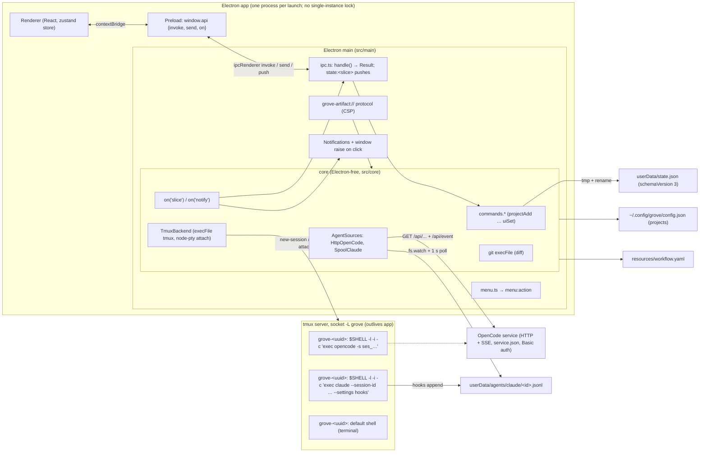

# Grove CLI — research

## Summary

- Core exposes nine `commands.*` (project add/remove, session create/kill/remove/resume/rename/link, `uiSet`), each returning `Result<T>` with bare error codes. The only caller is the renderer, through preload `window.api` and `ipcMain` handlers in `src/main/ipc.ts`.
- `sessionCreate` takes `{projectId, kind, cols, rows}` only. The cwd is always the project path, the label is grove-side `"<Kind> · HH:MM"`, and the link starts null. Agents get no prompt, title or instructions.
- Electron main opens no socket or server and has no single-instance lock. It is a client of tmux (`-L grove`), the OpenCode HTTP/SSE service and the Claude spool files. Quitting disposes core but leaves tmux sessions running.
- Text reaches a running session only through the single attach pty (keyboard input). No tmux `send-keys` or paste, and no OpenCode `POST …/prompt` call, exists in `src`. Review comments has no research, design or code yet.
- Persisted sessions have no relationship fields. Main can subscribe to `core.on('slice')` and `core.on('notify')` only.
- No `bin`, no packaging and no CLI ship today. xirp reaches a WebSocket daemon over a unix socket or port file under `~/.chirp` and identifies the caller by `CHIRP_SESSION_ID`. herdr uses a JSON request/response API on a unix socket and identifies the caller by `HERDR_PANE_ID` and related variables.

## Answers

### 1. Core operations and how the renderer reaches them

- **`Core` interface** (`src/core/core.ts:67-80`): `start()`, `getSlices()`, `getErrors()`, `on('slice'|'notify', cb)` returning an unsubscribe function (`core.ts:71-72`, `603-607`), `setWindowFocused(f)` (`core.ts:608-611`), `checkLiveness()` (`core.ts:279-290`), `commands`, `attach(sessionId, cols, rows): AttachHandle`, which throws `Error('not-found')` (`core.ts:614-631`), `artifactPath(projectId, slug, rel)` and `filePath(projectId, rel)`, both `string | null` (`core.ts:77-78`, `632-639`), and `dispose()` (`core.ts:640-648`).
- **`Commands`** (`core.ts:55-65`) each return `Promise<Result<T>>`, where `Result<T> = {ok:true,data:T} | {ok:false,error:string}` (`src/shared/ipc.ts:3`).

| Command | Args | Data | Errors |
|---|---|---|---|
| `projectAdd` | `{path}` | `Project` | none; no validation or duplicate check (`core.ts:463-468`) |
| `projectRemove` | `{id}` | `{id}` | `not-found`, `has-live-sessions` (`core.ts:470-480`) |
| `sessionCreate` | `{projectId, kind, cols, rows}` | `Session` | `not-found`, `no-source` (`core.ts:482-495`) |
| `sessionKill` | `{id}` | `{id}` | `not-found` (`core.ts:497-504`) |
| `sessionRemove` | `{id}` | `{id}` | `not-found`, `not-gone` (`core.ts:506-513`) |
| `sessionResume` | `{id}` | `Session` | `not-found`, `not-agent`, `not-gone`, `no-source` (`core.ts:517-533`) |
| `sessionRename` | `{id,label}` | `Session` | `not-found` (`core.ts:535-541`) |
| `sessionLink` | `{id, feature: string\|null}` | `Session` | `not-found`, also for an unknown slug (`core.ts:543-552`) |
| `uiSet` | `Partial<UiState>` | `UiState` | none (`core.ts:554-564`) |

- Backend calls inside commands (`backend.create`, `kill`, `setColors`) are not wrapped in try/catch, so a tmux failure rejects the promise (`core.ts:490-491`, `500`, `525-528`).
- **IPC types** (`src/shared/ipc.ts`): `InvokeMap` maps a channel to `[args, data]` (`:8-22`). `SendMap` holds the fire-and-forget pty channels (`:24-28`). `PushMap` holds `state:<slice>`, `pty:data|exit` and `menu:action` (`:30-40`). `Api` is at `:41-45`.
- **`registerIpc`** (`src/main/ipc.ts:11-92`) wraps each handler in `handle()`. A throw becomes `{ok:false,error:message}`, and handlers that already return a `Result` pass it through (`ipc.ts:18-27`). The channel-to-command mapping is at `ipc.ts:29-45`. `project:add` opens a directory dialog first, and cancelling returns `{ok:true,data:null}` (`ipc.ts:31-37`). `pty:attach` keeps one live attach and kills any earlier one (`ipc.ts:53-69`). Slice pushes are coalesced per tick with `setImmediate` (`ipc.ts:80-91`).
- **Preload** exposes `window.api = {invoke, send, on}` through `contextBridge` (`src/preload/index.ts:4-14`). Its type is in `src/renderer/src/env.d.ts:5`.
- **Renderer call sites:** store `hydrate` (`src/renderer/src/stores/slices.ts:52-67`); focus setters call `ui:set` (`slices.ts:68-90`); `NewSessionModal.tsx:23`; `LinkPicker.tsx:15`; `Sidebar.tsx:71,88,91,176,218`; `App.tsx:108,110,141`; `TerminalView.tsx:38-69` (pty).

### 2. Session creation end to end

1. The renderer invokes `session:create` with `{projectId, kind, cols:120, rows:40}` and then calls `setFocused(res.data.id)` (`NewSessionModal.tsx:22-27`). The kinds are opencode, claude and terminal (`NewSessionModal.tsx:10-14`).
2. `sessionCreate` (`core.ts:482-495`) runs these steps:
   - Looks up the project, else returns `not-found`. An agent kind needs a registered `AgentSource`, else `no-source` (`483-486`).
   - Mints the agent id with `source.mintId(now())`, or `null` for a terminal (`487`). OpenCode mints a descending `ses_…` id (`src/core/opencode/client.ts:48-50`, `src/core/opencodeId.ts:7-14`). Claude mints `randomUUID()` (`src/core/claude/source.ts:22-24`).
   - Builds the record with `newSession(...)`, using id `randomUUID()` (`core.ts:488`).
   - For agents, builds argv as `loginShellArgv(source.argv(id,'start'))` (`core.ts:489`), which gives `[process.env.SHELL ?? '/bin/zsh', '-l', '-i', '-c', 'exec <quoted argv>']` (`src/core/env.ts:41-43`). OpenCode uses `['opencode','-s',id]` for both start and resume (`client.ts:52-54`). Claude uses `['claude','--session-id',id,'--settings',<hook JSON>]`, and on resume `--resume <resumeId ?? id>` replaces `--session-id` (`src/core/claude/hooks.ts:30-33`, `source.ts:26-28`). A terminal gets no argv, so tmux runs its default shell (`core.ts:489`).
   - Creates the tmux session with `backend.create({name: tmuxName, cwd: project.path, cols, rows, argv})` (`core.ts:490`). This runs `tmux -L grove -f <conf> new-session -d -s <name> -c <cwd> -x -y [-- argv]` (`src/core/backend/tmux.ts:39-45`). The socket is set in main (`src/main/index.ts:28-33`), and the config has `remain-on-exit failed` (`resources/tmux.conf:7`). `backend.setColors` applies the theme (`core.ts:491`, `tmux.ts:47-50`).
   - Persists and pushes with `set('sessions', [...])` (`core.ts:492`). `set()` notifies slice listeners, writes `state.json` synchronously without live fields, and re-derives features (`core.ts:114-129`). It then calls `refreshStatus()` and returns the post-status copy (`core.ts:493-494`).
3. **Label** is `"<Kind> · HH:MM"` in local time (`src/core/sessions.ts:3-8`). It is never passed to the agent. Rename sets `labelPinned:true` (`sessions.ts:73-75`).
4. **Link** is always `feature:null, linkPinned:false` at creation (`sessions.ts:19-20`), and `sessionCreate` takes no feature argument (`core.ts:58`). `action` is always null (`src/shared/types.ts:13`). Workflow `actions` / `stage_actions` are parsed (`src/core/workflow/parse.ts:25-26`, `117-124`), but no core path starts a session from them.
5. **Later linking** happens three ways. Auto-link follows the latest write into a feature folder (`core.ts:237-249`) and is held until discovery lists the folder (`core.ts:251-260`). On re-sync, `catchUp` links missed writes (`core.ts:263-277`). A manual `sessionLink` pins the link (`sessions.ts:69-71`).
6. **Resume** kills any leftover pane and recreates it with the same tmux name, cwd `project.path`, 80x24 and the resume argv (`core.ts:525-528`). It sets `lastStatus:'running', endedAt:null` (`sessions.ts:65-67`) and re-syncs the source if it is connected (`core.ts:530`).

### 3. CLI launch options and what the app uses

- Installed versions are `opencode v2.0.20` and Claude Code `2.1.285`, both in `/opt/homebrew/bin`.
- **OpenCode TUI**: `opencode [flags] [<directory>]` with `--session/-s` ("Session ID to continue, or to create if it does not exist"), `--prompt`, `--continue/-c`, `--auto`, `--server`/`--standalone`. It has no title flag.
  - `opencode run` (non-interactive) has `--session`, `--title`, `--agent`, `--model`, `--file`, `--fork` and `--format`.
  - `opencode mini` has `--prompt` and `--session`.
  - The server API offers `POST /api/session` (`id`, `title`, `agent`, `model`, `location: {directory}`) and `PATCH /api/session/{id}` (`title`).
- **Claude Code**: `claude [options] [prompt]` with `-n/--name` (display name in the prompt box, `/resume` picker and terminal title), `--session-id <uuid>`, `-r/--resume`, `--settings <file-or-json>`, `--add-dir`, `--append-system-prompt`/`--system-prompt` and `-w/--worktree`. It has no working-directory flag and uses the process cwd.
- **What the app uses:**
  - OpenCode: `['opencode','-s',id]` (`client.ts:52-54`), with no `--prompt` or directory.
  - Claude: `--session-id`/`--resume` plus `--settings` (`hooks.ts:30-33`), with no prompt and no `--name`.
  - The cwd comes from tmux `-c` (`tmux.ts:39-44`) and is always `project.path` (`core.ts:490`, `:527`).
  - Grove mints the agent id before launch (`core.ts:487`). OpenCode's "create if it does not exist" makes a minted id work.
  - IPC `session:create` takes only `{projectId, kind, cols, rows}` (`src/shared/ipc.ts:13`).
  - Workflow actions with a `prompt` template exist in `resources/workflow.yaml:51-56` and are validated in `parse.ts:117-127`. No code runs them.

### 4. Session environment

- `minimalEnv(base)` (`src/core/env.ts:9-18`) copies `{...base}`, keeping every inherited variable. It deletes `TMUX`/`TMUX_PANE`, appends `/opt/homebrew/bin` and `/usr/local/bin` to `PATH` when missing (`env.ts:5`), and sets `LANG=en_US.UTF-8` if unset.
- It is passed to `TmuxBackend` (`src/main/index.ts:28-33`). Every tmux CLI call uses it (`tmux.ts:25-28`), and so does the node-pty attach client, plus `TERM=xterm-256color` and `COLORTERM=truecolor` (`tmux.ts:84-91`). Git also uses it (`core.ts:112`).
- **Conflict resolved.** ADR 0010 says tmux gets "only a minimal env: its PATH plus fixed directories". The code (`env.ts:9-18`, checked) only strips the two TMUX variables and adds PATH entries. The tmux server therefore receives the app's whole `process.env`. On the running `-L grove` server, `show-environment -g` lists the dev launch's variables, including `ELECTRON_*`, `npm_*`, `CHIRP_*` and `WEZTERM_*`. Neither `resources/tmux.conf` nor the backend sets `update-environment`.
- The pane command is `loginShellArgv(argv)` (`env.ts:41-43`), quoted by `shellQuote` (`env.ts:36-38`) and applied at `core.ts:489` (create) and `core.ts:526` (resume). Terminals get no argv.
- **Per kind:** Claude gets hooks only, via `--settings` JSON (`hooks.ts:3-27`). Each hook appends `{"t":…,"e":<stdin>}` to `<userData>/agents/claude/<id>.jsonl` (`src/main/index.ts:36`, `source.ts:65-67`). OpenCode gets nothing per kind. No `GROVE_*` variable exists in `src`.
- The environment is assembled in `src/core/env.ts`, `src/core/agents/types.ts:28` (the `argv` contract) and `core.ts:482-495`, `517-533`.

### 5. What Electron main starts and owns; `userData`; second instance; quit

- **Startup** (`src/main/index.ts`):
  - Before `ready`, `registerArtifactScheme()` (`:16`) registers `grove-artifact` as privileged, standard and secure (`src/main/artifacts.ts:34-36`).
  - On `whenReady`, main resolves tmux and git with `findTmux`/`findBin` (`index.ts:20-22`, `env.ts:5,20-34`). A missing tmux becomes a startup error (`:21`).
  - `createCore(...)` (`:24-39`) gets: config `~/.config/grove/config.json`, which is not under userData (`:25`); state `<userData>/state.json` (`:26`); `resources/workflow.yaml` (`:27`); `TmuxBackend` on socket `grove` (`:28-33`); `HttpOpenCode` and `SpoolClaude` on `<userData>/agents/claude` (`:34-37`); and the git path (`:38`). It then calls `await core.start()` (`:40`).
  - Main then wires notifications (`:43-67`), `handleArtifacts` (`:68`), `registerIpc` (`:70`) and `buildMenu` (`:71-73`). It creates one `BrowserWindow` with `contextIsolation: true` and preload `../preload/index.js` (`:75-83`), plus `guardNavigation` (`:84`). Focus and blur feed core (`:89-93`).
- **Core start** (`core.ts:568-600`):
  - Loads config and state (`:570-576`).
  - Starts a chokidar watch on the workflow file (`:577-583`) and per-project discovery watchers (`:185,192`; `src/core/discovery/watcher.ts:2,15-43`).
  - Calls `backend.ensureConfig()`, which runs `tmux source-file` if a server exists (`tmux.ts:30-37`), then reconciles (`core.ts:586-588`).
  - Sets a 5 s interval (`:594-597`) and starts the agent sources (`:599`).
- **Protocol:** only `grove-artifact://` (`artifacts.ts:45-68`). Host `assets` serves the viewer files (`:39-55`), and other paths resolve through `core.artifactPath`/`filePath` (`:56-59`). Every response carries a CSP header with `sandbox allow-scripts` (`:12,28-31`).
- **Sockets and servers:** `src` contains no `net.createServer`, `listen(`, `requestSingleInstanceLock` or `second-instance`. The app is a client of three things:
  - tmux, through `execFile` (`tmux.ts:25-28`).
  - OpenCode HTTP/SSE, at the URL in `$XDG_STATE_HOME|~/.local/state/opencode/service.json` (`client.ts:8-10,73,152-159`). The file is polled with `fs.watchFile` (`:59`).
  - Claude spool files, tailed with `fs.watch` plus a 1 s poll (`src/core/claude/spool.ts:61-85`).
- **Child processes:**
  - The `tmux` CLI (`tmux.ts:7,27`).
  - One node-pty `tmux attach-session` per attach (`tmux.ts:83-104`), with at most one live (`ipc.ts:53-69`).
  - `git` via `execFile`, with a 10 s timeout and `GIT_OPTIONAL_LOCKS=0` (`src/core/diff/git.ts:11-25`).
  - Session processes are tmux children created with `new-session -d`, not children of Electron (`tmux.ts:39-45`).
- **Under `userData`:**
  - `state.json`, written as `${file}.${pid}.tmp` then renamed (`jsonFile.ts:6-8`). A bad file is moved aside (`:37`).
  - `agents/claude/<id>.jsonl`, in a directory with mode 0700 (`spool.ts:76`). Each spool is deleted when its session is forgotten (`source.ts:51-58`).
  - The live folder `~/Library/Application Support/grove` also holds Chromium data and a `window-state.json` that current `src` does not reference.
- **Second instance:** there is no guard. A second instance runs the same startup: its own core, the same `state.json`, the same `-L grove` socket, the same spool directory and its own window.
- **Quit:** closing the window and `window-all-closed` both call `app.quit()` (`index.ts:94-97`, `104`). `before-quit` runs `core.dispose()` (`:101`), and `will-quit` runs `app.exit(0)` (`:105`). `dispose()` (`core.ts:640-648`) clears timers, disposes the diff watch, stops the sources (`client.ts:63-67`, `source.ts:61-63`), closes watchers and kills attach ptys. tmux sessions are not killed (ADR 0003: `docs/adr/0003-tmux-dedicated-socket-backend.md:35`). ADR 0004 says nothing observes while the app is closed (`docs/adr/0004-core-in-electron-main.md:17-22`).

### 6. Getting text into a running session from outside its TUI

- **tmux:** the backend has `create`, `setColors`, `list`, `cwds`, `kill` and `attach` (`src/core/backend/types.ts:9-17`). `src` contains no `send-keys`, `paste-buffer` or `load-buffer`. The only input path is renderer `pty:input` → `attaches.get(attachId)?.write(data)` (`src/main/ipc.ts:73`) → `p.write` (`tmux.ts:96`), for the one focused attach (`ipc.ts:54-60`). `HerdrBackend` is an unimplemented stub (`src/core/backend/herdr.ts`).
- **OpenCode server:**
  - The app uses only GETs: `/api/info`, `/api/event` (SSE) (`client.ts:150-164`); `/api/session/active`, `/api/session/{id}`, `/permission`, `/form`, `?parentID=` (`client.ts:79-98`); and `/api/session/{id}/message` (`client.ts:100-113`). It authenticates with Basic auth, using the password from `service.json` (`client.ts:8-10`, `152-153`).
  - The live v2.0.20 API also offers `POST /api/session/{id}/prompt` (`text` required, plus `files`, `agents`, `skills`, and `delivery: "steer"|"queue"`). It also has `…/command`, `…/interrupt`, `…/shell`, `…/synthetic`, `GET …/inbox`, `PATCH /api/session/{id}` and experimental `…/skill` and `…/instructions/entries/{key}`. `opencode api … --data` calls them. The app calls none of these.
- **Claude Code:** `claude --help` documents no way to inject input into a running interactive session. Related flags are `--remote-control [name]`, `--bg` with `attach <id>`/`logs`/`stop`, and `--input-format stream-json` (print mode only). The binary contains the hidden strings `--channels` and `--dangerously-load-development-channels`. The app's only Claude integration is the one-way hook spool.
- **`2026-10-07-review-comments`:**
  - It has only `feature.md`, `00-ticket.md` and `01-questions.md` (draft, v1). There is no research, design or code, and no comment, draft or tray code in `src`.
  - The ticket covers comments on diff lines and markdown artifacts, sent together to that session. It supersedes epic child 6 and builds its own send path. The send path is listed as open (bracketed paste into tmux, or agent-specific).
  - Product answers recorded so far: one tray per session; send even while the session is working; resume a gone session first, then send; drafts persist and re-anchor, with orphans shown; a collapsed "Sent" list with times; no HTML or `~file` comments; one optional general note per send.
  - ADR 0020 (uncommitted edit) says the Grove CLI "reuses review comments' send path", described as "typing into the session's tmux pane" (`docs/adr/0020-sessions-and-review-before-workflow.md`, Decision item 5 and Consequences). The review-comments ticket narrows ADR 0008's earlier design (paste into a linked idle session, or a `needs_input` action).

### 7. Session status: produced and observed

- `lastStatus: 'running'|'gone'` is persisted (`types.ts:16`). `status?: 'working'|'waiting'|'idle'` and `waitingFor?: 'permission'|'question'|'done'` are live only (`types.ts:19-20`) and are stripped in `set()` (`core.ts:125`). Core has no `gone` value for `status`. The renderer derives `gone` from `lastStatus`, and `running` when there is no status (`src/renderer/src/sessionStatus.ts:7-10`).
- **Gone:** `reconcile` marks running sessions that are missing from `backend.list()` as gone and stamps `endedAt` (`sessions.ts:29-37`, `53-55`). `list()` excludes dead panes (`tmux.ts:52-61`). Reconcile runs on `start()` (`core.ts:587`), every 5 s (`:594-597`), when an attach exits (`:626-629`) and on window focus (`index.ts:89-92`). `sessionKill` marks a session gone directly (`core.ts:502`).
- **Agent status:**
  - Sources emit `AgentEvent`s: connected, disconnected, exec-started, exec-ended, pending, child and wrote (`src/core/agents/types.ts:4-11`).
  - Core keeps a `SourceState` per kind (`core.ts:42-51`, `103-105`). `onEvent` (`core.ts:376-405`) re-syncs from `source.snapshot(ids)` on connect and disconnect (`:408-436`). `wrote` drives auto-link and the diff. The other events fold into trackers (`src/core/status.ts:16-32`).
  - `statusOf` precedence is permission > question > working > unseen finish (`idleAt > seenAt`) > idle (`status.ts:52-59`).
  - `withStatus` applies status only while the source is connected (`status.ts:63-76`). With `statusNeedsEvent` (true for Claude, `source.ts:13`; false for OpenCode, `client.ts:34`) it also waits until a tracker exists.
  - `refreshStatus` stamps `seenAt` on the on-screen session (`core.ts:324-349`).
- **Subscriptions available to main:** `core.on('slice', (key, value) => …)` fires on every `set` (`core.ts:114-116`) and is used by IPC (`ipc.ts:82`). `core.on('notify', (session) => …)` fires when a running agent session enters `waiting` or gets a new `waitingFor` while off screen, after the source is primed (`core.ts:352-363`). Main subscribes to it in `index.ts:46-67`. There are no per-session or status-transition events.

### 8. Focus changes, window raising, notifications

- **Focus state** is `ui.focusedSessionId`, `focusedFeature` and `focusedProject` (`types.ts:52-63`). It changes only through `uiSet`, which keeps the three mutually exclusive (`core.ts:554-559`) and then runs `refreshStatus()` and `syncDiff()` (`:560-563`).
- **Renderer helpers:** `setFocused(id)` (`slices.ts:68`), `focusFeature` (`:69`) and `openProject(id)`, which sends `{focusedProject:id, board:'sessions'}` (`slices.ts:70`, `src/renderer/src/navigation.ts:26`). With nothing focused, the first project shows (`navigation.ts:15-23`).
- **Core moves focus itself** in two cases. Removing the focused session moves focus to its project (`core.ts:444-455`). Removing the focused project clears `focusedProject` (`core.ts:477`).
- **Menu accelerators** send `menu:action` (newSession, closeSession, focusIndex 1-9, projectBoard, sessionDiff), and the renderer performs them (`src/main/menu.ts:4-53`, `App.tsx:40-58`).
- **Window raising:** main restores, shows and focuses the window only in the click handler of a `notify` notification, which then calls `uiSet({focusedSessionId})` (`index.ts:51-59`). `uiSet` never raises the window. `win.show()` runs once on `ready-to-show` (`index.ts:85-88`).
- **Notifications** use Electron `Notification`. The title is the session label, and the body is "Needs permission", "Has a question" or "Finished". Notifications are held in a set until closed, and a failure is logged once (`index.ts:42-67`).
- **Not present:** single-instance lock, `second-instance`, argv handling and dock badge. `core` is a local variable inside `app.whenReady` (`index.ts:24-40`).

### 9. Persisted session record

- **Fields** (`src/shared/types.ts:3-21`):
  - Identity: `id` (UUID, `core.ts:488`), `projectId`, `kind`, `tmuxName` (`'grove-'+id`, `sessions.ts:17`) and `agentSessionId` (string|null).
  - Label and link: `label`, `labelPinned`, `feature` (slug|null), `linkPinned` and `action` (always null).
  - Lifecycle: `startedAt` (ISO), `endedAt` (ISO|null), `lastStatus` and `seenAt` (ISO|null).
  - Live only, never saved: `branch`, `status` and `waitingFor`.
- **File:** `<userData>/state.json` holds `StateFile {schemaVersion:3, sessions, ui}` (`types.ts:97`). It is written atomically on every `sessions` or `ui` change (`core.ts:124-126`, `src/core/store/stateStore.ts:34-36`, `src/core/store/jsonFile.ts:4-9`).
- **Versioning:** `readVersioned` runs step migrations. Bad JSON or an unknown version is renamed `*.bad-<ms>` and empty state is returned with an error (`jsonFile.ts:11-40`).
  - v1→v2 renames `opencodeSessionId` to `agentSessionId` (`stateStore.ts:7-10`).
  - v2→v3 turns the viewer into a tagged union (`stateStore.ts:13-17`).
  - Normalisation fills `seenAt`, merges UI defaults and clears stale diff viewers (`stateStore.ts:21-30`).
- **Projects** live in `~/.config/grove/config.json` as `ConfigFile {schemaVersion:1, projects, workflow?}`, with no migrations (`types.ts:96`, `configStore.ts:4-10`). A project is `{id: randomUUID, name: basename(path), path}` (`src/core/projects.ts:4-6`).
- **Relationships:** none are persisted; there are no parent, child or group fields. The only session-to-session relation is live and agent-internal: `SourceState.roots` maps a subagent's id to its root agent session for status folding (`core.ts:46`, `372`; `status.ts:15-31`). Sessions sharing a cwd share a diff (`core.ts:397`). Features find their linked sessions through `feature` (`src/core/workflow/derive.ts:67`).

### 10. Build and run

- **`package.json`:** `"main": "./out/main/index.js"`. Scripts: `dev` (`electron-vite dev`), `build`, `start` (`electron-vite preview`), `test` (`vitest run`), `typecheck` (node + web `tsc --noEmit`) and `postinstall` (`node scripts/fix-spawn-helper.mjs`). There is **no `bin` field**. A `build` key holds `asarUnpack: ["node_modules/node-pty/**","resources/**"]`, but electron-builder is not a dependency and no packaging script exists.
- **`electron.vite.config.ts`:** three targets. `main` has `externalizeDepsPlugin`, `node-pty` external and the `@shared` alias. `preload` has the same. `renderer` has React with `@renderer` and `@shared`. Entry points are electron-vite defaults: `src/main/index.ts`, `src/preload/index.ts` and `src/renderer/index.html`.
- **Output:** `out/main/index.js` plus a mermaid chunk from the `?asset` import (`src/main/artifacts.ts:4`), `out/preload/index.js` and `out/renderer/`. `out/` is gitignored (`.gitignore:2`).
- **Resources** load from `app.getAppPath()/resources/`: `workflow.yaml`, `tmux.conf` and `viewer/*` (`index.ts:27,31`, `artifacts.ts:41-42`).
- **Dev vs build:** main loads `ELECTRON_RENDERER_URL` if set, else `out/renderer/index.html` (`index.ts:98-99`).
- **Scripts in the repo:** the only tracked one is `scripts/fix-spawn-helper.mjs`, which chmods node-pty's `spawn-helper` (`:1-15`). `spikes/` is untracked and not wired into `package.json`. No CLI ships.

### 11. The `xirp` and `herdr` CLIs

- **xirp install:** `~/.local/share/chirp/cli/external/xirp` is a sh launcher managed by the Chirp desktop app ("launcher protocol: 1"). It exports `CHIRP_*` variables and `exec`s `/Applications/Xirp.app/Contents/Resources/chirp-cli/xirp`, a 145 MB arm64 binary that bundles Node and JS.
- **xirp commands:**
  - Top level: `session`, `project`, `api`, `features`, `skill`, `update`, `edition`.
  - Session: `new --goal`, `list`, `get [--json]`, `stop`, `delete`, `goal`, `update --name`, `reparent`, `new-terminal`, `message <id> <text> [--no-enter] [--from [id]]`, `import`, `attach`, `upload`.
  - `api list|describe|send` calls any cataloged daemon handler.
  - `session new` flags include `--project` ("default: $CHIRP_PROJECT_ID or CWD"), `--name`, `--worktree`/`--no-worktree`, `--depends-on [id]` and `--parent [id]` (both default `$CHIRP_SESSION_ID`), `--harness`, `--model` and `--json`. Aliases are `ls`, `show` and `msg`. Ids may be a unique prefix.
- **xirp transport:** a WebSocket daemon.
  - Discovery looks for `~/.chirp/ipc/daemon-<edition>.sock`, then `~/.chirp/daemon-<edition>.port`, then `CHIRP_DAEMON_PORT`, then a default port (3849 for external).
  - Over the socket it connects with `new WebSocket("ws://localhost/", {createConnection: () => net.createConnection(socketPath)})`.
  - Requests are JSON `{type, ...params, requestId}`. For example, `session:create` waits for `session:created`, with a 120 s timeout.
  - Observed: the socket has mode `srw-------`, and the daemon is an Electron utility process that also listens on `127.0.0.1:55002`. `message:send` takes `sessionId` and `content` and replies `message:added`.
- **xirp output:** human tables with ANSI colour by default, and `--json` on many commands. `session get --json` includes `tmuxSession: xirp-<uuid>` and `parentSessionId`. `session goal` prints raw text. `message` prints "Message sent".
- **xirp caller identity:** env vars injected into sessions: `CHIRP_SESSION_ID`, `CHIRP_PROJECT_ID`, `CHIRP_PARENT_SESSION_ID`, `CHIRP_DAEMON_PORT`, `CHIRP_EDITION`, `CHIRP_NOTIFICATION_ID`. `PATH` is prefixed with the CLI directory. `--parent`, `--from` and `--depends-on` without a value resolve to `$CHIRP_SESSION_ID`, and an omitted `--parent` defaults to it. `import` refuses when `CHIRP_SESSION_ID` is set and reads `CLAUDE_CODE_SESSION_ID`/`CODEX_THREAD_ID`.
- **herdr install:** `/opt/homebrew/bin/herdr` 0.9.3, a native arm64 binary.
- **herdr commands:**
  - Groups: `server`, `api` (`snapshot`, `schema`), `workspace`, `worktree`, `tab`, `notification`, `agent`, `pane`, `session`, `integration`, `machine`, `config`, `channel`, `status`.
  - `agent`: `list`, `get`, `read`, `send-keys`, `prompt <target> <text> [--wait] [--until STATUS]`, `rename`, `focus`, `wait`, `attach`, `start <name> --kind KIND --pane ID`. Kinds include claude, codex and opencode.
  - `pane`: `split [--cwd] [--env]`, `run`, `read`, `send-text`, `send-keys`, `wait-output`, `current`. `herdr --skill` prints a skill file.
- **herdr transport:** a unix socket at `~/.config/herdr/herdr.sock` (protocol 22). Requests are `{id, method, params}`, successes are `{id, result}` and errors are `{id, error:{code,message}}`. Methods include `agent.prompt`, `agent.wait`, `pane.split` and `events.subscribe`. `--session`, `--machine` and `--remote` (over SSH) select other targets.
- **herdr output:** "Most control commands return JSON". Server errors are JSON on stderr with exit 1, and syntax errors exit 2.
- **herdr caller identity:** "Herdr injects the caller's context into each managed pane: `$HERDR_WORKSPACE_ID` `$HERDR_TAB_ID` `$HERDR_PANE_ID`". `--current` targets the calling pane, and `HERDR_ENV=1` is the guard. The binary also contains `HERDR_SOCKET_PATH`, `HERDR_SESSION` and `HERDR_BIN_PATH`.
- **In this repo:** a `HerdrBackend` stub (`src/core/backend/herdr.ts:1-15`). ADR 0003 rejects herdr as a backend (`docs/adr/0003-tmux-dedicated-socket-backend.md:37`). ADR 0020 names "Xirp's and herdr's CLIs" as the model for the Grove CLI.

### 12. How grove-started sessions get instructions and skills

- **What the app passes:** nothing. Claude gets no `--append-system-prompt`, `--system-prompt`, `--agents`, `--plugin-dir` or `--add-dir`. OpenCode gets no `--agent`, `--prompt` or config (`client.ts:52-54`, `hooks.ts:30-33`). Claude's `--settings` JSON holds only `hooks` (`hooks.ts:22-26`), merged with the user's own settings (ADR 0016). Each agent runs its own discovery from cwd = project path and the user's home config.
- **This repo as a project:** `AGENTS.md` (the Grove workflow block) exists. There is no `CLAUDE.md`, `opencode.json` or `.opencode/`. `.claude/settings.local.json` holds permissions and sandbox settings. `.grove/instructions/*.md` exists, but `src` and `resources` never reference it.
- **User level:** `~/.claude/skills` and `~/.config/opencode/skills` both symlink to `/Users/victor/git/victor/skills`, which holds the `grove-*` skills. OpenCode also has `~/.config/opencode/commands/grove-*.md` wrappers and the plugin `orca-opencode-status.js`. There is no `~/.claude/CLAUDE.md` or `~/.config/opencode/AGENTS.md`.

## Current architecture

## Existing patterns to reuse

- **Electron-free core behind one seam** (ADR 0004). Electron APIs live only in `src/main/*`. Core exposes `commands.*` returning `Result`, plus `on('slice'|'notify')` (`src/main/ipc.ts:17-45`).
- **`Result` everywhere.** Commands return `{ok,data}|{ok:false,error}` with bare error codes. `handle(ch, fn, returnsResult)` turns throws into `Result` (`ipc.ts:18-27`).
- **Whole slices pushed** on every change and batched per `setImmediate` (ADR 0011; `core.ts:114-129`, `ipc.ts:80-91`).
- **Pure transforms plus an imperative shell.** `sessions.ts` and `status.ts` return the same reference when nothing changed, and core calls `set()` only on change (`core.ts:287`, `301`, `347`). After any await, a command re-reads the session with `findSession(id) ?? session` (`core.ts:502`, `529`).
- **Adapters behind interfaces.** `SessionBackend` (Tmux, Herdr stub) and `AgentSource` (`mintId`, `argv(id,'start'|'resume')`, `forget`, `snapshot`) sit behind interfaces (`src/core/agents/types.ts:23-34`). Core never names the agent CLIs, and the watchers and `now` are injectable (`core.ts:28-37`).
- **External binaries** are resolved with `findBin` over PATH plus Homebrew dirs and run with `execFile` (no shell). Session argv is the exception: it goes through `loginShellArgv` with the one tested `shellQuote` (`env.ts:36-43`). Hook commands use a separate `shQuote` (`hooks.ts:16`).
- **Per-launch agent config** travels as inline `--settings` JSON (Claude). Agent-to-app traffic goes through files (the spool), with no listener.
- **Discovery through well-known files:** grove finds OpenCode via `service.json`.
- **External reference points (facts):**
  - xirp finds its daemon through `~/.chirp/ipc/daemon-<edition>.sock` (mode `srw-------`) or a port file. It speaks JSON-typed WebSocket messages with a `requestId`. It identifies the caller by injected `CHIRP_SESSION_ID`/`CHIRP_PROJECT_ID`, prefixes `PATH` with its CLI directory, and offers both human tables and `--json`.
  - herdr uses a unix socket under `~/.config/herdr`, `{id, method, params}` → `{id, result|error}`, and JSON output by default. It identifies the caller through `HERDR_PANE_ID` and related variables, with a `HERDR_ENV=1` guard, and prints a skill file with `--skill`.

## Constraints & invariants

- Focus is exclusive: at most one of session, feature or project (`core.ts:556-559`).
- A project with running sessions can't be removed (`core.ts:472`, `projects.ts:8-10`). Only gone sessions can be removed (`core.ts:509`). Only gone agent sessions can be resumed (`core.ts:521-522`).
- A manual link pins, and auto-link skips pinned sessions (`core.ts:239`, `sessions.ts:61-71`). A link must name a discovered feature in the same project (`core.ts:546`).
- Session cwd is always the project path at create and resume (`core.ts:490`, `527`). Resume recreates the session at 80x24.
- `status`, `waitingFor` and `branch` are never persisted (`core.ts:125`). Status exists only while the source is connected (`status.ts:68`).
- Notify is suppressed for the on-screen session and before the first re-sync (`core.ts:361`).
- Only one pty attach is live at a time (`ipc.ts:55-59`).
- No single-instance guard. One window per process, held in `win` (`index.ts:14`). Closing the window quits the app (`index.ts:94-97`, `104`).
- Quit never kills tmux sessions. Startup reconciles from tmux, state and agent sources (`core.ts:584-588`).
- tmux targets use the exact form `=name` / `=name:` (`tmux.ts:49,75,85`). Session names are `grove-<uuid>` (`sessions.ts:17`).
- OpenCode returns 404 for a minted session until its first prompt (`client.ts:82`).
- Claude resume uses the spool's latest `SessionStart` id, because `/clear` changes it (`hooks.ts:29`, `normalise.ts:97`).
- `service.json` holds a password that must never be logged or pushed (`client.ts:7`).
- tmux config changes may need `kill-server` (`resources/tmux.conf:1-2`).
- `state.json` writes are tmp-then-rename (`jsonFile.ts:6-8`). App state stays in JSON files outside repos (ADR 0009).
- Artifact responses always carry the CSP header (`artifacts.ts:12,28-31`).
- No packaging pipeline: no `bin`, no electron-builder dependency, and resource paths depend on `app.getAppPath()`.

## Test landscape

- Run tests with `npm test` (`vitest run`) and types with `npm run typecheck`. `vitest.config.ts` uses the node env, `src/**/*.test.ts`, a 15 s timeout and the aliases `@shared`, `@renderer`.
- Core integration tests use `setupCore()`: a temp config with project `p`, `FakeBackend`, `FakeWatchers`, and fake opencode/claude sources (`src/core/testing/setup.ts:18-50`). The fakes are in `src/core/testing/{fakeBackend,fakeAgentSource,fakeWatchers,gitRepo,setup}.ts`.
- `src/core/sessions.test.ts` covers:
  - lifecycle (`:40-240`), including create argv per kind (`:113-165`)
  - OpenCode status (`:241+`)
  - seen and notify (`:425-512`)
  - resume (`:513-590`), including resume argv (`:535-575`)
  - Claude cleanup (`:591+`)
- Other core tests:
  - `src/core/status.test.ts`
  - `src/core/features.test.ts`: `sessionLink` `:160-205`, auto-link `:207-330`
  - `src/core/projects.test.ts`
  - `src/core/env.test.ts`: `loginShellArgv`, `minimalEnv`, `findBin`
  - `src/core/backend/tmux.test.ts`
  - `src/core/claude/{hooks,spool,source,normalise}.test.ts`
  - `src/core/opencode/{client,normalise}.test.ts`
  - `src/core/discovery/{watcher,folder}.test.ts`
  - `src/core/store/{jsonFile,stateStore,configStore}.test.ts`
  - `src/core/diff/*.test.ts`
  - `src/shared/artifactUrl.test.ts`
- Renderer tests: `navigation.test.ts`, `sessionStatus.test.ts`, `tree.test.ts`.
- Not covered: `src/main/*` (index, ipc, artifacts, menu, notifications, window), `src/preload`, the build config, and `uiSet` focus exclusivity on its own. No tests send input to a session, because no such code exists. There is no e2e config or script.

## Relevant ADRs

- **0003. tmux on a dedicated socket as the session backend.** Sessions live on `-L grove` and survive app quits. herdr was rejected as a backend.
- **0004. Core runs in Electron main behind an Electron-free seam.** Everything is reached through core, and nothing observes while the app is closed.
- **0005. Session status from the shared OpenCode service's event stream.** The app is an HTTP/SSE client of OpenCode's service.
- **0008. In-app inline comments, collected as drafts, sent explicitly.** The earlier send design, narrowed by review comments.
- **0009. App-owned state in versioned JSON files, never in repos.** Covers `state.json` and `config.json`.
- **0010. Sessions get their environment from the user's login shell.** Covers `loginShellArgv`. Its "minimal env" wording differs from the code (see Q4).
- **0011. Main pushes whole state slices to the renderer.** The slice/push model.
- **0015. Live session status with a persisted "seen" mark.** Covers `status` vs `lastStatus`/`seenAt`.
- **0016. Claude Code status and writes from per-session hook spool files.** Covers the `--settings` hooks and the spool.
- **0017. Agent-neutral session id and the first state migration.** Covers `agentSessionId` and the migrations.
- **0019. Agent sources run side by side with per-source state.** The `AgentSource` seam and `SourceState`.
- **0020. Sessions and review come first; new workflow features are on hold.** Defines the Grove CLI (list, start, message sessions, modelled on xirp and herdr) and ties it to review comments' send path. Edited but uncommitted.

## Unknowns

- **Behaviour of Claude Code's hidden `--channels` / `--dangerously-load-development-channels` flags**, and whether they allow injecting input into a running session. Resolved by: Claude Code channels documentation or a spike.
- **How two simultaneous app instances interact** (shared `state.json`, tmux socket and spool directory). Resolved by: running two instances.
- **Which earlier code wrote `userData/window-state.json`.** Resolved by: inspecting commits `61cf125` and `15ec3b4` (`git log -S window-state`).
- **herdr's wire framing on its unix socket.** Resolved by: a running herdr server or herdr's source.
- **Whether herdr injects its `HERDR_*` variables into panes.** This is inferred from string adjacency in the binary only. Resolved by: running herdr and inspecting a pane's environment.

## Open questions
