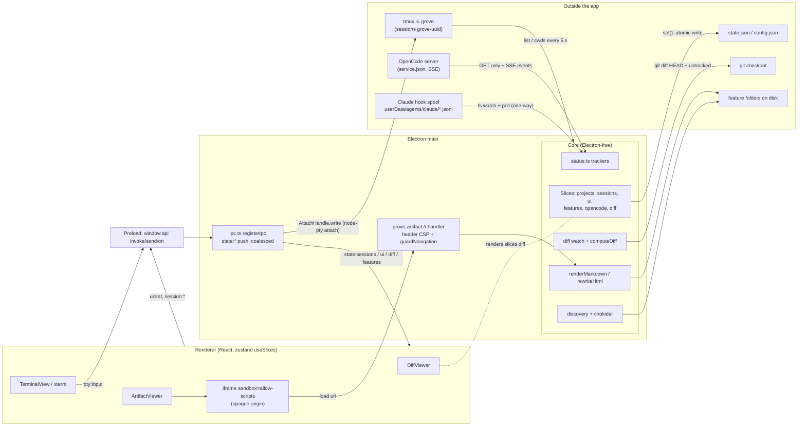

# Review comments — research

## Summary

- The only path for input into a running session is the tmux attach pty (`pty:input` → `AttachHandle.write`). The tmux backend has no `send-keys`, buffer or `capture-pane` call (src/core/backend/types.ts:9-17; src/main/ipc.ts:73).
- The app uses only GET endpoints of OpenCode's server. The server's spec also offers `POST /api/session/{id}/prompt` and related operations. Claude Code sessions are reachable only through the pty; the hook spool carries data one way, from Claude to the app.
- Status (`working`/`waiting`/`idle`) comes from agent events per kind. `gone` comes from tmux liveness, polled every 5 s. Status is live-only and is pushed to the renderer in the `sessions` slice.
- The session diff is a checkout-wide `git diff HEAD` plus untracked files. Line identity is `(path, side, number)`. Only the on-screen diff exists, and it is not persisted.
- Markdown artifacts are rendered in main to HTML that has no source-line mapping. They are served over `grove-artifact://` into an opaque sandboxed iframe. No injected app script and no `postMessage` channel exist.
- No code, types, IPC or store exist for comments, drafts or a review tray. They exist only in the glossary, ADR 0008/0009/0020, the epic design, and the superseded child `2026-10-05-06-artifact-comments`.

## Answers

### 1. tmux backend surface for a running session

- `SessionBackend` has `ensureConfig`, `create`, `setColors`, `list`, `cwds`, `kill` and `attach`. `AttachHandle` has `onData`, `onExit`, `write`, `resize` and `kill` (src/core/backend/types.ts:1-17). `HerdrBackend` throws "not implemented" in every method (src/core/backend/herdr.ts:3-14).
- Every command is `execFile(tmuxPath, ['-L', socket, ...args])` (src/core/backend/tmux.ts:25-28). The socket is `grove` and the config is `resources/tmux.conf` (src/main/index.ts:28-33). Commands per method:
  - `create`: `new-session -d -s <name> -c <cwd> -x -y [-- argv]` (tmux.ts:39-45)
  - `setColors`: `select-pane -P` (tmux.ts:47-50)
  - `list`: `list-sessions` with `#{pane_dead}`; dead panes excluded (tmux.ts:52-61)
  - `cwds`: `#{pane_current_path}` (tmux.ts:63-71)
  - `kill`: `kill-session` (tmux.ts:73-81)
  - `ensureConfig`: `source-file` when a server exists (tmux.ts:30-37)
- Session names are `grove-<uuid>` (src/core/sessions.ts:17). Targets use the exact `=name` form (tmux.ts:49, 75, 85).
- Input path: `attach` spawns a node-pty running `tmux attach-session -t =<name>` (tmux.ts:83-91). `write` is `p.write(d)` (tmux.ts:96). Renderer keystrokes travel over `pty:input` (src/renderer/src/components/TerminalView.tsx:45; src/main/ipc.ts:73). Only one attach is live at a time; earlier ones are killed (ipc.ts:54-59).
- None of `send-keys`, `set-buffer`, `paste-buffer`, `load-buffer` or `capture-pane` appears under `src/`. Untracked spike scripts do exercise `send-keys -l/-H`, `set-buffer` + `paste-buffer -p` and bracketed paste into the OpenCode TUI. They record no results (spikes/tmux-opencode/q5-opencode-paste.sh:12-25; spikes/opencode/common.sh:7).
- Errors:
  - `list`/`cwds` return empty on "no server running"/"error connecting" and rethrow anything else (tmux.ts:16, 57-60, 67-70).
  - `kill` swallows a missing session (tmux.ts:76-79).
  - `create`/`setColors` reject.
  - `attach` to a missing session exits and fires `pty:exit` (ipc.ts:64-67).
- `checkLiveness` ignores `list()` errors and reconciles absent sessions to `gone` with `endedAt` (src/core/core.ts:279-285; sessions.ts:29-37, 53-55). It runs every 5 s, on window focus and on attach exit (core.ts:594-597, 614-631; src/main/index.ts:89-92).
- tmux.conf sets `remain-on-exit failed`, `history-limit 50000`, `allow-passthrough on`, `escape-time 10` and `focus-events on` (resources/tmux.conf).

### 2. OpenCode server API: used and offered

- Connection: url and password come from `$XDG_STATE_HOME/opencode/service.json`, with Basic auth `opencode:<password>` (src/core/opencode/client.ts:8-10, 152-153).
- The app makes GET calls only:
  - `/api/info` (client.ts:154-157)
  - `/api/event` SSE, aborted after 45 s of silence (client.ts:159-172)
  - `/api/session/active`, `/api/session/:id`, `/:id/permission`, `/:id/form` (client.ts:81-86)
  - `/api/session?parentID=` (client.ts:94)
  - `/:id/message?limit=200`, up to 5 pages (client.ts:100-113)
- Requests time out after 5 s (client.ts:73). Reconnect backs off from 1 s to 10 s, and a change to `service.json` forces a reconnect (client.ts:59, 127-148). ADR 0005 names different re-sync endpoints than the code uses (docs/adr/0005:27-28 vs client.ts:86).
- Events read: `permission.*`, `form.*`, `session.created` (with a parent), `session.execution.*`, and `session.tool.*` for write/edit/patch (src/core/opencode/normalise.ts:22-44, 86-114). These are 2.0.20 shapes of an "Experimental API" (normalise.ts:3). Other versions get an "untested version" banner (src/renderer/src/sessionStatus.ts:59-68).
- Launch is `opencode -s <id>` for both start and resume (client.ts:48-54), wrapped in a login shell (src/core/env.ts:41-43).
- Offered by the installed 2.0.20 server's OpenAPI ("Experimental HttpApi surface", read via `opencode api GET /openapi.json`; no SDK in node_modules):
  - `POST /api/session/{id}/prompt`: `{text, files, agents, skills, metadata, delivery: steer|queue|null, resume, id}`; returns 200/400/401/404/409.
  - `POST .../command`, `.../synthetic` and `.../interrupt`.
  - `POST .../permission/{requestID}/reply` and `.../form/{formID}/reply`.
  - Inbox GET/DELETE/PATCH.
  - `GET .../diff?from&to&context`, a per-turn structured diff.
  - Also shell, compact, fork, revert, PATCH and DELETE.
  - The CLI equivalents are `opencode api …` and `opencode run -s <id> <message>`.

### 3. Claude Code launch and outside channels

- Start: `claude --session-id <uuid> --settings <hooks-json>`. Resume: `claude --resume <resumeId ?? id> --settings …` (src/core/claude/hooks.ts:30-33). `resumeId` is the latest `SessionStart` `session_id`, which changes after `/clear` (src/core/claude/normalise.ts:96-98; src/core/claude/source.ts:26-28). Both are wrapped as `$SHELL -l -i -c 'exec claude …'` (env.ts:40-43; core.ts:489, 526).
- Hooks (5 s timeout, hooks.ts:3-26): SessionStart, UserPromptSubmit, PermissionRequest, PreToolUse(AskUserQuestion), PostToolUse(Write|Edit|MultiEdit|NotebookEdit|AskUserQuestion), PostToolUseFailure, PostToolBatch, Stop, StopFailure, Notification(idle_prompt).
- Each hook appends `{"t","e"}` to `<userData>/agents/claude/<id>.jsonl` (hooks.ts:18-21; src/main/index.ts:36; source.ts:65-67). The directory has mode 0700 (src/core/claude/spool.ts:76).
- Environment: tmux gets `minimalEnv` (env.ts:9-18), and the session re-reads the full environment through the login shell (ADR 0010).
- Outside channels in the app: only the attach pty (ipc.ts:73; tmux.ts:96). The spool is one-way. `claude --help` (v2.1.285) lists `--remote-control`, `--bg` with `attach`/`logs`/`stop`/`respawn`, `-p --input-format stream-json --resume`, `--mcp-config` and `--permission-prompts`. The app uses none of them.

### 4. Session status derivation, latency and availability

- Sources emit `AgentEvent`s (src/core/agents/types.ts:4-11). Core keeps a `SourceState` per kind (core.ts:41-51, 103-105). `apply` folds events into `Tracker{running, pending, idleAt, children}`, and subagent pending items count toward the root (src/core/status.ts:16-32).
- `statusOf` order: permission → `waiting/permission`; question → `waiting/question`; running → `working`; `idleAt > seenAt` → `waiting/done`; otherwise `idle` (status.ts:52-59). `withStatus` strips status while the source is disconnected. With `statusNeedsEvent`, a session also needs a tracker before it gets a status (status.ts:63-76).
- OpenCode (`statusNeedsEvent=false`, client.ts:34): `session.execution.started` sets working, and its end sets `idleAt` (normalise.ts:27-42). On connect, core re-syncs from `snapshot()` and replays queued events (core.ts:376-392, 408-436). On disconnect the status is removed, and an "unreachable" banner shows after 5 s (core.ts:365-369; sessionStatus.ts:62-65). Latency follows SSE push.
- Claude (`statusNeedsEvent=true`, source.ts:13; connected at `start()`, source.ts:30-34):
  - UserPromptSubmit sets running and clears pending.
  - PermissionRequest and PreToolUse(AskUserQuestion) open pending items.
  - PostToolUse/Failure close them and record writes.
  - Main-scope Stop/StopFailure set `idleAt`.
  - `idle_prompt` ends the turn (normalise.ts:38-106).
  - Latency is `fs.watch` plus a 1 s poll (spool.ts:61-94), with one-second timestamps (hooks.ts:19).
- `lastStatus` (`running|gone`) is tmux liveness only, on a 5 s poll (core.ts:279-290, 594-597, 626-629). Terminal sessions have no agent status.
- `seenAt` is set while a session is on screen and persisted (core.ts:324-349). `status`/`waitingFor`/`branch` are stripped before save (core.ts:124-127). `notify` fires on entering waiting while off screen (core.ts:352-363; src/main/index.ts:46-67).
- Available in core as `slices.sessions[].status/.waitingFor` (src/shared/types.ts:19-20), `notify` (core.ts:72), card state (src/core/workflow/derive.ts:66-72) and `slices.opencode` (types.ts:94). In the renderer, via the `state:sessions` push (src/shared/ipc.ts:32; ipc.ts:80-91) into zustand with `waitingSince`/`statusSince` (src/renderer/src/stores/slices.ts:35-40, 56). `shownStatus`/`statusView` rank `gone` > live status > `running` (sessionStatus.ts:7-15).

### 5. Session diff: computation, model, rendering, refresh

- `computeDiff` (src/core/diff/compute.ts:18-43):
  - Runs `rev-parse --show-toplevel`; a non-repo gives `state:'not-git'` (:26-28).
  - Runs `git diff <HEAD|empty-tree> -M --no-color --no-ext-diff --no-relative` (:9, :31-32).
  - Lists `ls-files --others --exclude-standard -z` and reads those files itself (:33, :93-118).
  - Key = sha1(raw diff + untracked names + size:mtime) (:35). Errors give `state:'error'` (:39-41).
- Limits: 200 untracked files are read (:10, :97-99). Files over 1 MB are truncated (:11, :106). A NUL in the first 8000 bytes means binary (:12, :109). Past 20,000 total lines, later hunks are dropped and `truncated=true` (:13, :79-90).
- `setRendered` maps viewable files to `{slug, path}` inside a feature folder, or to `{slug:null, path}` elsewhere in the project (:57-76).
- The git runner sets `GIT_OPTIONAL_LOCKS=0` and `LC_ALL=C`, with a 10 s timeout and a 64 MB buffer (src/core/diff/git.ts:12-25). The directory is the pane cwd while running, else the project path (core.ts:305-314).
- `parseUnifiedDiff` makes one `DiffFile` per section and tracks hunk counts (src/core/diff/parse.ts:14-56). Numbering: context increments both sides, add increments `new`, del increments `old` (:22-34). It handles renames, modes, binary and quoted paths (:59-141). Untracked files become one all-add hunk (:144-154).
- Model (src/shared/types.ts:28-51):
  - `SessionDiff{sessionId, projectId, state, error, root, files, truncated}`
  - `DiffFile{path, oldPath, status, binary, additions, deletions, hunks, truncated, rendered}`
  - `DiffHunk{header, oldStart, newStart, lines}`
  - `DiffLine{kind, text, old, new}`
- Line identity is `(path, side, number)`: add → new, del → old, context → new (types.ts:50; CONTEXT.md "Diff line identity"). The renderer's `lineKey` is `${path}:old:${old}` for del, else `${path}:new:${new}` (src/renderer/src/diffView.ts:8-10). It is used only as the React key (DiffViewer.tsx:90).
- `DiffViewer` renders only a diff whose `sessionId` matches the target (src/renderer/src/components/DiffViewer.tsx:22).
  - Header: Untracked filter, collapse-all, expand and close (:23-47). Collapse state is local per session (:26-27).
  - Body: notice, Loading, not-git, error, no changes, or `FileSection`s (:49-58).
  - Lines are plain text nodes with no highlighting (:64-101).
  - The body never remounts (:12).
- Refresh (src/core/diff/watch.ts):
  - Single-flight with one queued rerun (:20-46). `onChange` fires only when the key changes (:32-35). `target()` emits `null`, then pokes (:49-55).
  - `syncDiff` targets a session only when `ui.viewer.kind==='diff'` (core.ts:318-322).
  - Pokes come from the 5 s tick, any `wrote` event, and `exec-ended` (core.ts:289, 397, 402).

### 6. Artifact rendering, serving and isolation

- `grove-artifact` is a privileged standard and secure scheme (src/main/artifacts.ts:34-36). URLs are `grove-artifact://<projectId>/<slug>/<path>` and `…/<projectId>/~file/<path>` (src/shared/artifactUrl.ts:14-36). Viewable extensions: html, htm, md, png, jpg, jpeg, gif, webp, svg (:6-12).
- `handleArtifacts` (artifacts.ts:38-69):
  - The `assets` host serves only `mermaid.min.js`, `mermaid-init.js` and `markdown.css` (:39-55).
  - Paths go through `core.artifactPath` / `core.filePath` (core.ts:632-639) and `safeArtifactPath`, which allows relative paths only, no dot-segments, realpath inside the root, and regular files (src/core/artifacts/path.ts:6-17).
  - Dispatch is by extension (:60). Refusals get a 404 page (:13-14).
- Every response carries the header CSP `default-src 'none'; script-src grove-artifact://assets; style-src 'unsafe-inline' grove-artifact://assets; img-src grove-artifact: data:; font-src data:; base-uri 'none'; form-action 'none'; sandbox allow-scripts` (artifacts.ts:12, 28-31).
- Markdown (src/core/artifacts/markdown.ts):
  - markdown-it with `html:false` (:7), task-list checkboxes (:11-24), and mermaid fences as `<pre class="mermaid">` (:27-31).
  - `renderMarkdown` renders the frontmatter as a `<table class="frontmatter">` and returns a full document linking `markdown.css`, with `<main class="markdown-body">` (:33-58).
  - The output has no source-position attributes.
- HTML: `rewriteHtml` swaps only the jsdelivr Mermaid script for the bundled one (src/core/artifacts/html.ts:6-11). No `postMessage`, `contentWindow` or `onmessage` appears in src/ or resources/.
- `ArtifactViewer` renders `<iframe sandbox="allow-scripts">` with no same-origin, which gives an opaque origin (src/renderer/src/components/ArtifactViewer.tsx:8, 47). The app CSP allows `frame-src grove-artifact:` (src/renderer/index.html:7-9). `contextIsolation: true` (src/main/index.ts:82).
- `guardNavigation` (artifacts.ts:85-109):
  - Blocks main-frame navigations other than hash changes.
  - Reroutes subframe artifact links through `uiSet`, keeping `fromDiff` (:93-100).
  - Sends http(s) to `shell.openExternal` and denies `window.open`.

### 7. Viewer target: choice, holding, version and disk changes

- `ViewerTarget = ArtifactTarget{projectId, slug, path, hash, fromDiff} | FileTarget{projectId, path, hash, fromDiff} | DiffTarget{sessionId}` (src/shared/types.ts:22-27).
- It is held as `ui.viewer` and persisted in state.json at schemaVersion 3 (types.ts:60-62, 98; core.ts:124-127). The v2→v3 migration and the drop of unknown-session diff targets happen in src/core/store/stateStore.ts:12-30 and core.ts:450-454. Changes go through `ui:set` → `uiSet` → `state:ui` (core.ts:554-564).
- Renderer actions (src/renderer/src/stores/slices.ts:74-85):
  - `openArtifact`: from the FeaturePage list and "Open review" (FeaturePage.tsx:30, 67; viewerFiles.ts:17-22), and from the switcher (App.tsx:126).
  - `openDiff`: from the toggle, ⌥⌘B and "← Diff" (App.tsx:54-55, 88-89, 127; src/main/menu.ts:47).
  - `openRendered`: builds a target with `fromDiff` (slices.ts:76-81).
  - `closeViewer`.
- A `diff` target renders `DiffViewer`, anything else renders `ArtifactViewer` (App.tsx:118-128). The switcher lists only an artifact target's feature files (App.tsx:65, 123; viewerFiles.ts:7-14). `AppShell` places the viewer as a right aside with a splitter (src/renderer/src/components/shell/AppShell.tsx:5, 41-51).
- The viewer receives no frontmatter or `version`. Its props are `target`, `groups`, `mtimeMs` and callbacks (ArtifactViewer.tsx:9-19). `Feature.artifacts` entries are `{name, stage, role, mtimeMs}` (types.ts:87; derive.ts:98). Frontmatter is parsed only for stage derivation (src/core/discovery/folder.ts:41-48, 62-66). `version` is visible only in the rendered frontmatter table (markdown.ts:43-50).
- Disk changes:
  - chokidar watches with `depth:1` and a 200 ms write-finish (src/core/discovery/watcher.ts:12-29), which pushes a new `features` slice with `mtimeMs` (core.ts:192, 208-228).
  - A listed artifact whose mtime changes triggers `onReload` → `viewer:reload`, which reloads `grove-artifact:` subframes (ArtifactViewer.tsx:22-27; App.tsx:124; src/main/ipc.ts:46-51).
  - `file` targets and sub-path files are never auto-reloaded.

### 8. App state: storage, push, IPC and preload

- `Slices = {projects, sessions, ui, features, opencode, diff}` (src/shared/types.ts:95; core.ts:85). `features`, `opencode` and `diff` are live-only (core.ts:217; types.ts:94-95). The glossary lists a future `comments` slice (CONTEXT.md:55-57).
- `set(k, v)` is the single write path (core.ts:114-129):
  - `projects` → config at schemaVersion 1.
  - `sessions`/`ui` → state at schemaVersion 3, with live-only fields stripped.
  - `sessions` also runs `publish()`.
  - Writes are synchronous with no debounce.
- Files: `~/.config/grove/config.json`, `<userData>/state.json` and `<userData>/agents/claude/` (src/main/index.ts:25-26, 36). No `comments/` file exists. ADR 0009 plans `comments/<projectId>.json` (docs/adr/0009-app-state-in-json-files.md:21).
- `atomicWrite` writes a tmp file, then renames it (src/core/store/jsonFile.ts:4-9). `readVersioned`:
  - A missing file gives `empty`.
  - Migrations run step by step.
  - Bad JSON or an unknown version is moved to `.bad-<ms>` and gives `empty` + `onBad` (jsonFile.ts:11-40).
- `loadState` migrates `{1: v1ToV2, 2: v2ToV3}` and applies unversioned fixes (src/core/store/stateStore.ts:6-32). `loadConfig` is v1 with no migrations (src/core/store/configStore.ts:4-6). `onBad` errors surface via `app:errors` (core.ts:569-573).
- Push: `registerIpc` coalesces per `setImmediate` into `state:<key>` pushes (src/main/ipc.ts:80-91; src/shared/ipc.ts:30-40). The renderer's `useSlices.hydrate()` subscribes first, then calls `state:get` (src/renderer/src/stores/slices.ts:34, 52-66). Pushes replace whole slices (ADR 0011).
- Preload exposes `window.api{invoke, send, on}` (src/preload/index.ts:4-14; src/shared/ipc.ts:41-45).
  - Invoke channels: `state:get`, `app:errors`, `project:add|remove`, `session:create|kill|remove|resume|rename|link`, `ui:set`, `viewer:reload`, `pty:attach` (ipc.ts:8-22).
  - Send channels: `pty:input|resize|detach` (ipc.ts:24-28).
  - Results are `Result<T>` (ipc.ts:3; src/main/ipc.ts:18-51).
- The core `Commands` interface is at core.ts:55-65. `uiSet` shallow-merges with no validation beyond focus exclusivity (core.ts:554-564).

### 9. Comments, drafts and review tray: existing code and records

- Code: none. Greps for comment, draft and tray in `src/` find only unrelated hits (e.g. src/core/workflow/derive.test.ts:44; src/core/opencode/client.test.ts:18). `Slices`, `PushMap` and `InvokeMap` have no comments entry (src/shared/types.ts:95; src/shared/ipc.ts:8-40). There is no `postMessage` or `getSelection` code. `Session.action` is always null (types.ts:13).
- Existing data usable as anchors: diff line identity (types.ts:50-51; CONTEXT.md:101-102), `ArtifactTarget`/`FileTarget` `projectId/slug/path` (types.ts:22-24), and `Feature.artifacts` without `version` (types.ts:87).
- Glossary: Comment draft and Review tray (CONTEXT.md:51-54), plus the future `comments` slice (CONTEXT.md:55-57).
- ADR 0008 (Accepted, docs/adr/0008-in-app-inline-comments.md:18-34):
  - An injected script handles selection, a popover and highlights over `postMessage`.
  - Anchor = path + `version` + quote + prefix/suffix (TextQuoteSelector), with fuzzy re-attach and orphans.
  - Drafts live in a per-feature tray.
  - "Send to agent" fills `{feedback}`, then either pastes into a linked idle session or starts the `needs_input` action.
  - Sent comments are kept with their version.
  - The cut fallback is side-panel comments.
- ADR 0007 allows one app script using `postMessage` (docs/adr/0007-artifact-protocol-with-header-csp.md:25-26).
- ADR 0009 plans `comments/<projectId>.json` for "hundreds of comments" (:12-15, 21).
- ADR 0020:
  - Defines review comments as "several comments on diff lines and on markdown artifacts, collected in a tray and sent together to one session as a single message" (docs/adr/0020-sessions-and-review-before-workflow.md:33-35).
  - Supersedes child 6 (:43-45).
  - Has review comments build its own send path by typing into the tmux pane (:53-54).
  - The working tree holds an uncommitted edit to ADR 0020 stating that a Grove CLI reuses that send path (:36-39).
- Superseded child `2026-10-05-06-artifact-comments` holds only `feature.md`:
  - Planned outcome: select text and comment; drafts with TextQuoteSelector + version; orphans; a tray whose Send makes one `{feedback}` revise prompt through child 5's send path; never auto-send (feature.md:19).
  - Scope E-D7–E-D9, depending on children 4 and 5, sized 4–6 days (:23-31).
  - Superseded on 2026-10-07 (:33-39).
- Epic design v6 (docs/work/2026-10-05-opencode-feature-workspace/03-design.md):
  - Explicit-send comments as one revise prompt (:44-47); the app writes only its own state (:48); no auto-send (:56, 59).
  - `revise` is `/grove-{stage} {slug} {feedback}` with `needs_input` (:88, 93).
  - Store `{schemaVersion, comments:[Comment]}` (:154). `Comment{id, projectId, featureSlug, artifact, artifactVersion, anchor{exact,prefix,suffix}, body, state, createdAt, sentAt, sentTo}` (:158-159).
  - Flow diagram (:164-171); orphans stay sendable (:175, 222); follow-ups go by "bracketed paste + Enter via the backend" (:203); cut 5 (:239).
- Epic structure v6: child 6 (04-structure.md:195-211) depends on children 4 and 5 (:40-41, 208). Child 5 pastes follow-ups into an idle linked session (:181-185).

### 10. Session ↔ project, cwd, feature, diff and artifact

- `Session.projectId` is set at creation (sessions.ts:10-27). tmux starts in `project.path` on create and resume (core.ts:490, 527).
- The cwd is not stored. `pane_current_path` is read into `lastCwds` every 5 s and gives the live `branch` (core.ts:292-302; sessions.ts:40-51; src/core/git.ts:6-16).
- `Session.feature` is one slug or null, and `linkPinned` marks a manual link (types.ts:11-12; core.ts:543-552).
  - Auto-link uses write paths, and the last match wins (src/core/autolink.ts:20-32; core.ts:236-249). Pending folders are held (core.ts:243-260). Re-sync catches up from `lastWrites` (core.ts:262-277). Subagent writes go to the root (core.ts:238).
  - The renderer's `linkedSessions` and `linkedFeature` filter by `projectId` + slug (src/renderer/src/tree.ts:44-51).
- Diff: keyed by `sessionId`, but it covers the whole checkout, so sessions sharing a checkout share one diff (core.ts:304-314, 397; compute.ts:18-43; CONTEXT.md "Session diff"). No per-session line attribution exists, and only one diff exists at a time (core.ts:316-322; watch.ts:10-61).
- Artifacts belong to a feature, not a session. Each source keeps only the latest write per session (Claude normalise.ts:10, 82; OpenCode normalise.ts:118-132; ADR 0006:32-33). An artifact therefore traces to the sessions linked to its feature, possibly several. A file or line does not trace to one session.
- OpenCode's per-session `GET /api/session/{id}/diff` exists and is unused.

## Current architecture

## Existing patterns to reuse

- Agent-kind differences are handled by per-kind sources emitting a shared `AgentEvent` (src/core/agents/types.ts:4-11) and folded by `status.ts` (status.ts:16-76).
- A versioned JSON file with migrations is done by `readVersioned` + `atomicWrite` (src/core/store/jsonFile.ts:4-40), as in `loadState` (src/core/store/stateStore.ts:19-32).
- New state reaches the renderer through a slice in `Slices`, `set(k, v)` and the coalesced `state:<key>` push (core.ts:114-129; src/main/ipc.ts:80-91; src/renderer/src/stores/slices.ts:52-66).
- Renderer → core actions are typed invoke channels returning `Result<T>` (src/shared/ipc.ts:3, 8-22; src/main/ipc.ts:18-51), backed by the core `Commands` interface (core.ts:55-65).
- Live-only fields are stripped before persisting in `set` (core.ts:124-127).
- Dropping state that refers to unknown sessions is done in `loadState` and on session drop (stateStore.ts:26-30; core.ts:450-454).
- Waiting-state notification while off screen is done by `notify` → OS notification (core.ts:352-363; src/main/index.ts:46-67).
- Stable diff-line keys are built by `lineKey` (src/renderer/src/diffView.ts:8-10).
- Iframe navigation is turned into viewer-target changes by `guardNavigation` → `uiSet` (src/main/artifacts.ts:93-100).
- Bundled scripts are allowlisted for artifacts on the `assets` host (artifacts.ts:39-55), and HTML is rewritten in `rewriteHtml` (src/core/artifacts/html.ts:6-11).
- Reloading the viewer on disk change is done by `mtimeMs` → `viewer:reload` (ArtifactViewer.tsx:22-27; src/main/ipc.ts:46-51).
- Login-shell quoting for any spawned command is done by one helper (src/core/env.ts:36-43).
- tmux error tolerance uses stderr pattern matching (tmux.ts:16, 57-60, 76-79).

## Constraints & invariants

- Core in main is the single writer of app state. Writes are atomic and every file carries a `schemaVersion` (ADR 0009; jsonFile.ts:4-9). An unknown version is moved aside, not fatal (jsonFile.ts:36-39).
- The app never writes into repos (ADR 0009:13; epic design :48). Comments never auto-send (ADR 0008; epic design :59).
- Core is Electron-free (ADR 0004). IPC wiring lives in src/main/ipc.ts.
- Slices are pushed whole, one push per tick per slice. Mutations go through `invoke` and come back by push (ADR 0011).
- `status`, `waitingFor`, `branch`, `features`, `opencode` and `diff` are never persisted (core.ts:124-127, 217; types.ts:94-95).
- Only one pty attach is live at a time, and closing it never ends the session (ipc.ts:55-59; CONTEXT.md "Attach"). tmux targets use exact `=name`. A dead pane counts as not live (tmux.ts:54-56).
- Agent sources connect independently (ADR 0019). Claude status needs a first spool record (source.ts:40). Removing a Claude session deletes its spool (source.ts:50-59). `service.json` holds a password and is never logged (client.ts:7).
- Only one diff exists, and only while the viewer shows a diff. It is pushed on key change, with `null` first on retarget. Diff lines are text nodes, and the body never remounts. Collapse and Untracked state are renderer-local.
- Line identity is `(path, side, number)`, and `DiffFile.path` is the new path for renames (types.ts:50).
- Artifact iframes are opaque and sandboxed. Scripts come only from `grove-artifact://assets`, and there is no network (artifacts.ts:12). Markdown raw HTML is escaped, and the rendered HTML has no source-line mapping.
- Path safety: relative POSIX only, no dot-segments, realpath inside the root, regular file (path.ts:6-17). `~file` shadows a feature folder of that name.
- `uiSet` accepts any `Partial<UiState>` with only focus-exclusivity checks (core.ts:554-560).
- Git runs with `GIT_OPTIONAL_LOCKS=0`, a 10 s timeout and a 64 MB buffer (src/core/diff/git.ts:11-24).

## Test landscape

- Run with `npm test` (`vitest run`, environment `node`, `include: src/**/*.test.ts`, 15 s timeout; vitest.config.ts:12-13). Typecheck with `npm run typecheck`.
- Core units: src/core/backend/tmux.test.ts (real tmux, skipped without it, line 16); src/core/opencode/{client,normalise}.test.ts; src/core/claude/{hooks,normalise,source,spool}.test.ts (fixtures `capture-2.1.285*.jsonl`); src/core/{status,sessions,autolink,env,features,projects}.test.ts (features covers uiSet focus and state writes).
- Diff and artifacts: src/core/diff/{compute,parse,watch,core}.test.ts (compute and core tests import the helper src/core/testing/gitRepo.ts); src/core/artifacts/{markdown,html,path}.test.ts; src/shared/artifactUrl.test.ts.
- Store: src/core/store/{jsonFile,stateStore,configStore}.test.ts. Renderer units: src/renderer/src/*.test.ts (sessionStatus, diffView, viewerFiles, navigation, tree, tags, noInlineStyles).
- Harness: `setupCore()` with temp config/state, FakeBackend, FakeWatchers and FakeAgentSource (src/core/testing/setup.ts:18-38; fakeBackend.ts; fakeAgentSource.ts).
- Not covered: src/main/artifacts.ts (protocol, guard), ArtifactViewer.tsx, DiffViewer.tsx. No DOM test environment is configured. No comment tests exist.

## Relevant ADRs

- Infrastructure: 0003 tmux dedicated-socket backend; 0004 core in Electron main; 0010 session env via login shell; 0011 slice snapshots to renderer; 0012 CSS modules and tokens; 0013 YAML core schema, own frontmatter splitter.
- Sessions and status: 0005 OpenCode status over SSE (its re-sync endpoints differ from the code); 0006 link sessions by write events (only the latest write kept); 0015 live status with persisted seen mark; 0016 Claude status from hook spool files; 0017 agent-neutral session id, first state migration; 0019 per-source state.
- Artifacts and diff: 0007 artifact protocol with header CSP (permits one injected `postMessage` app script, not implemented); 0021 session diff and diff line identity; 0022 viewer serves project files (`~file`).
- Comments: 0008 in-app inline comments (TextQuoteSelector + version anchors, tray, explicit send by paste into a linked idle session; not implemented); 0009 app state in JSON files (plans `comments/<projectId>.json`); 0020 sessions and review before workflow (defines review comments, supersedes child 6, own send path by typing into the tmux pane; an uncommitted working-tree edit adds that the Grove CLI reuses it).

## Unknowns

- Whether a TUI attached to an OpenCode session picks up a prompt POSTed to `POST /api/session/{id}/prompt` from outside was not determined from code or the spec. Resolved by a live run against a TUI-held session. The existing spikes/opencode/q3-*.sh test only `--prompt` at launch.
- Whether any `claude` channel (`--remote-control`, `--bg attach`, `-p --resume`, stream-json input) can inject input into an already-running interactive TUI launched without those flags was not determined. Resolved by the Claude Code documentation or a spike.
- The outcome of tmux `send-keys -l/-H` and `set-buffer`/`paste-buffer -p` (bracketed paste) into the OpenCode and Claude TUIs is unrecorded. The spike scripts exist without results (spikes/tmux-opencode/q5-opencode-paste.sh:12-25). Resolved by running them and recording results.

## Open questions
