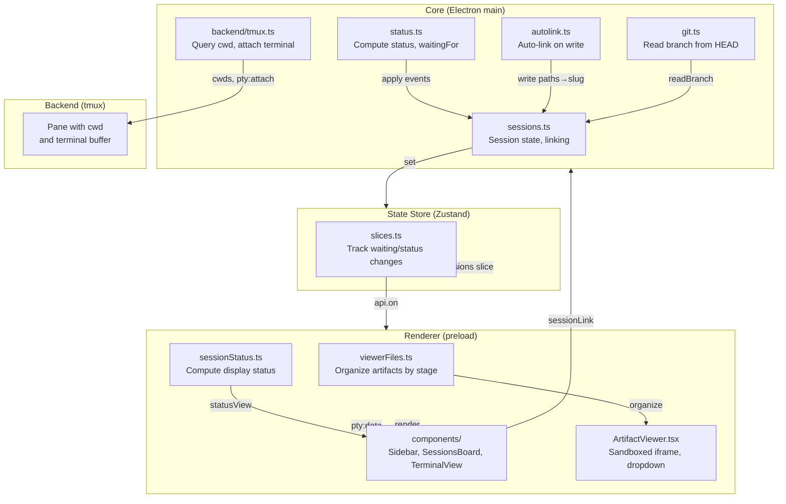

# Session diff — research

## Summary

Session display uses a component-based architecture where terminal output and
metadata (status, branch, linked feature) are rendered separately. The core
pushes session state updates as Zustand slices to the renderer. Git
integration exists only for branch reading from HEAD files; no diff tools are
currently used. Artifacts display in a right-side sandboxed iframe viewer with
a dropdown switcher. Sessions auto-link to features when they write into
`docs/work/` folders. Non-git sessions gracefully handle the lack of repo by
omitting branch info.

## Answers

### Q1: Session viewer display

The TerminalView component renders terminal output via xterm.js:
- Attaches to tmux session using `pty:attach` and receives streaming data via
  `pty:data` events, writing to the terminal `term.write(p.data)`
  (`src/renderer/src/components/TerminalView.tsx:8-82`, lines 38-40, 47).
- Handles session exit via `pty:exit` events (`src/renderer/src/components/TerminalView.tsx:42-44`).

Session metadata displays in two contexts:
1. **Sidebar cards** show label, kind icon, linked feature (title and stage),
   git branch if present, and status (working/waiting/idle). Status is computed
   via `statusView()` which returns label and tone based on the last recorded
   status or live agent status, with a `waitingFor` reason if waiting
   (`src/renderer/src/sessionStatus.ts:7-15`, `src/renderer/src/components/Sidebar.tsx:22-99`).
2. **Sessions board** groups sessions by status column, showing label, icon,
   linked feature tag, and elapsed time in current status (`src/renderer/src/components/SessionsBoard.tsx:12-57`, line 47).

### Q2: Working directory and git integration

Sessions start with a project path as working directory (`src/core/core.ts:453, 490`,
`cwd: project.path`). The backend queries current directory via `cwds()` which
walks the tmux pane to get the session's cwd at any time
(`src/core/backend/tmux.ts:63-71`).

Branch detection reads `.git` folder or worktree `.git` files without spawning
git. `readBranch(dir)` walks up the directory tree and follows `gitdir: …`
pointers in worktree `.git` files to find the branch
(`src/core/git.ts:6-26`). Branch is refreshed on each liveness check
(`src/core/core.ts:284-293`).

Worktrees are partially supported: the code can follow worktree `.git` file
pointers, but one checkout per session (ADR 0020) means all sessions on the
same project see a shared working directory today. Per-session worktrees are
planned for a later phase.

### Q3: Git diff tools or libraries

**No git diff tools or libraries are currently used** in the codebase.
`package.json` has no git diff dependencies. The only git interaction is
reading branch names from HEAD files (`src/core/git.ts`). Patch/write
detection comes from pattern matching on agent event text, not git
(`src/core/opencode/normalise.ts:79-90`).

### Q4: Renderer refresh on session state change

Session state updates flow from core to renderer as Zustand slices:
- Core pushes updates via `api.on('state:sessions', setSessions)`
  (`src/renderer/src/stores/slices.ts:52`).
- `setSessions()` updates sessions and recomputes tracking metadata: `trackWaiting()`
  records when each session started waiting, `trackStatus()` records when it
  entered its current status (`src/renderer/src/stores/slices.ts:32-37`).
- Updates trigger Zustand re-renders. Status change detection in `trackStatus()`
  only updates the object if status changed, enabling same-array optimization
  for unchanged sessions (`src/renderer/src/sessionStatus.ts:29-38`, line 36).

When a session event arrives (exec-started, exec-ended, permission/question):
- Core calls `onEvent()` which applies the event to trackers via `apply()`,
  recomputes session status and waitingFor via `withStatus()`, then pushes
  to renderer via `set('sessions', next)` (`src/core/core.ts:342-374`).

When a focused session's window refreshes, if it's an agent and is waiting,
it's marked as seen via `markSeen()`, updating `seenAt`, which is pushed back
to the renderer (`src/core/core.ts:306-320`, `src/core/sessions.ts:57-59`).

### Q5: Artifact display

Artifacts display in a resizable right-side panel using an opaque sandboxed
iframe (`src/renderer/src/components/ArtifactViewer.tsx:8, 45`). A dropdown
switcher selects which artifact to view; artifacts are organized into file
groups by workflow stage in workflow order, with an "Other" group for untagged
files (`src/renderer/src/viewerFiles.ts:7-13`, `src/renderer/src/components/ArtifactViewer.tsx:33`).

Opening an artifact via `openArtifact()` sets `ui.viewer` to a ViewerTarget
with the projectId, slug, artifact path, and scroll hash
(`src/renderer/src/App.tsx:69`). The panel has expand/collapse and close buttons
and is resizable via a vertical splitter; both viewer and content have 320px
minimum width (`src/renderer/src/components/ArtifactViewer.tsx:41-43`,
`src/renderer/src/components/shell/AppShell.tsx:47-51`).

### Q6: Session/feature linking logic

Sessions have a `feature: string | null` field for the linked slug and a
`linkPinned: boolean` field (true = manually linked, false = auto-linked)
(`src/shared/types.ts:11-12`).

**Auto-linking:** When a session writes files, `linkWrite()` extracts the
feature slug from the file path (first segment under the feature root via
`slugFor()`) and applies it via `autoLink()` which sets the slug while leaving
`linkPinned` unchanged (`src/core/autolink.ts:22-31`, `src/core/sessions.ts:61-63`,
`src/core/core.ts:236-239`). If the feature hasn't been discovered yet, the
slug is held in a map; it's applied once discovery lists the feature via
`applyHeld()` (`src/core/core.ts:244-252`). On connection or resume, catch-up
auto-linking calls `linkWrite()` on any writes the agent made while Grove
wasn't listening (`src/core/core.ts:256-269`).

**Manual linking:** The `sessionLink()` command accepts a session id and optional
slug. `link()` sets both `feature` and `linkPinned: true`, pinning the link and
stopping auto-linking (`src/core/core.ts:506-515`, `src/core/sessions.ts:69-71`).

**Link display:** `linkedFeature()` looks up the feature object by matching
projectId and slug. The sidebar displays the linked feature's title, stage,
and color tag (`src/renderer/src/tree.ts:50-51`, `src/renderer/src/components/Sidebar.tsx:181-186`).

### Q7: Non-git sessions

`readBranch()` returns `null` when no `.git` folder is found at any ancestor
level (`src/core/git.test.ts:35-37`). The Session `branch` field is optional
and never persisted (`src/shared/types.ts:18`). The UI conditionally renders
branch display only if `s.branch` exists. Non-git sessions function normally
with all other features; branch display is simply absent.

## Current architecture

## Existing patterns to reuse

1. **State push via Zustand slices** (`src/renderer/src/stores/slices.ts`):
   When diff state changes, it can be pushed as a new slice or added to the
   existing `sessions` slice. The renderer subscribes via `api.on()` and
   re-renders on change.

2. **Artifact viewer as a switcher** (`src/renderer/src/components/ArtifactViewer.tsx`):
   The diff can be added as another tab-like option in the viewer's dropdown,
   coexisting with other artifacts. Same resizable panel, same open/close
   behavior.

3. **Keyboard shortcut binding** (`src/renderer/src/`):
   New shortcuts can be added to the app's keyboard handler following the
   existing pattern (e.g., ⌘B for project page, ⌘Option+D for diff).

4. **Optional session fields** (`src/shared/types.ts`):
   Session fields like `branch` are optional. A `diff` or similar field can
   be added as optional and gracefully omitted if not available.

5. **Computed vs. stored** (`src/core/status.ts`, `src/core/sessions.ts`):
   Status is computed on every state update, not stored separately. Diff
   computation can follow this pattern: compute on demand or on session event,
   don't persist in the session object.

## Constraints & invariants

1. **Single working directory per project:** Today, all sessions on a project
   share one checkout. Diff is computed from the project's current working
   directory, not per-session. Multiple parallel sessions will see each
   other's changes in the same diff (ADR 0020, consequences).

2. **Diff against HEAD only:** The research questions mention multiple base
   options (HEAD, merge-base, session start commit), but for this phase the
   diff is against HEAD — the currently checked-out commit (ADR 0020, step 3).

3. **Untracked files included:** The diff must include untracked files (files
   not yet added to git). Git diff by default shows only tracked-file changes;
   untracked files need separate enumeration.

4. **Graceful degradation for non-git repos:** Sessions without a `.git` repo
   must not error; they show an empty or disabled state for the diff.

5. **Refresh on session event or polling:** The diff can be refreshed when a
   session event arrives (exec-ended, exec-started) or via polling. Polling
   is the safer default to catch changes made outside the agent (manual edits,
   concurrent work). Live update via session event is stricter (only agent
   events) but cheaper.

6. **Keyboard shortcut Cmd+Option+B:** A quick key must exist to toggle to
   the diff viewer without a mouse. This takes precedence over artifact
   selection.

## Test landscape

**Existing session tests:**
- `src/core/sessions.test.ts` — session creation, linking, pinning, unlink,
  catch-up auto-linking on write (`linkWrite()` tests).
- `src/core/git.test.ts` — branch reading from HEAD, `.git` file walking,
  worktree `.git` file following.
- `src/renderer/src/sessionStatus.test.ts` — status computation, waitingFor
  labels, tone assignment based on status.
- `src/renderer/src/navigation.test.ts` — sidebar and sessions board rendering,
  session card display.

**What's missing for diff:**
- Git diff computation (no existing diff tests).
- Diff display in the artifact viewer (UI component test).
- Diff state flow from core to renderer (integration test of the slice).
- Keyboard shortcut Cmd+Option+B (end-to-end test).

## Relevant ADRs

- **ADR 0020** — Sessions and review come first; session diff is step 3 of
  the re-scope, after Claude Code sessions and before review comments.
- **ADR 0006** — Link sessions by file write events; describes the auto-linking
  mechanism that links a session to a feature when it writes into `docs/work/`.
- **ADR 0007** — Artifact protocol with header CSP; the artifact viewer is
  sandboxed with opaque origin.
- **ADR 0011** — Slice snapshots to renderer; session state flows as Zustand
  slices.
- **ADR 0015** — Live session status with persisted seen mark; session status
  and seenAt are tracked.

## Unknowns

1. **Diff refresh cadence:** Should the diff be recomputed continuously while
   an agent works (polling), or only when a session event arrives? Polling is
   safer but more expensive; events are stricter but miss non-agent changes.

2. **Diff computation library:** Node.js has no built-in git diff; options are
   spawning `git diff`, using a library like `simple-git`, or parsing diff
   output from a command. Each has trade-offs (spawn overhead, dependency
   weight, parsing complexity).

3. **Diff storage and caching:** Should the diff be stored in the session
   object, recomputed on demand, or cached with a stale time? Storage bloats
   the state slice; recompute on every render is expensive; caching adds
   complexity.

4. **UI for large diffs:** If a session creates many changes, a large diff
   viewer could be hard to navigate. Truncation, folding, or search would be
   needed. Current scope assumes minimal diffs for now.

5. **Diff line numbering and anchoring:** Review comments (`2026-10-07-review-comments`)
   will anchor comments to diff lines. The diff must have stable line numbers
   and a way to locate a line by hash or content.

## Open questions

(None yet — research answers all factual questions. Product decisions are in
`01-questions.md`'s Product questions section.)
