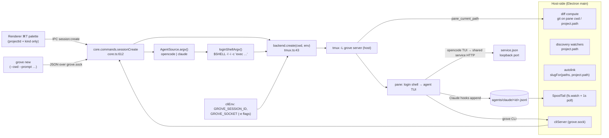

# Agent session sandboxing — research

Answers `01-questions.md` § "Research questions" (11 items; the source
numbering has two Q4s, answered as 4a and 4b). Facts as of `repo_heads`,
each cited.

## Summary

Grove launches every session through one pipeline: `AgentSource.argv()` → `loginShellArgv()`
→ `TmuxBackend.create()` → `tmux new-session -- argv` (`src/core/core.ts:634-637`,
`src/core/env.ts:42-46`, `src/core/backend/tmux.ts:43-50`). tmux, the attach clients and all
of core run on the host; only the pane's leaf command is the agent. The pane's environment
carries exactly two injected variables (`GROVE_SESSION_ID`, `GROVE_SOCKET`); the Claude
hook-spool path reaches the pane as text inside the launch argv, not as an env var. The
`grove` CLI speaks JSON over `<userData>/grove.sock`. Host-side subsystems (diff, discovery,
autolink, spool tailing) resolve paths from `project.path` or the pane's reported cwd, so a
session's directory must remain a real host-visible path. Every session-creation path
converges on the single `sessionCreate` command.

## Answers

### 1. How a session's argv is constructed

- Each agent kind builds its argv behind `AgentSource.argv(id, mode, opts)`
  (`src/core/agents/types.ts:38`):
  - OpenCode: `['opencode', '-s', id, ...(--prompt)]`; resume uses the same form
    (`src/core/opencode/client.ts:52-54`).
  - Claude: `claudeArgv()` → `['claude', --session-id | --resume, '--settings', <hooks
    JSON>, ...(--name), prompt]` (`src/core/claude/source.ts:26-28`,
    `src/core/claude/hooks.ts:51-55`).
- `loginShellArgv(argv, opts)` wraps it in the user's login shell: `[shell, '-l', '-i',
  '-c', 'export PATH=<binDir>:"$PATH"; exec <argv>']` (`src/core/env.ts:42-46`), one quoting
  helper for all args (`src/core/env.ts:36-38`); `pathPrefix` runs after the rc files so
  they cannot hide it (`src/core/env.ts:44`).
- Core calls it at creation (`src/core/core.ts:634-637`) and resume
  (`src/core/core.ts:684-685`), passing the result straight to
  `backend.create({ ..., argv, env: cliEnv(session) })`. The pane therefore
  always executes `$SHELL -l -i -c 'exec <command>'` — a single `exec` leaf.
- Terminal sessions pass no argv (`argv` is `undefined`, `src/core/core.ts:636`);
  tmux falls back to its default login shell (`src/core/backend/tmux.ts:48`), and a first
  prompt is typed in via the send path once the pane is stable
  (`src/core/core.ts:645-650`).

### 2. What `cliEnv(session)` injects, and what must stay reachable

- `cliEnv` returns exactly (`src/core/core.ts:166-174`): `GROVE_SESSION_ID`
  = the app's session id (:170), `GROVE_SOCKET` = `<userData>/grove.sock`
  (:171, built at `src/main/index.ts:58`), `PATH` = `<binDir>:<minimal
  PATH>` — **terminal sessions only** (:172) — or `undefined` when core
  was built without `sessionEnv` (:167-168).
- Agent sessions get their `PATH` (with the `grove` launcher dir prefixed) through
  `loginShellArgv`'s `pathPrefix` instead (`src/core/core.ts:175`, `src/core/env.ts:44`).
  Tests pin both shapes: terminal env includes PATH, agent env is `{GROVE_SESSION_ID,
  GROVE_SOCKET}` and argv starts with `export PATH=…; exec`
  (`src/core/cliEnv.test.ts:15-33`).
- Facts about what a pane must be able to reach for existing features:
  - **`GROVE_SOCKET`**: without it the `grove` CLI exits with a usage error
    (`src/cli/index.ts:59-63`); it is the socket core listens on while the app runs (ADR
    0027).
  - **`GROVE_SESSION_ID`**: the CLI's identity — `grove ls` highlights the calling session
    with it (`src/cli/index.ts:23`); ADR 0027 records both variables injected via `tmux
    new-session -e`.
  - **`PATH` including `binDir`**: that dir holds the `grove` executable
    (`src/main/index.ts:60`, ADR 0027).
  - **Claude hook-spool path**: *not* an env var — text inside the `--settings` JSON
    argument (`src/core/claude/hooks.ts:41,47`), written from inside the pane (see 3).
  - **OpenCode's shared service**: the TUI joins the shared service whose URL and password
    live in `~/.local/state/opencode/service.json` (`src/core/opencode/client.ts:8-10`, ADR
    0005:14-16) — a loopback HTTP port plus a file under the user's home.

### 3. (source item 3) How the hook-spool mechanism works for Claude sessions

- **Writer — shell commands running inside the pane.** Every Claude launch carries
  `--settings <JSON>` (`src/core/claude/hooks.ts:54`) whose `hooks` block maps each event
  (SessionStart, PermissionRequest, Pre/PostToolUse, Stop, …) to an inline shell command:
  `x=$(cat); printf '{"t":…,"e":%s}\n' … >> <spool>` (`src/core/claude/hooks.ts:39-48`);
  `PostToolBatch` appends a marker line instead (`src/core/claude/hooks.ts:42`). The
  `statusLine` command appends a slim `StatusLine` record via `jq`, then runs the user's own
  statusline (`src/core/claude/hooks.ts:27-37`). Claude executes these as hook subprocesses
  in the pane; the spool path is fixed at launch as literal text inside the settings
  argument.
- **File**: `<dir>/<id>.jsonl`, where `dir` is `<userData>/agents/claude`
  (`src/main/index.ts:76`) and `id` is the app-minted session UUID (`src/core/claude/source.ts:22-24,65-67`).
- **Reader — host-side.** `SpoolClaude` owns a `SpoolTail` over that dir
  (`src/core/claude/source.ts:18-19`), started with the source (`src/core/claude/source.ts:30-33`):
  `fs.watch` with a 1 s poll fallback (`src/core/claude/spool.ts:74-90`), byte-offset tail per
  file (`src/core/claude/spool.ts:114-135`), newline-agnostic record scanning
  (`src/core/claude/spool.ts:36-59`), folded into status/event updates
  (`src/core/claude/source.ts:69-77`). Core replays records on re-sync and app start
  (`src/core/core.ts:522-550`); `forget()` deletes the file when a session is removed
  (`src/core/claude/source.ts:51-59`).

### 4. (source item 4a) How the Grove CLI communicates with a running session

- Socket: `<userData>/grove.sock` (`src/main/index.ts:58`), handed to sessions as
  `GROVE_SOCKET` (`src/core/core.ts:171`); the CLI refuses to run without it
  (`src/cli/index.ts:59-63`); mode 0600, same user trust as the tmux socket (ADR
  0027:20-37).
- Protocol: one JSON request per connection `{v, id, method, params}` → `{id, ok, data}` /
  `{id, ok:false, error}` — `call()` (`src/cli/index.ts:9-10`) against `PROTOCOL`
  (`src/shared/cli.ts`), served by `startCliServer` (`src/main/cliServer.ts`, started
  `src/main/index.ts:81`); methods include `sessions.create/list/send`
  (`src/main/cliServer.ts:77-82`, `src/shared/cli.ts:8`). ADR 0027 fixes `{v:1,…}` and the
  exit-code contract.
- Session identity: `GROVE_SESSION_ID` in the caller's env (`src/core/core.ts:170`), read by
  the CLI for `ls` output (`src/cli/index.ts:23`); no other identity mechanism exists.

### 4b. The `Session` schema and how migrations work

- `Session` is the interface at `src/shared/types.ts:5-30`: persisted fields `id`,
  `projectId`, `kind`, `label`, `labelPinned`, `tmuxName` (always `grove-<id>`), `cwd:
  string | null`, `agentSessionId`, `feature`, `linkPinned`, `action`, `startedAt`,
  `endedAt`, `lastStatus`, `seenAt`, `lastContext`; live-only fields are commented "never
  saved" (`src/shared/types.ts:22-28`).
- Persistence: on every `sessions`/`ui` change, core strips the live-only fields and writes
  `{schemaVersion: 7, sessions, ui}` (`src/core/core.ts:188-191`,
  `src/shared/types.ts:127`).
- Migrations: a sequential chain `{1: v1ToV2, …, 6: v6ToV7}` passed to `readVersioned(file,
  7, …)` (`src/core/store/stateStore.ts:36-37`); each step is a small pure function, e.g.
  `v3ToV4` adds `cwd: null` to every session — the ADR 0029 migration
  (`src/core/store/stateStore.ts:21`). A file newer than the code's version is moved aside
  rather than read (ADR 0029:33).

### 5. What `TmuxBackend.create()` actually runs

`src/core/backend/tmux.ts:43-50` executes:

```
tmux -L <socket> -f <conf> new-session -d -s <name> -c <cwd>
     -x <cols> -y <rows> [-e K=V]... -- <argv>...
```

- `-L grove` is the dedicated socket (`src/core/backend/tmux.ts:29-32`, ADR 0003:20-24);
  `-f` is the app-shipped config, also `source-file`d onto a running server
  (`src/core/backend/tmux.ts:34-41`).
- Each `env` entry becomes its own `-e K=V` flag (`src/core/backend/tmux.ts:47`) — this is
  how `GROVE_SESSION_ID`/ `GROVE_SOCKET` reach the pane (ADR 0027:29-30).
- Everything after `--` is the pane's command (`src/core/backend/tmux.ts:48`): for agent
  sessions that is the login-shell wrapper from Q1 (`$SHELL -l -i -c 'exec …'`), for
  terminals tmux's own default shell.
- `-c <cwd>` sets the pane's starting directory before the command runs.
- tmux runs it under its server process; config details (`mouse on`, `status off`,
  `history-limit 50000`, `allow-passthrough on`, `remain-on-exit failed`) are ADR
  0003:21-24.

### 6. Session-creation entry points and where a per-session option would land

Three live paths, one funnel:

1. **UI (⌘T palette)**: `newSessionItems()` builds one item per project × kind
   (`src/renderer/src/paletteItems.ts:46-55`); picking one calls `session:create` with
   **only** `{projectId, kind, cols, rows}` (`src/renderer/src/App.tsx:110-111`, typed at
   `src/shared/ipc.ts:14`), handled at `src/main/ipc.ts:40`. ⌘J does the same for terminals
   (`src/renderer/src/App.tsx:78`).
2. **CLI (`grove new`)**: flags `--cwd --prompt --label --link --wait --timeout --json`
   (`src/cli/args.ts:18,54-63`), sent as `sessions.create` (`src/cli/index.ts:41-44`) and
   unpacked by the socket server (`src/main/cliServer.ts:77-82`).
3. **Workflow next-actions**: the workflow schema parses `actions` (with `label`, `prompt`,
   `cwd` templates) and `stage_actions` (`src/core/workflow/parse.ts:117-135`), but no code
   path consumes them to start a session — `Session.action` is typed and commented "always
   null" (`src/shared/types.ts:16`), and the feature page renders no action button
   (`src/renderer/src/components/FeaturePage.tsx:24-103`).

All three converge on `sessionCreate({projectId?, cwd?, kind, prompt?, label?, feature?,
cols, rows})` (`src/core/core.ts:68-70,612`); a new per-session option would cross the same
three type boundaries: `src/shared/ipc.ts:14` (UI), `src/shared/cli.ts` + `src/cli/args.ts`
(CLI), and the `sessionCreate` signature (`src/core/core.ts:68-70`).

### 7. How a session's working directory is determined

- `Session.cwd: string | null` — `null` means the project's path (`src/shared/types.ts:12`,
  ADR 0029:22-24).
- **Create**: with a `cwd` argument (CLI), core checks it is a directory
  (`src/core/core.ts:619`), resolves its project (`resolveProject`,
  `src/core/cliOps.ts:41`), and stores `fs.realpathSync(cwd)` unless it *is* the project
  path (then `null`); without `cwd` (UI), `dir` stays `null` (`src/core/core.ts:617-623`).
- **Backend/resume**: `backend.create` receives `cwd: dir ?? project.path`
  (`src/core/core.ts:637`) — tmux's `-c` (`src/core/backend/tmux.ts:45`); resume passes
  `session.cwd ?? project.path` (`src/core/core.ts:685`).
- **Read back**: `backend.cwds()` maps tmux name → `#{pane_current_path}`
  (`src/core/backend/tmux.ts:68-76`); core uses it for the branch field
  (`src/core/sessions.ts:42-53`) and as the diff's directory while running
  (`src/core/core.ts:409`).
- **Not** derived from `Session.cwd`: discovery watches `resolveRoot(project.path, …)`
  (`src/core/core.ts:253`) and autolink resolves writes against `project.path`
  (`src/core/core.ts:336`) — both key off the project, not the session (same as the worktree
  research, `../2026-10-08-worktree-support/02-research.md:61-97`).

### 8. Teardown/cleanup when a session ends

- `sessionKill`: `backend.kill(tmuxName)` then marks the session gone
  (`src/core/core.ts:654-661`); `sessionRemove` does the same, drops the session from state
  and calls `forgetAgents` (`src/core/core.ts:664-671`).
- `backend.kill` is **only** `tmux kill-session -t =<name>` (missing session = success,
  `src/core/backend/tmux.ts:78-86`) — no other cleanup hook exists in the backend.
- `forgetAgents` (`src/core/core.ts:584-587`) calls each source's `forget()`: Claude deletes
  its spool file (`src/core/claude/source.ts:51-59`); OpenCode's is a no-op
  (`src/core/opencode/client.ts:56`).
- Liveness is polled every 5 s (`src/core/core.ts:374-385,850-853`); `remain-on-exit failed`
  + `pane_dead` distinguishes a dead pane from a live session
  (`src/core/backend/tmux.ts:57-65`, ADR 0003:24).
- Killing the tmux session terminates the pane's process tree; nothing removes directories,
  containers or other external resources on teardown.

### 9. How diff/discovery/autolink resolve paths, and container-cwd effects

- **Diff**: `runDiff` picks *pane cwd while running*, else `project.path`
  (`src/core/core.ts:409`); `computeDiff` runs host-side `git rev-parse --show-toplevel`
  against that directory (`src/core/diff/compute.ts:20,29`). Two sub-resolutions key off
  `project.path`: `projectScope` (`src/core/diff/compute.ts:63-66`) and `setRendered`'s
  `path.relative(project.path, …)` (`src/core/diff/compute.ts:74-78`).
- **Discovery**: watchers/folder reads build from `resolveRoot(project.path, …)` per project
  (`src/core/core.ts:241-272`); sessions never contribute a path. **Autolink**: write paths
  are matched by `slugFor(paths, project.path, …)` (`src/core/core.ts:336`,
  `src/core/autolink.ts:22-32`).
- **All run host-side in Electron main.** tmux is a host process (ADR 0003), so
  `pane_current_path` is the `-c` argument core gave it — a host path
  (`src/core/core.ts:637`, `src/core/backend/tmux.ts:45,68-76`). Write-event paths come from
  inside the pane (OpenCode HTTP events `src/core/opencode/client.ts:100-113`; Claude spool
  records `src/core/claude/spool.ts:36-59`).
- **If a session's cwd were a bind-mounted path inside a container:**
  - Same-path mount (host == container path): nothing changes for host-side resolution —
    git, discovery, autolink and the viewer all see one path.
  - Container-only path (host `-c` pointing nowhere, or a container-internal reported cwd):
    host-side `git` fails → `computeDiff` returns `error`/`not-git`
    (`src/core/diff/compute.ts:20-34`) and `readBranch` returns `null`
    (`src/core/git.ts:6-22`).
  - Discovery/autolink ignore the pane cwd (keyed on `project.path`), but write-event paths
    are whatever the agent saw inside the pane — container-only paths would not resolve
    under `project.path` in `slugFor` (`src/core/autolink.ts:22-32`).

### 10. State of the worktree-support feature and intersections

- `../2026-10-08-worktree-support/02-research.md` is `status: approved, version: 1`; its
  folder holds only ticket/questions/research — no design/structure/plan artifacts, so
  implementation has not started.
- Established there: `Session.cwd` is already an independent field the session/diff/branch
  layers honor (`02-research.md:27-34`); **no git-worktree mechanics exist anywhere** in the
  codebase (`02-research.md:49-59`); discovery, the diff viewer's rendered paths and
  autolink resolve against `project.path` and would miss a sibling worktree
  (`02-research.md:61-97`); no GUI affordance for a custom cwd (`02-research.md:85-90`);
  `Project` is strictly one path ↔ one id (`02-research.md:92-97`).
- Mechanical intersections: both change what `sessionCreate` passes as `cwd`/the backend's
  `-c` (`src/core/core.ts:637`) — the sandbox's bind-mount source and a worktree's checkout
  directory are the *same* value; both depend on the same host-visible-path invariant (Q9);
  the two fields are independent and neither feature's artifacts reference the other.

## Current architecture



## Existing patterns to reuse

- **Argv-wrapping seam**: `loginShellArgv()` is the one place the executed command is
  assembled before `backend.create` (`src/core/env.ts:42-46`, `src/core/core.ts:634-637`); a
  per-session wrapper composes there the same way `pathPrefix` does.
- **Per-session env injection**: `cliEnv` + tmux `-e` (`src/core/core.ts:166-174`,
  `src/core/backend/tmux.ts:47`) is the established channel for pane-visible variables.
- **Per-launch config as an argv argument**: Claude receives generated settings JSON via
  `--settings` (`src/core/claude/hooks.ts:54`) — precedent for structured launch config
  without env.
- **Schema migration chain**: sequential v1→v7 functions with `readVersioned`
  (`src/core/store/stateStore.ts:36-37`); `cwd`'s v3→v4 is the direct template for a
  persisted per-session boolean (`src/core/store/stateStore.ts:21`, ADR 0029).
- **Command funnel**: every entry point converges on `sessionCreate`
  (`src/core/core.ts:612`), so one parameter reaches UI and CLI alike.
- **Testing seam**: `setupCore` injects a fake backend recording `create` calls
  (`src/core/sessionCreate.test.ts:9-10`, `src/core/testing/fakeBackend.ts`) plus fake agent
  sources — argv/env assertions run without tmux or a real agent.

## Constraints & invariants

- tmux, attach clients and node-pty are host processes; the pane command is the only
  per-session executable leaf (ADR 0003, `src/core/backend/tmux.ts:29-32,110-131`).
- `GROVE_SOCKET` + `GROVE_SESSION_ID` must be set in every session whose pane runs `grove`;
  the CLI hard-fails without the socket (`src/cli/index.ts:59-63`).
- The Claude spool path is baked into the launch argv as literal text
  (`src/core/claude/hooks.ts:41,47,54`), appended from inside the pane and tailed host-side
  (`src/core/claude/spool.ts:74-90`) — the same path must resolve to the same file on both
  sides.
- OpenCode sessions reach a **shared** host service over loopback HTTP with credentials from
  `service.json` under the user's home (`src/core/opencode/client.ts:8-10,152`, ADR
  0005:14-16).
- Host-side git, discovery, autolink and the viewer require the session's directory to be a
  real host path (`src/core/core.ts:253,336,409`, `src/core/diff/compute.ts:29`).
- `sessionCreate` rejects a `cwd` that isn't an existing directory and stores its realpath
  (`src/core/core.ts:619-623`); resume reuses the stored cwd and tmux name
  (`src/core/core.ts:683-685`).
- Every launch re-reads the user's login-shell environment; sessions pay shell startup each
  start (ADR 0010:24-32).
- State-file migrations are strictly ordered; a newer file version is moved aside, not read
  (ADR 0029:33, `src/core/store/stateStore.ts:37`).
- `backend.kill` performs only `tmux kill-session` (`src/core/backend/tmux.ts:78-86`);
  nothing else runs on teardown.

## Test landscape

- Run: `npm run test` (vitest run) and `npm run typecheck` (`package.json:13,8`).
- Covering this area: `sessionCreate.test.ts` (argv composition, cwd, resume, prompt),
  `cliEnv.test.ts` (exact `GROVE_*` env per kind, the `export PATH=…; exec` prefix),
  `env.test.ts` (`loginShellArgv` quoting), `backend/tmux.test.ts` (exact `tmux` argv from
  `create()`), `claude/hooks.test.ts` / `spool.test.ts` / `source.test.ts` (settings JSON,
  spool parsing/tailing, event folding), `sessions.test.ts` (create/resume/reconcile),
  `src/main/cliServer.test.ts` (`sessions.create` over the socket), and
  `src/core/claude/fixtures/*.jsonl` (real hook payloads).

## Relevant ADRs

- **ADR 0003** — tmux on a dedicated socket; the `SessionBackend` adapter and what
  create/kill is.
- **ADR 0010** — login-shell env; the `loginShellArgv` wrapper.
- **ADR 0016** — hook-spool files; the write/tail split and the
  `<userData>/agents/claude/<id>.jsonl` path.
- **ADR 0005** — shared OpenCode service; the TUI's loopback HTTP and `service.json`.
- **ADR 0021** — session diff from git CLI; host-side git on the session's directory.
- **ADR 0027** — `grove` CLI over the Unix socket; protocol, identity env, `new-session -e`.
- **ADR 0029** — `Session.cwd`; the v3→v4 migration precedent.
- **ADR 0017** — agent-neutral session id; the first state migration.

## Unknowns

- tmux's behavior when `-c` points at a host directory that doesn't exist (expected to fail
  `new-session`; not verified here).
- What `pane_current_path` reports when the pane command is an external container launcher —
  reasoned from the code (the wrapper is a host process), not observed.
- OpenCode/Claude behavior *inside* a containerized filesystem view (paths, git config,
  credential files) — no such run exists in this repo's tests or fixtures.
- Third-party mechanism capabilities (startup latency, network policy surface, mount
  semantics of any specific tool) are outside this codebase and were not verified in this
  pass.

## Open questions

None — all research questions in `01-questions.md` are answered above.
